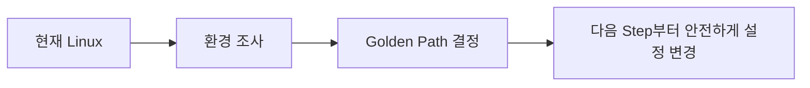

# B1-1 Round 01 — Beginner Guide

이 문서는 B1-1을 처음 수행하는 입문자가 공식 Mission/Evaluation을 기준으로 처음부터 끝까지 재현하기 위한 중심 가이드입니다.

> 현재 훈련 차수는 **R01 — CLEAR**입니다. 과거 작업 결과는 이번 Round의 완료 근거로 사용하지 않습니다. 실제 실행·검증·Evidence가 끝나기 전에는 CLEAR로 판정하지 않습니다.

## 00. 미션 한눈에 보기

- 미션: **B1-1 — 컴퓨터가 알아서 자기 상태를 점검하게 만들기**
- 구분: **필수 미션 (REQUIRED)**
- 분야: **Linux와 OS**
- 훈련 차수: **R01 — CLEAR**
- 현재 상태: **🟡 ACTIVE**
- 목표: Linux 운영 환경을 안전하게 구성하고, Bash 기반 `monitor.sh`로 시스템 상태를 관제·기록·자동 실행한 뒤 공식 평가항목을 Evidence로 증명합니다.

## 01. Source of Truth

이번 Round의 판단 순서는 다음과 같습니다.

1. `b1-1-mission.pdf`
2. `b1-1-mission.md`
3. `b1-1-evaluation.md`
4. `agent-app.zip`
5. 이번 Round의 구현·검증·Evidence

공식 원본은 수정하지 않습니다.

### 현재 Source 확인 상태

- [x] `b1-1-mission.pdf` 존재 및 공식 원본 확인
- [x] `b1-1-mission.md` 존재 및 요구사항 확인
- [x] `b1-1-evaluation.md` 존재 및 평가항목 확인
- [x] `agent-app.zip` 존재 확인
- [ ] `agent-app.zip` 내부 파일/아키텍처 확인 — 실제 실행 준비 단계에서 안전하게 확인

## 02. 무엇을 만드는가

B1-1은 단순 스크립트 작성 미션이 아닙니다. 다음 운영 환경 전체를 구성하고 검증합니다.

1. SSH 기본 보안
   - SSH 포트 `20022`
   - Root 원격 로그인 차단
2. Firewall
   - UFW 또는 firewalld
   - 인바운드 `20022/tcp`, `15034/tcp`만 허용
3. 사용자/그룹/권한
   - `agent-admin`, `agent-dev`, `agent-test`
   - `agent-common`, `agent-core`
   - 공유/보안 디렉터리 권한과 ACL
4. 제공 Agent 애플리케이션 실행 환경
   - 필요한 환경 변수
   - Secret은 실제 머신에서만 관리
   - Boot Sequence 5단계 `[OK]`
   - `Agent READY`
   - `0.0.0.0:15034` LISTEN
5. Bash `monitor.sh`
   - 프로세스/포트 Health Check
   - CPU/MEM/DISK 수집
   - 임계값 WARNING
   - `/var/log/agent-app/monitor.log` 누적
6. 로그 용량 관리
   - 최대 `10MB / 10개`
7. cron
   - `agent-admin` 계정으로 매분 실행
   - 실제 로그 증가 확인

## 03. 평가자가 확인하는 것

공식 Evaluation은 다음 네 영역을 확인합니다.

1. **요구사항 구현 및 실제 동작**
2. **구현 방식과 명령어 선택 이유 설명**
3. **보안·권한·운영 원리 설명**
4. **응용 및 장애 대응 설명**

따라서 R01 CLEAR는 `명령 실행 → 성공`만으로 끝나지 않습니다.

`구성 → 실행 → 검증 → Evidence → 자기 말로 설명`까지 완료해야 합니다.

## 04. Reference Complete Path

ChatGPT 기준 완성 경로는 다음 순서입니다.

```text
00 SOURCE LOCK
01 현재 실행 환경 Baseline 확인
02 Golden Path 확정 및 사전 요구사항 확인
03 필요한 패키지/도구 확인
04 변경 전 시스템 상태 기록 + Backup
05 SSH 20022 안전 전환
06 Firewall 최종 정책 적용
07 agent 사용자/그룹 생성
08 AGENT_HOME / 디렉터리 / ACL 구성
09 agent-app.zip 확인·해제·CPU 아키텍처 선택
10 환경변수 + Secret을 실제 머신에만 구성
11 Agent Boot Sequence 5/5 검증
12 15034 LISTEN 검증
13 monitor.sh 단계별 작성
14 Process / Port Health Check 검증
15 CPU / MEM / DISK 수집·WARNING 검증
16 monitor.log 누적 검증
17 10MB / 10개 로그 관리 검증
18 agent-admin cron 매분 등록
19 1~2분 후 실제 자동 로그 증가 검증
20 실패 시나리오 / exit 1 검증
21 종합 verify
22 Requirement → Implementation → Verification → Evidence 연결
23 Beginner Guide 완성
24 Checklist 최종 확인
25 Secret Scan
26 B1-1 CLEAR 판정
```

보너스 과제와 현재 미션 통과에 필요하지 않은 고도화는 R01 CLEAR 이후로 미룹니다.

---

# STEP 01 — 현재 실행 환경 Baseline 확인

> **중요:** 이번 Step에서는 시스템을 변경하지 않습니다. 설치, 사용자 생성, SSH 변경, Firewall 활성화, 파일 삭제를 하지 않습니다.

## ① 왜 하는가

B1-1은 SSH, 방화벽, 사용자/그룹, 권한, 환경변수, 프로세스, 포트, cron, 로그를 실제 Linux 시스템에서 다룹니다.

환경을 확인하지 않고 바로 수정하면 다음 문제가 생길 수 있습니다.

- 기존 SSH 접속을 끊어 원격 접속 불가
- 기존 사용자/그룹과 충돌
- WSL/VM/일반 Linux 차이로 명령 실패
- CPU 아키텍처가 다른 Agent 바이너리 선택
- 기존 Git 작업 손상

따라서 모든 변경은 다음 순서를 따릅니다.

```text
현재 상태 확인
→ 백업
→ 변경
→ 문법/설정 검사
→ 적용
→ 검증
→ Evidence
```

## ② 무엇을 하는가

이번 Step에서는 다음만 읽기 전용으로 확인합니다.

1. Linux 종류와 버전
2. CPU 아키텍처
3. WSL 여부
4. 현재 사용자와 그룹
5. sudo 상태
6. systemd 상태
7. SSH 설치/서비스 상태
8. 중요 포트 `22`, `20022`, `15034` 상태
9. UFW/firewalld 상태
10. 기존 `agent-*` 사용자/그룹 상태
11. 현재 Git branch / working tree / remote 상태

## ③ 이번 단계에서 알아야 할 용어

### 운영체제 (Operating System, OS)
- **한 줄 정의:** 컴퓨터의 하드웨어와 프로그램을 관리하는 기본 소프트웨어입니다.
- **왜 필요한가:** Ubuntu 버전과 실행 환경에 따라 서비스/설정 방식이 달라질 수 있습니다.
- **B1-1 사용 위치:** SSH, Firewall, 사용자, 권한, cron 환경을 결정합니다.

### 아키텍처 (Architecture)
- **한 줄 정의:** CPU가 사용하는 명령 체계의 종류입니다.
- **대표 예:** `x86_64`, `aarch64/arm64`
- **왜 필요한가:** 제공 Agent에서 CPU에 맞는 실행 파일을 선택해야 할 수 있습니다.
- **B1-1 사용 위치:** `agent-app.zip` 실행 파일 선택 단계입니다.

### 루트 사용자 (root user)
- **한 줄 정의:** Linux에서 거의 모든 권한을 가진 최고 관리자 계정입니다.
- **왜 필요한가:** Agent는 root가 아닌 일반 계정으로 실행해야 하며, 관리자 작업만 `sudo`로 수행합니다.
- **B1-1 사용 위치:** 사용자/권한/SSH/Firewall 설정 단계입니다.

### 관리자 권한 실행 (sudo)
- **한 줄 정의:** 일반 사용자가 필요한 명령만 관리자 권한으로 실행하는 방법입니다.
- **왜 필요한가:** 시스템 설정은 일반 사용자 권한만으로 변경할 수 없는 경우가 있습니다.
- **B1-1 사용 위치:** SSH 설정, Firewall, 사용자 생성, `/var/log` 설정 등에 사용합니다.

### 시스템 관리자 (systemd)
- **한 줄 정의:** Ubuntu에서 서비스와 시스템 부팅을 관리하는 시스템 관리자입니다.
- **왜 필요한가:** SSH와 같은 서비스의 상태 확인·적용에 사용합니다.
- **B1-1 사용 위치:** SSH 서비스 검증 단계입니다.

### 포트 (Port)
- **한 줄 정의:** 한 컴퓨터 안에서 네트워크 프로그램을 구분하는 번호입니다.
- **B1-1 사용 위치:** SSH `20022`, Agent Application `15034`를 사용합니다.

## ④ 필요한 핵심 개념



이번 Step은 **고치는 단계가 아니라 검사하는 단계**입니다. 결과를 받은 뒤 WSL/VM/일반 Ubuntu, CPU 아키텍처, 기존 SSH/Firewall 상태에 맞는 하나의 Golden Path를 선택합니다.

## ⑤ 실행할 명령어 또는 코드

### 1. B1-1 저장소로 이동

```bash
cd ~/codyssey-basic-b1-1-system-monitor
```

> 저장소 위치가 다르면 실제 clone 경로로 이동합니다.

### 2. 운영체제 확인

```bash
cat /etc/os-release
```

### 3. CPU 아키텍처 확인

```bash
uname -m
```

### 4. Kernel / WSL 여부 확인

```bash
uname -a

grep -qi microsoft /proc/version \
  && echo "WSL detected" \
  || echo "WSL not detected"
```

### 5. 현재 사용자/그룹 확인

```bash
whoami
id
```

### 6. sudo 상태 확인

```bash
sudo -n true 2>/dev/null \
  && echo "[PASS] sudo without prompt" \
  || echo "[INFO] sudo may require password"
```

> 이 명령은 설정을 변경하지 않습니다. sudo 비밀번호는 채팅이나 Evidence에 기록하지 않습니다.

### 7. systemd 상태 확인

```bash
ps -p 1 -o comm=
systemctl is-system-running 2>/dev/null || true
```

### 8. SSH 설치/서비스 확인

```bash
command -v ssh
command -v sshd || true

systemctl status ssh --no-pager 2>/dev/null \
  || systemctl status sshd --no-pager 2>/dev/null \
  || true
```

### 9. 중요 포트 확인

```bash
sudo ss -lntp \
  | grep -E ':(22|20022|15034)\b' \
  || echo "[INFO] 22/20022/15034 LISTEN 없음"
```

### 10. Firewall 상태 확인

```bash
command -v ufw \
  && sudo ufw status verbose \
  || echo "[INFO] ufw not installed"

command -v firewall-cmd \
  && sudo firewall-cmd --state \
  || echo "[INFO] firewalld not installed"
```

> 이번 Step에서는 Firewall을 활성화하거나 규칙을 변경하지 않습니다.

### 11. 기존 Agent 사용자 확인

```bash
for u in agent-admin agent-dev agent-test; do
    id "$u" 2>/dev/null || echo "[INFO] $u does not exist"
done
```

### 12. 기존 Agent 그룹 확인

```bash
for g in agent-common agent-core; do
    getent group "$g" || echo "[INFO] $g does not exist"
done
```

### 13. Git 상태 확인

```bash
git branch --show-current
git status --short
git remote -v
```

## ⑥ 명령어와 코드에 입문자가 이해할 수 있는 주석

### `uname -m`

```bash
uname -m
# uname : 현재 시스템 정보 확인
# -m    : machine, CPU 아키텍처만 출력
```

예를 들어 `x86_64`이면 Intel/AMD 계열 64-bit Linux입니다.

### `id`

```bash
id
# 현재 사용자의 UID, 기본 그룹 GID,
# 가입된 그룹을 함께 확인합니다.
```

### `ss -lntp`

```bash
sudo ss -lntp
# -l : LISTEN 중인 소켓
# -n : 서비스 이름 대신 포트 번호를 숫자로 표시
# -t : TCP
# -p : 해당 포트를 사용하는 프로세스 표시
```

즉, **어떤 프로그램이 어떤 TCP 포트를 열고 기다리는지** 확인합니다.

### `command -v`

```bash
command -v ufw
# ufw 명령이 현재 시스템에 설치되어 있는지 확인합니다.
```

### `git status --short`

```bash
git status --short
# 수정되거나 새로 생긴 파일을 짧게 표시합니다.
# 예상하지 못한 로컬 작업이 있는지 확인하기 위한 명령입니다.
```

## ⑦ 예상되는 정상 결과

환경에 따라 정확한 값은 달라집니다. 다음은 예시일 뿐입니다.

```text
Ubuntu 22.04/24.04 계열
x86_64 또는 aarch64
WSL detected 또는 WSL not detected
일반 사용자명
systemd
/usr/bin/ssh
22/20022/15034 중 현재 LISTEN 상태
UFW/firewalld 현재 상태
agent-* 사용자/그룹 존재 또는 미존재
현재 Git branch
```

기존 SSH가 22번 포트에서 동작하거나, 과거 실습의 `agent-*` 계정이 존재해도 그 자체가 실패는 아닙니다. 이 정보를 기준으로 다음 Step의 안전한 경로를 정합니다.

## ⑧ 그 결과가 의미하는 것

Baseline은 다음과 같이 다음 단계의 분기를 결정합니다.

```text
Ubuntu + WSL2 + systemd
→ WSL2 Ubuntu Golden Path 검토

일반 Ubuntu VM/서버
→ Ubuntu VM/Server Golden Path 검토

x86_64
→ x86_64 Agent 실행 파일 검토

aarch64
→ ARM64 Agent 실행 파일 검토

SSH 22 LISTEN
→ 기존 연결을 보호하면서 20022 안전 전환

agent-* 기존 존재
→ 삭제하지 않고 기존 구성부터 분석

Firewall inactive
→ SSH 안전 전환 순서를 고려한 뒤 필요한 시점에 적용
```

## ⑨ 자주 발생하는 오류와 해결 방법

### `ss: command not found`
이번 Step에서 바로 설치하지 않습니다. 결과를 기록하고 Step 02에서 필요한 패키지 여부를 결정합니다.

### `System has not been booted with systemd`
바로 systemd 설정을 바꾸지 않습니다. WSL/Container/VM 종류를 먼저 판정합니다.

### sudo 비밀번호를 요구함
정상일 수 있습니다. 비밀번호는 사용자가 터미널에서만 입력하고 채팅·GitHub·Evidence에 남기지 않습니다.

### `ufw not installed`
Baseline 단계에서는 실패가 아닙니다. 설치 필요 여부를 다음 Step에서 결정합니다.

### `agent-admin` 등이 이미 존재함
삭제하지 않습니다. 기존 UID/GID/그룹/파일 소유권을 먼저 확인해야 합니다.

### `git status --short`에 파일이 표시됨
`git reset`, `git clean`, `rm`을 실행하지 않습니다. 변경 내용을 먼저 확인합니다.

## ⑩ 완료 확인

다음 정보가 실제 터미널 출력으로 확인되면 Step 01을 판정할 수 있습니다.

- [ ] OS / Version
- [ ] Architecture
- [ ] WSL 여부
- [ ] 현재 사용자 / 그룹
- [ ] sudo 상태
- [ ] systemd 상태
- [ ] SSH 상태
- [ ] 22 / 20022 / 15034 포트 상태
- [ ] Firewall 상태
- [ ] `agent-*` 사용자 / 그룹 상태
- [ ] Git branch / working tree / remote 상태

### 사용자에게 요청할 결과

위 명령의 터미널 출력을 채팅에 붙여 넣습니다. 단, 다음 값은 반드시 제외하거나 마스킹합니다.

- Password
- Secret
- `*.key` 내용
- Token
- Private Key

ChatGPT는 결과를 받은 뒤 다음 형식으로 판정합니다.

```text
[PASS] 항목
[PASS] 항목
[FAIL] 항목
Result: N PASS / N FAIL
```

Step 01이 판정되면 **STEP 02 — Golden Path 확정 및 사전 요구사항 확인**으로 이동합니다.

---

## 이후 Step 작성 원칙

모든 Step은 다음 10개 항목을 유지합니다.

1. 왜 하는가
2. 무엇을 하는가
3. 이번 단계에서 알아야 할 용어
4. 필요한 핵심 개념
5. 실행할 명령어 또는 코드
6. 명령어와 코드의 입문자용 주석
7. 예상되는 정상 결과
8. 그 결과가 의미하는 것
9. 자주 발생하는 오류와 해결 방법
10. 완료 확인

## Evidence 원칙

Evidence는 단순 스크린샷 모음이 아니라 다음 연결을 증명해야 합니다.

`Requirement → Implementation → Verification → Evidence`

실제 실행하지 않은 결과를 PASS로 기록하지 않습니다. Secret, Token, Password, Private Key는 Evidence에 포함하지 않습니다.

## Mission CLEAR

`CHECKLIST.md`의 모든 필수 항목이 실제 구현·검증·Evidence를 갖춘 경우에만 **✅ CLEAR**로 판정합니다.
