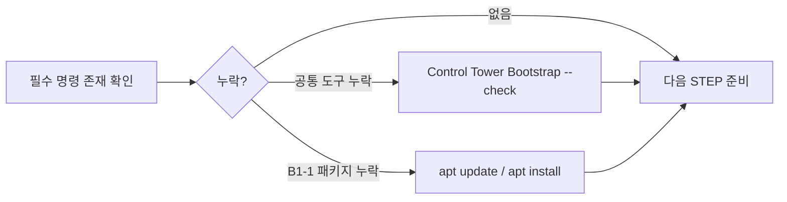
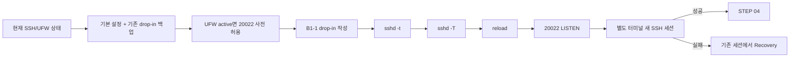
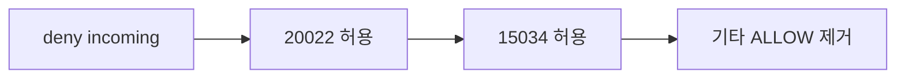
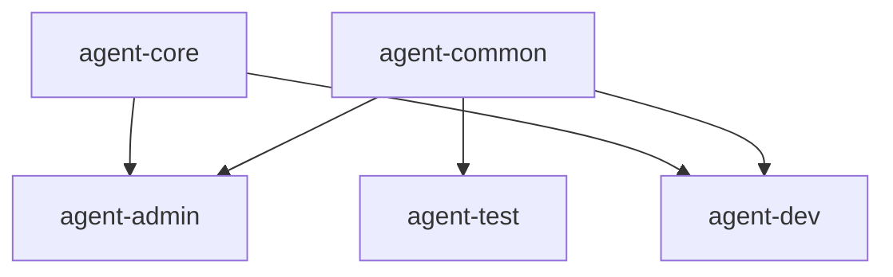
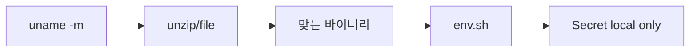
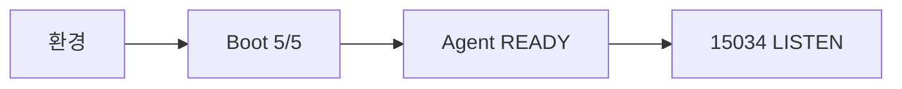
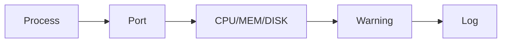
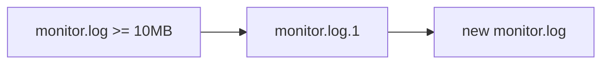
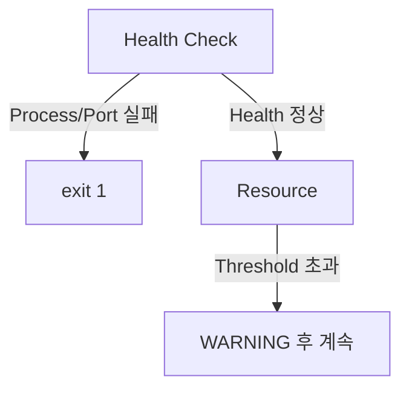
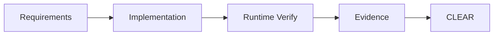

# B1-1 Round 01 — Beginner Guide

이 문서는 B1-1을 처음 수행하는 입문자가 공식 Mission/Evaluation을 기준으로 처음부터 끝까지 재현하기 위한 중심 가이드입니다.

> 현재 훈련 차수는 **R01 — CLEAR**이며, Control Tower의 현재 운영 기준은 **Phase C — FAST EXECUTE / Runtime**입니다. Phase A/B의 Reference·설계 준비는 완료된 상태로 보고, 지금은 실제 Ubuntu Runtime → Verify → Evidence → CLEAR를 우선합니다. 실제 실행하지 않은 항목은 PASS/CLEAR로 기록하지 않습니다.

---

<a id="quick-start"></a>
## 🚀 빠른 시작(Quick Start)

> **공통 개발환경이 이미 준비되어 있고 B1-1 저장소를 받은 학습자**가 안전하게 현재 상태를 다시 확인하는 경로입니다.
> 처음 개발환경을 준비하는 경우에는 Control Tower의 `environments/START-HERE-DEVELOPMENT-ENVIRONMENT.md`를 먼저 완료한 뒤 돌아오세요.

### 📍 실행 위치

```text
Host       : MAC-V OrbStack Ubuntu 24.04 또는 WIN-V WSL2 Ubuntu 24.04
Terminal   : Ubuntu Bash
Repository : $HOME/codyssey/codyssey-basic-b1-1-system-monitor
권한       : 일반 사용자
venv       : 해당 없음
```

### 빠른 상태 확인

```bash
cd "$HOME/codyssey/codyssey-basic-b1-1-system-monitor"
pwd
git branch --show-current
git status --short
cat /etc/os-release
uname -m
ps -p 1 -o comm=
bash -n training/round-01-clear/monitor.sh
```

### 줄별 의미

```text
1. cd ...
   → B1-1 Repository Root로 이동합니다.

2. pwd
   → 실제 작업 위치가 Ubuntu의 B1-1 Repository인지 확인합니다.

3. git branch --show-current
   → 현재 작업 Branch를 확인합니다.

4. git status --short
   → 예상하지 않은 로컬 변경이 있는지 확인합니다.

5. cat /etc/os-release
   → Ubuntu 배포판과 버전을 확인합니다.

6. uname -m
   → 제공 Agent 실행 파일 선택에 필요한 CPU Architecture를 확인합니다.

7. ps -p 1 -o comm=
   → PID 1을 확인하여 systemd 기반 Runtime인지 판단합니다.

8. bash -n .../monitor.sh
   → monitor.sh를 실행하지 않고 Bash 문법만 검사합니다.
```

### Quick Start 정상 기준

```text
[ ] pwd가 /home/<user>/codyssey/codyssey-basic-b1-1-system-monitor 계열이다.
[ ] 현재 Branch와 변경사항을 이해하고 있다.
[ ] Ubuntu 24.04 Runtime이다.
[ ] CPU Architecture를 확인했다.
[ ] PID 1이 systemd이다.
[ ] monitor.sh 문법 검사에 오류가 없다.
```

```text
✅ GO
→ 모두 만족하면 STEP 01부터 현재 실제 Runtime 상태를 확인합니다.

❌ STOP
→ 하나라도 다르면 SSH/UFW 설정을 시작하지 않습니다.
→ 개발환경·Repository 위치·Branch·Runtime부터 먼저 바로잡습니다.
```

재실행 안전성:

```text
cd / pwd / branch / git status / OS·Architecture·systemd 확인 → 🟢 SAFE TO RERUN
bash -n monitor.sh                                      → 🟢 SAFE TO RERUN
```

> Quick Start에서는 SSH, UFW, 사용자, ACL, Agent, cron 설정을 자동 변경하지 않습니다. 시스템 변경은 반드시 해당 상세 STEP의 Checkpoint와 STOP/GO 기준을 따라 수행합니다.

---

<a id="toc"></a>
## 📑 목차(Table of Contents)

- [🚀 빠른 시작(Quick Start)](#quick-start)
- [00. 미션 한눈에 보기](#overview)
- [01. Source of Truth](#source-of-truth)
- [02. 최종적으로 만들어야 하는 것](#final-deliverables)
- [03. R01 Runtime Path](#runtime-path)
- [STEP 01 — 현재 실행 환경 Baseline 확인](#step-01)
- [STEP 02 — Golden Path와 필수 도구 준비](#step-02)
- [STEP 03 — SSH를 20022로 안전하게 전환](#step-03)
- [STEP 04 — UFW 최종 정책](#step-04)
- [STEP 05 — 사용자·그룹·디렉터리·ACL 구성](#step-05)
- [STEP 06 — Agent archive·환경변수·Secret 준비](#step-06)
- [STEP 07 — Agent Boot 5/5와 15034 LISTEN](#step-07)
- [STEP 08 — monitor.sh 설치와 정상 실행](#step-08)
- [STEP 09 — monitor.log와 10MB/10개 로그 회전](#step-09)
- [STEP 10 — agent-admin cron 매분 자동 실행](#step-10)
- [STEP 11 — 실패 경로와 Warning 경로 검증](#step-11)
- [STEP 12 — 통합 verify.sh 실행](#step-12)
- [STEP 13 — Evidence 정리](#step-13)
- [STEP 14 — Evaluation Q&A 학습](#step-14)
- [STEP 15 — B1-1 CLEAR Gate](#step-15)
- [Reference 보조 파일](#reference-files)
- [Secret 원칙](#secret-policy)

---

<a id="overview"></a>
## 00. 미션 한눈에 보기

- 미션: **B1-1 — 컴퓨터가 알아서 자기 상태를 점검하게 만들기**
- 구분: **필수 미션 (REQUIRED)**
- 분야: **Linux와 OS**
- Runtime 상태: **🟡 ACTIVE**
- 현재 운영 모드: **Phase C — FAST EXECUTE / Runtime**
- Primary R01 Golden Path: **MAC-V — macOS → OrbStack → Ubuntu 24.04 + systemd + UFW + Bash**
- Secondary Check: **WIN-V — Windows 11 Pro → WSL2 → Ubuntu 24.04**
- Docker: **선택 Lab**이며 B1-1 CLEAR의 기본 선행조건이 아님
- 기준 `AGENT_HOME`: **`/opt/agent-app`**
- 목표: Linux 운영 환경을 안전하게 구성하고 Bash `monitor.sh`로 시스템 상태를 점검·기록·자동 실행한 뒤 공식 평가항목을 Evidence로 증명합니다.

공식 Mission은 `$AGENT_HOME`의 예시 경로를 제시하지만 고정 경로로 요구하지 않습니다. R01은 공유 디렉터리의 상위 경로 권한 문제를 줄이고 `agent-common`/`agent-core` 최소 권한을 명확히 검증하기 위해 `/opt/agent-app`을 기준으로 사용합니다.

현재 운영 상태가 달라질 수 있으므로 Phase/Active/CLEAR 같은 진행 상태는 Control Tower `training/round-01-clear/NEXT-ACTIONS.md`를 최종 운영 기준으로 확인합니다.

<a id="source-of-truth"></a>
## 01. Source of Truth

1. `b1-1-mission.pdf`
2. `b1-1-mission.md`
3. `b1-1-evaluation.md`
4. `agent-app.zip`
5. 이번 Round의 실제 Runtime 결과와 Evidence

공식 원본은 수정하지 않습니다.

<a id="final-deliverables"></a>
## 02. 최종적으로 만들어야 하는 것

1. SSH `20022`, Root 원격 로그인 차단
2. UFW에서 인바운드 `20022/tcp`, `15034/tcp`만 허용
3. `agent-admin`, `agent-dev`, `agent-test`
4. `agent-common`, `agent-core`
5. `/opt/agent-app/upload_files`, `/opt/agent-app/api_keys`, `/var/log/agent-app` 권한/ACL
6. 제공 Agent 앱의 Boot Sequence 5단계 `[OK]`, `Agent READY`, `0.0.0.0:15034` LISTEN
7. Bash `monitor.sh`
8. Process/Port Health Check와 실패 시 `exit 1`
9. CPU/MEM/DISK 수집과 Warning
10. `/var/log/agent-app/monitor.log` 누적
11. `10MB / 10개` 로그 관리
12. `agent-admin` cron 매분 실행
13. Requirement → Implementation → Verification → Evidence 연결

<a id="runtime-path"></a>
## 03. R01 Runtime Path

```text
SOURCE
  ↓
Baseline / Preflight
  ↓
Golden Path / Prerequisites
  ↓
SSH 20022 안전 전환
  ↓
UFW 최종 정책
  ↓
Users / Groups / ACL
  ↓
Agent archive / environment / Secret(local only)
  ↓
Agent READY + 15034 LISTEN
  ↓
monitor.sh
  ↓
Log rotation
  ↓
cron
  ↓
Failure / Warning tests
  ↓
verify.sh
  ↓
Evidence + Evaluation Q&A
  ↓
✅ CLEAR
```

---

<a id="step-01"></a>
# STEP 01 — 현재 실행 환경 Baseline 확인

## ① 왜 하는가

SSH, Firewall, 사용자, 포트처럼 시스템 전체에 영향을 주는 설정을 바꾸기 전에 현재 상태를 알아야 기존 환경을 손상시키지 않습니다.

## ② 무엇을 하는가

OS, CPU, WSL 여부, systemd, 사용자, sudo, SSH, 중요 포트, UFW, 기존 agent 계정/그룹, Git 상태를 읽기 전용으로 확인합니다.

## ③ 이번 단계에서 알아야 할 용어

- **기준 상태 (Baseline)** — 변경 전 상태 기록입니다.
- **아키텍처 (Architecture)** — `x86_64`, `aarch64` 같은 CPU 계열입니다.
- **초기화 시스템 (Init system / systemd)** — 서비스 시작·중지·상태를 관리합니다.
- **리슨 (Listen)** — 프로세스가 TCP 연결을 받을 준비가 된 상태입니다.

## ④ 필요한 핵심 개념


기존 상태를 모르면 되돌리기도 어렵습니다. 먼저 조사하고 그 다음 바꿉니다.

## ⑤ 실행할 명령어 또는 코드

```bash
# OS / CPU / 실행 환경
cat /etc/os-release
uname -m
uname -a
grep -qi microsoft /proc/version && echo "[INFO] WSL detected" || echo "[INFO] WSL marker not detected"
ps -p 1 -o comm=

# 현재 사용자
whoami
id

# SSH / 포트 / Firewall
command -v ssh
command -v sshd || true
sudo ss -lntp | grep -E ':(22|20022|15034)\b' || true
command -v ufw && sudo ufw status verbose || true

# 기존 mission 사용자/그룹
for u in agent-admin agent-dev agent-test; do
    id "$u" 2>/dev/null || echo "[INFO] user missing: $u"
done
for g in agent-common agent-core; do
    getent group "$g" || echo "[INFO] group missing: $g"
done

# Git 기준선
git branch --show-current
git status --short
git remote -v
```

## ⑥ 명령어와 코드에 입문자가 이해할 수 있는 주석

이 STEP은 **설정을 바꾸지 않고 현재 상태를 읽는 사전 점검**입니다. `sudo`가 붙은 줄도 SSH/UFW/포트 상태를 더 정확히 읽기 위한 것이며, 설정 변경 명령은 포함하지 않습니다.

### OS / CPU / 실행 환경

- `cat /etc/os-release`
  - `/etc/os-release` 파일의 배포판 이름과 버전 정보를 화면에 출력합니다.
  - `cat`은 파일을 읽기만 하므로 시스템 설정을 변경하지 않습니다.
- `uname -m`
  - `-m`은 머신 하드웨어 이름, 즉 CPU 아키텍처를 출력합니다.
  - 결과가 `x86_64`인지 `aarch64`인지에 따라 제공 Agent 실행 파일 선택이 달라집니다.
- `uname -a`
  - `-a`는 커널 이름·호스트·커널 버전·아키텍처 등 현재 Linux 정보를 한 번에 출력합니다.
  - `uname -m`보다 넓은 실행 환경 기준선을 남길 때 사용합니다.
- `grep -qi microsoft /proc/version && echo ... || echo ...`
  - `/proc/version`에서 `microsoft` 문자열을 찾아 WSL 흔적이 있는지 확인합니다.
  - `grep -q`는 찾은 내용을 출력하지 않고 성공/실패 상태만 반환하고, `-i`는 대소문자를 구분하지 않습니다.
  - `&&`는 앞의 검색이 성공했을 때 왼쪽 메시지를, `||`는 성공하지 않았을 때 오른쪽 메시지를 출력합니다.
  - WSL 표식이 없다는 결과가 곧 오류라는 뜻은 아닙니다. MAC-V OrbStack Ubuntu에서는 WSL 표식이 없는 것이 정상입니다.
- `ps -p 1 -o comm=`
  - `-p 1`은 PID 1 프로세스만 선택합니다.
  - `-o comm=`은 명령 이름만 헤더 없이 출력합니다. `systemd`가 나오면 이번 R01 기준 실행 환경과 맞는지 판단하는 근거가 됩니다.

### 현재 사용자

- `whoami`
  - 지금 터미널에서 명령을 실행하는 로그인 사용자 이름을 확인합니다.
- `id`
  - 현재 사용자의 UID, 기본 GID, 소속 그룹을 확인합니다.
  - 이후 `sudo` 사용 가능 여부와 mission 계정/그룹을 만들기 전 현재 권한 상태를 이해하는 기준입니다.

### SSH / 포트 / Firewall

- `command -v ssh`
  - 현재 `PATH`에서 SSH 클라이언트 실행 파일이 있는지 확인합니다.
  - 경로가 출력되면 명령을 찾은 것이고, 아무 것도 나오지 않으면 STEP 02에서 패키지 상태를 확인합니다.
- `command -v sshd || true`
  - SSH 서버 실행 파일 `sshd`가 현재 `PATH`에서 보이는지 확인합니다.
  - `|| true`는 `sshd`가 아직 없더라도 이 Baseline 점검 전체를 중단하지 않고 다음 확인을 계속하기 위한 처리입니다.
- `sudo ss -lntp | grep -E ':(22|20022|15034)\b' || true`
  - `sudo`는 다른 사용자 프로세스까지 포함한 포트/프로세스 정보를 가능한 한 정확히 읽기 위해 사용합니다. 이 줄은 설정을 변경하지 않습니다.
  - `ss`의 `-l`은 LISTEN 소켓, `-n`은 포트 번호를 숫자로 표시, `-t`는 TCP, `-p`는 연결된 프로세스 정보를 뜻합니다.
  - `|`는 `ss` 출력 결과를 다음 `grep` 명령에 전달합니다.
  - `grep -E`는 확장 정규식을 사용해 `22`, `20022`, `15034` 포트만 추려 봅니다. `\b`는 숫자 뒤의 단어 경계를 사용해 비슷한 다른 포트와의 잘못된 일치를 줄입니다.
  - 아무 포트도 아직 열려 있지 않아도 Baseline 수집 자체는 계속해야 하므로 마지막에 `|| true`를 둡니다.
- `command -v ufw && sudo ufw status verbose || true`
  - 먼저 `command -v ufw`로 UFW 설치 여부를 확인합니다.
  - UFW가 있으면 `sudo ufw status verbose`로 활성/비활성 상태, 기본 정책, 현재 규칙을 **읽기 전용으로** 확인합니다.
  - `verbose`는 기본 정책을 포함한 상세 상태를 보여 줍니다.
  - UFW가 아직 없거나 비활성 상태여도 이 STEP에서는 조사 결과로 기록하고, `|| true`로 다음 Baseline 점검을 계속합니다.

### 기존 mission 사용자 / 그룹

- `for u in agent-admin agent-dev agent-test; do ... done`
  - 세 mission 사용자 이름을 하나씩 변수 `u`에 넣어 같은 검사를 반복합니다.
- `id "$u" 2>/dev/null || echo "[INFO] user missing: $u"`
  - 해당 사용자가 존재하면 UID/GID/소속 그룹을 보여 줍니다.
  - `2>/dev/null`은 사용자가 없을 때 나오는 오류 메시지만 숨기고, 대신 `|| echo ...`가 누락된 사용자 이름을 명확히 표시합니다.
  - 기존 사용자가 발견되어도 이 단계에서는 삭제·수정하지 않습니다.
- `for g in agent-common agent-core; do ... done`
  - 두 mission 그룹을 하나씩 변수 `g`에 넣어 반복 확인합니다.
- `getent group "$g" || echo "[INFO] group missing: $g"`
  - 시스템 계정 데이터베이스에서 그룹과 현재 멤버를 조회합니다.
  - 그룹이 없으면 정보 메시지만 출력하며, 이 단계에서는 새 그룹을 만들지 않습니다.

### Git 기준선

- `git branch --show-current`
  - 현재 체크아웃한 Git 브랜치 이름을 출력합니다.
- `git status --short`
  - 추적 파일의 수정·추가·삭제 상태를 짧은 형식으로 보여 줍니다.
  - 예상하지 않은 변경이 있으면 `reset`이나 `clean`부터 실행하지 말고 변경 원인을 먼저 확인합니다.
- `git remote -v`
  - 연결된 원격 저장소 이름과 fetch/push URL을 확인합니다.
  - URL에 자격증명이나 토큰을 직접 넣어 둔 특수한 구성이면 채팅·Evidence에 그대로 붙여 넣지 말고 민감 값을 가린 뒤 기록합니다.

### 기호와 재실행 안전성

- `&&` : 앞 명령이 성공했을 때만 다음 명령을 실행합니다.
- `||` : 앞 명령이 실패했을 때 다음 명령을 실행합니다.
- `|` : 왼쪽 명령의 출력을 오른쪽 명령의 입력으로 넘깁니다.
- `2>/dev/null` : 표준 오류(stderr)만 버립니다. 정상 출력까지 숨기는 것은 아닙니다.
- 이 STEP의 명령은 **🟢 SAFE TO RERUN**입니다. 모두 조회 중심이며 사용자·그룹·SSH·UFW 설정을 만들거나 삭제하지 않습니다.

> **STOP 기준:** systemd가 아니거나, Repository/Branch가 예상과 다르거나, 기존 agent 사용자·그룹·SSH/UFW 상태가 예상과 크게 다르면 다음 시스템 변경 STEP으로 진행하지 않습니다. 먼저 현재 상태와 원인을 정리합니다.

## ⑦ 예상되는 정상 결과

Primary는 Ubuntu 24.04 + systemd이며, CPU는 환경에 따라 `x86_64` 또는 `aarch64`가 나올 수 있습니다. Secondary WIN-V도 Ubuntu 24.04를 기준으로 합니다. 현재 SSH/UFW/계정 상태는 기존 환경에 따라 달라도 정상이며, 그 상태를 기록하는 것이 목적입니다.

## ⑧ 그 결과가 의미하는 것

제공 Agent 실행 파일 선택과 SSH/UFW 변경 방식을 결정할 기준을 확보한 것입니다.

## ⑨ 자주 발생하는 오류와 해결 방법

- systemd가 아님 → 다음 단계로 강행하지 않고 WSL/Container 구성을 먼저 정리합니다.
- `ss`/`ufw`가 없음 → STEP 02에서 필요한 패키지만 설치합니다.
- 기존 agent 계정이 있음 → 삭제하지 말고 현재 설정을 먼저 확인합니다.
- Git working tree가 예상과 다름 → `reset/clean`하지 말고 변경 이유를 확인합니다.

## ⑩ 완료 확인

- [ ] Ubuntu 24.04 확인
- [ ] OS/Architecture 확인
- [ ] systemd 확인
- [ ] SSH/포트/UFW 확인
- [ ] 기존 사용자/그룹 확인
- [ ] Git 기준선 확인

---

<a id="step-02"></a>
# STEP 02 — Golden Path와 필수 도구 준비

## ① 왜 하는가

중간 단계에서 명령 자체가 없어 실패하는 일을 막고 하나의 재현 가능한 기준 환경을 사용하기 위해서입니다.

## ② 무엇을 하는가

필요한 명령이 있는지 확인하고 없는 Mission 패키지만 설치합니다. `unzip`, `file`, `git` 같은 공통 기본도구는 Control Tower Ubuntu Bootstrap에서 관리하고, B1-1에서만 필요한 시스템 패키지는 Mission 계층으로 분리합니다.

## ③ 이번 단계에서 알아야 할 용어

- **Golden Path** — 이번 Round의 기준 실행 경로입니다.
- **패키지 (Package)** — Linux에서 설치·관리하는 프로그램 묶음입니다.
- **패키지 인덱스 (Package Index)** — 설치 가능한 패키지 이름·버전·다운로드 위치에 대한 로컬 목록입니다.
- **공통 기본 계층 (Common Base)** — 여러 미션이 함께 사용하는 기본 명령과 도구입니다.
- **미션 전용 패키지 (Mission Package)** — B1-1 요구사항을 수행하기 위해 추가로 필요한 시스템 패키지입니다.

## ④ 필요한 핵심 개념



핵심은 **먼저 확인하고, 누락된 계층만 복구하는 것**입니다. 공통 도구와 B1-1 전용 패키지를 한 목록에 계속 섞어 넣지 않습니다.

## ⑤ 실행할 명령어 또는 코드

필수 명령 존재 여부 확인:

```bash
for c in bash ssh sshd ss ps pgrep df stat getfacl setfacl crontab unzip file runuser git awk grep find; do
    command -v "$c" || echo "[MISSING] $c"
done
```

Mission 전용 패키지가 누락되었을 때만:

```bash
sudo apt update
sudo apt install -y openssh-server ufw acl cron procps iproute2 util-linux
```

`unzip`, `file`, `git` 같은 공통 기본도구가 누락되었다면 Mission 패키지 목록에 섞기보다 Control Tower에서 다음 공통 Bootstrap을 다시 확인합니다.

```bash
cd "$HOME/codyssey/codyssey-basic"
bash environments/ubuntu/bootstrap.sh --check
```

## ⑥ 명령어와 코드에 입문자가 이해할 수 있는 주석

### 1) 필수 명령 존재 여부 확인

- `for c in ...; do ... done`
  - `bash`, `ssh`, `sshd`처럼 확인할 명령 이름을 변수 `c`에 하나씩 넣고 같은 검사를 반복합니다.
  - 이 반복문은 프로그램을 설치하거나 삭제하지 않고 **명령 존재 여부만 조회**합니다.
- `command -v "$c"`
  - 현재 셸의 `PATH`에서 해당 명령을 실행할 수 있는 위치를 찾습니다.
  - `/usr/bin/bash`처럼 경로가 나오면 그 명령을 현재 환경에서 사용할 수 있다는 뜻입니다.
- `|| echo "[MISSING] $c"`
  - `command -v`가 실패했을 때만 `[MISSING] 명령이름`을 출력합니다.
  - `[MISSING]`이 있다고 바로 임의 패키지를 설치하지 말고, **공통 기본도구인지 B1-1 Mission 도구인지 먼저 분류**합니다.

이 첫 번째 확인 블록은 **🟢 SAFE TO RERUN**입니다. 조회만 수행합니다.

### 2) `sudo apt update`

- `sudo`
  - 시스템 패키지 정보는 관리자 권한이 필요한 영역이므로 `apt` 작업을 root 권한으로 실행합니다.
  - 이 권한은 패키지 관리에만 사용하며 `agent-admin` 같은 Mission 계정에 광범위한 sudo 권한을 추가하는 뜻이 아닙니다.
- `apt`
  - Ubuntu의 패키지 관리자입니다.
- `update`
  - 저장소에서 최신 **패키지 인덱스**를 받아 로컬 목록을 갱신합니다.
  - 애플리케이션 패키지를 직접 업그레이드하는 `upgrade`와 다릅니다.
  - 네트워크와 패키지 목록에는 영향을 주므로 단순 조회 명령은 아니지만, 정상적인 패키지 설치 전에 수행하는 표준 준비 단계입니다.

### 3) `sudo apt install -y openssh-server ufw acl cron procps iproute2 util-linux`

- `install`
  - 뒤에 적은 패키지를 설치하거나, 이미 설치되어 있다면 현재 설치 상태를 확인하고 필요한 의존성을 맞춥니다.
- `-y`
  - 설치 도중 나오는 일반적인 확인 질문에 자동으로 `yes`라고 답합니다.
  - 따라서 패키지 목록을 **눈으로 확인한 뒤에만** 실행해야 합니다. 임의의 패키지 이름을 추가한 상태에서 그대로 실행하지 않습니다.
- `openssh-server`
  - SSH 서버 데몬 `sshd`를 제공합니다. STEP 03에서 포트 `20022`와 Root 원격 로그인 차단을 설정할 때 필요합니다.
- `ufw`
  - Ubuntu의 방화벽 관리 도구입니다. STEP 04에서 `20022/tcp`, `15034/tcp` 정책을 구성할 때 사용합니다.
- `acl`
  - `getfacl`, `setfacl` 명령을 제공합니다. STEP 05에서 역할별 접근 권한을 세밀하게 검증·설정할 때 필요합니다.
- `cron`
  - 예약 실행 서비스와 `crontab`을 제공합니다. STEP 10에서 `agent-admin`이 `monitor.sh`를 매분 실행하도록 구성할 때 필요합니다.
- `procps`
  - `ps`, `pgrep` 등 프로세스 확인 도구를 제공합니다. Agent 프로세스 Health Check와 자원 확인에 사용합니다.
- `iproute2`
  - `ss` 등 네트워크 상태 확인 도구를 제공합니다. TCP `20022`, `15034` LISTEN 여부를 검사할 때 필요합니다.
- `util-linux`
  - 다양한 Linux 기본 시스템 도구를 제공합니다. R01에서 사용자 전환·시스템 점검에 필요한 기반 명령의 가용성을 맞추는 Mission 패키지 계층입니다.

이 설치 블록은 시스템 패키지를 변경하므로 **🟡 CHECK BEFORE RERUN**입니다. 다시 실행하기 전에 STEP 02의 `command -v` 결과와 현재 패키지 상태를 확인합니다. 이미 필요한 패키지가 모두 있다면 설치를 반복할 이유가 없습니다.

### 4) Common Base와 Mission Package를 분리하는 이유

이번 R01에서 B1-1 Mission 패키지 계층은 다음 일곱 패키지로 관리합니다.

```text
openssh-server
ufw
acl
cron
procps
iproute2
util-linux
```

반면 `git`, `unzip`, `file`, `ssh` 클라이언트처럼 여러 미션이 공통으로 사용하는 도구는 Control Tower의 **Common Base**에서 관리합니다. 이렇게 나누면 다음 미션마다 같은 기본 패키지를 반복 설치하거나 Mission 전용 목록이 계속 커지는 것을 막을 수 있습니다.

### 5) Control Tower Bootstrap 확인

- `cd "$HOME/codyssey/codyssey-basic"`
  - Control Tower 저장소 루트로 이동합니다.
  - 큰따옴표를 사용해 `$HOME`에서 확장된 경로를 하나의 인자로 안전하게 전달합니다.
- `bash environments/ubuntu/bootstrap.sh --check`
  - `bash`로 Control Tower의 Ubuntu Bootstrap 스크립트를 실행합니다.
  - `--check`는 공통 개발환경이 준비되어 있는지 **확인하는 모드**이며, B1-1 Mission 패키지를 대신 설치하는 명령이 아닙니다.
  - 공통 기본도구가 누락된 경우에는 이 결과를 기준으로 Common Base부터 복구한 뒤 B1-1 저장소로 돌아옵니다.

> **STOP 기준:** `apt update`가 네트워크/DNS/저장소 오류로 실패하거나, 설치 과정에서 예상하지 않은 패키지 제거·대규모 변경이 제안되거나, Common Base 검사 자체가 FAIL이면 STEP 03으로 진행하지 않습니다. 오류 원인을 먼저 해결합니다.

## ⑦ 예상되는 정상 결과

- 첫 번째 반복문에서 필수 명령마다 실행 경로가 출력되고 `[MISSING]`이 남지 않습니다.
- `apt update`를 실행한 경우 패키지 인덱스 갱신이 오류 없이 끝납니다.
- Mission 패키지를 설치한 경우 대상 패키지 설치가 정상 종료됩니다.
- Common Base가 이미 준비되어 있다면 `bootstrap.sh --check`에서 공통 개발환경 확인 결과가 정상으로 나옵니다.

## ⑧ 그 결과가 의미하는 것

SSH, ACL, 프로세스/포트 확인, 압축 해제, cron 실습을 수행할 최소 실행 도구가 준비되었고, **Common Base와 B1-1 Mission 패키지의 책임 경계도 유지된 상태**입니다.

## ⑨ 자주 발생하는 오류와 해결 방법

- `apt` lock → 다른 패키지 작업이 끝났는지 먼저 확인합니다. 잠금 파일을 임의 삭제하지 않습니다.
- DNS/네트워크 오류 → 패키지 설치를 반복하기보다 네트워크·DNS부터 해결합니다.
- `Unable to locate package` → `apt update` 성공 여부와 저장소 상태를 확인합니다.
- 공통 기본도구가 누락됨 → Mission 패키지를 계속 추가하지 말고 Control Tower Bootstrap을 먼저 복구합니다.
- `[MISSING] sshd`만 보임 → SSH 클라이언트 `ssh`와 서버 `sshd`는 별개이므로 `openssh-server` 설치 여부를 확인합니다.

## ⑩ 완료 확인

- [ ] 필수 명령 존재
- [ ] `[MISSING]` 항목의 Common Base / Mission Package 분류 완료
- [ ] 필요한 경우에만 Mission 전용 패키지 설치 완료
- [ ] 공통 기본도구와 Mission 전용 패키지 역할을 구분함
- [ ] Common Base가 누락되었다면 Bootstrap `--check` 기준으로 복구 방향 확인
- [ ] 실제 버전을 `environment/versions.md`에 Runtime 실행 시 기록할 준비 완료

---

<a id="step-03"></a>
# STEP 03 — SSH를 20022로 안전하게 전환

## ① 왜 하는가

공식 요구사항은 SSH 포트 `20022`와 Root 원격 로그인 차단입니다. SSH는 원격 접속 경로 자체를 바꾸는 작업이므로 순서를 잘못 잡으면 현재 접속을 잃을 수 있습니다. 따라서 이 STEP은 **현재 상태 확인 → 체크포인트(Checkpoint) → 변경 → 검증(Verification) → 새 세션 → 필요 시 복구(Recovery)** 순서를 고정합니다.

## ② 무엇을 하는가

1. 현재 `sshd`, 포트, UFW 상태를 읽습니다.
2. `/etc/ssh/sshd_config`와 B1-1용 drop-in이 이미 있다면 그 파일까지 백업합니다.
3. UFW가 이미 활성 상태이면 `20022/tcp`를 먼저 허용합니다.
4. B1-1 drop-in에 `Port 20022`, `PermitRootLogin no`를 작성합니다.
5. `sshd -t`와 `sshd -T`가 모두 정상일 때만 reload합니다.
6. Ubuntu 내부에서 `20022` LISTEN을 확인합니다.
7. 기존 세션을 닫지 않은 상태에서 **다른 터미널**로 실제 새 SSH 세션을 확인합니다.
8. 실패하면 기존 세션에서 이전 drop-in/UFW 상태로 최소 복구합니다.

> 기존 SSH 세션과 기존 `22/tcp` 허용 규칙은 `20022` 새 세션이 성공하기 전까지 제거하지 않습니다. 기존 22 정리는 STEP 04에서만 진행합니다.

## ③ 이번 단계에서 알아야 할 용어

- **SSH(Secure Shell)** — 암호화된 원격 접속 프로토콜입니다.
- **SSH 서버(sshd)** — 원격 SSH 연결을 받아 인증하고 세션을 만드는 서버 프로세스입니다.
- **추가 설정 파일(drop-in)** — 기본 설정 파일을 직접 크게 수정하지 않고 `/etc/ssh/sshd_config.d/`에 기능별 설정을 추가하는 방식입니다.
- **최종 적용 설정(Effective Configuration)** — 여러 설정 파일을 모두 읽은 뒤 `sshd`가 실제로 적용하는 최종 값입니다.
- **체크포인트(Checkpoint)** — 변경 전 상태와 백업 위치를 기록해 되돌릴 수 있게 만드는 지점입니다.
- **복구(Recovery)** — 실패 시 변경 전 동작 상태로 되돌리는 절차입니다.
- **다시 불러오기(reload)** — 서비스를 완전히 종료하지 않고 검증된 설정을 다시 읽게 하는 작업입니다.

## ④ 필요한 핵심 개념



### OrbStack 접속과 B1-1 Mission SSH를 반드시 구분

```text
OrbStack 관리/편의 접속
ssh orb 또는 VS Code Remote-SSH orb

≠

B1-1 평가 대상
OrbStack Ubuntu 내부 OpenSSH Server(sshd)
TCP 20022
ssh -p 20022 <Ubuntu사용자>@<Ubuntu주소>
```

`ssh orb`로 Ubuntu에 들어갈 수 있다는 사실만으로 B1-1의 `sshd:20022`가 동작한다고 판정하지 않습니다. B1-1은 Ubuntu 내부 OpenSSH Server, 실제 `20022` LISTEN, 그리고 실제 새 SSH 세션을 별도로 확인합니다.

## ⑤ 실행할 명령어 또는 코드

### A. 변경 전 상태 확인 — 읽기 전용

```bash
sudo systemctl is-active ssh
sudo grep -RniE '^[[:space:]]*(Port|PermitRootLogin)' \
  /etc/ssh/sshd_config /etc/ssh/sshd_config.d 2>/dev/null || true
sudo sshd -T | grep -E '^(port|permitrootlogin) '
sudo ss -lntp | grep -E ':(22|20022)\b' || true
sudo ufw status verbose || true
```

`ssh` 서비스가 active가 아니거나 `sshd -T` 자체가 실패하면 **아직 설정 파일을 쓰지 않습니다.** STEP 02의 `openssh-server` 설치 상태와 `systemctl status ssh`를 먼저 확인합니다.

### B. 체크포인트와 백업 만들기

```bash
STAMP="$(date +%Y%m%d%H%M%S)"
DROPIN="/etc/ssh/sshd_config.d/99-codyssey-b1-1.conf"
MAIN_BAK="/etc/ssh/sshd_config.b1-1-r01.${STAMP}.bak"
DROPIN_BAK="${DROPIN}.b1-1-r01.${STAMP}.bak"
CHECKPOINT="/tmp/b1-1-ssh-checkpoint.${STAMP}.txt"
UFW_BEFORE="/tmp/b1-1-ufw-before-ssh.${STAMP}.txt"

sudo cp -a /etc/ssh/sshd_config "$MAIN_BAK"

if sudo test -e "$DROPIN"; then
    sudo cp -a "$DROPIN" "$DROPIN_BAK"
    DROPIN_EXISTED=yes
else
    DROPIN_EXISTED=no
fi

sudo ufw status numbered | tee "$UFW_BEFORE" >/dev/null || true

printf 'STAMP=%s\nMAIN_BAK=%s\nDROPIN=%s\nDROPIN_BAK=%s\nDROPIN_EXISTED=%s\nUFW_BEFORE=%s\n' \
  "$STAMP" "$MAIN_BAK" "$DROPIN" "$DROPIN_BAK" "$DROPIN_EXISTED" "$UFW_BEFORE" \
  > "$CHECKPOINT"

printf '[CHECKPOINT] %s\n' "$CHECKPOINT"
```

> `/tmp` 체크포인트에는 **경로와 상태만** 기록합니다. 비밀번호, SSH 개인키, Token, Secret 값은 기록하지 않습니다.

### C. UFW가 이미 active라면 20022를 먼저 허용

```bash
UFW_ADDED_20022=no

if sudo ufw status | grep -q '^Status: active$'; then
    if sudo ufw status | grep -Eq '^[[:space:]]*20022/tcp[[:space:]]+ALLOW IN'; then
        echo '[INFO] 20022/tcp is already allowed'
    else
        sudo ufw allow 20022/tcp
        UFW_ADDED_20022=yes
        echo '[CHECKPOINT] this STEP added 20022/tcp'
    fi
else
    echo '[INFO] UFW is inactive; final enable/policy is handled in STEP 04'
fi

printf 'UFW_ADDED_20022=%s\n' "$UFW_ADDED_20022" >> "$CHECKPOINT"
sudo ufw status verbose || true
```

UFW가 이미 active인데 `20022/tcp` 허용이 실패하면 SSH 포트를 바꾸지 않습니다.

### D. B1-1 SSH drop-in 작성

```bash
printf '%s\n' 'Port 20022' 'PermitRootLogin no' \
  | sudo tee "$DROPIN" >/dev/null

sudo chown root:root "$DROPIN"
sudo chmod 0644 "$DROPIN"
```

### E. reload 전에 반드시 두 번 검증

```bash
sudo sshd -t
sudo sshd -T | grep -E '^(port|permitrootlogin) '
```

정상 기준:

```text
port 20022
permitrootlogin no
```

`sshd -t`가 오류를 내거나 `sshd -T`에서 위 두 값이 나오지 않으면 **reload하지 않습니다.** 다른 drop-in이나 기본 파일의 우선순위를 조사하고 아래 Recovery 절차로 원래 상태를 복구합니다.

### F. 검증이 정상일 때만 reload하고 LISTEN 확인

```bash
sudo systemctl reload ssh
sudo systemctl is-active ssh
sudo ss -lntp | grep ':20022'
sudo sshd -T | grep -E '^(port 20022|permitrootlogin no)$'
```

여기까지 성공해도 기존 SSH 세션은 아직 닫지 않습니다.

### G. 실제 새 SSH 세션 확인

먼저 **OrbStack Ubuntu 터미널**에서 접속 대상 정보를 확인합니다.

```bash
whoami
hostname
hostname -I
```

- `whoami` 결과가 `<Ubuntu사용자>` 후보입니다.
- `hostname -I`는 Ubuntu가 가진 IP 주소 후보를 보여 줄 수 있습니다. 여러 주소가 나오면 macOS Host에서 실제로 도달 가능한 주소를 확인해야 합니다.
- 현재 사용자가 SSH 인증에 사용할 정상적인 비밀번호나 공개키 인증 경로가 없다면, Root 로그인을 허용하거나 보안 설정을 약화시켜 억지로 통과시키지 않습니다. 비-root 사용자용 정상 인증 경로를 먼저 준비합니다.

그 다음 **별도의 macOS Terminal**에서 B1-1 Mission SSH를 실행합니다.

```bash
ssh -p 20022 <Ubuntu사용자>@<Ubuntu주소>
```

> 이 명령이 실제 B1-1 `sshd:20022` 새 세션 확인입니다. `ssh orb`로 다시 접속한 것은 이 검증을 대신하지 않습니다.

새 세션 안에서 최소 확인:

```bash
whoami
printf 'SSH_CONNECTION=%s\n' "$SSH_CONNECTION"
```

`whoami`가 의도한 비-root 사용자이고 새 세션이 유지되면 실제 접속 경로가 열린 것입니다. `SSH_CONNECTION`에는 IP/포트 정보가 포함될 수 있으므로 공개 Evidence에 넣을 때는 네트워크 정보 공개 범위를 먼저 확인합니다.

### H. 실패 시 Recovery — 기존 세션을 닫지 말고 수행

먼저 체크포인트 파일을 확인합니다. 체크포인트에는 Secret이 없습니다.

```bash
cat "$CHECKPOINT"
```

#### 기존 B1-1 drop-in이 원래 존재했던 경우

```bash
sudo cp -a "$DROPIN_BAK" "$DROPIN"
sudo sshd -t
sudo systemctl reload ssh
```

#### 기존 B1-1 drop-in이 원래 없었던 경우

```bash
sudo rm -f "$DROPIN"
sudo sshd -t
sudo systemctl reload ssh
```

복구 후 현재 SSH 포트를 다시 확인합니다.

```bash
sudo systemctl is-active ssh
sudo sshd -T | grep -E '^(port|permitrootlogin) '
sudo ss -lntp | grep -E ':(22|20022)\b' || true
```

그리고 체크포인트의 `UFW_BEFORE`와 현재 UFW를 비교합니다.

```bash
cat "$UFW_BEFORE"
sudo ufw status numbered
```

`UFW_ADDED_20022=yes`였고 **이 STEP에서 새로 추가한 20022 규칙을 더 이상 유지할 이유가 없으며 이전 SSH 동작이 복구된 것을 확인한 뒤에만** 다음을 실행합니다.

```bash
sudo ufw delete allow 20022/tcp
sudo ufw status verbose
```

> 기존 `22/tcp` 규칙은 Recovery 중에도 임의 삭제하지 않습니다. `/etc/ssh/sshd_config` 본문은 이 STEP에서 수정하지 않지만, `MAIN_BAK`은 예기치 않은 수동 변경이 있었을 때 원본 비교/복구를 위한 안전 백업입니다.

## ⑥ 명령어와 코드에 입문자가 이해할 수 있는 주석

### 상태 확인 명령

- `systemctl is-active ssh`
  - Ubuntu의 `ssh` 서비스가 현재 실행 중인지 상태만 확인합니다.
- `grep -RniE ...`
  - `-R`은 디렉터리 아래를 재귀 탐색하고, `-n`은 줄 번호, `-i`는 대소문자 무시, `-E`는 확장 정규식을 사용합니다.
  - 여러 SSH 설정 파일에 `Port` 또는 `PermitRootLogin`이 중복되어 있는지 조사합니다.
- `sshd -T`
  - 설정 파일 여러 개를 모두 해석한 뒤 실제 적용될 값을 출력합니다.
  - 파일 한 곳만 보는 것보다 최종 적용 상태를 판단하기에 적합합니다.
- `ss -lntp`
  - `-l` LISTEN, `-n` 숫자 포트, `-t` TCP, `-p` 프로세스 정보를 표시합니다.

### 체크포인트와 백업 명령

- `STAMP="$(date +%Y%m%d%H%M%S)"`
  - `$(...)`는 괄호 안 명령의 출력을 변수에 넣는 명령 치환(Command Substitution)입니다.
  - `date +...`로 초 단위 시각을 붙여 백업 파일 이름 충돌을 줄입니다.
- `cp -a`
  - 파일 내용뿐 아니라 가능한 속성을 함께 보존해 백업합니다.
- `test -e "$DROPIN"`
  - 대상 파일이 이미 존재하는지 확인합니다. 기존 파일이 있으면 덮어쓰기 전에 반드시 별도 백업합니다.
- `tee "$UFW_BEFORE"`
  - UFW 상태 출력을 화면 파이프에서 파일로도 기록합니다. `/tmp`의 이 파일은 복구 비교용이며 비밀정보를 포함시키지 않습니다.
- `printf ... > "$CHECKPOINT"`
  - `>`는 파일을 새로 만들거나 기존 내용을 덮어씁니다. 여기서는 이번 실행용 새 타임스탬프 파일이므로 의도된 동작입니다.
- `>> "$CHECKPOINT"`
  - `>>`는 기존 내용을 지우지 않고 뒤에 추가합니다.

### UFW 사전 허용 명령

- `grep -q '^Status: active$'`
  - UFW가 이미 활성 상태인지 출력 없이 종료 코드로 판단합니다.
- `grep -Eq ...20022...ALLOW IN`
  - 기존 규칙에 `20022/tcp` 허용이 이미 있는지 확인해 불필요한 중복 추가를 줄입니다.
- `ufw allow 20022/tcp`
  - 현재 UFW가 active인 경우 SSH 포트를 바꾸기 **전에** 새 포트의 인바운드 TCP를 허용합니다.

### SSH 설정 작성과 검증

- `printf '%s\n' ... | sudo tee "$DROPIN" >/dev/null`
  - 두 설정 줄을 정확히 만들어 root 권한으로 drop-in 파일에 기록합니다.
  - `>/dev/null`은 `tee`가 같은 설정을 터미널에 다시 출력하는 것만 막습니다.
- `chown root:root`
  - SSH 시스템 설정 파일 소유자를 root로 고정합니다.
- `chmod 0644`
  - root는 읽기/쓰기, 그 외 사용자는 읽기만 가능하게 설정합니다.
- `sshd -t`
  - 서비스를 건드리지 않고 SSH 설정 문법과 기본 유효성을 검사합니다. 성공 시 일반적으로 출력이 없습니다.
- `sshd -T`
  - 실제 최종 적용 설정을 확인합니다. `port 20022`, `permitrootlogin no` 확인 전에는 reload하지 않습니다.
- `systemctl reload ssh`
  - 검증된 설정을 실행 중인 SSH 서비스가 다시 읽도록 합니다. `restart`보다 기존 세션 영향을 줄이는 방향으로 사용하지만, 기존 세션을 닫아도 된다는 뜻은 아닙니다.

### 실제 접속 명령

- `hostname -I`
  - Ubuntu에 할당된 IP 주소 후보를 출력합니다. 가상화 환경에서는 여러 주소가 나올 수 있으므로 실제 Host에서 도달 가능한 주소인지 확인해야 합니다.
- `ssh -p 20022 사용자@주소`
  - `-p 20022`는 기본 SSH 포트 22가 아니라 공식 Mission 포트 20022를 명시합니다.
  - 이 명령은 **별도의 macOS Terminal**에서 실행해 기존 Ubuntu 세션을 안전망으로 남겨 둡니다.
- `$SSH_CONNECTION`
  - 실제 SSH 세션에서 연결 양 끝의 주소와 포트 정보를 확인하는 환경변수입니다. 민감한 네트워크 정보를 공개 Evidence에 그대로 노출하지 않도록 주의합니다.

### Recovery 명령

- `cp -a "$DROPIN_BAK" "$DROPIN"`
  - 기존 drop-in이 있었던 경우 이전 파일을 되돌립니다.
- `rm -f "$DROPIN"`
  - 기존 drop-in이 없었는데 이번 STEP에서 새로 만든 경우에만 새 파일을 제거합니다.
- 복구 후에도 반드시 `sshd -t → reload → is-active → ss` 순서로 실제 서비스 상태를 다시 확인합니다.
- UFW 20022 삭제는 **이 STEP이 새로 추가한 규칙이라는 사실과 기존 SSH 경로 복구를 모두 확인한 뒤** 수행합니다.

### 재실행 안전성

이 STEP 전체는 **🔴 DO NOT RERUN BLINDLY**입니다.

```text
조회 명령                               → 🟢 SAFE TO RERUN
백업 생성                               → 🟡 CHECK BEFORE RERUN
UFW 20022 사전 허용                     → 🟡 CHECK BEFORE RERUN
SSH drop-in 쓰기 / reload               → 🔴 상태·백업·검증 후에만
Recovery의 rm/ufw delete                → 🔴 이전 상태를 확인한 뒤에만
```

> **STOP 기준:** 백업 경로를 확인할 수 없음, `sshd -t` 실패, 최종 적용 설정이 20022/Root 차단과 다름, reload 후 ssh service 비정상, 20022 LISTEN 없음, 실제 새 SSH 세션 실패 중 하나라도 발생하면 STEP 04로 진행하지 않습니다.

## ⑦ 예상되는 정상 결과

- 변경 전 SSH/UFW 상태와 백업 경로가 기록됩니다.
- 기존 B1-1 drop-in이 있었다면 덮어쓰기 전에 별도 백업됩니다.
- UFW가 active였다면 20022가 사전 허용된 뒤 SSH 설정이 변경됩니다.
- `sshd -t`가 오류 없이 끝납니다.
- `sshd -T`에서 `port 20022`, `permitrootlogin no`가 확인됩니다.
- reload 후 `ssh` service가 active입니다.
- Ubuntu 내부 `ss`에서 TCP `20022` LISTEN이 확인됩니다.
- 별도 macOS Terminal의 `ssh -p 20022 ...`로 실제 비-root 새 세션이 성공합니다.

## ⑧ 그 결과가 의미하는 것

B1-1의 SSH 요구사항이 단순히 설정 파일에 적힌 상태가 아니라 **최종 적용 설정 → 실제 서비스 LISTEN → 실제 새 세션**까지 연결되어 검증 가능한 상태가 된 것입니다. 또한 실패하더라도 이전 drop-in/UFW 상태를 기준으로 복구할 경로가 확보되어 있습니다.

## ⑨ 자주 발생하는 오류와 해결 방법

- `sshd -t` 오류 → reload 금지. 오류 위치를 확인하고 기존 drop-in 복구 또는 이번에 만든 drop-in 제거 후 다시 `sshd -t`.
- `sshd -T`에 `port 22`가 남음 → 다른 설정 파일의 `Port` 선언과 읽기 순서를 조사하고 reload 금지.
- `permitrootlogin no`가 아님 → 다른 설정 파일/Match 블록 영향을 확인하고 reload 금지.
- reload 후 `20022`가 LISTEN하지 않음 → 기존 세션을 유지한 채 `systemctl status ssh`, `sshd -T`, `ss`를 다시 확인.
- macOS에서 `Connection refused` → Ubuntu에서 20022 LISTEN 여부와 접속 주소를 먼저 확인. `ssh orb` 성공을 Mission SSH 성공으로 대체하지 않음.
- macOS에서 timeout → Host/Guest 네트워크 경로와 UFW를 확인. 주소를 임의 추측하지 않음.
- `Permission denied` → 비-root 사용자 인증 수단을 확인. Root 로그인 허용 또는 무분별한 `PasswordAuthentication yes`로 우회하지 않음.
- 기존 drop-in을 덮어쓴 뒤 문제 발생 → `DROPIN_BAK` 복구 후 `sshd -t`, reload, 기존 포트 확인.
- UFW에 20022를 새로 추가했지만 SSH 변경을 철회함 → 이전 SSH가 정상 복구된 뒤, 체크포인트와 `UFW_BEFORE` 비교 후 이번에 추가한 규칙만 제거.

## ⑩ 완료 확인

- [ ] 변경 전 `ssh` service / effective config / LISTEN / UFW 상태 확인
- [ ] `/etc/ssh/sshd_config` 백업
- [ ] 기존 B1-1 drop-in 존재 여부 확인 및 존재 시 별도 백업
- [ ] UFW 상태 체크포인트 기록
- [ ] UFW active일 때 20022 사전 허용
- [ ] B1-1 drop-in owner/group/mode 확인
- [ ] `sshd -t` 성공
- [ ] `sshd -T`에서 `port 20022`
- [ ] `sshd -T`에서 `permitrootlogin no`
- [ ] reload 후 `ssh` active
- [ ] Ubuntu 내부 20022 LISTEN
- [ ] OrbStack 관리 접속과 Mission `sshd:20022` 차이를 이해함
- [ ] 별도 macOS Terminal에서 실제 비-root 새 SSH 세션 성공
- [ ] 실패 시 Recovery 절차와 UFW 원복 조건을 이해함

---

<a id="step-04"></a>
# STEP 04 — UFW를 20022/15034만 허용하도록 최종 정리

## ① 왜 하는가

필요하지 않은 인바운드 서비스 노출을 줄여 공격 표면을 최소화하기 위해서입니다.

## ② 무엇을 하는가

기본 인바운드를 차단하고 `20022/tcp`, `15034/tcp`만 허용합니다. 기존 22나 다른 ALLOW IN 규칙은 **새 SSH 세션 성공 후** 하나씩 검토·삭제합니다.

## ③ 이번 단계에서 알아야 할 용어

- **인바운드 (Inbound)** — 외부에서 서버로 들어오는 연결입니다.
- **Default deny** — 명시적으로 허용하지 않은 인바운드를 기본 차단하는 정책입니다.

## ④ 필요한 핵심 개념



## ⑤ 실행할 명령어 또는 코드

```bash
sudo ufw default deny incoming
sudo ufw default allow outgoing
sudo ufw allow 20022/tcp
sudo ufw allow 15034/tcp
sudo ufw --force enable
sudo ufw status numbered
```

기존 `22/tcp` 또는 다른 ALLOW IN 규칙은 번호를 확인한 뒤 **필요하지 않은 것만** 삭제합니다.

```bash
sudo ufw status numbered
sudo ufw delete <삭제할-규칙번호>
sudo ufw status verbose
```

## ⑥ 명령어와 코드에 입문자가 이해할 수 있는 주석

규칙 번호는 삭제할 때마다 바뀔 수 있으므로 매번 `ufw status numbered`를 다시 확인합니다.

이 STEP은 **🔴 DO NOT RERUN BLINDLY**입니다. 특히 `ufw delete`는 현재 번호를 다시 확인한 뒤 실행합니다.

## ⑦ 예상되는 정상 결과

UFW `Status: active`, `Default: deny (incoming)`이며 ALLOW IN은 20022/tcp와 15034/tcp뿐입니다. IPv6 대응 동일 규칙은 같은 두 포트의 정상 복제입니다.

## ⑧ 그 결과가 의미하는 것

공식 Firewall 요구사항이 실제 인바운드 정책으로 적용되었습니다.

## ⑨ 자주 발생하는 오류와 해결 방법

- 업무 서버에 다른 필수 포트가 있음 → 이 미션의 전용 WSL/VM로 옮기는 것이 안전합니다.
- 22를 너무 일찍 삭제함 → STEP 03 새 세션 검증을 먼저 완료해야 합니다.

## ⑩ 완료 확인

- [ ] UFW active
- [ ] default deny incoming
- [ ] 20022/tcp ALLOW IN
- [ ] 15034/tcp ALLOW IN
- [ ] 그 외 불필요한 ALLOW IN 없음

---

<a id="step-05"></a>
# STEP 05 — 사용자·그룹·디렉터리·ACL 구성

## ① 왜 하는가

admin/dev/test 역할을 분리하고 공유 데이터와 민감 데이터를 최소 권한으로 나누기 위해서입니다.

## ② 무엇을 하는가

세 사용자, 두 그룹, `/opt/agent-app` 구조, setgid/ACL을 구성하고 **실제 사용자별 접근 가능 여부까지** 확인합니다.

## ③ 이번 단계에서 알아야 할 용어

- **그룹 (Group)** — 여러 사용자에게 공통 권한을 주는 단위입니다.
- **ACL (Access Control List)** — owner/group/others 외의 세밀한 권한 규칙입니다.
- **setgid directory** — 새 파일이 디렉터리의 그룹을 상속하도록 돕습니다.
- **최소 권한 (Least Privilege)** — 필요한 사람에게 필요한 권한만 부여합니다.

## ④ 필요한 핵심 개념



`upload_files`는 세 사용자 모두, `api_keys`와 로그는 admin/dev만 접근합니다.

## ⑤ 실행할 명령어 또는 코드

```bash
sudo groupadd -f agent-common
sudo groupadd -f agent-core

id agent-admin >/dev/null 2>&1 || sudo useradd -m -s /bin/bash agent-admin
id agent-dev   >/dev/null 2>&1 || sudo useradd -m -s /bin/bash agent-dev
id agent-test  >/dev/null 2>&1 || sudo useradd -m -s /bin/bash agent-test

sudo usermod -aG agent-common,agent-core agent-admin
sudo usermod -aG agent-common,agent-core agent-dev
sudo usermod -aG agent-common agent-test

export AGENT_HOME=/opt/agent-app
sudo install -d -o agent-admin -g agent-common -m 0710 "$AGENT_HOME"
sudo install -d -o agent-admin -g agent-common -m 2770 "$AGENT_HOME/upload_files"
sudo install -d -o agent-admin -g agent-core   -m 2770 "$AGENT_HOME/api_keys"
sudo install -d -o agent-dev   -g agent-core   -m 0750 "$AGENT_HOME/bin"
sudo install -d -o agent-admin -g agent-core   -m 2770 /var/log/agent-app

sudo setfacl -m g:agent-common:rwx,m:rwx "$AGENT_HOME/upload_files"
sudo setfacl -d -m g:agent-common:rwx,m:rwx "$AGENT_HOME/upload_files"
sudo setfacl -m g:agent-core:rwx,m:rwx "$AGENT_HOME/api_keys" /var/log/agent-app
sudo setfacl -d -m g:agent-core:rwx,m:rwx "$AGENT_HOME/api_keys" /var/log/agent-app
```

구조 확인:

```bash
id agent-admin
id agent-dev
id agent-test
ls -ld /opt/agent-app /opt/agent-app/upload_files /opt/agent-app/api_keys /opt/agent-app/bin /var/log/agent-app
getfacl /opt/agent-app/upload_files /opt/agent-app/api_keys /var/log/agent-app
```

실제 접근 정책 확인:

```bash
sudo runuser -u agent-admin -- test -w /opt/agent-app/upload_files && echo '[PASS] admin upload write'
sudo runuser -u agent-dev   -- test -w /opt/agent-app/upload_files && echo '[PASS] dev upload write'
sudo runuser -u agent-test  -- test -w /opt/agent-app/upload_files && echo '[PASS] test upload write'

sudo runuser -u agent-test -- test -r /opt/agent-app/api_keys \
  && echo '[FAIL] test can read api_keys' || echo '[PASS] test blocked from api_keys'
sudo runuser -u agent-test -- test -r /var/log/agent-app \
  && echo '[FAIL] test can read logs' || echo '[PASS] test blocked from logs'
```

## ⑥ 명령어와 코드에 입문자가 이해할 수 있는 주석

`ls`/`getfacl`은 설정 모양을 보고, `runuser ... test`는 각 계정이 실제로 접근 가능한지 확인합니다. 둘 다 필요합니다.

## ⑦ 예상되는 정상 결과

admin/dev는 common+core, test는 common이지만 core에는 없고, 세 사용자는 upload에 쓸 수 있으며 test는 api_keys/log에 접근하지 못합니다.

## ⑧ 그 결과가 의미하는 것

파일 모드뿐 아니라 실제 사용자 관점에서도 최소 권한 정책이 성립합니다.

## ⑨ 자주 발생하는 오류와 해결 방법

- 그룹 변경이 현재 로그인 셸에 반영 안 됨 → 새 로그인 세션에서 다시 확인
- `setfacl` 없음 → `sudo apt install acl`
- test가 api_keys 접근 가능 → group membership/ACL/mask를 점검

## ⑩ 완료 확인

- [ ] 사용자 3개
- [ ] 그룹 2개
- [ ] membership 정확
- [ ] 디렉터리/ACL 정확
- [ ] 역할별 effective access 정확

---

<a id="step-06"></a>
# STEP 06 — 제공 Agent archive·환경변수·Secret 준비

## ① 왜 하는가

제공 앱의 CPU 아키텍처와 Boot 조건을 맞추고 Secret을 노출하지 않은 채 실행 환경을 준비해야 합니다.

## ② 무엇을 하는가

`agent-app.zip`을 검사해 CPU와 맞는 실행 파일을 선택하고 canonical 이름 `agent-app`으로 설치합니다. 환경변수와 Secret 파일을 로컬에 준비합니다.

## ③ 이번 단계에서 알아야 할 용어

- **ELF** — Linux 실행 파일 형식 중 하나입니다.
- **환경변수 (Environment Variable)** — 실행 환경을 외부에서 전달하는 설정값입니다.
- **Secret** — Repository/채팅/Evidence에 노출하면 안 되는 민감 값입니다.

## ④ 필요한 핵심 개념



## ⑤ 실행할 명령어 또는 코드

```bash
uname -m
unzip -l agent-app.zip
rm -rf /tmp/b1-1-agent-inspect
mkdir -p /tmp/b1-1-agent-inspect
unzip -q agent-app.zip -d /tmp/b1-1-agent-inspect
find /tmp/b1-1-agent-inspect -maxdepth 3 -type f -exec file {} \;
```

> `rm -rf`는 **정확히 `/tmp/b1-1-agent-inspect` 임시 검사 폴더에만** 사용합니다. 경로가 다르면 실행하지 않습니다. 이 줄은 🔴 DO NOT RERUN BLINDLY로 보고 경로를 먼저 확인합니다.

CPU와 맞는 제공 실행 파일을 확인한 뒤 `<선택파일>`만 실제 경로로 바꿉니다.

```bash
sudo install -o agent-admin -g agent-core -m 0750 \
  /tmp/b1-1-agent-inspect/<선택파일> \
  /opt/agent-app/bin/agent-app
```

비밀값이 없는 환경 파일:

```bash
sudo tee /opt/agent-app/env.sh >/dev/null <<'EOF'
# B1-1 R01 non-secret runtime environment
export AGENT_HOME="/opt/agent-app"
export AGENT_PORT="15034"
export AGENT_UPLOAD_DIR="/opt/agent-app/upload_files"
export AGENT_KEY_PATH="/opt/agent-app/api_keys/t_secret.key"
export AGENT_LOG_DIR="/var/log/agent-app"
export AGENT_PROCESS_NAME="agent-app"
EOF
sudo chown agent-admin:agent-core /opt/agent-app/env.sh
sudo chmod 0640 /opt/agent-app/env.sh
```

Secret은 공식 Mission 원본을 보고 **사용자가 로컬 터미널에서만 직접 입력**합니다.

```bash
read -rsp 'Enter B1-1 mission test key: ' B1_SECRET; echo
printf '%s\n' "$B1_SECRET" \
  | sudo tee /opt/agent-app/api_keys/t_secret.key >/dev/null
unset B1_SECRET
sudo chown agent-admin:agent-core /opt/agent-app/api_keys/t_secret.key
sudo chmod 0660 /opt/agent-app/api_keys/t_secret.key
```

값을 보지 않고 확인:

```bash
sudo test -s /opt/agent-app/api_keys/t_secret.key && echo '[PASS] key file exists'
sudo stat -c '%U %G %a %n' /opt/agent-app/api_keys/t_secret.key
```

## ⑥ 명령어와 코드에 입문자가 이해할 수 있는 주석

- `file`: 실행 파일의 CPU/형식을 확인합니다.
- `read -s`: 입력값을 화면에 표시하지 않습니다.
- `tee >/dev/null`: 파일에는 기록하지만 터미널에는 Secret을 출력하지 않습니다.
- canonical 이름 `agent-app`: 이후 `pgrep -x agent-app`으로 정확하게 찾기 위한 기준입니다.

## ⑦ 예상되는 정상 결과

CPU와 일치하는 실행 파일이 `/opt/agent-app/bin/agent-app`에 설치되고 env.sh/Secret 파일의 존재와 권한이 확인됩니다.

## ⑧ 그 결과가 의미하는 것

Agent Boot Sequence가 검사할 실행 환경이 준비된 것입니다.

## ⑨ 자주 발생하는 오류와 해결 방법

- `Exec format error` → 잘못된 CPU 바이너리 선택 여부 확인
- Secret check 실패 → 값을 채팅에 보내지 말고 공식 원본을 보고 로컬에서 다시 입력
- Permission denied → owner/group/mode와 상위 디렉터리 execute 권한 확인

## ⑩ 완료 확인

- [ ] archive 내부 확인
- [ ] CPU와 바이너리 일치
- [ ] canonical `agent-app` 설치
- [ ] env.sh 준비
- [ ] Secret 존재/권한만 확인, 값 노출 없음

---

<a id="step-07"></a>
# STEP 07 — Agent Boot 5/5와 15034 LISTEN 검증

## ① 왜 하는가

`monitor.sh`보다 먼저 실제 모니터링 대상인 Agent 자체가 정상이어야 합니다.

## ② 무엇을 하는가

root가 아닌 `agent-admin`으로 Agent를 실행하고 Boot Sequence 5단계, `Agent READY`, TCP 15034 LISTEN을 확인합니다.

## ③ 이번 단계에서 알아야 할 용어

- **프로세스 (Process)** — 실행 중인 프로그램입니다.
- **Boot Sequence** — 앱 시작 전 필수 조건을 차례로 검사하는 과정입니다.

## ④ 필요한 핵심 개념



## ⑤ 실행할 명령어 또는 코드

터미널 A:

```bash
sudo -u agent-admin -H bash -lc '
  source /opt/agent-app/env.sh
  cd "$AGENT_HOME"
  exec "$AGENT_HOME/bin/agent-app"
'
```

터미널 B:

```bash
pgrep -x agent-app
ps -C agent-app -o user,pid,comm,args
sudo ss -lntp | grep ':15034'
```

## ⑥ 명령어와 코드에 입문자가 이해할 수 있는 주석

`sudo -u agent-admin`은 root가 아닌 운영 계정으로 실행합니다. `pgrep -x`는 정확한 프로세스 이름만 찾습니다.

## ⑦ 예상되는 정상 결과

Boot 5단계가 `[OK]`, 마지막에 `Agent READY`, 프로세스 사용자가 root가 아니며 `0.0.0.0:15034` 또는 동등한 all-interface LISTEN이 확인됩니다.

## ⑧ 그 결과가 의미하는 것

사용자·환경변수·Secret·포트·로그 권한 등 제공 앱의 시작 조건이 실제로 통과했습니다.

## ⑨ 자주 발생하는 오류와 해결 방법

- User check 실패 → root로 실행하지 않았는지 확인
- Env check 실패 → env.sh source 여부 확인
- Key check 실패 → Secret 값을 노출하지 말고 존재/권한/로컬 입력만 점검
- Port in use → `ss -lntp`로 점유 프로세스 확인
- Log permission 실패 → `/var/log/agent-app` effective 권한 확인

## ⑩ 완료 확인

- [ ] 일반 계정 실행
- [ ] Boot 5/5
- [ ] Agent READY
- [ ] agent-app 프로세스 확인
- [ ] 15034 LISTEN

---

<a id="step-08"></a>
# STEP 08 — monitor.sh 설치와 정상 실행

## ① 왜 하는가

B1-1의 핵심 구현물은 Agent의 Process/Port/자원 상태를 자동으로 확인하고 로그로 남기는 Bash 스크립트입니다.

## ② 무엇을 하는가

Repository의 Reference `monitor.sh`를 공식 Runtime 위치에 설치하고 owner/group/mode를 맞춘 뒤 `agent-admin`으로 실행합니다.

## ③ 이번 단계에서 알아야 할 용어

- **Health Check** — 핵심 서비스가 실제 동작하는지 확인하는 검사입니다.
- **임계값 (Threshold)** — Warning을 발생시키는 기준값입니다.

## ④ 필요한 핵심 개념



Process/Port 실패는 `exit 1`, 자원 임계값은 Warning 후 계속 진행합니다.

## ⑤ 실행할 명령어 또는 코드

Repository 루트에서:

```bash
bash -n training/round-01-clear/monitor.sh
sudo install -o agent-dev -g agent-core -m 0750 \
  training/round-01-clear/monitor.sh \
  /opt/agent-app/bin/monitor.sh

sudo stat -c '%U %G %a %n' /opt/agent-app/bin/monitor.sh
```

실행:

```bash
sudo -u agent-admin -H bash -lc '
  source /opt/agent-app/env.sh
  /opt/agent-app/bin/monitor.sh
  echo "exit=$?"
'
```

## ⑥ 명령어와 코드에 입문자가 이해할 수 있는 주석

`install -o -g -m`은 파일 복사와 동시에 owner/group/mode를 설정합니다. `bash -n`은 실행하지 않고 Bash 문법만 검사합니다.

## ⑦ 예상되는 정상 결과

Process/TCP `[OK]`, CPU/MEM/DISK 값, 필요 시 Warning, log append `[OK]`, `exit=0`이 출력됩니다.

## ⑧ 그 결과가 의미하는 것

한 번의 Bash 실행으로 서비스 Health와 시스템 자원 상태를 수집·기록할 수 있습니다.

## ⑨ 자주 발생하는 오류와 해결 방법

- Process not found → 실제 설치 basename이 `agent-app`인지 확인
- Port not LISTEN → STEP 07부터 해결
- Log not writable → agent-admin의 core membership과 로그 ACL 확인

## ⑩ 완료 확인

- [ ] 경로 `$AGENT_HOME/bin/monitor.sh`
- [ ] owner agent-dev
- [ ] group agent-core
- [ ] mode 750
- [ ] 정상 실행 `exit=0`

---

<a id="step-09"></a>
# STEP 09 — monitor.log와 10MB/10개 로그 회전 검증

## ① 왜 하는가

로그가 무한히 커지면 디스크 고갈로 서비스 장애가 발생할 수 있습니다.

## ② 무엇을 하는가

실제 로그 포맷을 확인하고 `/tmp` 격리 디렉터리에서 10MB/10개 회전 동작을 안전하게 재현합니다.

## ③ 이번 단계에서 알아야 할 용어

- **로그 회전 (Log Rotation)** — 큰 active 로그를 이전 번호 파일로 넘기고 새 로그를 시작하는 방식입니다.
- **보존 정책 (Retention Policy)** — 로그 크기/개수를 제한하는 규칙입니다.

## ④ 필요한 핵심 개념



active 로그를 포함하여 최대 10개를 유지합니다.

## ⑤ 실행할 명령어 또는 코드

```bash
sudo tail -n 5 /var/log/agent-app/monitor.log

sudo rm -rf /tmp/b1-1-log-test
sudo install -d -o agent-admin -g agent-core -m 0770 /tmp/b1-1-log-test

# active + .1~.9를 만들어 최대 개수 경계도 함께 시험
sudo -u agent-admin truncate -s 10485760 /tmp/b1-1-log-test/monitor.log
for i in $(seq 1 9); do
  sudo -u agent-admin touch "/tmp/b1-1-log-test/monitor.log.$i"
done

sudo -u agent-admin -H bash -lc '
  source /opt/agent-app/env.sh
  export AGENT_LOG_DIR=/tmp/b1-1-log-test
  /opt/agent-app/bin/monitor.sh
'

sudo ls -lh /tmp/b1-1-log-test
sudo find /tmp/b1-1-log-test -maxdepth 1 -type f -name 'monitor.log*' | wc -l
```

> `sudo rm -rf /tmp/b1-1-log-test`는 정확한 격리 테스트 폴더만 지웁니다. 경로가 다르면 실행하지 않습니다. 이 줄은 🔴 DO NOT RERUN BLINDLY입니다.

## ⑥ 명령어와 코드에 입문자가 이해할 수 있는 주석

`truncate -s 10485760`은 실제 데이터를 10MB 쓰지 않고 파일 크기를 빠르게 만들어 테스트합니다. 운영 로그 대신 `/tmp`에서 시험합니다.

## ⑦ 예상되는 정상 결과

기존 active 로그가 `.1`로 이동하고 새 `monitor.log`가 생성되며 전체 `monitor.log*` 파일 수는 10개 이하입니다.

## ⑧ 그 결과가 의미하는 것

공식 10MB/10개 정책이 실제 회전 로직으로 동작합니다.

## ⑨ 자주 발생하는 오류와 해결 방법

- temp write denied → `/tmp/b1-1-log-test` owner/group 확인
- 11개 이상 → 회전 번호 이동/최고 번호 삭제 로직 확인

## ⑩ 완료 확인

- [ ] 공식 로그 포맷
- [ ] 10MB 회전
- [ ] 전체 파일 10개 이하
- [ ] 운영 로그를 손상시키지 않고 테스트

---

<a id="step-10"></a>
# STEP 10 — agent-admin cron 매분 자동 실행

## ① 왜 하는가

모니터링은 사람이 매번 실행하는 대신 일정 주기로 자동 수행되어야 합니다.

## ② 무엇을 하는가

`agent-admin` crontab에 매분 monitor를 등록하고 실제 로그 증가를 Before/After로 확인합니다.

## ③ 이번 단계에서 알아야 할 용어

- **cron** — 명령을 정해진 시간마다 실행하는 스케줄러입니다.
- **crontab** — 사용자별 cron 작업 목록입니다.

## ④ 필요한 핵심 개념


cron 환경은 로그인 셸보다 환경변수가 적으므로 env.sh를 명시적으로 읽습니다.

## ⑤ 실행할 명령어 또는 코드

현재 설정 백업:

```bash
sudo crontab -u agent-admin -l 2>/dev/null \
  | sudo tee /tmp/agent-admin-crontab.before-b1-1.txt >/dev/null || true
```

편집:

```bash
sudo crontab -u agent-admin -e
```

추가할 한 줄:

```cron
* * * * * . /opt/agent-app/env.sh; /opt/agent-app/bin/monitor.sh >> /var/log/agent-app/cron.log 2>&1
```

Before:

```bash
sudo wc -l /var/log/agent-app/monitor.log
sudo date '+%Y-%m-%d %H:%M:%S'
```

1~2분 후 After:

```bash
sudo wc -l /var/log/agent-app/monitor.log
sudo tail -n 3 /var/log/agent-app/monitor.log
sudo crontab -u agent-admin -l
```

## ⑥ 명령어와 코드에 입문자가 이해할 수 있는 주석

`* * * * *`는 매분 실행입니다. `>> ... 2>&1`은 cron의 일반 출력과 오류를 누적합니다.

## ⑦ 예상되는 정상 결과

1~2분 후 monitor.log의 줄 수와 최신 시간이 증가합니다.

## ⑧ 그 결과가 의미하는 것

사용자 개입 없이 주기 모니터링이 실제 동작합니다.

## ⑨ 자주 발생하는 오류와 해결 방법

- crontab은 있는데 로그가 안 늘어남 → `/var/log/agent-app/cron.log`, env.sh 읽기 권한, monitor 실행권한 확인
- cron 서비스 미동작 → `systemctl status cron`

## ⑩ 완료 확인

- [ ] agent-admin crontab
- [ ] 매분 등록
- [ ] 실제 1~2분 로그 증가

---

<a id="step-11"></a>
# STEP 11 — 실패 경로와 Warning 경로 검증

## ① 왜 하는가

정상 경로만 보면 Health Check와 Warning 분리가 실제로 구현됐는지 증명하기 어렵습니다.

## ② 무엇을 하는가

실제 Agent를 중단하지 않고 환경변수 override로 Process failure, Port failure, Warning 분기를 안전하게 테스트합니다.

## ③ 이번 단계에서 알아야 할 용어

- **종료 코드 (Exit Code)** — 성공/실패를 호출자에게 전달하는 숫자입니다. 이 미션은 Health failure에서 `1`을 요구합니다.
- **테스트 오버라이드 (Override)** — 운영 기본값은 유지한 채 테스트 실행에서만 값을 임시 교체합니다.

## ④ 필요한 핵심 개념



## ⑤ 실행할 명령어 또는 코드

Process failure:

```bash
sudo -u agent-admin -H bash -lc '
  source /opt/agent-app/env.sh
  export AGENT_PROCESS_NAME=definitely-not-running-b1-1
  /opt/agent-app/bin/monitor.sh
'
echo "exit=$?"
```

Port failure — 실제 Agent process는 그대로 두고 사용하지 않는 검사 포트만 지정:

```bash
sudo -u agent-admin -H bash -lc '
  source /opt/agent-app/env.sh
  export AGENT_PORT=65534
  /opt/agent-app/bin/monitor.sh
'
echo "exit=$?"
```

Warning 분기 — 공식 기본값을 바꾸지 않고 이번 한 실행에서만 threshold를 낮춤:

```bash
sudo -u agent-admin -H bash -lc '
  source /opt/agent-app/env.sh
  export CPU_WARN_THRESHOLD=-1
  export MEM_WARN_THRESHOLD=-1
  export DISK_WARN_THRESHOLD=-1
  /opt/agent-app/bin/monitor.sh
'
echo "exit=$?"
```

## ⑥ 명령어와 코드에 입문자가 이해할 수 있는 주석

환경변수 override는 이 프로세스 실행에만 적용됩니다. env.sh의 공식 기본값과 시스템 자원 상태를 위험하게 변경하지 않습니다.

## ⑦ 예상되는 정상 결과

- Process failure → `[FAIL]`, `exit=1`
- Port failure → `[FAIL]`, `exit=1`
- Warning test → CPU/MEM/DISK `[WARNING]`이 나오지만 마지막 `exit=0`

## ⑧ 그 결과가 의미하는 것

서비스 장애와 운영 경고를 서로 다른 정책으로 처리한다는 것을 실제 실행으로 증명합니다.

## ⑨ 자주 발생하는 오류와 해결 방법

- Port 65534가 우연히 LISTEN → 다른 미사용 높은 포트를 선택
- Warning test가 Process/Port에서 먼저 실패 → STEP 07 Agent 상태부터 확인

## ⑩ 완료 확인

- [ ] Process failure `exit=1`
- [ ] Port failure `exit=1`
- [ ] Warning 후 계속 실행 `exit=0`

---

<a id="step-12"></a>
# STEP 12 — 통합 verify.sh 실행

## ① 왜 하는가

수십 개의 설정을 한 번에 다시 확인해 누락을 줄이기 위해서입니다.

## ② 무엇을 하는가

관리자 읽기 권한으로 `verify.sh`를 실행합니다. 스크립트는 설정을 변경하지 않습니다.

## ③ 이번 단계에서 알아야 할 용어

- **검증 (Verification)** — 구현이 요구사항을 만족하는지 확인하는 과정입니다.
- **Effective permission** — 실제 사용자 관점에서 최종 적용되는 접근 권한입니다.

## ④ 필요한 핵심 개념

`verify.sh`는 SSH/UFW/사용자/권한/Agent/monitor/log/cron/Secret tracking을 `[PASS]/[FAIL]`로 확인합니다.

## ⑤ 실행할 명령어 또는 코드

```bash
sudo bash training/round-01-clear/environment/verify.sh
```

## ⑥ 명령어와 코드에 입문자가 이해할 수 있는 주석

`sudo`는 시스템 설정을 **읽고 역할별 권한을 테스트하기 위해** 사용합니다. verify 자체는 SSH/UFW/사용자/서비스를 변경하지 않습니다.

## ⑦ 예상되는 정상 결과

```text
[PASS] ...
[PASS] ...
Result: N PASS / 0 FAIL
```

## ⑧ 그 결과가 의미하는 것

자동 검증 가능한 현재 B1-1 Runtime 상태가 요구사항을 충족한다는 의미입니다. Boot 출력, 새 SSH 세션, cron Before/After 같은 실제 Evidence는 별도로 남깁니다.

## ⑨ 자주 발생하는 오류와 해결 방법

FAIL 한 항목의 원래 Step으로 돌아가 해당 원인만 수정합니다. 전체 시스템을 무작정 초기화하지 않습니다.

## ⑩ 완료 확인

- [ ] `Result: N PASS / 0 FAIL`
- [ ] FAIL을 숨기거나 출력만 수정하지 않음

---

<a id="step-13"></a>
# STEP 13 — Evidence 정리

## ① 왜 하는가

설정했다고 말하는 것과 실제로 동작함을 증명하는 것은 다릅니다.

## ② 무엇을 하는가

`docs/requirements-mapping.md`와 `evidence/README.md`를 따라 요구사항별 실제 출력/화면을 정리합니다.

## ③ 이번 단계에서 알아야 할 용어

- **Evidence** — 요구사항 충족을 제3자가 재확인할 수 있는 실제 증거입니다.
- **Traceability** — 요구사항부터 증거까지 연결이 끊기지 않는 성질입니다.

## ④ 필요한 핵심 개념

```text
Requirement → Implementation → Verification → Evidence
```

## ⑤ 실행할 명령어 또는 코드

각 STEP의 검증 명령을 재사용합니다. Secret 파일은 `cat`하지 않습니다.

주요 증거:

```text
SSH effective config + 20022 LISTEN + 새 연결
UFW 전체 정책
사용자/그룹/effective permission
Agent Boot 5/5 + READY + 15034
monitor 정상/실패/Warning
monitor.log 형식
10MB/10개 회전
cron Before/After
verify 0 FAIL
```

## ⑥ 명령어와 코드에 입문자가 이해할 수 있는 주석

Evidence에는 예상 결과가 아니라 실제 Runtime 결과만 넣습니다.

## ⑦ 예상되는 정상 결과

모든 필수 요구사항이 하나 이상의 실제 검증 자료와 연결됩니다.

## ⑧ 그 결과가 의미하는 것

평가자가 Repository와 Evidence만으로 수행 여부를 다시 확인할 수 있습니다.

## ⑨ 자주 발생하는 오류와 해결 방법

- Secret이 화면에 보임 → 해당 Evidence 폐기 후 안전한 검증 명령으로 다시 수집
- 스크린샷만 있고 요구사항 ID가 없음 → requirements mapping과 연결
- 과거 Round 결과를 재사용함 → 현재 R01 실행 결과로 다시 수집

## ⑩ 완료 확인

- [ ] 필수 Evidence 현재 R01 실제 결과
- [ ] Secret 없음
- [ ] Requirement Mapping 연결

---

<a id="step-14"></a>
# STEP 14 — Evaluation Q&A 학습

## ① 왜 하는가

공식 Evaluation은 기능뿐 아니라 구현 이유와 장애 대응을 설명할 수 있는지도 확인합니다.

## ② 무엇을 하는가

`docs/evaluation-qa.md`를 기준으로 실제 자신의 Runtime 결과를 연결해 설명합니다.

## ③ 이번 단계에서 알아야 할 용어

지금까지 배운 SSH, UFW, ACL, least privilege, `pgrep -x`, `ss`, Health Check, Warning, cron, log rotation을 서로 연결합니다.

## ④ 필요한 핵심 개념

명령을 외우는 것이 아니라 **왜 그 명령/구조를 선택했는지** 설명하는 것이 목표입니다.

## ⑤ 실행할 명령어 또는 코드

```bash
sed -n '1,260p' training/round-01-clear/docs/evaluation-qa.md
```

## ⑥ 명령어와 코드에 입문자가 이해할 수 있는 주석

`sed -n`은 문서를 읽기 위한 명령이며 시스템 상태를 변경하지 않습니다.

## ⑦ 예상되는 정상 결과

각 평가 질문에 실제 자신의 파일·명령·Evidence를 근거로 2~5문장 이상 설명할 수 있습니다.

## ⑧ 그 결과가 의미하는 것

단순 복사 수행이 아니라 시스템의 보안·권한·관제 구조를 이해한 상태에 가까워집니다.

## ⑨ 자주 발생하는 오류와 해결 방법

- 기준 답안만 암기함 → 자신의 실제 PID/경로/설정 구조를 예로 들어 다시 설명
- `pgrep -x` 선택 이유를 모름 → false positive 방지 관점으로 설명
- Process와 Port 역할 혼동 → 프로세스 실행과 socket LISTEN은 별도 상태임을 구분

## ⑩ 완료 확인

- [ ] Evaluation 항목 2 설명 가능
- [ ] Evaluation 항목 3 설명 가능
- [ ] Evaluation 항목 4 장애 대응 설명 가능

---

<a id="step-15"></a>
# STEP 15 — B1-1 CLEAR Gate

## ① 왜 하는가

Reference 파일이 존재하는 것과 실제 미션을 통과한 것은 다르기 때문입니다.

## ② 무엇을 하는가

공식 Mission, Evaluation, Runtime, Evidence, Secret 정책을 마지막으로 한 번에 확인합니다.

## ③ 이번 단계에서 알아야 할 용어

- **Gate** — 다음 상태로 넘어가기 전 반드시 만족해야 하는 조건입니다.
- **CLEAR** — 구현뿐 아니라 실제 검증과 필요한 Evidence까지 완료된 상태입니다.

## ④ 필요한 핵심 개념



어느 하나라도 빠지면 CLEAR가 아닙니다.

## ⑤ 실행할 명령어 또는 코드

```bash
sudo bash training/round-01-clear/environment/verify.sh

git status --short
git ls-files | grep -E '(^|/)(\.env($|\.)|.*\.(key|pem)$|secrets/)' || true
```

그리고 `CHECKLIST.md`를 위에서 아래로 확인합니다.

## ⑥ 명령어와 코드에 입문자가 이해할 수 있는 주석

마지막 Secret pattern 검사는 위험한 파일이 Git 추적 대상에 들어갔는지 확인합니다. Secret의 **값을 검색하거나 출력하지 않습니다.**

## ⑦ 예상되는 정상 결과

- verify `0 FAIL`
- 공식 필수 Runtime 항목 완료
- 현재 R01 Evidence 완료
- Secret 노출 없음
- 설명형 평가 답변 가능

## ⑧ 그 결과가 의미하는 것

이 조건을 모두 만족한 뒤에만 B1-1을 `✅ CLEAR`로 바꿀 수 있습니다.

## ⑨ 자주 발생하는 오류와 해결 방법

- Reference Build 완료를 CLEAR로 착각 → Runtime/Evidence 확인
- 과거 실행 증거만 있음 → 현재 R01에서 다시 검증
- 하나의 FAIL이 남음 → 해당 요구사항을 해결한 뒤 재검증

## ⑩ 완료 확인

- [ ] 공식 Mission 필수 요구사항 전부 충족
- [ ] 공식 Evaluation 전부 대응
- [ ] verify `0 FAIL`
- [ ] 실제 Evidence 완료
- [ ] Secret 노출 없음
- [ ] **✅ B1-1 CLEAR**

---

<a id="reference-files"></a>
## Reference 보조 파일

- `REFERENCE-BUILD.md` — Reference 준비 현황
- `REFERENCE-STATUS.md` — 자체감사/Runtime 분리 상태
- `environment/README.md` — Golden Path와 안전 원칙
- `environment/prerequisites.md` — 사전조건
- `environment/versions.md` — 실제 버전 기록
- `environment/setup.sh` — 재현 보조
- `environment/verify.sh` — 검증 전용
- `environment/reset.sh` — 보수적 reset
- `monitor.sh` — 기준 관제 구현
- `docs/requirements-mapping.md` — Requirement/Evidence 연결
- `docs/evaluation-qa.md` — 평가 설명 기준
- `evidence/README.md` — 실제 Evidence 계획

<a id="secret-policy"></a>
## Secret 원칙

실제 `.env`, `*.key`, Password, API Key, Access Token, Private Key는 GitHub·채팅·로그·Evidence에 저장하지 않습니다. 특히 `t_secret.key`는 **값을 보여 주지 않고 존재·소유권·권한만 검증**합니다.
