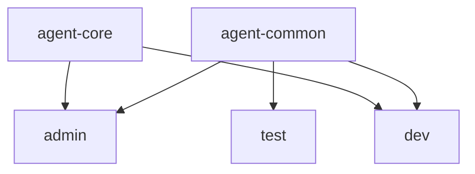
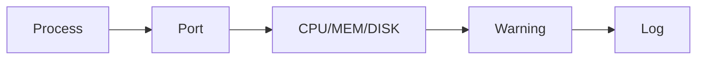
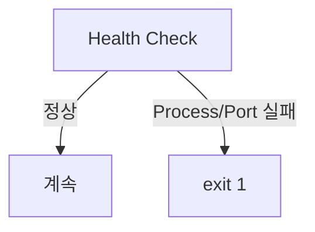

# B1-1 Round 01 — Beginner Guide

이 문서는 B1-1을 처음 수행하는 입문자가 공식 Mission/Evaluation을 기준으로 처음부터 끝까지 재현하기 위한 중심 가이드입니다.

> 현재 훈련 차수는 **R01 — CLEAR**입니다. Phase A에서는 Reference Complete Version을 먼저 준비하고, 실제 Ubuntu/WSL 실행·검증·Evidence는 Phase C에서 수행합니다. 실제 실행하지 않은 항목은 PASS/CLEAR로 기록하지 않습니다.

## 00. 미션 한눈에 보기

- 미션: **B1-1 — 컴퓨터가 알아서 자기 상태를 점검하게 만들기**
- 구분: **필수 미션 (REQUIRED)**
- 분야: **Linux와 OS**
- 상태: **🟡 ACTIVE**
- 현재 운영 모드: **Phase A — REFERENCE BUILD**
- 목표: Linux 운영 환경을 안전하게 구성하고 Bash `monitor.sh`로 시스템 상태를 점검·기록·자동 실행한 뒤 공식 평가항목을 Evidence로 증명합니다.

## 01. Source of Truth

1. `b1-1-mission.pdf`
2. `b1-1-mission.md`
3. `b1-1-evaluation.md`
4. `agent-app.zip`
5. 이번 Round의 구현·검증·Evidence

공식 원본은 수정하지 않습니다.

## 02. 무엇을 만드는가

1. SSH `20022`, Root 원격 로그인 차단
2. UFW/firewalld에서 `20022/tcp`, `15034/tcp`만 허용
3. `agent-admin`, `agent-dev`, `agent-test`와 `agent-common`, `agent-core`
4. `$AGENT_HOME`, `upload_files`, `api_keys`, `/var/log/agent-app` 권한/ACL
5. 제공 Agent 앱의 Boot Sequence 5단계 `[OK]`, `Agent READY`, `0.0.0.0:15034` LISTEN
6. Bash `monitor.sh`
7. CPU/MEM/DISK Warning
8. `/var/log/agent-app/monitor.log` 누적
9. `10MB / 10개` 로그 관리
10. `agent-admin` cron 매분 실행

## 03. Reference Complete Path

```text
SOURCE
  ↓
Baseline
  ↓
Golden Path / Prerequisites
  ↓
SSH 20022
  ↓
Firewall
  ↓
Users / Groups / ACL
  ↓
Agent environment / Secret(local only)
  ↓
Agent READY + 15034 LISTEN
  ↓
monitor.sh
  ↓
Log rotation
  ↓
cron
  ↓
Failure tests
  ↓
verify.sh
  ↓
Evidence + Evaluation Q&A
  ↓
✅ CLEAR
```

Reference Build 관련 파일은 `REFERENCE-BUILD.md`를 확인합니다.

---

# STEP 01 — 현재 실행 환경 Baseline 확인

## ① 왜 하는가

SSH, Firewall, 사용자, 포트 등 시스템 설정을 바꾸기 전에 현재 상태를 알아야 기존 환경을 손상시키지 않습니다.

## ② 무엇을 하는가

OS, CPU, WSL/VM 여부, 사용자, sudo, systemd, SSH, 중요 포트, Firewall, 기존 agent 계정/그룹, Git 상태를 읽기 전용으로 확인합니다.

## ③ 이번 단계에서 알아야 할 용어

- **운영체제 (Operating System)** — 시스템 전체를 관리하는 기본 소프트웨어입니다. B1-1의 Linux 환경을 확인합니다.
- **아키텍처 (Architecture)** — CPU 명령 체계입니다. 제공 Agent 실행 파일 선택에 필요합니다.
- **관리자 권한 (sudo)** — 필요한 명령만 관리자 권한으로 실행합니다.
- **포트 (Port)** — 네트워크 서비스를 구분하는 번호입니다. B1-1은 `20022`, `15034`가 핵심입니다.

## ④ 필요한 핵심 개념


현재 상태를 먼저 알면 기존 SSH 연결이나 사용자 구성을 무작정 덮어쓰지 않을 수 있습니다.

## ⑤ 실행할 명령어 또는 코드

```bash
cat /etc/os-release
uname -m
uname -a
grep -qi microsoft /proc/version && echo "WSL detected" || echo "WSL not detected"
whoami
id
ps -p 1 -o comm=
command -v ssh
command -v sshd || true
sudo ss -lntp | grep -E ':(22|20022|15034)\b' || true
command -v ufw && sudo ufw status verbose || true
for u in agent-admin agent-dev agent-test; do id "$u" 2>/dev/null || echo "[INFO] $u missing"; done
for g in agent-common agent-core; do getent group "$g" || echo "[INFO] $g missing"; done
git branch --show-current
git status --short
git remote -v
```

## ⑥ 명령어와 코드에 입문자가 이해할 수 있는 주석

- `uname -m`: CPU 아키텍처만 확인합니다.
- `id`: 현재 UID/GID와 그룹을 확인합니다.
- `ss -lntp`: TCP LISTEN 포트와 프로세스를 확인합니다.
- `command -v`: 명령 설치 여부를 확인합니다.
- `git status --short`: 로컬 변경을 짧게 확인합니다.

## ⑦ 예상되는 정상 결과

Ubuntu 22.04/24.04 또는 동등 Linux, `x86_64`/`aarch64`, systemd 여부, 현재 SSH/Firewall/포트 상태가 출력됩니다. 기존 agent 계정이 있어도 그 자체로 실패는 아닙니다.

## ⑧ 그 결과가 의미하는 것

이 결과로 WSL2/VM/일반 Linux Golden Path, Agent 아키텍처, SSH 전환 방법, 기존 계정 재사용 여부를 결정합니다.

## ⑨ 자주 발생하는 오류와 해결 방법

- `ss` 없음 → 다음 Step에서 `iproute2` 설치 여부 확인
- systemd 아님 → WSL/Container 종류부터 확인
- sudo 비밀번호 요구 → 정상일 수 있으며 비밀번호를 채팅에 보내지 않음
- 기존 agent 계정 존재 → 삭제하지 말고 재사용 여부 판단

## ⑩ 완료 확인

- [ ] OS/Architecture 확인
- [ ] systemd/SSH/포트 확인
- [ ] Firewall 확인
- [ ] 사용자/그룹 확인
- [ ] Git 작업트리 확인

---

# STEP 02 — Golden Path와 필수 도구 준비

## ① 왜 하는가

필요한 도구가 없으면 이후 명령이 중간에 실패합니다. 한 가지 기준 환경을 정해 가이드를 단순하게 유지합니다.

## ② 무엇을 하는가

`environment/prerequisites.md`를 기준으로 필요한 명령만 준비합니다.

## ③ 이번 단계에서 알아야 할 용어

- **Golden Path** — 이번 Round에서 우선 사용하는 하나의 기준 실행 경로입니다.
- **패키지 (Package)** — Linux에서 설치·관리되는 프로그램 묶음입니다.

## ④ 필요한 핵심 개념


Round 01에서는 여러 OS 변형을 동시에 지원하기보다 한 환경에서 재현 가능한 경로를 먼저 완성합니다.

## ⑤ 실행할 명령어 또는 코드

```bash
for c in bash ssh sshd ss ps pgrep df stat getfacl crontab unzip; do
    command -v "$c" || echo "[MISSING] $c"
done
```

필요할 때만:

```bash
sudo apt update
sudo apt install -y openssh-server ufw acl cron unzip procps iproute2
```

## ⑥ 명령어와 코드에 입문자가 이해할 수 있는 주석

`command -v`로 먼저 확인하고, 실제로 없는 도구가 있을 때만 `apt install`을 수행합니다.

## ⑦ 예상되는 정상 결과

필수 명령이 모두 경로를 출력합니다.

## ⑧ 그 결과가 의미하는 것

B1-1의 SSH, ACL, 모니터링, cron 실습을 진행할 최소 도구가 준비된 것입니다.

## ⑨ 자주 발생하는 오류와 해결 방법

- `apt` lock 오류 → 다른 패키지 관리 작업 종료 후 재시도
- 네트워크 오류 → DNS/인터넷 상태 먼저 확인

## ⑩ 완료 확인

- [ ] 필수 명령 존재
- [ ] 실제 OS/버전을 `environment/versions.md`에 Runtime 결과로 기록

---

# STEP 03 — SSH를 20022로 안전하게 전환

## ① 왜 하는가

공식 요구사항은 SSH 포트 `20022`와 Root 원격 로그인 차단입니다. 원격 서버에서는 잘못 적용하면 접속을 잃을 수 있어 안전 순서가 중요합니다.

## ② 무엇을 하는가

현재 SSH 설정을 백업하고 drop-in 설정을 추가한 뒤 문법 검사, reload, 새 포트 확인을 수행합니다.

## ③ 이번 단계에서 알아야 할 용어

- **SSH (Secure Shell)** — 원격 Linux에 암호화 접속하는 프로토콜입니다.
- **sshd** — SSH 서버 프로세스입니다.
- **drop-in configuration** — 기본 파일을 크게 수정하지 않고 별도 설정 파일로 값을 추가하는 방식입니다.

## ④ 필요한 핵심 개념


문법 검사를 통과하기 전에는 서비스를 적용하지 않습니다.

## ⑤ 실행할 명령어 또는 코드

현재 설정 확인:

```bash
sudo grep -RniE '^[[:space:]]*(Port|PermitRootLogin)' \
  /etc/ssh/sshd_config /etc/ssh/sshd_config.d 2>/dev/null || true
```

백업:

```bash
sudo cp -a /etc/ssh/sshd_config \
  "/etc/ssh/sshd_config.b1-1-r01.$(date +%Y%m%d%H%M%S).bak"
```

설정 작성:

```bash
printf '%s\n' 'Port 20022' 'PermitRootLogin no' \
  | sudo tee /etc/ssh/sshd_config.d/99-codyssey-b1-1.conf >/dev/null
```

검사·적용:

```bash
sudo sshd -t
sudo systemctl reload ssh
sudo ss -lntp | grep ':20022'
sudo sshd -T | grep -E '^(port|permitrootlogin) '
```

다른 터미널에서 실제 새 접속을 확인합니다.

```bash
ssh -p 20022 <사용자>@<서버주소>
```

## ⑥ 명령어와 코드에 입문자가 이해할 수 있는 주석

- `cp -a`: 원본 속성을 최대한 보존해 백업합니다.
- `sshd -t`: 설정 문법만 검사합니다.
- `systemctl reload`: 프로세스를 완전히 재시작하지 않고 설정을 다시 읽습니다.
- `sshd -T`: 실제 적용되는 effective configuration을 확인합니다.

## ⑦ 예상되는 정상 결과

`sshd -t`는 오류 없이 종료하고, `ss`에 `:20022` LISTEN이 보이며 `sshd -T`에서 `port 20022`, `permitrootlogin no`가 확인됩니다.

## ⑧ 그 결과가 의미하는 것

새 SSH 포트와 Root 원격 로그인 차단이 실제 서버 설정에 반영된 것입니다.

## ⑨ 자주 발생하는 오류와 해결 방법

- `sshd -t` 오류 → 적용하지 말고 메시지의 파일/라인 수정
- 20022 미LISTEN → active `Port 22` 등 중복 설정 검색
- 원격 새 접속 실패 → 기존 세션을 끊지 말고 Firewall/주소/sshd 상태부터 확인

## ⑩ 완료 확인

- [ ] 백업 존재
- [ ] `sshd -t` 성공
- [ ] 20022 LISTEN
- [ ] `PermitRootLogin no`
- [ ] 실제 새 SSH 세션 성공

---

# STEP 04 — Firewall을 필요한 포트만 허용

## ① 왜 하는가

열 필요가 없는 포트를 외부에 노출하지 않아 공격 표면을 줄입니다.

## ② 무엇을 하는가

UFW 기준으로 20022/tcp, 15034/tcp를 허용하고 다른 불필요한 인바운드 규칙을 제거합니다.

## ③ 이번 단계에서 알아야 할 용어

- **방화벽 (Firewall)** — 네트워크 접근을 허용/차단하는 정책입니다.
- **인바운드 (Inbound)** — 외부에서 현재 서버로 들어오는 연결입니다.

## ④ 필요한 핵심 개념


SSH 안전성을 위해 20022가 실제 동작하는 것을 먼저 확인한 뒤 최종 규칙을 정리합니다.

## ⑤ 실행할 명령어 또는 코드

```bash
sudo ufw default deny incoming
sudo ufw default allow outgoing
sudo ufw allow 20022/tcp
sudo ufw allow 15034/tcp
sudo ufw enable
sudo ufw status numbered
```

기존 `22/tcp` 허용 규칙이 있고 새 20022 접속이 검증되었다면 번호를 확인한 뒤 해당 규칙만 삭제합니다.

```bash
sudo ufw status numbered
sudo ufw delete <규칙번호>
```

## ⑥ 명령어와 코드에 입문자가 이해할 수 있는 주석

`ufw delete`는 번호가 바뀔 수 있으므로 상태를 다시 확인한 뒤 정확한 규칙만 삭제합니다.

## ⑦ 예상되는 정상 결과

UFW가 active이고 인바운드 핵심 허용이 `20022/tcp`, `15034/tcp`로 정리됩니다.

## ⑧ 그 결과가 의미하는 것

SSH와 Agent 서비스만 외부에서 접근하도록 네트워크 경계를 최소화한 것입니다.

## ⑨ 자주 발생하는 오류와 해결 방법

- 원격 SSH가 끊길 위험 → 20022 새 세션 확인 전 22 규칙 삭제 금지
- 예상 외 규칙 존재 → 실습 전용 환경인지 확인하고 하나씩 검토

## ⑩ 완료 확인

- [ ] Firewall active
- [ ] 20022/tcp 허용
- [ ] 15034/tcp 허용
- [ ] 불필요한 인바운드 규칙 없음

---

# STEP 05 — 사용자·그룹·디렉터리·ACL 구성

## ① 왜 하는가

admin/dev/test 역할을 분리하고 공유 데이터와 보안 데이터를 최소 권한으로 나누기 위해서입니다.

## ② 무엇을 하는가

세 사용자, 두 그룹, `$AGENT_HOME` 구조, 소유권/권한/ACL을 만듭니다.

## ③ 이번 단계에서 알아야 할 용어

- **사용자 (User)** — Linux에서 작업 주체를 구분하는 계정입니다.
- **그룹 (Group)** — 여러 사용자에게 공통 권한을 주는 단위입니다.
- **ACL (Access Control List)** — 기본 owner/group/others보다 세밀한 권한 규칙입니다.
- **최소 권한 (Least Privilege)** — 필요한 사람에게 필요한 권한만 주는 원칙입니다.

## ④ 필요한 핵심 개념



`upload_files`는 세 사용자가 공유하지만 `api_keys`와 로그는 core인 admin/dev만 접근합니다.

## ⑤ 실행할 명령어 또는 코드

```bash
sudo groupadd -f agent-common
sudo groupadd -f agent-core

id agent-admin >/dev/null 2>&1 || sudo useradd -m -s /bin/bash agent-admin
id agent-dev   >/dev/null 2>&1 || sudo useradd -m -s /bin/bash agent-dev
id agent-test  >/dev/null 2>&1 || sudo useradd -m -s /bin/bash agent-test

sudo usermod -aG agent-common,agent-core agent-admin
sudo usermod -aG agent-common,agent-core agent-dev
sudo usermod -aG agent-common agent-test
```

기준 경로:

```bash
export AGENT_HOME=/home/agent-admin/agent-app
sudo install -d -o agent-admin -g agent-core   -m 0750 "$AGENT_HOME"
sudo install -d -o agent-admin -g agent-common -m 2770 "$AGENT_HOME/upload_files"
sudo install -d -o agent-admin -g agent-core   -m 2770 "$AGENT_HOME/api_keys"
sudo install -d -o agent-dev   -g agent-core   -m 0750 "$AGENT_HOME/bin"
sudo install -d -o agent-admin -g agent-core   -m 2770 /var/log/agent-app
```

ACL:

```bash
sudo setfacl -m g:agent-common:rwx,m:rwx "$AGENT_HOME/upload_files"
sudo setfacl -d -m g:agent-common:rwx,m:rwx "$AGENT_HOME/upload_files"
sudo setfacl -m g:agent-core:rwx,m:rwx "$AGENT_HOME/api_keys" /var/log/agent-app
sudo setfacl -d -m g:agent-core:rwx,m:rwx "$AGENT_HOME/api_keys" /var/log/agent-app
```

검증:

```bash
id agent-admin
id agent-dev
id agent-test
ls -ld "$AGENT_HOME" "$AGENT_HOME/upload_files" "$AGENT_HOME/api_keys" /var/log/agent-app
getfacl "$AGENT_HOME/upload_files" "$AGENT_HOME/api_keys" /var/log/agent-app
```

## ⑥ 명령어와 코드에 입문자가 이해할 수 있는 주석

- `usermod -aG`: 기존 그룹을 유지하면서 추가 그룹에 가입시킵니다.
- `2770`: group rwx + setgid로 새 파일이 디렉터리 그룹을 계승하게 합니다.
- `setfacl -d`: 새 파일/디렉터리에 적용될 기본 ACL을 지정합니다.

## ⑦ 예상되는 정상 결과

admin/dev는 common+core, test는 common에 속하고, `upload_files`는 common, `api_keys`와 로그는 core 그룹으로 확인됩니다.

## ⑧ 그 결과가 의미하는 것

공유 영역과 민감 운영 영역이 역할별로 분리되었습니다.

## ⑨ 자주 발생하는 오류와 해결 방법

- 새 그룹이 현재 셸에 즉시 안 보임 → 재로그인 또는 `newgrp` 고려
- `setfacl` 없음 → `sudo apt install acl`
- 기존 사용자 존재 → 삭제하지 말고 membership만 보완

## ⑩ 완료 확인

- [ ] 사용자 3개
- [ ] 그룹 2개
- [ ] membership
- [ ] 디렉터리 구조
- [ ] owner/group/mode
- [ ] ACL

---

# STEP 06 — Agent 앱과 환경변수·Secret 준비

## ① 왜 하는가

제공 앱의 Boot Sequence가 요구하는 경로와 환경변수를 정확하게 맞춰야 합니다.

## ② 무엇을 하는가

ZIP 내부를 확인하고 CPU 아키텍처에 맞는 실행 대상을 선택하며, 비밀값을 제외한 환경변수 파일과 실제 Secret 파일을 로컬에서만 준비합니다.

## ③ 이번 단계에서 알아야 할 용어

- **환경변수 (Environment Variable)** — 프로그램 실행 시 외부에서 전달하는 설정값입니다.
- **Secret** — 공개 저장소나 로그에 노출하면 안 되는 민감 값입니다.
- **ELF** — Linux에서 사용하는 실행 파일 형식 중 하나입니다.

## ④ 필요한 핵심 개념


Secret 값은 GitHub/채팅/Evidence에 쓰지 않고 실제 머신에서만 입력합니다.

## ⑤ 실행할 명령어 또는 코드

```bash
uname -m
unzip -l agent-app.zip
rm -rf /tmp/b1-1-agent-inspect
mkdir -p /tmp/b1-1-agent-inspect
unzip -q agent-app.zip -d /tmp/b1-1-agent-inspect
find /tmp/b1-1-agent-inspect -maxdepth 3 -type f -exec file {} \;
```

아키텍처에 맞는 파일을 확인한 뒤 실제 선택 파일을 `<선택파일>`로 바꿉니다.

```bash
sudo install -o agent-admin -g agent-core -m 0750 \
  /tmp/b1-1-agent-inspect/<선택파일> \
  /home/agent-admin/agent-app/bin/agent-app
```

비밀값이 없는 환경 파일:

```bash
sudo tee /home/agent-admin/agent-app/env.sh >/dev/null <<'EOF'
export AGENT_HOME=/home/agent-admin/agent-app
export AGENT_PORT=15034
export AGENT_UPLOAD_DIR=/home/agent-admin/agent-app/upload_files
export AGENT_KEY_PATH=/home/agent-admin/agent-app/api_keys/t_secret.key
export AGENT_LOG_DIR=/var/log/agent-app
export AGENT_PROCESS_PATTERN='agent-app|agent_app.py'
EOF
sudo chown agent-admin:agent-core /home/agent-admin/agent-app/env.sh
sudo chmod 0640 /home/agent-admin/agent-app/env.sh
```

Secret은 공식 Mission에서 확인한 값을 **직접 로컬 터미널에서만** 입력합니다.

```bash
read -rsp 'Enter B1-1 mission test key: ' B1_SECRET; echo
printf '%s\n' "$B1_SECRET" \
  | sudo tee /home/agent-admin/agent-app/api_keys/t_secret.key >/dev/null
unset B1_SECRET
sudo chown agent-admin:agent-core /home/agent-admin/agent-app/api_keys/t_secret.key
sudo chmod 0660 /home/agent-admin/agent-app/api_keys/t_secret.key
```

값을 출력하지 않고 존재/권한만 검증합니다.

```bash
sudo test -s /home/agent-admin/agent-app/api_keys/t_secret.key && echo '[PASS] key file exists'
sudo stat -c '%U %G %a %n' /home/agent-admin/agent-app/api_keys/t_secret.key
```

## ⑥ 명령어와 코드에 입문자가 이해할 수 있는 주석

- `unzip -l`: 압축을 풀지 않고 목록만 봅니다.
- `file`: 바이너리 아키텍처/형식을 확인합니다.
- `read -s`: 입력한 Secret을 화면에 표시하지 않습니다.
- `tee >/dev/null`: 파일에 쓰되 Secret 값을 터미널 출력에 남기지 않습니다.

## ⑦ 예상되는 정상 결과

CPU와 맞는 제공 실행 대상이 확인되고 env.sh와 key 파일의 경로/권한이 준비됩니다.

## ⑧ 그 결과가 의미하는 것

Agent Boot Sequence가 검사할 실행 환경의 전제조건을 만든 것입니다.

## ⑨ 자주 발생하는 오류와 해결 방법

- `Exec format error` → CPU 아키텍처가 다른 파일 선택 여부 확인
- `Permission denied` → executable mode/owner/group 확인
- Secret 관련 실패 → 값을 채팅에 보내지 말고 공식 원본을 보고 로컬에서 다시 입력

## ⑩ 완료 확인

- [ ] ZIP 내부 확인
- [ ] CPU 아키텍처와 실행 파일 일치
- [ ] env.sh 준비
- [ ] Secret 파일 존재/권한 확인, 값 노출 없음

---

# STEP 07 — Agent Boot Sequence와 15034 LISTEN 검증

## ① 왜 하는가

`monitor.sh`는 실제 Agent가 정상 실행 중이라는 전제에서 동작하므로 먼저 서비스 자체를 검증해야 합니다.

## ② 무엇을 하는가

root가 아닌 `agent-admin`으로 Agent를 실행하고 Boot 5/5, `Agent READY`, TCP 15034를 확인합니다.

## ③ 이번 단계에서 알아야 할 용어

- **프로세스 (Process)** — 실행 중인 프로그램 인스턴스입니다.
- **LISTEN** — 네트워크 프로그램이 연결을 받을 준비가 된 상태입니다.
- **Boot Sequence** — 앱이 시작 전에 환경을 차례로 검사하는 과정입니다.

## ④ 필요한 핵심 개념


앱 메시지와 운영체제 포트 상태를 둘 다 확인해야 합니다.

## ⑤ 실행할 명령어 또는 코드

실행 파일이 `/home/agent-admin/agent-app/bin/agent-app`인 Golden Path 예시:

```bash
sudo -u agent-admin -H bash -lc '
  source /home/agent-admin/agent-app/env.sh
  exec /home/agent-admin/agent-app/bin/agent-app
'
```

다른 터미널에서:

```bash
ps -ef | grep '[a]gent-app'
sudo ss -lntp | grep ':15034'
```

## ⑥ 명령어와 코드에 입문자가 이해할 수 있는 주석

`sudo -u agent-admin`은 root가 아니라 지정 일반 계정으로 실행합니다. `exec`는 셸 프로세스를 실제 Agent로 교체합니다.

## ⑦ 예상되는 정상 결과

Boot Sequence 5단계가 모두 `[OK]`, 마지막에 `Agent READY`, `ss`에서 `0.0.0.0:15034` 또는 동등한 all-interface LISTEN이 확인됩니다.

## ⑧ 그 결과가 의미하는 것

공식 제공 앱이 요구한 계정·환경·파일·포트·로그 권한 조건을 모두 통과한 것입니다.

## ⑨ 자주 발생하는 오류와 해결 방법

- User check 실패 → root 실행 여부 확인
- Env check 실패 → `source env.sh`와 경로 확인
- Key check 실패 → 파일 존재/권한/로컬 입력값 확인
- Port in use → `sudo ss -lntp | grep ':15034'`로 점유 프로세스 확인
- Log permission 실패 → `/var/log/agent-app` owner/group/mode/ACL 확인

## ⑩ 완료 확인

- [ ] root 아닌 계정 실행
- [ ] Boot 5/5
- [ ] Agent READY
- [ ] 15034 LISTEN

---

# STEP 08 — monitor.sh 설치와 정상 실행

## ① 왜 하는가

B1-1의 핵심 구현물은 Agent 프로세스/포트/자원을 자동 확인하고 로그로 남기는 Bash 스크립트입니다.

## ② 무엇을 하는가

Repository의 Reference `monitor.sh`를 공식 Runtime 경로에 설치하고 권한을 맞춰 실행합니다.

## ③ 이번 단계에서 알아야 할 용어

- **Health Check** — 핵심 서비스가 실제 동작 중인지 검사하는 절차입니다.
- **임계값 (Threshold)** — 경고를 발생시키는 기준값입니다.
- **리다이렉션 (Redirection)** — 프로그램 출력을 파일로 보내는 기능입니다.

## ④ 필요한 핵심 개념



프로세스/포트 실패는 서비스 장애이므로 `exit 1`, 자원 임계값은 관제를 계속하기 위해 Warning으로 처리합니다.

## ⑤ 실행할 명령어 또는 코드

Repository 루트에서:

```bash
sudo install -o agent-dev -g agent-core -m 0750 \
  training/round-01-clear/monitor.sh \
  /home/agent-admin/agent-app/bin/monitor.sh
```

검증:

```bash
stat -c '%U %G %a %n' /home/agent-admin/agent-app/bin/monitor.sh
```

실행:

```bash
sudo -u agent-admin -H bash -lc '
  source /home/agent-admin/agent-app/env.sh
  /home/agent-admin/agent-app/bin/monitor.sh
  echo "exit=$?"
'
```

## ⑥ 명령어와 코드에 입문자가 이해할 수 있는 주석

- `install -o -g -m`: 복사와 동시에 owner/group/mode를 지정합니다.
- `pgrep/ps`: 프로세스와 CPU/MEM을 확인합니다.
- `ss`: 15034 LISTEN 여부를 확인합니다.
- `df -P /`: Root filesystem의 디스크 사용률을 확인합니다.

## ⑦ 예상되는 정상 결과

Process `[OK]`, TCP 15034 `[OK]`, CPU/MEM/DISK 수치, 필요 시 Warning, log append `[OK]`, `exit=0`이 출력됩니다.

## ⑧ 그 결과가 의미하는 것

관제 스크립트가 핵심 서비스 상태와 자원 상태를 한 번의 실행으로 확인하고 기록할 수 있습니다.

## ⑨ 자주 발생하는 오류와 해결 방법

- Process not found → 실제 실행 파일명과 `AGENT_PROCESS_PATTERN` 확인
- Port not LISTEN → Agent가 정상 bind됐는지 먼저 해결
- log directory not writable → group/core 권한 확인

## ⑩ 완료 확인

- [ ] Runtime 경로
- [ ] owner `agent-dev`
- [ ] group `agent-core`
- [ ] mode `750`
- [ ] 정상 실행 exit 0

---

# STEP 09 — monitor.log와 10MB/10개 로그 관리 검증

## ① 왜 하는가

로그가 무한히 커지면 디스크를 가득 채울 수 있으므로 공식 요구사항의 용량 제한을 확인해야 합니다.

## ② 무엇을 하는가

정상 로그 형식을 확인하고 별도 임시 로그 디렉터리에서 10MB 회전 로직을 안전하게 재현합니다.

## ③ 이번 단계에서 알아야 할 용어

- **로그 회전 (Log Rotation)** — 큰 로그를 이전 파일로 넘기고 새 로그를 시작하는 방식입니다.
- **보존 정책 (Retention Policy)** — 로그를 얼마나 많이/오래 유지할지 정한 규칙입니다.

## ④ 필요한 핵심 개념


Reference 구현은 active log와 번호 로그를 합쳐 최대 10개를 유지합니다.

## ⑤ 실행할 명령어 또는 코드

실제 로그 형식:

```bash
sudo tail -n 5 /var/log/agent-app/monitor.log
```

안전한 임시 회전 테스트:

```bash
rm -rf /tmp/b1-1-log-test
mkdir -p /tmp/b1-1-log-test
chmod 700 /tmp/b1-1-log-test
truncate -s 10485760 /tmp/b1-1-log-test/monitor.log

sudo -u agent-admin -H bash -lc '
  source /home/agent-admin/agent-app/env.sh
  export AGENT_LOG_DIR=/tmp/b1-1-log-test
  /home/agent-admin/agent-app/bin/monitor.sh
'

ls -lh /tmp/b1-1-log-test
```

> `/tmp/b1-1-log-test`를 agent-admin이 쓸 수 있도록 실제 Runtime에서는 소유권이 필요할 수 있습니다. 필요하면 `sudo chown agent-admin:agent-core /tmp/b1-1-log-test`를 먼저 수행합니다.

## ⑥ 명령어와 코드에 입문자가 이해할 수 있는 주석

`truncate -s`는 테스트 파일 크기만 빠르게 키웁니다. 실제 운영 로그를 손상시키지 않기 위해 `/tmp`를 사용합니다.

## ⑦ 예상되는 정상 결과

기존 10MB `monitor.log`가 `monitor.log.1`로 이동하고 새 `monitor.log`에 한 줄이 기록됩니다.

## ⑧ 그 결과가 의미하는 것

로그 크기 임계값을 넘었을 때 회전되어 디스크 폭증 위험을 줄이는 정책이 작동합니다.

## ⑨ 자주 발생하는 오류와 해결 방법

- `/tmp` write denied → test directory owner 변경
- 회전 안 됨 → 파일 크기와 `stat` 결과 확인

## ⑩ 완료 확인

- [ ] 공식 로그 포맷
- [ ] 10MB 회전
- [ ] 최대 10개 유지 로직 설명 가능

---

# STEP 10 — agent-admin cron 매분 자동 실행

## ① 왜 하는가

운영 관제는 사람이 매번 실행하는 것이 아니라 일정 주기로 자동 수행되어야 합니다.

## ② 무엇을 하는가

`agent-admin` crontab에 monitor.sh를 매분 등록하고 1~2분 후 실제 로그 증가를 비교합니다.

## ③ 이번 단계에서 알아야 할 용어

- **cron** — Linux에서 명령을 정해진 시간마다 실행하는 스케줄러입니다.
- **crontab** — 사용자별 cron 작업 목록입니다.

## ④ 필요한 핵심 개념


cron 환경은 로그인 셸보다 환경변수가 적으므로 `env.sh`를 명시적으로 읽습니다.

## ⑤ 실행할 명령어 또는 코드

현재 crontab 백업:

```bash
sudo crontab -u agent-admin -l 2>/dev/null \
  > /tmp/agent-admin-crontab.before-b1-1.txt || true
```

편집:

```bash
sudo crontab -u agent-admin -e
```

추가할 한 줄:

```cron
* * * * * . /home/agent-admin/agent-app/env.sh; /home/agent-admin/agent-app/bin/monitor.sh >> /var/log/agent-app/cron.log 2>&1
```

Before:

```bash
sudo wc -l /var/log/agent-app/monitor.log
```

1~2분 후 After:

```bash
sudo wc -l /var/log/agent-app/monitor.log
sudo tail -n 3 /var/log/agent-app/monitor.log
sudo crontab -u agent-admin -l
```

## ⑥ 명령어와 코드에 입문자가 이해할 수 있는 주석

- `* * * * *`: 매분 실행합니다.
- `. env.sh`: cron에 필요한 환경변수를 불러옵니다.
- `>> cron.log 2>&1`: 표준출력과 오류를 운영 로그로 누적합니다.

## ⑦ 예상되는 정상 결과

1~2분 후 `monitor.log` 줄 수가 증가합니다.

## ⑧ 그 결과가 의미하는 것

사용자가 직접 실행하지 않아도 매분 시스템 관제가 자동 실행됩니다.

## ⑨ 자주 발생하는 오류와 해결 방법

- cron 등록됐지만 로그 미증가 → `cron.log`, env.sh 읽기 권한, monitor.sh 실행권한 확인
- `crontab` 없음 → cron 패키지와 서비스 상태 확인

## ⑩ 완료 확인

- [ ] agent-admin crontab
- [ ] 매분 등록
- [ ] 1~2분 후 실제 로그 증가

---

# STEP 11 — 실패 경로와 exit 1 검증

## ① 왜 하는가

정상 실행만 확인하면 Health Check가 실제 장애를 잡는지 증명할 수 없습니다.

## ② 무엇을 하는가

프로세스 미존재와 포트 미LISTEN 상황을 안전하게 재현해 `exit 1`을 확인합니다.

## ③ 이번 단계에서 알아야 할 용어

- **종료 코드 (Exit Code)** — 프로그램의 성공/실패를 숫자로 전달하는 값입니다. 일반적으로 0은 성공, 0이 아닌 값은 실패입니다.

## ④ 필요한 핵심 개념



## ⑤ 실행할 명령어 또는 코드

프로세스 중단 테스트는 Agent를 정상적으로 `Ctrl+C` 또는 제공 방식으로 종료한 뒤:

```bash
sudo -u agent-admin -H bash -lc '
  source /home/agent-admin/agent-app/env.sh
  /home/agent-admin/agent-app/bin/monitor.sh
  echo "exit=$?"
'
```

Port failure를 별도로 확인하려면 실제 Agent가 중단된 상태에서 임시 가짜 프로세스를 사용합니다.

```bash
bash -c 'exec -a b1-1-fake-agent sleep 60' &
FAKE_PID=$!

sudo -u agent-admin -H bash -lc '
  source /home/agent-admin/agent-app/env.sh
  export AGENT_PROCESS_PATTERN=b1-1-fake-agent
  /home/agent-admin/agent-app/bin/monitor.sh
  echo "exit=$?"
'

kill "$FAKE_PID" 2>/dev/null || true
```

테스트 후 실제 Agent를 다시 정상 실행합니다.

## ⑥ 명령어와 코드에 입문자가 이해할 수 있는 주석

가짜 프로세스는 Process Check만 통과시키고 15034는 열지 않기 때문에 Port Check 실패를 분리해 확인할 수 있습니다.

## ⑦ 예상되는 정상 결과

Process 없음 또는 15034 미LISTEN에서 `[FAIL]`과 `exit=1`이 확인됩니다.

## ⑧ 그 결과가 의미하는 것

monitor.sh가 실제 서비스 장애를 성공과 구분할 수 있습니다.

## ⑨ 자주 발생하는 오류와 해결 방법

- 가짜 프로세스가 너무 빨리 종료 → `sleep` 시간 늘림
- 실제 Agent가 여전히 15034 LISTEN → Port failure 테스트 전 정상 종료 확인

## ⑩ 완료 확인

- [ ] Process failure exit 1
- [ ] Port failure exit 1
- [ ] 실제 Agent 정상 복구

---

# STEP 12 — 통합 verify.sh 실행

## ① 왜 하는가

여러 요구사항을 한 번에 재확인해 누락을 줄입니다.

## ② 무엇을 하는가

`environment/verify.sh`를 실행하고 모든 FAIL을 실제 원인에 따라 수정합니다.

## ③ 이번 단계에서 알아야 할 용어

- **검증 (Verification)** — 구현이 정해진 요구사항을 만족하는지 확인하는 과정입니다.

## ④ 필요한 핵심 개념

`verify.sh`는 **검증만 수행**하며 시스템을 변경하지 않습니다.

## ⑤ 실행할 명령어 또는 코드

```bash
bash training/round-01-clear/environment/verify.sh
```

## ⑥ 명령어와 코드에 입문자가 이해할 수 있는 주석

결과는 `[PASS]`/`[FAIL]`과 마지막 `Result: N PASS / N FAIL` 형태입니다.

## ⑦ 예상되는 정상 결과

최종적으로 필수 Runtime 환경이 모두 준비되면 `0 FAIL`을 목표로 합니다.

## ⑧ 그 결과가 의미하는 것

자동 확인 가능한 B1-1 요구사항이 한 번에 통과했다는 의미입니다. 다만 설명형 평가와 Evidence는 별도입니다.

## ⑨ 자주 발생하는 오류와 해결 방법

FAIL 한 항목만 원래 Step으로 돌아가 수정한 뒤 verify를 다시 실행합니다. 전체 환경을 초기화하지 않습니다.

## ⑩ 완료 확인

- [ ] `Result: N PASS / 0 FAIL`

---

# STEP 13 — Evidence 정리

## ① 왜 하는가

평가자는 설정이 존재한다는 설명보다 실제 명령 출력과 동작 결과로 요구사항 충족 여부를 확인해야 합니다.

## ② 무엇을 하는가

`evidence/README.md` 순서대로 실제 결과를 수집합니다.

## ③ 이번 단계에서 알아야 할 용어

- **Evidence** — 요구사항이 실제로 충족되었음을 증명하는 자료입니다.

## ④ 필요한 핵심 개념

```text
Requirement → Implementation → Verification → Evidence
```

## ⑤ 실행할 명령어 또는 코드

필요한 실제 명령은 각 Runtime Step의 검증 명령을 재사용합니다. Secret 파일 내용은 절대로 출력하지 않습니다.

## ⑥ 명령어와 코드에 입문자가 이해할 수 있는 주석

Evidence는 예상 결과가 아니라 실제 Runtime 결과여야 합니다.

## ⑦ 예상되는 정상 결과

SSH, Firewall, 계정/그룹, 권한, Agent Boot, 포트, monitor, 로그, cron, verify가 평가항목과 1:1로 연결됩니다.

## ⑧ 그 결과가 의미하는 것

다른 사람이 Repository와 Evidence만 보고도 미션 수행 여부를 재확인할 수 있습니다.

## ⑨ 자주 발생하는 오류와 해결 방법

- 화면에 Secret이 보임 → 해당 Evidence 폐기 후 값이 안 보이는 검증 방식으로 다시 생성
- 스크린샷만 있고 어떤 요구인지 불명확 → `docs/requirements-mapping.md` ID와 연결

## ⑩ 완료 확인

- [ ] 필수 Evidence 모두 실제 결과
- [ ] Secret 없음
- [ ] Requirement Mapping 연결

---

# STEP 14 — Evaluation Q&A 학습

## ① 왜 하는가

공식 Evaluation은 동작뿐 아니라 구현 이유와 장애 대응을 설명할 수 있는지 확인합니다.

## ② 무엇을 하는가

`docs/evaluation-qa.md`를 읽고 자신의 실제 구현 결과를 근거로 다시 설명합니다.

## ③ 이번 단계에서 알아야 할 용어

현재까지 등장한 `SSH`, `Firewall`, `ACL`, `Health Check`, `cron`, `log rotation`, `exit code`를 연결해 설명합니다.

## ④ 필요한 핵심 개념

기능 이름을 외우는 것이 아니라 **왜 이 구조를 선택했는지** 설명하는 것이 목표입니다.

## ⑤ 실행할 명령어 또는 코드

코드 실행 단계가 아니라 실제 파일을 근거로 설명합니다.

```bash
sed -n '1,240p' training/round-01-clear/docs/evaluation-qa.md
```

## ⑥ 명령어와 코드에 입문자가 이해할 수 있는 주석

`sed -n`은 문서를 읽기 위해 사용하며 시스템을 변경하지 않습니다.

## ⑦ 예상되는 정상 결과

각 평가 질문에 2~5문장 정도로 자신의 말로 답할 수 있습니다.

## ⑧ 그 결과가 의미하는 것

명령 복사 수준이 아니라 B1-1 운영 구조의 이유를 이해한 상태입니다.

## ⑨ 자주 발생하는 오류와 해결 방법

외운 문장이 실제 환경과 다르면 Runtime Evidence를 다시 확인해 자신의 결과에 맞게 설명합니다.

## ⑩ 완료 확인

- [ ] Evaluation 항목 2~4 설명 가능

---

# STEP 15 — Final CLEAR Gate

## ① 왜 하는가

Reference Build와 실제 미션 완료를 구분하기 위해 최종 Gate가 필요합니다.

## ② 무엇을 하는가

`CHECKLIST.md`를 마지막으로 검토합니다.

## ③ 이번 단계에서 알아야 할 용어

- **Gate** — 다음 단계로 넘어가기 전에 반드시 통과해야 하는 조건 묶음입니다.

## ④ 필요한 핵심 개념

문서 존재 ≠ 실행 성공 ≠ Evidence 완료입니다. 세 가지를 모두 구분합니다.

## ⑤ 실행할 명령어 또는 코드

```bash
bash training/round-01-clear/environment/verify.sh
```

그리고 `CHECKLIST.md`의 실제 Runtime/Evidence 항목을 확인합니다.

## ⑥ 명령어와 코드에 입문자가 이해할 수 있는 주석

verify가 자동 항목을 확인하고 Checklist가 설명형·Evidence·Secret까지 포함해 최종 판단합니다.

## ⑦ 예상되는 정상 결과

공식 요구사항, Evaluation, 실제 Runtime, Evidence, Beginner Guide, Secret 보호가 모두 완료됩니다.

## ⑧ 그 결과가 의미하는 것

이때만 B1-1을 `✅ CLEAR`로 변경할 수 있습니다.

## ⑨ 자주 발생하는 오류와 해결 방법

미검증 항목을 억지로 체크하지 않습니다. 해당 Step으로 돌아가 실제로 확인합니다.

## ⑩ 완료 확인

- [ ] Mission 요구사항 충족
- [ ] Evaluation 충족
- [ ] verify 0 FAIL
- [ ] 실제 Evidence 완료
- [ ] Secret 노출 없음
- [ ] **✅ B1-1 CLEAR**

---

## 보조 파일

- `REFERENCE-BUILD.md` — Reference 준비 현황
- `environment/README.md` — 환경 운영 원칙
- `environment/prerequisites.md` — 사전조건
- `environment/versions.md` — 실제 버전 기록
- `environment/setup.sh` — 재현 보조
- `environment/verify.sh` — 검증 전용
- `environment/reset.sh` — 보수적 reset
- `monitor.sh` — 기준 관제 구현
- `docs/requirements-mapping.md` — Requirement/Evidence 연결
- `docs/evaluation-qa.md` — 평가 설명 기준
- `evidence/README.md` — 실제 Evidence 계획

## Secret 원칙

실제 `.env`, `*.key`, Password, API Key, Access Token, Private Key는 GitHub·채팅·로그·Evidence에 저장하지 않습니다. 특히 `t_secret.key`는 **값을 보여 주지 않고 존재와 권한만 검증**합니다.
