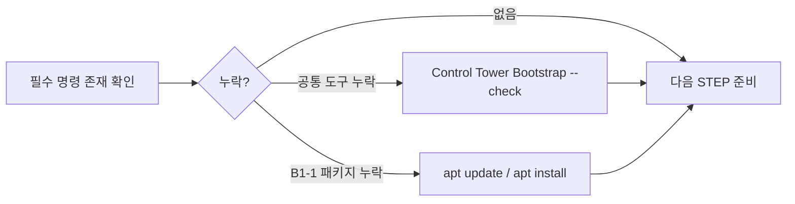
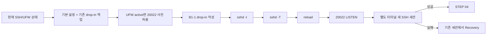
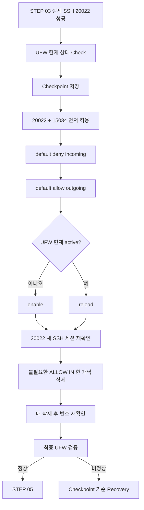
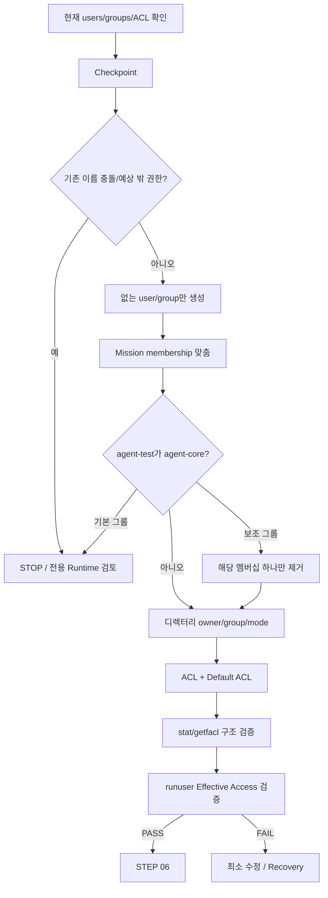
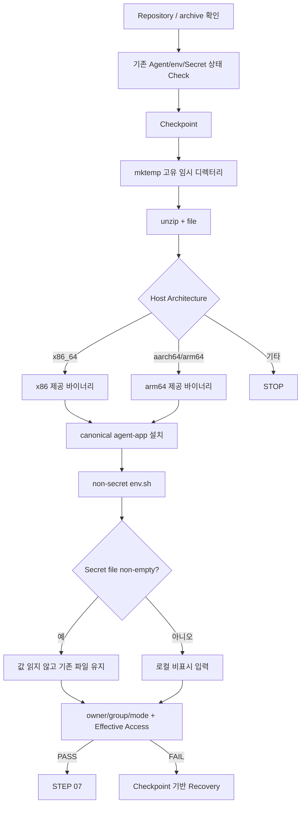
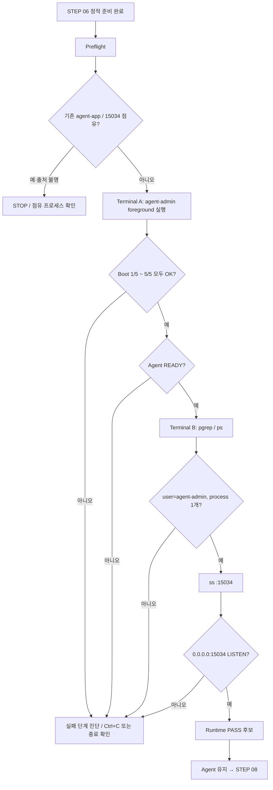
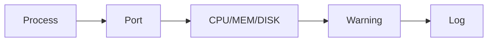
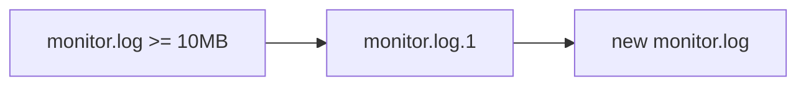
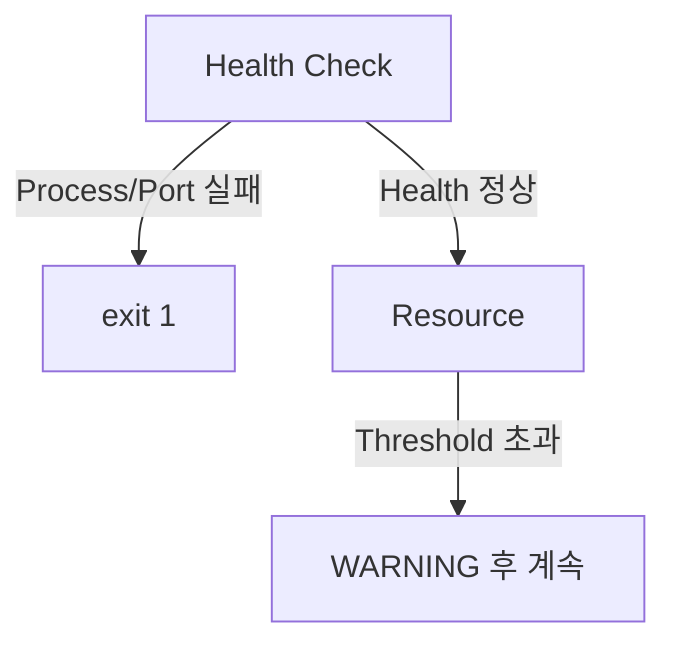
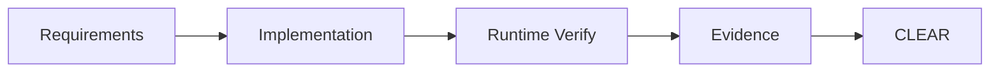

# B1-1 Round 01 — Beginner Guide

이 문서는 B1-1을 처음 수행하는 입문자가 공식 Mission/Evaluation을 기준으로 처음부터 끝까지 재현하기 위한 중심 가이드입니다.

> 현재 훈련 차수는 **R01 — CLEAR**이며, Control Tower의 현재 운영 기준은 **Phase C — FAST EXECUTE / Runtime**입니다. Phase A/B의 Reference·설계 준비는 완료된 상태로 보고, 지금은 실제 Ubuntu Runtime → Verify → Evidence → CLEAR를 우선합니다. 실제 실행하지 않은 항목은 PASS/CLEAR로 기록하지 않습니다.

---

<a id="quick-start"></a>
## 🚀 빠른 시작(Quick Start)

> **공통 개발환경이 이미 준비되어 있고 B1-1 저장소를 받은 학습자**가 안전하게 현재 상태를 다시 확인하는 경로입니다.
> 처음 개발환경을 준비하는 경우에는 Control Tower의 `environments/START-HERE-DEVELOPMENT-ENVIRONMENT.md`를 먼저 완료한 뒤 돌아오세요.

### 📍 실행 위치

```text
Host       : MAC-V OrbStack Ubuntu 24.04 또는 WIN-V WSL2 Ubuntu 24.04
Terminal   : Ubuntu Bash
Repository : $HOME/codyssey/codyssey-basic-b1-1-system-monitor
권한       : 일반 사용자
venv       : 해당 없음
```

### 빠른 상태 확인

```bash
cd "$HOME/codyssey/codyssey-basic-b1-1-system-monitor"
pwd
git branch --show-current
git status --short
cat /etc/os-release
uname -m
ps -p 1 -o comm=
bash -n training/round-01-clear/monitor.sh
```

### 줄별 의미

```text
1. cd ...
   → B1-1 Repository Root로 이동합니다.

2. pwd
   → 실제 작업 위치가 Ubuntu의 B1-1 Repository인지 확인합니다.

3. git branch --show-current
   → 현재 작업 Branch를 확인합니다.

4. git status --short
   → 예상하지 않은 로컬 변경이 있는지 확인합니다.

5. cat /etc/os-release
   → Ubuntu 배포판과 버전을 확인합니다.

6. uname -m
   → 제공 Agent 실행 파일 선택에 필요한 CPU Architecture를 확인합니다.

7. ps -p 1 -o comm=
   → PID 1을 확인하여 systemd 기반 Runtime인지 판단합니다.

8. bash -n .../monitor.sh
   → monitor.sh를 실행하지 않고 Bash 문법만 검사합니다.
```

### Quick Start 정상 기준

```text
[ ] pwd가 /home/<user>/codyssey/codyssey-basic-b1-1-system-monitor 계열이다.
[ ] 현재 Branch와 변경사항을 이해하고 있다.
[ ] Ubuntu 24.04 Runtime이다.
[ ] CPU Architecture를 확인했다.
[ ] PID 1이 systemd이다.
[ ] monitor.sh 문법 검사에 오류가 없다.
```

```text
✅ GO
→ 모두 만족하면 STEP 01부터 현재 실제 Runtime 상태를 확인합니다.

❌ STOP
→ 하나라도 다르면 SSH/UFW 설정을 시작하지 않습니다.
→ 개발환경·Repository 위치·Branch·Runtime부터 먼저 바로잡습니다.
```

재실행 안전성:

```text
cd / pwd / branch / git status / OS·Architecture·systemd 확인 → 🟢 SAFE TO RERUN
bash -n monitor.sh                                      → 🟢 SAFE TO RERUN
```

> Quick Start에서는 SSH, UFW, 사용자, ACL, Agent, cron 설정을 자동 변경하지 않습니다. 시스템 변경은 반드시 해당 상세 STEP의 Checkpoint와 STOP/GO 기준을 따라 수행합니다.

---

<a id="toc"></a>
## 📑 목차(Table of Contents)

- [🚀 빠른 시작(Quick Start)](#quick-start)
- [00. 미션 한눈에 보기](#overview)
- [01. Source of Truth](#source-of-truth)
- [02. 최종적으로 만들어야 하는 것](#final-deliverables)
- [03. R01 Runtime Path](#runtime-path)
- [STEP 01 — 현재 실행 환경 Baseline 확인](#step-01)
- [STEP 02 — Golden Path와 필수 도구 준비](#step-02)
- [STEP 03 — SSH를 20022로 안전하게 전환](#step-03)
- [STEP 04 — UFW 최종 정책](#step-04)
- [STEP 05 — 사용자·그룹·디렉터리·ACL 구성](#step-05)
- [STEP 06 — Agent archive·환경변수·Secret 준비](#step-06)
- [STEP 07 — Agent Boot 5/5와 15034 LISTEN](#step-07)
- [STEP 08 — monitor.sh 설치와 정상 실행](#step-08)
- [STEP 09 — monitor.log와 10MB/10개 로그 회전](#step-09)
- [STEP 10 — agent-admin cron 매분 자동 실행](#step-10)
- [STEP 11 — 실패 경로와 Warning 경로 검증](#step-11)
- [STEP 12 — 통합 verify.sh 실행](#step-12)
- [STEP 13 — Evidence 정리](#step-13)
- [STEP 14 — Evaluation Q&A 학습](#step-14)
- [STEP 15 — B1-1 CLEAR Gate](#step-15)
- [Reference 보조 파일](#reference-files)
- [Secret 원칙](#secret-policy)

---

<a id="overview"></a>
## 00. 미션 한눈에 보기

- 미션: **B1-1 — 컴퓨터가 알아서 자기 상태를 점검하게 만들기**
- 구분: **필수 미션 (REQUIRED)**
- 분야: **Linux와 OS**
- Runtime 상태: **🟡 ACTIVE**
- 현재 운영 모드: **Phase C — FAST EXECUTE / Runtime**
- Primary R01 Golden Path: **MAC-V — macOS → OrbStack → Ubuntu 24.04 + systemd + UFW + Bash**
- Secondary Check: **WIN-V — Windows 11 Pro → WSL2 → Ubuntu 24.04**
- Docker: **선택 Lab**이며 B1-1 CLEAR의 기본 선행조건이 아님
- 기준 `AGENT_HOME`: **`/opt/agent-app`**
- 목표: Linux 운영 환경을 안전하게 구성하고 Bash `monitor.sh`로 시스템 상태를 점검·기록·자동 실행한 뒤 공식 평가항목을 Evidence로 증명합니다.

공식 Mission은 `$AGENT_HOME`의 예시 경로를 제시하지만 고정 경로로 요구하지 않습니다. R01은 공유 디렉터리의 상위 경로 권한 문제를 줄이고 `agent-common`/`agent-core` 최소 권한을 명확히 검증하기 위해 `/opt/agent-app`을 기준으로 사용합니다.

현재 운영 상태가 달라질 수 있으므로 Phase/Active/CLEAR 같은 진행 상태는 Control Tower `training/round-01-clear/NEXT-ACTIONS.md`를 최종 운영 기준으로 확인합니다.

<a id="source-of-truth"></a>
## 01. Source of Truth

1. `b1-1-mission.pdf`
2. `b1-1-mission.md`
3. `b1-1-evaluation.md`
4. `agent-app.zip`
5. 이번 Round의 실제 Runtime 결과와 Evidence

공식 원본은 수정하지 않습니다.

<a id="final-deliverables"></a>
## 02. 최종적으로 만들어야 하는 것

1. SSH `20022`, Root 원격 로그인 차단
2. UFW에서 인바운드 `20022/tcp`, `15034/tcp`만 허용
3. `agent-admin`, `agent-dev`, `agent-test`
4. `agent-common`, `agent-core`
5. `/opt/agent-app/upload_files`, `/opt/agent-app/api_keys`, `/var/log/agent-app` 권한/ACL
6. 제공 Agent 앱의 Boot Sequence 5단계 `[OK]`, `Agent READY`, `0.0.0.0:15034` LISTEN
7. Bash `monitor.sh`
8. Process/Port Health Check와 실패 시 `exit 1`
9. CPU/MEM/DISK 수집과 Warning
10. `/var/log/agent-app/monitor.log` 누적
11. `10MB / 10개` 로그 관리
12. `agent-admin` cron 매분 실행
13. Requirement → Implementation → Verification → Evidence 연결

<a id="runtime-path"></a>
## 03. R01 Runtime Path

```text
SOURCE
  ↓
Baseline / Preflight
  ↓
Golden Path / Prerequisites
  ↓
SSH 20022 안전 전환
  ↓
UFW 최종 정책
  ↓
Users / Groups / ACL
  ↓
Agent archive / environment / Secret(local only)
  ↓
Agent READY + 15034 LISTEN
  ↓
monitor.sh
  ↓
Log rotation
  ↓
cron
  ↓
Failure / Warning tests
  ↓
verify.sh
  ↓
Evidence + Evaluation Q&A
  ↓
✅ CLEAR
```

---

<a id="step-01"></a>
# STEP 01 — 현재 실행 환경 Baseline 확인

## ① 왜 하는가

SSH, Firewall, 사용자, 포트처럼 시스템 전체에 영향을 주는 설정을 바꾸기 전에 현재 상태를 알아야 기존 환경을 손상시키지 않습니다.

## ② 무엇을 하는가

OS, CPU, WSL 여부, systemd, 사용자, sudo, SSH, 중요 포트, UFW, 기존 agent 계정/그룹, Git 상태를 읽기 전용으로 확인합니다.

## ③ 이번 단계에서 알아야 할 용어

- **기준 상태 (Baseline)** — 변경 전 상태 기록입니다.
- **아키텍처 (Architecture)** — `x86_64`, `aarch64` 같은 CPU 계열입니다.
- **초기화 시스템 (Init system / systemd)** — 서비스 시작·중지·상태를 관리합니다.
- **리슨 (Listen)** — 프로세스가 TCP 연결을 받을 준비가 된 상태입니다.

## ④ 필요한 핵심 개념


기존 상태를 모르면 되돌리기도 어렵습니다. 먼저 조사하고 그 다음 바꿉니다.

## ⑤ 실행할 명령어 또는 코드

```bash
# OS / CPU / 실행 환경
cat /etc/os-release
uname -m
uname -a
grep -qi microsoft /proc/version && echo "[INFO] WSL detected" || echo "[INFO] WSL marker not detected"
ps -p 1 -o comm=

# 현재 사용자
whoami
id

# SSH / 포트 / Firewall
command -v ssh
command -v sshd || true
sudo ss -lntp | grep -E ':(22|20022|15034)\b' || true
command -v ufw && sudo ufw status verbose || true

# 기존 mission 사용자/그룹
for u in agent-admin agent-dev agent-test; do
    id "$u" 2>/dev/null || echo "[INFO] user missing: $u"
done
for g in agent-common agent-core; do
    getent group "$g" || echo "[INFO] group missing: $g"
done

# Git 기준선
git branch --show-current
git status --short
git remote -v
```

## ⑥ 명령어와 코드에 입문자가 이해할 수 있는 주석

이 STEP은 **설정을 바꾸지 않고 현재 상태를 읽는 사전 점검**입니다. `sudo`가 붙은 줄도 SSH/UFW/포트 상태를 더 정확히 읽기 위한 것이며, 설정 변경 명령은 포함하지 않습니다.

### OS / CPU / 실행 환경

- `cat /etc/os-release`
  - `/etc/os-release` 파일의 배포판 이름과 버전 정보를 화면에 출력합니다.
  - `cat`은 파일을 읽기만 하므로 시스템 설정을 변경하지 않습니다.
- `uname -m`
  - `-m`은 머신 하드웨어 이름, 즉 CPU 아키텍처를 출력합니다.
  - 결과가 `x86_64`인지 `aarch64`인지에 따라 제공 Agent 실행 파일 선택이 달라집니다.
- `uname -a`
  - `-a`는 커널 이름·호스트·커널 버전·아키텍처 등 현재 Linux 정보를 한 번에 출력합니다.
  - `uname -m`보다 넓은 실행 환경 기준선을 남길 때 사용합니다.
- `grep -qi microsoft /proc/version && echo ... || echo ...`
  - `/proc/version`에서 `microsoft` 문자열을 찾아 WSL 흔적이 있는지 확인합니다.
  - `grep -q`는 찾은 내용을 출력하지 않고 성공/실패 상태만 반환하고, `-i`는 대소문자를 구분하지 않습니다.
  - `&&`는 앞의 검색이 성공했을 때 왼쪽 메시지를, `||`는 성공하지 않았을 때 오른쪽 메시지를 출력합니다.
  - WSL 표식이 없다는 결과가 곧 오류라는 뜻은 아닙니다. MAC-V OrbStack Ubuntu에서는 WSL 표식이 없는 것이 정상입니다.
- `ps -p 1 -o comm=`
  - `-p 1`은 PID 1 프로세스만 선택합니다.
  - `-o comm=`은 명령 이름만 헤더 없이 출력합니다. `systemd`가 나오면 이번 R01 기준 실행 환경과 맞는지 판단하는 근거가 됩니다.

### 현재 사용자

- `whoami`
  - 지금 터미널에서 명령을 실행하는 로그인 사용자 이름을 확인합니다.
- `id`
  - 현재 사용자의 UID, 기본 GID, 소속 그룹을 확인합니다.
  - 이후 `sudo` 사용 가능 여부와 mission 계정/그룹을 만들기 전 현재 권한 상태를 이해하는 기준입니다.

### SSH / 포트 / Firewall

- `command -v ssh`
  - 현재 `PATH`에서 SSH 클라이언트 실행 파일이 있는지 확인합니다.
  - 경로가 출력되면 명령을 찾은 것이고, 아무 것도 나오지 않으면 STEP 02에서 패키지 상태를 확인합니다.
- `command -v sshd || true`
  - SSH 서버 실행 파일 `sshd`가 현재 `PATH`에서 보이는지 확인합니다.
  - `|| true`는 `sshd`가 아직 없더라도 이 Baseline 점검 전체를 중단하지 않고 다음 확인을 계속하기 위한 처리입니다.
- `sudo ss -lntp | grep -E ':(22|20022|15034)\b' || true`
  - `sudo`는 다른 사용자 프로세스까지 포함한 포트/프로세스 정보를 가능한 한 정확히 읽기 위해 사용합니다. 이 줄은 설정을 변경하지 않습니다.
  - `ss`의 `-l`은 LISTEN 소켓, `-n`은 포트 번호를 숫자로 표시, `-t`는 TCP, `-p`는 연결된 프로세스 정보를 뜻합니다.
  - `|`는 `ss` 출력 결과를 다음 `grep` 명령에 전달합니다.
  - `grep -E`는 확장 정규식을 사용해 `22`, `20022`, `15034` 포트만 추려 봅니다. `\b`는 숫자 뒤의 단어 경계를 사용해 비슷한 다른 포트와의 잘못된 일치를 줄입니다.
  - 아무 포트도 아직 열려 있지 않아도 Baseline 수집 자체는 계속해야 하므로 마지막에 `|| true`를 둡니다.
- `command -v ufw && sudo ufw status verbose || true`
  - 먼저 `command -v ufw`로 UFW 설치 여부를 확인합니다.
  - UFW가 있으면 `sudo ufw status verbose`로 활성/비활성 상태, 기본 정책, 현재 규칙을 **읽기 전용으로** 확인합니다.
  - `verbose`는 기본 정책을 포함한 상세 상태를 보여 줍니다.
  - UFW가 아직 없거나 비활성 상태여도 이 STEP에서는 조사 결과로 기록하고, `|| true`로 다음 Baseline 점검을 계속합니다.

### 기존 mission 사용자 / 그룹

- `for u in agent-admin agent-dev agent-test; do ... done`
  - 세 mission 사용자 이름을 하나씩 변수 `u`에 넣어 같은 검사를 반복합니다.
- `id "$u" 2>/dev/null || echo "[INFO] user missing: $u"`
  - 해당 사용자가 존재하면 UID/GID/소속 그룹을 보여 줍니다.
  - `2>/dev/null`은 사용자가 없을 때 나오는 오류 메시지만 숨기고, 대신 `|| echo ...`가 누락된 사용자 이름을 명확히 표시합니다.
  - 기존 사용자가 발견되어도 이 단계에서는 삭제·수정하지 않습니다.
- `for g in agent-common agent-core; do ... done`
  - 두 mission 그룹을 하나씩 변수 `g`에 넣어 반복 확인합니다.
- `getent group "$g" || echo "[INFO] group missing: $g"`
  - 시스템 계정 데이터베이스에서 그룹과 현재 멤버를 조회합니다.
  - 그룹이 없으면 정보 메시지만 출력하며, 이 단계에서는 새 그룹을 만들지 않습니다.

### Git 기준선

- `git branch --show-current`
  - 현재 체크아웃한 Git 브랜치 이름을 출력합니다.
- `git status --short`
  - 추적 파일의 수정·추가·삭제 상태를 짧은 형식으로 보여 줍니다.
  - 예상하지 않은 변경이 있으면 `reset`이나 `clean`부터 실행하지 말고 변경 원인을 먼저 확인합니다.
- `git remote -v`
  - 연결된 원격 저장소 이름과 fetch/push URL을 확인합니다.
  - URL에 자격증명이나 토큰을 직접 넣어 둔 특수한 구성이면 채팅·Evidence에 그대로 붙여 넣지 말고 민감 값을 가린 뒤 기록합니다.

### 기호와 재실행 안전성

- `&&` : 앞 명령이 성공했을 때만 다음 명령을 실행합니다.
- `||` : 앞 명령이 실패했을 때 다음 명령을 실행합니다.
- `|` : 왼쪽 명령의 출력을 오른쪽 명령의 입력으로 넘깁니다.
- `2>/dev/null` : 표준 오류(stderr)만 버립니다. 정상 출력까지 숨기는 것은 아닙니다.
- 이 STEP의 명령은 **🟢 SAFE TO RERUN**입니다. 모두 조회 중심이며 사용자·그룹·SSH·UFW 설정을 만들거나 삭제하지 않습니다.

> **STOP 기준:** systemd가 아니거나, Repository/Branch가 예상과 다르거나, 기존 agent 사용자·그룹·SSH/UFW 상태가 예상과 크게 다르면 다음 시스템 변경 STEP으로 진행하지 않습니다. 먼저 현재 상태와 원인을 정리합니다.

## ⑦ 예상되는 정상 결과

Primary는 Ubuntu 24.04 + systemd이며, CPU는 환경에 따라 `x86_64` 또는 `aarch64`가 나올 수 있습니다. Secondary WIN-V도 Ubuntu 24.04를 기준으로 합니다. 현재 SSH/UFW/계정 상태는 기존 환경에 따라 달라도 정상이며, 그 상태를 기록하는 것이 목적입니다.

## ⑧ 그 결과가 의미하는 것

제공 Agent 실행 파일 선택과 SSH/UFW 변경 방식을 결정할 기준을 확보한 것입니다.

## ⑨ 자주 발생하는 오류와 해결 방법

- systemd가 아님 → 다음 단계로 강행하지 않고 WSL/Container 구성을 먼저 정리합니다.
- `ss`/`ufw`가 없음 → STEP 02에서 필요한 패키지만 설치합니다.
- 기존 agent 계정이 있음 → 삭제하지 말고 현재 설정을 먼저 확인합니다.
- Git working tree가 예상과 다름 → `reset/clean`하지 말고 변경 이유를 확인합니다.

## ⑩ 완료 확인

- [ ] Ubuntu 24.04 확인
- [ ] OS/Architecture 확인
- [ ] systemd 확인
- [ ] SSH/포트/UFW 확인
- [ ] 기존 사용자/그룹 확인
- [ ] Git 기준선 확인

---

<a id="step-02"></a>
# STEP 02 — Golden Path와 필수 도구 준비

## ① 왜 하는가

중간 단계에서 명령 자체가 없어 실패하는 일을 막고 하나의 재현 가능한 기준 환경을 사용하기 위해서입니다.

## ② 무엇을 하는가

필요한 명령이 있는지 확인하고 없는 Mission 패키지만 설치합니다. `unzip`, `file`, `git` 같은 공통 기본도구는 Control Tower Ubuntu Bootstrap에서 관리하고, B1-1에서만 필요한 시스템 패키지는 Mission 계층으로 분리합니다.

## ③ 이번 단계에서 알아야 할 용어

- **Golden Path** — 이번 Round의 기준 실행 경로입니다.
- **패키지 (Package)** — Linux에서 설치·관리하는 프로그램 묶음입니다.
- **패키지 인덱스 (Package Index)** — 설치 가능한 패키지 이름·버전·다운로드 위치에 대한 로컬 목록입니다.
- **공통 기본 계층 (Common Base)** — 여러 미션이 함께 사용하는 기본 명령과 도구입니다.
- **미션 전용 패키지 (Mission Package)** — B1-1 요구사항을 수행하기 위해 추가로 필요한 시스템 패키지입니다.

## ④ 필요한 핵심 개념



핵심은 **먼저 확인하고, 누락된 계층만 복구하는 것**입니다. 공통 도구와 B1-1 전용 패키지를 한 목록에 계속 섞어 넣지 않습니다.

## ⑤ 실행할 명령어 또는 코드

필수 명령 존재 여부 확인:

```bash
for c in bash ssh sshd ss ps pgrep df stat getfacl setfacl crontab unzip file runuser git awk grep find; do
    command -v "$c" || echo "[MISSING] $c"
done
```

Mission 전용 패키지가 누락되었을 때만:

```bash
sudo apt update
sudo apt install -y openssh-server ufw acl cron procps iproute2 util-linux
```

`unzip`, `file`, `git` 같은 공통 기본도구가 누락되었다면 Mission 패키지 목록에 섞기보다 Control Tower에서 다음 공통 Bootstrap을 다시 확인합니다.

```bash
cd "$HOME/codyssey/codyssey-basic"
bash environments/ubuntu/bootstrap.sh --check
```

## ⑥ 명령어와 코드에 입문자가 이해할 수 있는 주석

### 1) 필수 명령 존재 여부 확인

- `for c in ...; do ... done`
  - `bash`, `ssh`, `sshd`처럼 확인할 명령 이름을 변수 `c`에 하나씩 넣고 같은 검사를 반복합니다.
  - 이 반복문은 프로그램을 설치하거나 삭제하지 않고 **명령 존재 여부만 조회**합니다.
- `command -v "$c"`
  - 현재 셸의 `PATH`에서 해당 명령을 실행할 수 있는 위치를 찾습니다.
  - `/usr/bin/bash`처럼 경로가 나오면 그 명령을 현재 환경에서 사용할 수 있다는 뜻입니다.
- `|| echo "[MISSING] $c"`
  - `command -v`가 실패했을 때만 `[MISSING] 명령이름`을 출력합니다.
  - `[MISSING]`이 있다고 바로 임의 패키지를 설치하지 말고, **공통 기본도구인지 B1-1 Mission 도구인지 먼저 분류**합니다.

이 첫 번째 확인 블록은 **🟢 SAFE TO RERUN**입니다. 조회만 수행합니다.

### 2) `sudo apt update`

- `sudo`
  - 시스템 패키지 정보는 관리자 권한이 필요한 영역이므로 `apt` 작업을 root 권한으로 실행합니다.
  - 이 권한은 패키지 관리에만 사용하며 `agent-admin` 같은 Mission 계정에 광범위한 sudo 권한을 추가하는 뜻이 아닙니다.
- `apt`
  - Ubuntu의 패키지 관리자입니다.
- `update`
  - 저장소에서 최신 **패키지 인덱스**를 받아 로컬 목록을 갱신합니다.
  - 애플리케이션 패키지를 직접 업그레이드하는 `upgrade`와 다릅니다.
  - 네트워크와 패키지 목록에는 영향을 주므로 단순 조회 명령은 아니지만, 정상적인 패키지 설치 전에 수행하는 표준 준비 단계입니다.

### 3) `sudo apt install -y openssh-server ufw acl cron procps iproute2 util-linux`

- `install`
  - 뒤에 적은 패키지를 설치하거나, 이미 설치되어 있다면 현재 설치 상태를 확인하고 필요한 의존성을 맞춥니다.
- `-y`
  - 설치 도중 나오는 일반적인 확인 질문에 자동으로 `yes`라고 답합니다.
  - 따라서 패키지 목록을 **눈으로 확인한 뒤에만** 실행해야 합니다. 임의의 패키지 이름을 추가한 상태에서 그대로 실행하지 않습니다.
- `openssh-server`
  - SSH 서버 데몬 `sshd`를 제공합니다. STEP 03에서 포트 `20022`와 Root 원격 로그인 차단을 설정할 때 필요합니다.
- `ufw`
  - Ubuntu의 방화벽 관리 도구입니다. STEP 04에서 `20022/tcp`, `15034/tcp` 정책을 구성할 때 사용합니다.
- `acl`
  - `getfacl`, `setfacl` 명령을 제공합니다. STEP 05에서 역할별 접근 권한을 세밀하게 검증·설정할 때 필요합니다.
- `cron`
  - 예약 실행 서비스와 `crontab`을 제공합니다. STEP 10에서 `agent-admin`이 `monitor.sh`를 매분 실행하도록 구성할 때 필요합니다.
- `procps`
  - `ps`, `pgrep` 등 프로세스 확인 도구를 제공합니다. Agent 프로세스 Health Check와 자원 확인에 사용합니다.
- `iproute2`
  - `ss` 등 네트워크 상태 확인 도구를 제공합니다. TCP `20022`, `15034` LISTEN 여부를 검사할 때 필요합니다.
- `util-linux`
  - 다양한 Linux 기본 시스템 도구를 제공합니다. R01에서 사용자 전환·시스템 점검에 필요한 기반 명령의 가용성을 맞추는 Mission 패키지 계층입니다.

이 설치 블록은 시스템 패키지를 변경하므로 **🟡 CHECK BEFORE RERUN**입니다. 다시 실행하기 전에 STEP 02의 `command -v` 결과와 현재 패키지 상태를 확인합니다. 이미 필요한 패키지가 모두 있다면 설치를 반복할 이유가 없습니다.

### 4) Common Base와 Mission Package를 분리하는 이유

이번 R01에서 B1-1 Mission 패키지 계층은 다음 일곱 패키지로 관리합니다.

```text
openssh-server
ufw
acl
cron
procps
iproute2
util-linux
```

반면 `git`, `unzip`, `file`, `ssh` 클라이언트처럼 여러 미션이 공통으로 사용하는 도구는 Control Tower의 **Common Base**에서 관리합니다. 이렇게 나누면 다음 미션마다 같은 기본 패키지를 반복 설치하거나 Mission 전용 목록이 계속 커지는 것을 막을 수 있습니다.

### 5) Control Tower Bootstrap 확인

- `cd "$HOME/codyssey/codyssey-basic"`
  - Control Tower 저장소 루트로 이동합니다.
  - 큰따옴표를 사용해 `$HOME`에서 확장된 경로를 하나의 인자로 안전하게 전달합니다.
- `bash environments/ubuntu/bootstrap.sh --check`
  - `bash`로 Control Tower의 Ubuntu Bootstrap 스크립트를 실행합니다.
  - `--check`는 공통 개발환경이 준비되어 있는지 **확인하는 모드**이며, B1-1 Mission 패키지를 대신 설치하는 명령이 아닙니다.
  - 공통 기본도구가 누락된 경우에는 이 결과를 기준으로 Common Base부터 복구한 뒤 B1-1 저장소로 돌아옵니다.

> **STOP 기준:** `apt update`가 네트워크/DNS/저장소 오류로 실패하거나, 설치 과정에서 예상하지 않은 패키지 제거·대규모 변경이 제안되거나, Common Base 검사 자체가 FAIL이면 STEP 03으로 진행하지 않습니다. 오류 원인을 먼저 해결합니다.

## ⑦ 예상되는 정상 결과

- 첫 번째 반복문에서 필수 명령마다 실행 경로가 출력되고 `[MISSING]`이 남지 않습니다.
- `apt update`를 실행한 경우 패키지 인덱스 갱신이 오류 없이 끝납니다.
- Mission 패키지를 설치한 경우 대상 패키지 설치가 정상 종료됩니다.
- Common Base가 이미 준비되어 있다면 `bootstrap.sh --check`에서 공통 개발환경 확인 결과가 정상으로 나옵니다.

## ⑧ 그 결과가 의미하는 것

SSH, ACL, 프로세스/포트 확인, 압축 해제, cron 실습을 수행할 최소 실행 도구가 준비되었고, **Common Base와 B1-1 Mission 패키지의 책임 경계도 유지된 상태**입니다.

## ⑨ 자주 발생하는 오류와 해결 방법

- `apt` lock → 다른 패키지 작업이 끝났는지 먼저 확인합니다. 잠금 파일을 임의 삭제하지 않습니다.
- DNS/네트워크 오류 → 패키지 설치를 반복하기보다 네트워크·DNS부터 해결합니다.
- `Unable to locate package` → `apt update` 성공 여부와 저장소 상태를 확인합니다.
- 공통 기본도구가 누락됨 → Mission 패키지를 계속 추가하지 말고 Control Tower Bootstrap을 먼저 복구합니다.
- `[MISSING] sshd`만 보임 → SSH 클라이언트 `ssh`와 서버 `sshd`는 별개이므로 `openssh-server` 설치 여부를 확인합니다.

## ⑩ 완료 확인

- [ ] 필수 명령 존재
- [ ] `[MISSING]` 항목의 Common Base / Mission Package 분류 완료
- [ ] 필요한 경우에만 Mission 전용 패키지 설치 완료
- [ ] 공통 기본도구와 Mission 전용 패키지 역할을 구분함
- [ ] Common Base가 누락되었다면 Bootstrap `--check` 기준으로 복구 방향 확인
- [ ] 실제 버전을 `environment/versions.md`에 Runtime 실행 시 기록할 준비 완료

---

<a id="step-03"></a>
# STEP 03 — SSH를 20022로 안전하게 전환

## ① 왜 하는가

공식 요구사항은 SSH 포트 `20022`와 Root 원격 로그인 차단입니다. SSH는 원격 접속 경로 자체를 바꾸는 작업이므로 순서를 잘못 잡으면 현재 접속을 잃을 수 있습니다. 따라서 이 STEP은 **현재 상태 확인 → 체크포인트(Checkpoint) → 변경 → 검증(Verification) → 새 세션 → 필요 시 복구(Recovery)** 순서를 고정합니다.

## ② 무엇을 하는가

1. 현재 `sshd`, 포트, UFW 상태를 읽습니다.
2. `/etc/ssh/sshd_config`와 B1-1용 drop-in이 이미 있다면 그 파일까지 백업합니다.
3. UFW가 이미 활성 상태이면 `20022/tcp`를 먼저 허용합니다.
4. B1-1 drop-in에 `Port 20022`, `PermitRootLogin no`를 작성합니다.
5. `sshd -t`와 `sshd -T`가 모두 정상일 때만 reload합니다.
6. Ubuntu 내부에서 `20022` LISTEN을 확인합니다.
7. 기존 세션을 닫지 않은 상태에서 **다른 터미널**로 실제 새 SSH 세션을 확인합니다.
8. 실패하면 기존 세션에서 이전 drop-in/UFW 상태로 최소 복구합니다.

> 기존 SSH 세션과 기존 `22/tcp` 허용 규칙은 `20022` 새 세션이 성공하기 전까지 제거하지 않습니다. 기존 22 정리는 STEP 04에서만 진행합니다.

## ③ 이번 단계에서 알아야 할 용어

- **SSH(Secure Shell)** — 암호화된 원격 접속 프로토콜입니다.
- **SSH 서버(sshd)** — 원격 SSH 연결을 받아 인증하고 세션을 만드는 서버 프로세스입니다.
- **추가 설정 파일(drop-in)** — 기본 설정 파일을 직접 크게 수정하지 않고 `/etc/ssh/sshd_config.d/`에 기능별 설정을 추가하는 방식입니다.
- **최종 적용 설정(Effective Configuration)** — 여러 설정 파일을 모두 읽은 뒤 `sshd`가 실제로 적용하는 최종 값입니다.
- **체크포인트(Checkpoint)** — 변경 전 상태와 백업 위치를 기록해 되돌릴 수 있게 만드는 지점입니다.
- **복구(Recovery)** — 실패 시 변경 전 동작 상태로 되돌리는 절차입니다.
- **다시 불러오기(reload)** — 서비스를 완전히 종료하지 않고 검증된 설정을 다시 읽게 하는 작업입니다.

## ④ 필요한 핵심 개념



### OrbStack 접속과 B1-1 Mission SSH를 반드시 구분

```text
OrbStack 관리/편의 접속
ssh orb 또는 VS Code Remote-SSH orb

≠

B1-1 평가 대상
OrbStack Ubuntu 내부 OpenSSH Server(sshd)
TCP 20022
ssh -p 20022 <Ubuntu사용자>@<Ubuntu주소>
```

`ssh orb`로 Ubuntu에 들어갈 수 있다는 사실만으로 B1-1의 `sshd:20022`가 동작한다고 판정하지 않습니다. B1-1은 Ubuntu 내부 OpenSSH Server, 실제 `20022` LISTEN, 그리고 실제 새 SSH 세션을 별도로 확인합니다.

## ⑤ 실행할 명령어 또는 코드

### A. 변경 전 상태 확인 — 읽기 전용

```bash
sudo systemctl is-active ssh
sudo grep -RniE '^[[:space:]]*(Port|PermitRootLogin)' \
  /etc/ssh/sshd_config /etc/ssh/sshd_config.d 2>/dev/null || true
sudo sshd -T | grep -E '^(port|permitrootlogin) '
sudo ss -lntp | grep -E ':(22|20022)\b' || true
sudo ufw status verbose || true
```

`ssh` 서비스가 active가 아니거나 `sshd -T` 자체가 실패하면 **아직 설정 파일을 쓰지 않습니다.** STEP 02의 `openssh-server` 설치 상태와 `systemctl status ssh`를 먼저 확인합니다.

### B. 체크포인트와 백업 만들기

```bash
STAMP="$(date +%Y%m%d%H%M%S)"
DROPIN="/etc/ssh/sshd_config.d/99-codyssey-b1-1.conf"
MAIN_BAK="/etc/ssh/sshd_config.b1-1-r01.${STAMP}.bak"
DROPIN_BAK="${DROPIN}.b1-1-r01.${STAMP}.bak"
CHECKPOINT="/tmp/b1-1-ssh-checkpoint.${STAMP}.txt"
UFW_BEFORE="/tmp/b1-1-ufw-before-ssh.${STAMP}.txt"

sudo cp -a /etc/ssh/sshd_config "$MAIN_BAK"

if sudo test -e "$DROPIN"; then
    sudo cp -a "$DROPIN" "$DROPIN_BAK"
    DROPIN_EXISTED=yes
else
    DROPIN_EXISTED=no
fi

sudo ufw status numbered | tee "$UFW_BEFORE" >/dev/null || true

printf 'STAMP=%s\nMAIN_BAK=%s\nDROPIN=%s\nDROPIN_BAK=%s\nDROPIN_EXISTED=%s\nUFW_BEFORE=%s\n' \
  "$STAMP" "$MAIN_BAK" "$DROPIN" "$DROPIN_BAK" "$DROPIN_EXISTED" "$UFW_BEFORE" \
  > "$CHECKPOINT"

printf '[CHECKPOINT] %s\n' "$CHECKPOINT"
```

> `/tmp` 체크포인트에는 **경로와 상태만** 기록합니다. 비밀번호, SSH 개인키, Token, Secret 값은 기록하지 않습니다.

### C. UFW가 이미 active라면 20022를 먼저 허용

```bash
UFW_ADDED_20022=no

if sudo ufw status | grep -q '^Status: active$'; then
    if sudo ufw status | grep -Eq '^[[:space:]]*20022/tcp[[:space:]]+ALLOW IN'; then
        echo '[INFO] 20022/tcp is already allowed'
    else
        sudo ufw allow 20022/tcp
        UFW_ADDED_20022=yes
        echo '[CHECKPOINT] this STEP added 20022/tcp'
    fi
else
    echo '[INFO] UFW is inactive; final enable/policy is handled in STEP 04'
fi

printf 'UFW_ADDED_20022=%s\n' "$UFW_ADDED_20022" >> "$CHECKPOINT"
sudo ufw status verbose || true
```

UFW가 이미 active인데 `20022/tcp` 허용이 실패하면 SSH 포트를 바꾸지 않습니다.

### D. B1-1 SSH drop-in 작성

```bash
printf '%s\n' 'Port 20022' 'PermitRootLogin no' \
  | sudo tee "$DROPIN" >/dev/null

sudo chown root:root "$DROPIN"
sudo chmod 0644 "$DROPIN"
```

### E. reload 전에 반드시 두 번 검증

```bash
sudo sshd -t
sudo sshd -T | grep -E '^(port|permitrootlogin) '
```

정상 기준:

```text
port 20022
permitrootlogin no
```

`sshd -t`가 오류를 내거나 `sshd -T`에서 위 두 값이 나오지 않으면 **reload하지 않습니다.** 다른 drop-in이나 기본 파일의 우선순위를 조사하고 아래 Recovery 절차로 원래 상태를 복구합니다.

### F. 검증이 정상일 때만 reload하고 LISTEN 확인

```bash
sudo systemctl reload ssh
sudo systemctl is-active ssh
sudo ss -lntp | grep ':20022'
sudo sshd -T | grep -E '^(port 20022|permitrootlogin no)$'
```

여기까지 성공해도 기존 SSH 세션은 아직 닫지 않습니다.

### G. 실제 새 SSH 세션 확인

먼저 **OrbStack Ubuntu 터미널**에서 접속 대상 정보를 확인합니다.

```bash
whoami
hostname
hostname -I
```

- `whoami` 결과가 `<Ubuntu사용자>` 후보입니다.
- `hostname -I`는 Ubuntu가 가진 IP 주소 후보를 보여 줄 수 있습니다. 여러 주소가 나오면 macOS Host에서 실제로 도달 가능한 주소를 확인해야 합니다.
- 현재 사용자가 SSH 인증에 사용할 정상적인 비밀번호나 공개키 인증 경로가 없다면, Root 로그인을 허용하거나 보안 설정을 약화시켜 억지로 통과시키지 않습니다. 비-root 사용자용 정상 인증 경로를 먼저 준비합니다.

그 다음 **별도의 macOS Terminal**에서 B1-1 Mission SSH를 실행합니다.

```bash
ssh -p 20022 <Ubuntu사용자>@<Ubuntu주소>
```

> 이 명령이 실제 B1-1 `sshd:20022` 새 세션 확인입니다. `ssh orb`로 다시 접속한 것은 이 검증을 대신하지 않습니다.

새 세션 안에서 최소 확인:

```bash
whoami
printf 'SSH_CONNECTION=%s\n' "$SSH_CONNECTION"
```

`whoami`가 의도한 비-root 사용자이고 새 세션이 유지되면 실제 접속 경로가 열린 것입니다. `SSH_CONNECTION`에는 IP/포트 정보가 포함될 수 있으므로 공개 Evidence에 넣을 때는 네트워크 정보 공개 범위를 먼저 확인합니다.

### H. 실패 시 Recovery — 기존 세션을 닫지 말고 수행

먼저 체크포인트 파일을 확인합니다. 체크포인트에는 Secret이 없습니다.

```bash
cat "$CHECKPOINT"
```

#### 기존 B1-1 drop-in이 원래 존재했던 경우

```bash
sudo cp -a "$DROPIN_BAK" "$DROPIN"
sudo sshd -t
sudo systemctl reload ssh
```

#### 기존 B1-1 drop-in이 원래 없었던 경우

```bash
sudo rm -f "$DROPIN"
sudo sshd -t
sudo systemctl reload ssh
```

복구 후 현재 SSH 포트를 다시 확인합니다.

```bash
sudo systemctl is-active ssh
sudo sshd -T | grep -E '^(port|permitrootlogin) '
sudo ss -lntp | grep -E ':(22|20022)\b' || true
```

그리고 체크포인트의 `UFW_BEFORE`와 현재 UFW를 비교합니다.

```bash
cat "$UFW_BEFORE"
sudo ufw status numbered
```

`UFW_ADDED_20022=yes`였고 **이 STEP에서 새로 추가한 20022 규칙을 더 이상 유지할 이유가 없으며 이전 SSH 동작이 복구된 것을 확인한 뒤에만** 다음을 실행합니다.

```bash
sudo ufw delete allow 20022/tcp
sudo ufw status verbose
```

> 기존 `22/tcp` 규칙은 Recovery 중에도 임의 삭제하지 않습니다. `/etc/ssh/sshd_config` 본문은 이 STEP에서 수정하지 않지만, `MAIN_BAK`은 예기치 않은 수동 변경이 있었을 때 원본 비교/복구를 위한 안전 백업입니다.

## ⑥ 명령어와 코드에 입문자가 이해할 수 있는 주석

### 상태 확인 명령

- `systemctl is-active ssh`
  - Ubuntu의 `ssh` 서비스가 현재 실행 중인지 상태만 확인합니다.
- `grep -RniE ...`
  - `-R`은 디렉터리 아래를 재귀 탐색하고, `-n`은 줄 번호, `-i`는 대소문자 무시, `-E`는 확장 정규식을 사용합니다.
  - 여러 SSH 설정 파일에 `Port` 또는 `PermitRootLogin`이 중복되어 있는지 조사합니다.
- `sshd -T`
  - 설정 파일 여러 개를 모두 해석한 뒤 실제 적용될 값을 출력합니다.
  - 파일 한 곳만 보는 것보다 최종 적용 상태를 판단하기에 적합합니다.
- `ss -lntp`
  - `-l` LISTEN, `-n` 숫자 포트, `-t` TCP, `-p` 프로세스 정보를 표시합니다.

### 체크포인트와 백업 명령

- `STAMP="$(date +%Y%m%d%H%M%S)"`
  - `$(...)`는 괄호 안 명령의 출력을 변수에 넣는 명령 치환(Command Substitution)입니다.
  - `date +...`로 초 단위 시각을 붙여 백업 파일 이름 충돌을 줄입니다.
- `cp -a`
  - 파일 내용뿐 아니라 가능한 속성을 함께 보존해 백업합니다.
- `test -e "$DROPIN"`
  - 대상 파일이 이미 존재하는지 확인합니다. 기존 파일이 있으면 덮어쓰기 전에 반드시 별도 백업합니다.
- `tee "$UFW_BEFORE"`
  - UFW 상태 출력을 화면 파이프에서 파일로도 기록합니다. `/tmp`의 이 파일은 복구 비교용이며 비밀정보를 포함시키지 않습니다.
- `printf ... > "$CHECKPOINT"`
  - `>`는 파일을 새로 만들거나 기존 내용을 덮어씁니다. 여기서는 이번 실행용 새 타임스탬프 파일이므로 의도된 동작입니다.
- `>> "$CHECKPOINT"`
  - `>>`는 기존 내용을 지우지 않고 뒤에 추가합니다.

### UFW 사전 허용 명령

- `grep -q '^Status: active$'`
  - UFW가 이미 활성 상태인지 출력 없이 종료 코드로 판단합니다.
- `grep -Eq ...20022...ALLOW IN`
  - 기존 규칙에 `20022/tcp` 허용이 이미 있는지 확인해 불필요한 중복 추가를 줄입니다.
- `ufw allow 20022/tcp`
  - 현재 UFW가 active인 경우 SSH 포트를 바꾸기 **전에** 새 포트의 인바운드 TCP를 허용합니다.

### SSH 설정 작성과 검증

- `printf '%s\n' ... | sudo tee "$DROPIN" >/dev/null`
  - 두 설정 줄을 정확히 만들어 root 권한으로 drop-in 파일에 기록합니다.
  - `>/dev/null`은 `tee`가 같은 설정을 터미널에 다시 출력하는 것만 막습니다.
- `chown root:root`
  - SSH 시스템 설정 파일 소유자를 root로 고정합니다.
- `chmod 0644`
  - root는 읽기/쓰기, 그 외 사용자는 읽기만 가능하게 설정합니다.
- `sshd -t`
  - 서비스를 건드리지 않고 SSH 설정 문법과 기본 유효성을 검사합니다. 성공 시 일반적으로 출력이 없습니다.
- `sshd -T`
  - 실제 최종 적용 설정을 확인합니다. `port 20022`, `permitrootlogin no` 확인 전에는 reload하지 않습니다.
- `systemctl reload ssh`
  - 검증된 설정을 실행 중인 SSH 서비스가 다시 읽도록 합니다. `restart`보다 기존 세션 영향을 줄이는 방향으로 사용하지만, 기존 세션을 닫아도 된다는 뜻은 아닙니다.

### 실제 접속 명령

- `hostname -I`
  - Ubuntu에 할당된 IP 주소 후보를 출력합니다. 가상화 환경에서는 여러 주소가 나올 수 있으므로 실제 Host에서 도달 가능한 주소인지 확인해야 합니다.
- `ssh -p 20022 사용자@주소`
  - `-p 20022`는 기본 SSH 포트 22가 아니라 공식 Mission 포트 20022를 명시합니다.
  - 이 명령은 **별도의 macOS Terminal**에서 실행해 기존 Ubuntu 세션을 안전망으로 남겨 둡니다.
- `$SSH_CONNECTION`
  - 실제 SSH 세션에서 연결 양 끝의 주소와 포트 정보를 확인하는 환경변수입니다. 민감한 네트워크 정보를 공개 Evidence에 그대로 노출하지 않도록 주의합니다.

### Recovery 명령

- `cp -a "$DROPIN_BAK" "$DROPIN"`
  - 기존 drop-in이 있었던 경우 이전 파일을 되돌립니다.
- `rm -f "$DROPIN"`
  - 기존 drop-in이 없었는데 이번 STEP에서 새로 만든 경우에만 새 파일을 제거합니다.
- 복구 후에도 반드시 `sshd -t → reload → is-active → ss` 순서로 실제 서비스 상태를 다시 확인합니다.
- UFW 20022 삭제는 **이 STEP이 새로 추가한 규칙이라는 사실과 기존 SSH 경로 복구를 모두 확인한 뒤** 수행합니다.

### 재실행 안전성

이 STEP 전체는 **🔴 DO NOT RERUN BLINDLY**입니다.

```text
조회 명령                               → 🟢 SAFE TO RERUN
백업 생성                               → 🟡 CHECK BEFORE RERUN
UFW 20022 사전 허용                     → 🟡 CHECK BEFORE RERUN
SSH drop-in 쓰기 / reload               → 🔴 상태·백업·검증 후에만
Recovery의 rm/ufw delete                → 🔴 이전 상태를 확인한 뒤에만
```

> **STOP 기준:** 백업 경로를 확인할 수 없음, `sshd -t` 실패, 최종 적용 설정이 20022/Root 차단과 다름, reload 후 ssh service 비정상, 20022 LISTEN 없음, 실제 새 SSH 세션 실패 중 하나라도 발생하면 STEP 04로 진행하지 않습니다.

## ⑦ 예상되는 정상 결과

- 변경 전 SSH/UFW 상태와 백업 경로가 기록됩니다.
- 기존 B1-1 drop-in이 있었다면 덮어쓰기 전에 별도 백업됩니다.
- UFW가 active였다면 20022가 사전 허용된 뒤 SSH 설정이 변경됩니다.
- `sshd -t`가 오류 없이 끝납니다.
- `sshd -T`에서 `port 20022`, `permitrootlogin no`가 확인됩니다.
- reload 후 `ssh` service가 active입니다.
- Ubuntu 내부 `ss`에서 TCP `20022` LISTEN이 확인됩니다.
- 별도 macOS Terminal의 `ssh -p 20022 ...`로 실제 비-root 새 세션이 성공합니다.

## ⑧ 그 결과가 의미하는 것

B1-1의 SSH 요구사항이 단순히 설정 파일에 적힌 상태가 아니라 **최종 적용 설정 → 실제 서비스 LISTEN → 실제 새 세션**까지 연결되어 검증 가능한 상태가 된 것입니다. 또한 실패하더라도 이전 drop-in/UFW 상태를 기준으로 복구할 경로가 확보되어 있습니다.

## ⑨ 자주 발생하는 오류와 해결 방법

- `sshd -t` 오류 → reload 금지. 오류 위치를 확인하고 기존 drop-in 복구 또는 이번에 만든 drop-in 제거 후 다시 `sshd -t`.
- `sshd -T`에 `port 22`가 남음 → 다른 설정 파일의 `Port` 선언과 읽기 순서를 조사하고 reload 금지.
- `permitrootlogin no`가 아님 → 다른 설정 파일/Match 블록 영향을 확인하고 reload 금지.
- reload 후 `20022`가 LISTEN하지 않음 → 기존 세션을 유지한 채 `systemctl status ssh`, `sshd -T`, `ss`를 다시 확인.
- macOS에서 `Connection refused` → Ubuntu에서 20022 LISTEN 여부와 접속 주소를 먼저 확인. `ssh orb` 성공을 Mission SSH 성공으로 대체하지 않음.
- macOS에서 timeout → Host/Guest 네트워크 경로와 UFW를 확인. 주소를 임의 추측하지 않음.
- `Permission denied` → 비-root 사용자 인증 수단을 확인. Root 로그인 허용 또는 무분별한 `PasswordAuthentication yes`로 우회하지 않음.
- 기존 drop-in을 덮어쓴 뒤 문제 발생 → `DROPIN_BAK` 복구 후 `sshd -t`, reload, 기존 포트 확인.
- UFW에 20022를 새로 추가했지만 SSH 변경을 철회함 → 이전 SSH가 정상 복구된 뒤, 체크포인트와 `UFW_BEFORE` 비교 후 이번에 추가한 규칙만 제거.

## ⑩ 완료 확인

- [ ] 변경 전 `ssh` service / effective config / LISTEN / UFW 상태 확인
- [ ] `/etc/ssh/sshd_config` 백업
- [ ] 기존 B1-1 drop-in 존재 여부 확인 및 존재 시 별도 백업
- [ ] UFW 상태 체크포인트 기록
- [ ] UFW active일 때 20022 사전 허용
- [ ] B1-1 drop-in owner/group/mode 확인
- [ ] `sshd -t` 성공
- [ ] `sshd -T`에서 `port 20022`
- [ ] `sshd -T`에서 `permitrootlogin no`
- [ ] reload 후 `ssh` active
- [ ] Ubuntu 내부 20022 LISTEN
- [ ] OrbStack 관리 접속과 Mission `sshd:20022` 차이를 이해함
- [ ] 별도 macOS Terminal에서 실제 비-root 새 SSH 세션 성공
- [ ] 실패 시 Recovery 절차와 UFW 원복 조건을 이해함

---

<a id="step-04"></a>
# STEP 04 — UFW를 20022/15034만 허용하도록 최종 정리

## ① 왜 하는가

공식 요구사항은 Firewall이 활성 상태이고, 외부에서 들어오는 TCP 연결 중 `20022/tcp`와 `15034/tcp`만 허용되는 것입니다. 방화벽은 원격 접속 자체를 차단할 수 있으므로 단순히 규칙을 추가하는 것보다 **현재 상태 확인 → 체크포인트(Checkpoint) → 필수 규칙 확보 → 기본 정책 변경 → 활성화/다시 불러오기 → 불필요한 허용 규칙 정리 → 검증(Verification) → 필요 시 복구(Recovery)** 순서가 중요합니다.

## ② 무엇을 하는가

1. STEP 03의 `20022` 실제 새 SSH 세션이 성공했는지 다시 확인합니다.
2. 현재 UFW 활성 상태, 기본 정책, 전체 규칙과 재생성 가능한 규칙 목록을 `/tmp`에 체크포인트로 저장합니다.
3. UFW가 비활성 상태여도 먼저 `20022/tcp`, `15034/tcp` 허용 규칙을 준비합니다.
4. 기본 인바운드 정책을 `deny`, 기본 아웃바운드를 `allow`로 맞춥니다.
5. UFW가 비활성 상태였다면 필수 규칙이 준비된 뒤에만 활성화합니다. 이미 활성 상태라면 다시 불러오기(reload) 후 상태를 확인합니다.
6. 새 `20022` SSH 세션을 유지한 상태에서 기존 `22/tcp`와 그 밖의 불필요한 `ALLOW IN` 규칙을 **한 번에 하나씩** 검토·삭제합니다.
7. 최종적으로 UFW가 active이고, 인바운드 허용 포트가 `20022/tcp`, `15034/tcp`뿐인지 검증합니다.
8. 중간에 SSH 접속 또는 UFW 상태가 예상과 달라지면 체크포인트를 기준으로 최소 복구합니다.

> 이 STEP은 **B1-1 전용 Ubuntu Runtime**을 전제로 합니다. 업무 서버·공용 서버처럼 다른 필수 인바운드 포트가 실제로 필요한 환경이라면 그 포트를 억지로 삭제하지 말고 B1-1 전용 OrbStack/WSL2 Ubuntu 환경으로 옮기는 것이 안전합니다.

## ③ 이번 단계에서 알아야 할 용어

- **방화벽(Firewall)** — 네트워크 트래픽을 규칙에 따라 허용하거나 차단하는 보안 계층입니다.
- **UFW(Uncomplicated Firewall)** — Ubuntu에서 방화벽 정책을 비교적 단순한 명령으로 관리하는 도구입니다.
- **인바운드(Inbound)** — 외부에서 현재 Ubuntu 시스템으로 들어오는 연결입니다.
- **아웃바운드(Outbound)** — 현재 Ubuntu 시스템에서 외부로 나가는 연결입니다.
- **기본 차단(Default Deny)** — 명시적으로 허용하지 않은 인바운드 연결을 기본적으로 거부하는 정책입니다.
- **허용 규칙(ALLOW IN Rule)** — 특정 포트·프로토콜·주소의 인바운드 연결을 허용하는 규칙입니다.
- **체크포인트(Checkpoint)** — 변경 전 상태를 기록하여 잘못된 변경을 비교·복구할 수 있게 하는 지점입니다.
- **다시 불러오기(reload)** — 저장된 UFW 규칙을 현재 방화벽 상태에 다시 적용하는 작업입니다.
- **IPv4 / IPv6** — 서로 다른 IP 주소 체계입니다. UFW가 IPv6를 사용하도록 설정된 환경에서는 같은 허용 규칙이 `(v6)` 형태로 함께 보일 수 있습니다.

## ④ 필요한 핵심 개념



핵심 원칙은 다음입니다.

```text
필수 SSH 규칙 20022를 먼저 확보
→ 15034 허용
→ 기본 인바운드 차단
→ UFW 활성화/적용
→ 실제 SSH 20022가 계속 되는지 확인
→ 마지막에 기존 22와 불필요한 ALLOW IN 정리
```

`22/tcp`를 먼저 삭제하고 나중에 `20022/tcp`를 열어 보는 순서는 사용하지 않습니다.

## ⑤ 실행할 명령어 또는 코드

### A. STEP 03 완료 여부와 현재 연결 확인 — 읽기 전용

현재 Ubuntu 터미널에서:

```bash
sudo systemctl is-active ssh
sudo sshd -T | grep -E '^(port 20022|permitrootlogin no)$'
sudo ss -lntp | grep ':20022'
sudo ufw status verbose || true
```

그리고 STEP 03에서 연 **별도 `ssh -p 20022 ...` 세션을 닫지 않습니다.** 새 세션이 실제로 동작하지 않으면 이 STEP을 시작하지 않습니다.

### B. UFW 변경 전 체크포인트 만들기

```bash
STAMP="$(date +%Y%m%d%H%M%S)"
UFW_BEFORE_VERBOSE="/tmp/b1-1-ufw-before.${STAMP}.verbose.txt"
UFW_BEFORE_NUMBERED="/tmp/b1-1-ufw-before.${STAMP}.numbered.txt"
UFW_BEFORE_ADDED="/tmp/b1-1-ufw-before.${STAMP}.added.txt"
UFW_CHECKPOINT="/tmp/b1-1-ufw-checkpoint.${STAMP}.txt"

if sudo ufw status | grep -q '^Status: active$'; then
    UFW_WAS_ACTIVE=yes
else
    UFW_WAS_ACTIVE=no
fi

sudo ufw status verbose | tee "$UFW_BEFORE_VERBOSE" >/dev/null || true
sudo ufw status numbered | tee "$UFW_BEFORE_NUMBERED" >/dev/null || true
sudo ufw show added | tee "$UFW_BEFORE_ADDED" >/dev/null || true

printf 'STAMP=%s\nUFW_WAS_ACTIVE=%s\nUFW_BEFORE_VERBOSE=%s\nUFW_BEFORE_NUMBERED=%s\nUFW_BEFORE_ADDED=%s\n' \
  "$STAMP" "$UFW_WAS_ACTIVE" "$UFW_BEFORE_VERBOSE" "$UFW_BEFORE_NUMBERED" "$UFW_BEFORE_ADDED" \
  > "$UFW_CHECKPOINT"

printf '[CHECKPOINT] %s\n' "$UFW_CHECKPOINT"
```

체크포인트 파일에는 방화벽 상태와 규칙만 기록합니다. Secret 값은 저장하지 않습니다.

### C. 필수 두 포트를 먼저 허용

```bash
sudo ufw allow 20022/tcp
sudo ufw allow 15034/tcp
sudo ufw status numbered
```

이미 같은 규칙이 있으면 UFW가 기존 규칙이 있음을 알리거나 중복 추가를 건너뛸 수 있습니다. 이 단계에서는 **두 필수 포트가 실제로 허용 목록에 보이는지** 확인하는 것이 중요합니다.

### D. 기본 정책 설정

```bash
sudo ufw default deny incoming
sudo ufw default allow outgoing
sudo ufw status verbose
```

`default deny incoming`은 명시적으로 허용된 인바운드만 통과시키는 기준입니다. 따라서 반드시 C 단계에서 `20022/tcp`를 먼저 확보한 뒤 실행합니다.

### E. UFW 활성화 또는 다시 불러오기

```bash
if sudo ufw status | grep -q '^Status: active$'; then
    sudo ufw reload
else
    sudo ufw --force enable
fi

sudo ufw status verbose
sudo ss -lntp | grep ':20022'
```

UFW가 비활성 상태였다면 `--force enable`이 방화벽을 실제로 활성화합니다. 이미 활성 상태였다면 `reload`로 현재 저장 규칙을 다시 적용합니다.

**여기서 반드시 별도 macOS Terminal의 `ssh -p 20022 ...` 세션이 계속 살아 있는지 확인합니다.** 새 연결을 하나 더 열어도 좋지만, 기존 성공 세션을 닫아 놓고 확인하면 안전망이 사라집니다.

### F. 현재 전체 허용 규칙 확인

```bash
sudo ufw status numbered
sudo ufw status verbose
```

정리 대상은 공식 요구에 필요하지 않은 **추가 `ALLOW IN`** 규칙입니다. `DENY`, `REJECT` 같은 차단 규칙을 단순히 "두 포트가 아니다"라는 이유만으로 지우지 않습니다.

특히 다음이 보이면 정리 후보입니다.

```text
22/tcp ALLOW IN
OpenSSH ALLOW IN
기타 B1-1과 무관한 TCP/UDP ALLOW IN
```

다만 그 규칙이 다른 실제 서비스에 필요한 환경이라면 삭제하지 말고 미션 전용 Ubuntu 환경으로 이동합니다.

### G. 불필요한 ALLOW IN을 한 개씩 삭제

먼저 현재 번호를 확인합니다.

```bash
sudo ufw status numbered
```

삭제할 규칙의 **현재 번호를 직접 확인한 뒤**, `<삭제할-규칙번호>`를 실제 숫자로 바꾸어 한 개만 삭제합니다.

```bash
sudo ufw delete <삭제할-규칙번호>
```

삭제 직후 반드시 다시 번호를 확인합니다.

```bash
sudo ufw status numbered
```

규칙 하나를 삭제할 때마다 번호가 다시 매겨질 수 있으므로, 이전 화면의 번호를 기억해서 연속으로 `delete 2`, `delete 3`처럼 실행하지 않습니다.

> **중요:** `<삭제할-규칙번호>`는 그대로 복사해서 실행하는 문자열이 아닙니다. 실제 `ufw status numbered`의 현재 번호를 사용해야 합니다.

기존 `22/tcp` 또는 `OpenSSH` 규칙도 **STEP 03의 `20022` 새 SSH 세션이 실제 성공하고, E 단계 이후에도 20022 접속이 유지되는 것을 확인한 다음** 삭제합니다.

### H. 최종 정책 검증

```bash
sudo ufw status verbose
sudo ufw status numbered
sudo ss -lntp | grep -E ':(20022|15034)\b' || true
```

최종적으로 직접 확인할 항목:

```text
Status: active
Default: deny (incoming)
20022/tcp  ALLOW IN
15034/tcp  ALLOW IN
그 외 불필요한 ALLOW IN 없음
```

`15034`는 Agent가 아직 시작되지 않은 시점이라면 `ss`에 LISTEN이 보이지 않아도 STEP 04 자체의 UFW 설정 오류는 아닙니다. 실제 `15034` LISTEN은 STEP 07에서 Agent 실행 후 검증합니다.

### IPv4 / IPv6 결과 해석

UFW의 IPv6 지원이 활성화되어 있으면 다음처럼 같은 포트가 두 줄로 보일 수 있습니다.

```text
20022/tcp                  ALLOW IN    Anywhere
20022/tcp (v6)             ALLOW IN    Anywhere (v6)
15034/tcp                  ALLOW IN    Anywhere
15034/tcp (v6)             ALLOW IN    Anywhere (v6)
```

이것은 **네 개의 서로 다른 서비스 포트를 연 것**이 아니라 동일한 두 포트를 IPv4와 IPv6 주소 체계에 각각 적용한 것입니다. 다만 IPv6 규칙이 있다는 이유만으로 무조건 정상이라고 가정하지 말고, 최종 허용 포트 번호 자체가 `20022`, `15034` 외에 더 있는지 확인합니다.

### I. 실패 시 Recovery — 체크포인트와 실제 SSH 상태 기준

Recovery를 시작하기 전에 현재 20022 SSH 세션과 UFW 상태를 확인합니다.

```bash
sudo ss -lntp | grep ':20022' || true
sudo ufw status verbose || true
cat "$UFW_CHECKPOINT"
cat "$UFW_BEFORE_VERBOSE"
cat "$UFW_BEFORE_NUMBERED"
cat "$UFW_BEFORE_ADDED"
```

#### 이번 STEP에서 UFW를 처음 활성화했고 이전 상태로 돌아가야 하는 경우

체크포인트에서 `UFW_WAS_ACTIVE=no`였다는 사실을 확인하고, 현재 작업을 철회해 **변경 전 비활성 상태로 복구해야 하는 상황에서만** 다음을 검토합니다.

```bash
sudo ufw disable
sudo ufw status verbose
```

`ufw disable`은 방화벽 자체를 끄는 명령이므로 일반적인 문제 해결용으로 습관적으로 사용하지 않습니다. B1-1 최종 상태는 UFW active여야 하므로, 이 명령은 실패한 변경을 되돌리는 Recovery 상황에서만 사용합니다.

#### 실수로 필요한 기존 규칙을 삭제한 경우

`$UFW_BEFORE_ADDED`와 `$UFW_BEFORE_NUMBERED`에서 삭제 전 규칙을 확인합니다. 필요한 규칙의 의미를 확인한 뒤 **그 규칙 하나만** UFW 명령으로 다시 추가합니다. 체크포인트 내용을 보지 않고 규칙을 추측하거나 전체 UFW를 `reset`하지 않습니다.

#### 기본 정책을 되돌려야 하는 경우

`$UFW_BEFORE_VERBOSE`에 기록된 변경 전 `Default:` 값을 확인합니다. 이전 incoming/outgoing 정책을 정확히 확인한 뒤 해당 `ufw default ...` 명령만 최소 범위로 되돌립니다.

> 이 가이드에서는 `ufw reset`을 Recovery 기본 방법으로 사용하지 않습니다. `reset`은 전체 규칙을 초기화하므로 기존 상태를 더 크게 훼손할 수 있습니다.

Recovery 후에는 반드시 다음을 다시 확인합니다.

```bash
sudo ufw status verbose
sudo ufw status numbered
sudo systemctl is-active ssh
sudo ss -lntp | grep ':20022' || true
```

## ⑥ 명령어와 코드에 입문자가 이해할 수 있는 주석

### 상태 확인과 체크포인트

- `ufw status verbose`
  - UFW 활성 상태, 기본 incoming/outgoing 정책, 현재 규칙을 상세하게 보여 줍니다.
- `ufw status numbered`
  - 현재 규칙 앞에 번호를 붙여 보여 줍니다. 이후 특정 규칙을 삭제할 때 현재 번호를 확인하는 기준입니다.
- `ufw show added`
  - UFW에 추가된 규칙을 명령 형태에 가까운 정보로 보여 주어 삭제 전 규칙을 재구성할 때 참고할 수 있습니다.
- `tee "$UFW_BEFORE_..." >/dev/null`
  - 현재 상태 출력을 `/tmp` 체크포인트 파일에 저장합니다. `>/dev/null`은 같은 내용을 터미널에 다시 출력하지 않게 합니다.
- `UFW_WAS_ACTIVE=yes/no`
  - 이번 STEP 시작 전 방화벽이 실제로 켜져 있었는지 기록합니다. 실패 시 `disable`이 원래 상태 복구인지 판단할 때 사용합니다.

### 필수 포트 허용

- `sudo ufw allow 20022/tcp`
  - B1-1 SSH 서버 포트 `20022`로 들어오는 TCP 연결을 허용합니다.
  - SSH 안전망이므로 기본 차단 정책이나 UFW 활성화보다 먼저 확보합니다.
- `sudo ufw allow 15034/tcp`
  - 제공 Agent가 사용하는 공식 포트 `15034`의 인바운드 TCP 연결을 허용합니다.
  - Agent가 아직 실행되지 않아도 방화벽 규칙은 미리 준비할 수 있습니다.
- `/tcp`
  - 같은 포트 번호의 UDP가 아니라 TCP 프로토콜만 허용한다는 뜻입니다.

### 기본 정책

- `sudo ufw default deny incoming`
  - 별도 허용 규칙이 없는 인바운드 연결을 기본 차단합니다.
  - 원격 SSH가 필요한 환경에서는 반드시 `20022/tcp` 허용을 먼저 확인합니다.
- `sudo ufw default allow outgoing`
  - 현재 Ubuntu에서 외부로 나가는 연결을 기본 허용합니다.
  - 공식 B1-1의 핵심 제한 대상은 인바운드 허용 포트입니다.

### 활성화와 적용

- `sudo ufw --force enable`
  - UFW를 실제로 활성화합니다.
  - `--force`는 대화형 확인 질문을 생략하므로 필수 SSH 규칙과 체크포인트를 확인한 뒤에만 사용합니다.
- `sudo ufw reload`
  - 이미 활성화된 UFW가 저장된 현재 규칙을 다시 적용하도록 합니다.
- `if ...; then ...; else ...; fi`
  - UFW가 이미 active인지에 따라 `reload`와 `enable` 중 하나만 실행하도록 분기합니다.

### 규칙 삭제

- `sudo ufw delete <삭제할-규칙번호>`
  - 현재 번호에 해당하는 규칙 하나를 삭제합니다.
  - 방화벽 변경 명령이므로 삭제 대상의 의미를 확인한 뒤 실행합니다.
- 규칙 번호는 삭제 후 다시 매겨질 수 있습니다.
  - 따라서 **삭제 한 번 → `status numbered` 재확인 → 다음 삭제** 순서를 지킵니다.
- `22/tcp`와 `OpenSSH`
  - 일반적인 기존 SSH 허용 규칙일 수 있습니다. B1-1에서는 새 `20022` SSH 연결 성공 후에만 제거 후보가 됩니다.

### 최종 검증

- `ss -lntp | grep -E ':(20022|15034)\b'`
  - 실제로 프로세스가 두 Mission 포트를 LISTEN하는지 확인하는 보조 검사입니다.
  - STEP 04에서는 `20022` SSH LISTEN이 핵심이고, `15034`는 STEP 07 전까지 아직 LISTEN하지 않을 수 있습니다.
- UFW 규칙과 LISTEN 상태는 서로 다른 개념입니다.
  - **UFW ALLOW**는 방화벽이 통과를 허용한다는 뜻이고, **LISTEN**은 실제 프로그램이 그 포트에서 연결을 받을 준비가 되었다는 뜻입니다.

### Recovery 명령

- `sudo ufw disable`
  - 방화벽을 비활성화합니다. `UFW_WAS_ACTIVE=no`였고 실패한 작업을 이전 상태로 되돌리는 경우에만 사용합니다.
- 체크포인트의 `ufw show added` / `status numbered`
  - 삭제 전 규칙을 추측하지 않고 실제 이전 규칙을 확인하는 근거입니다.
- `ufw reset`
  - 전체 방화벽 규칙 초기화이므로 이번 R01의 기본 Recovery 방법으로 사용하지 않습니다.

### 재실행 안전성

이 STEP 전체는 **🔴 DO NOT RERUN BLINDLY**입니다.

```text
status / show added / ss 조회                    → 🟢 SAFE TO RERUN
체크포인트 파일 생성                            → 🟢 SAFE TO RERUN
allow 20022/15034                               → 🟡 CHECK BEFORE RERUN
기본 정책 변경(default)                         → 🔴 현재 SSH/규칙 확인 후
UFW enable / reload                             → 🔴 필수 허용 규칙 확인 후
ufw delete                                      → 🔴 현재 번호·대상 확인 후 한 개씩
Recovery의 disable/default/규칙 재추가          → 🔴 체크포인트와 원래 상태 확인 후
```

> **STOP 기준:** STEP 03의 실제 `20022` 새 SSH 세션 미확인, UFW 체크포인트 저장 실패, `20022/tcp` 허용 실패, UFW 활성화 후 SSH 20022 연결 실패, 현재 환경에 삭제하면 안 되는 필수 ALLOW IN 존재, 최종 UFW 상태가 active가 아님 중 하나라도 발생하면 STEP 05로 진행하지 않습니다.

## ⑦ 예상되는 정상 결과

- 변경 전 UFW active/inactive 상태와 기본 정책·규칙이 체크포인트에 기록됩니다.
- `20022/tcp`, `15034/tcp` 허용 규칙이 기본 차단 정책과 활성화보다 먼저 확보됩니다.
- UFW `Status: active`가 됩니다.
- 기본 정책이 `deny (incoming)` / `allow (outgoing)`입니다.
- STEP 03에서 성공한 실제 `20022` SSH 세션이 UFW 적용 후에도 유지됩니다.
- 불필요한 ALLOW IN을 하나씩 정리한 뒤 인바운드 허용 포트가 `20022`, `15034`만 남습니다.
- IPv6가 활성인 환경에서는 동일한 두 포트의 `(v6)` 대응 규칙이 보일 수 있습니다.

## ⑧ 그 결과가 의미하는 것

B1-1의 Firewall 요구사항이 단순한 설정 예정 상태가 아니라 **기본 정책 → 필수 허용 규칙 → UFW 활성 상태 → SSH 연결 유지 → 불필요한 인바운드 허용 제거**까지 연결된 재현·검증 가능한 절차로 정리된 것입니다.

## ⑨ 자주 발생하는 오류와 해결 방법

- UFW enable 직후 SSH가 끊김 → 기존 세션이 남아 있다면 닫지 말고 `ufw status`, `ss :20022`, `sshd -T`부터 확인. 무작정 `reset` 금지.
- `20022/tcp`가 보이지 않음 → `ufw allow 20022/tcp` 성공 여부와 현재 `status numbered`를 확인하고, 확인 전 기존 22 규칙 삭제 금지.
- `15034/tcp`는 허용됐는데 LISTEN이 없음 → STEP 04 시점에는 Agent 미실행이면 정상일 수 있음. STEP 07에서 실제 LISTEN 검증.
- `ufw delete` 후 엉뚱한 규칙이 사라짐 → 즉시 추가 삭제를 멈추고 체크포인트의 `UFW_BEFORE_NUMBERED`/`UFW_BEFORE_ADDED`와 비교해 필요한 규칙 하나만 복구.
- 규칙 번호가 갑자기 달라짐 → 정상 동작일 수 있음. 삭제할 때마다 `ufw status numbered`를 다시 실행.
- `OpenSSH` 규칙이 있음 → 새 20022 실제 접속 성공 여부를 확인한 뒤, 그것이 기존 22 허용인지 현재 rule detail을 검토하고 삭제.
- IPv4와 `(v6)` 규칙이 각각 보여 네 개처럼 보임 → 포트 번호가 같은지 확인. 동일한 20022/15034의 IPv4/IPv6 대응 규칙이면 별도 서비스 포트가 늘어난 것이 아님.
- 업무에 필요한 다른 ALLOW IN이 있음 → 그 규칙을 억지로 삭제하지 말고 B1-1 전용 OrbStack/WSL2 Ubuntu Runtime으로 이동.
- Recovery가 필요함 → `ufw reset`부터 하지 말고 체크포인트의 시작 상태·기본 정책·규칙을 기준으로 최소 변경만 되돌림.

## ⑩ 완료 확인

- [ ] STEP 03 실제 `ssh -p 20022 ...` 새 세션 성공 확인
- [ ] 기존 SSH 세션/새 20022 세션을 안전망으로 유지
- [ ] 변경 전 UFW active/inactive 기록
- [ ] 변경 전 `status verbose` 저장
- [ ] 변경 전 `status numbered` 저장
- [ ] 변경 전 `ufw show added` 저장
- [ ] `20022/tcp` ALLOW IN
- [ ] `15034/tcp` ALLOW IN
- [ ] default deny incoming
- [ ] default allow outgoing
- [ ] UFW active
- [ ] UFW 적용 후에도 20022 SSH 연결 유지
- [ ] 불필요한 ALLOW IN을 한 번에 하나씩 정리
- [ ] 삭제할 때마다 규칙 번호 재확인
- [ ] IPv4/IPv6 동일 포트 규칙을 올바르게 해석
- [ ] 최종 인바운드 허용 포트는 20022/15034만 존재
- [ ] 실패 시 체크포인트 기반 Recovery 절차를 이해함

---

<a id="step-05"></a>
# STEP 05 — 사용자·그룹·디렉터리·ACL 구성

## ① 왜 하는가

공식 요구사항은 `agent-admin`, `agent-dev`, `agent-test`의 역할을 분리하고, `agent-common`과 `agent-core`를 이용해 공유 영역과 보안 영역을 최소 권한으로 나누는 것입니다. 특히 `agent-test`가 `agent-core`에 들어가 있거나 보안 디렉터리에 남아 있는 ACL 때문에 접근할 수 있으면 `api_keys`와 로그의 **core-only** 정책이 깨집니다.

기존 사용자·그룹·ACL이 이미 있을 수 있으므로 이 STEP은 무조건 덮어쓰지 않고 **현재 상태 확인 → 체크포인트(Checkpoint) → 필요한 항목만 생성/수정 → 구조 검증 → 실제 사용자 관점의 유효 접근 검증(Effective Access Verification) → 필요 시 최소 복구(Recovery)** 순서로 진행합니다.

## ② 무엇을 하는가

1. 기존 `agent-*` 사용자와 `agent-common`/`agent-core` 그룹을 먼저 조사합니다.
2. 기존 계정·그룹·디렉터리·ACL 상태를 `/tmp` 체크포인트로 기록합니다.
3. 같은 이름이 다른 업무/서비스에서 이미 사용 중이거나 예상하지 않은 권한이 있으면 수정하지 않고 STOP합니다.
4. 없는 사용자·그룹만 생성합니다.
5. `agent-admin`, `agent-dev`는 `agent-common`+`agent-core`, `agent-test`는 `agent-common`만 갖도록 Mission 관련 멤버십을 맞춥니다.
6. 특히 `agent-test`가 `agent-core`의 **보조 그룹(Supplementary Group)** 이면 해당 멤버십 하나만 최소 범위로 제거합니다. `agent-core`가 `agent-test`의 기본 그룹(Primary Group)이면 자동 수정하지 않고 STOP합니다.
7. `/opt/agent-app`, `upload_files`, `api_keys`, `bin`, `/var/log/agent-app`의 owner/group/mode를 구성합니다.
8. `upload_files`는 `agent-common`, `api_keys`와 로그는 `agent-core` 중심 ACL을 적용합니다.
9. `id`, `stat`, `getfacl`로 설정 모양을 보고, `runuser ... test`로 실제 admin/dev/test의 읽기·쓰기 가능 여부까지 검증합니다.
10. 예상과 다르면 사용자·그룹 전체 삭제나 `chmod -R`, `chown -R`, `setfacl -b` 같은 광범위 초기화 대신 원인 하나만 최소 수정합니다.

> 이 STEP은 B1-1 전용 Ubuntu Runtime을 전제로 합니다. 이미 같은 `agent-*` 계정이나 그룹이 다른 서비스에서 사용 중이라면 그 계정을 미션 요구에 맞춰 강제로 변경하지 말고 B1-1 전용 OrbStack/WSL2 Ubuntu 환경을 사용합니다.

## ③ 이번 단계에서 알아야 할 용어

- **사용자(User)** — Linux에서 프로세스와 파일 접근 권한의 주체가 되는 계정입니다.
- **그룹(Group)** — 여러 사용자에게 공통 권한을 부여하는 단위입니다.
- **기본 그룹(Primary Group)** — 사용자가 로그인하거나 파일을 만들 때 기본적으로 연결되는 주 그룹입니다.
- **보조 그룹(Supplementary Group)** — 기본 그룹 외에 추가로 소속되어 접근 권한을 얻는 그룹입니다.
- **ACL(Access Control List)** — owner/group/others 기본 권한 외에 특정 사용자·그룹에 세밀한 권한을 추가하는 규칙입니다.
- **기본 ACL(Default ACL)** — 디렉터리 안에 새로 만들어지는 파일·디렉터리가 상속받을 ACL 기준입니다.
- **ACL 마스크(ACL Mask)** — named user/group와 group class에 실제로 허용되는 최대 권한 범위를 제한하는 값입니다.
- **setgid 디렉터리(setgid directory)** — 내부에 새로 생성되는 파일·디렉터리가 부모 디렉터리의 그룹을 상속하도록 돕는 디렉터리 설정입니다.
- **유효 접근(Effective Access)** — 설정 파일의 모양이 아니라 실제 사용자 입장에서 최종적으로 읽기·쓰기·실행이 가능한 상태입니다.
- **최소 권한(Least Privilege)** — 업무 수행에 필요한 사용자에게 필요한 권한만 부여하는 원칙입니다.
- **체크포인트(Checkpoint)** — 변경 전 계정·그룹·파일 권한 상태를 기록해 비교와 복구 근거로 사용하는 지점입니다.

## ④ 필요한 핵심 개념



공식 역할 관계는 다음입니다.

```text
agent-common
├─ agent-admin
├─ agent-dev
└─ agent-test

agent-core
├─ agent-admin
└─ agent-dev

agent-test ∉ agent-core
```

디렉터리 정책은 다음처럼 이해합니다.

```text
$AGENT_HOME/upload_files
→ group = agent-common
→ admin/dev/test가 읽기·쓰기 가능

$AGENT_HOME/api_keys
/var/log/agent-app
→ group = agent-core
→ admin/dev만 읽기·쓰기 가능
→ agent-test는 읽기·쓰기 불가
```

## ⑤ 실행할 명령어 또는 코드

### 📍 실행 위치(Context)

```text
Host       : OrbStack Ubuntu 24.04 또는 WSL2 Ubuntu 24.04
Terminal   : Ubuntu Bash
Repository : B1-1 Repository root
권한       : 일반 사용자 + 필요한 줄에서만 sudo
venv       : 해당 없음
```

### A. 변경 전 사용자·그룹·디렉터리 상태 확인 — 읽기 전용

```bash
export AGENT_HOME=/opt/agent-app

for u in agent-admin agent-dev agent-test; do
    getent passwd "$u" || echo "[INFO] user missing: $u"
    id "$u" 2>/dev/null || true
done

for g in agent-common agent-core; do
    getent group "$g" || echo "[INFO] group missing: $g"
done

command -v getfacl
command -v setfacl
command -v runuser
command -v gpasswd
```

기존 계정이 보이면 사용자 이름만 보고 바로 재사용하지 않습니다. `getent passwd`의 home/shell, `id`의 UID/GID/그룹, `getent group`의 기존 멤버를 보고 **B1-1 전용 계정인지 확인**합니다.

특히 `agent-test`를 확인합니다.

```bash
id -gn agent-test 2>/dev/null || true
id -nG agent-test 2>/dev/null || true
```

- 기본 그룹이 `agent-core`이면 자동 변경하지 않고 STOP합니다.
- 보조 그룹 목록에 `agent-core`가 있으면 아래 체크포인트를 만든 뒤 **B1-1 전용 계정임이 확인된 경우에만** 해당 보조 멤버십 하나를 제거합니다.
- `agent-core`에 admin/dev 외의 낯선 멤버가 보이면 그 사용자를 자동 제거하지 않고 용도를 먼저 확인합니다.

### B. 변경 전 상태 체크포인트 저장

```bash
STAMP="$(date +%Y%m%d%H%M%S)"
IDENTITY_BEFORE="/tmp/b1-1-identity-before.${STAMP}.txt"
PERMISSION_BEFORE="/tmp/b1-1-permission-before.${STAMP}.txt"
IDENTITY_CHECKPOINT="/tmp/b1-1-identity-checkpoint.${STAMP}.txt"

{
    for u in agent-admin agent-dev agent-test; do
        echo "===== USER: $u ====="
        getent passwd "$u" || echo "[MISSING] $u"
        id "$u" 2>/dev/null || true
    done
    for g in agent-common agent-core; do
        echo "===== GROUP: $g ====="
        getent group "$g" || echo "[MISSING] $g"
    done
} | tee "$IDENTITY_BEFORE" >/dev/null

{
    for d in "$AGENT_HOME" "$AGENT_HOME/upload_files" "$AGENT_HOME/api_keys" "$AGENT_HOME/bin" /var/log/agent-app; do
        echo "===== PATH: $d ====="
        if sudo test -e "$d"; then
            sudo stat -c '%U %G %a %n' "$d"
            sudo getfacl -p "$d" 2>/dev/null || true
        else
            echo "[MISSING] $d"
        fi
    done
} | tee "$PERMISSION_BEFORE" >/dev/null

printf 'STAMP=%s\nIDENTITY_BEFORE=%s\nPERMISSION_BEFORE=%s\n' \
  "$STAMP" "$IDENTITY_BEFORE" "$PERMISSION_BEFORE" \
  > "$IDENTITY_CHECKPOINT"

printf '[CHECKPOINT] %s\n' "$IDENTITY_CHECKPOINT"
```

> 체크포인트에는 계정 이름, UID/GID, 그룹, 경로, owner/group/mode, ACL만 기록합니다. Password, Token, Secret 값은 기록하지 않습니다.

### C. 없는 그룹과 사용자만 생성

```bash
getent group agent-common >/dev/null || sudo groupadd agent-common
getent group agent-core   >/dev/null || sudo groupadd agent-core

id agent-admin >/dev/null 2>&1 || sudo useradd -m -s /bin/bash agent-admin
id agent-dev   >/dev/null 2>&1 || sudo useradd -m -s /bin/bash agent-dev
id agent-test  >/dev/null 2>&1 || sudo useradd -m -s /bin/bash agent-test
```

이 명령은 기존 계정이나 그룹을 삭제하거나 새 UID/GID로 다시 만들지 않습니다. 이미 존재하는 경우에는 앞부분의 확인 결과를 그대로 존중하고 생성 명령을 건너뜁니다.

### D. 필요한 Mission 그룹 멤버십 추가

```bash
sudo usermod -aG agent-common,agent-core agent-admin
sudo usermod -aG agent-common,agent-core agent-dev
sudo usermod -aG agent-common agent-test

id -nG agent-admin
id -nG agent-dev
id -nG agent-test
```

`-aG`는 기존 보조 그룹을 유지하면서 필요한 Mission 그룹을 **추가**합니다. 하지만 추가만 하기 때문에 `agent-test`가 예전부터 `agent-core`에 들어가 있던 잘못된 상태는 자동으로 고쳐지지 않습니다. 따라서 다음 확인이 반드시 필요합니다.

```bash
if id -nG agent-test | grep -qw agent-core; then
    echo '[STOP] agent-test is still a member of agent-core'
else
    echo '[PASS] agent-test is not a member of agent-core'
fi
```

#### `agent-test`가 `agent-core`의 보조 그룹인 경우에만 최소 수정

먼저 기본 그룹이 `agent-core`가 아닌지 다시 확인합니다.

```bash
id -gn agent-test
```

결과가 `agent-core`가 **아니고**, 체크포인트에서 이 계정이 B1-1 전용임을 확인했다면 보조 그룹 멤버십 하나만 제거합니다.

```bash
sudo gpasswd -d agent-test agent-core
id -nG agent-test
```

> `gpasswd -d`는 사용자나 그룹 자체를 삭제하지 않고 지정한 **보조 그룹 멤버십 하나**를 제거합니다. `agent-core`가 `agent-test`의 기본 그룹이라면 이 명령으로 억지로 해결하지 말고 STOP하여 계정 출처와 기본 그룹 설계를 먼저 확인합니다.

### E. Mission 디렉터리 owner/group/mode 구성

```bash
export AGENT_HOME=/opt/agent-app

sudo install -d -o agent-admin -g agent-common -m 0710 "$AGENT_HOME"
sudo install -d -o agent-admin -g agent-common -m 2770 "$AGENT_HOME/upload_files"
sudo install -d -o agent-admin -g agent-core   -m 2770 "$AGENT_HOME/api_keys"
sudo install -d -o agent-dev   -g agent-core   -m 0750 "$AGENT_HOME/bin"
sudo install -d -o agent-admin -g agent-core   -m 2770 /var/log/agent-app
```

`$AGENT_HOME/bin`은 이후 `monitor.sh`와 Agent 실행 파일을 두기 위한 R01 보조 경로입니다. 공식 핵심 권한 정책은 `upload_files`, `api_keys`, `/var/log/agent-app`의 역할 분리에 있습니다.

### F. ACL과 Default ACL 적용

```bash
sudo setfacl -m g:agent-common:rwx,m:rwx "$AGENT_HOME/upload_files"
sudo setfacl -d -m g:agent-common:rwx,m:rwx "$AGENT_HOME/upload_files"

sudo setfacl -m g:agent-core:rwx,m:rwx "$AGENT_HOME/api_keys" /var/log/agent-app
sudo setfacl -d -m g:agent-core:rwx,m:rwx "$AGENT_HOME/api_keys" /var/log/agent-app
```

보안 디렉터리에 기존 named ACL이 남아 있으면 `agent-test`가 `agent-core`가 아니어도 접근할 수 있습니다. 따라서 바로 다음 구조 확인에서 예상하지 않은 `user:agent-test:...` 또는 Mission과 무관한 named user/group ACL이 보이면 **STEP 06으로 진행하지 않습니다.**

예를 들어 `getfacl`에 `agent-test`의 개별 ACL이 실제로 남아 있고, 체크포인트로 기존 상태를 확인한 뒤 B1-1 전용 Runtime에서 그 항목만 제거해야 한다고 판단한 경우에만 다음처럼 최소 수정합니다.

```bash
sudo setfacl -x u:agent-test "$AGENT_HOME/api_keys" /var/log/agent-app
```

Default ACL에도 같은 named user가 실제로 존재하는 경우에만 해당 default 항목을 개별적으로 제거합니다.

```bash
sudo setfacl -x d:u:agent-test "$AGENT_HOME/api_keys" /var/log/agent-app
```

> `setfacl -b`로 모든 확장 ACL을 한꺼번에 지우는 방법은 이번 R01의 기본 해결책으로 사용하지 않습니다. 기존 ACL이 있다면 어떤 항목이 문제인지 확인하고 필요한 엔트리만 수정합니다.

### G. 사용자·그룹·owner/group/mode/ACL 구조 확인

```bash
id agent-admin
id agent-dev
id agent-test

getent group agent-common
getent group agent-core

sudo stat -c '%U %G %a %n' \
  /opt/agent-app \
  /opt/agent-app/upload_files \
  /opt/agent-app/api_keys \
  /opt/agent-app/bin \
  /var/log/agent-app

sudo getfacl -p \
  /opt/agent-app/upload_files \
  /opt/agent-app/api_keys \
  /var/log/agent-app
```

여기서는 파일 모양과 ACL을 확인합니다. 하지만 **구조가 보기 좋다고 실제 접근이 맞는 것은 아니므로** 다음 H 단계의 사용자별 접근 검사를 반드시 수행합니다.

### H. 실제 사용자별 유효 접근(Effective Access) 검증

`upload_files`는 세 사용자 모두 읽기·쓰기가 가능해야 합니다.

```bash
for u in agent-admin agent-dev agent-test; do
    sudo runuser -u "$u" -- test -r "$AGENT_HOME/upload_files" \
      && sudo runuser -u "$u" -- test -w "$AGENT_HOME/upload_files" \
      && echo "[PASS] $u can read/write upload_files" \
      || echo "[FAIL] $u cannot read/write upload_files"
done
```

`api_keys`는 admin/dev만 읽기·쓰기가 가능해야 합니다.

```bash
for u in agent-admin agent-dev; do
    sudo runuser -u "$u" -- test -r "$AGENT_HOME/api_keys" \
      && sudo runuser -u "$u" -- test -w "$AGENT_HOME/api_keys" \
      && echo "[PASS] $u can read/write api_keys" \
      || echo "[FAIL] $u cannot read/write api_keys"
done
```

`agent-test`는 `api_keys`를 읽거나 쓸 수 없어야 합니다.

```bash
if ! sudo runuser -u agent-test -- test -r "$AGENT_HOME/api_keys" \
   && ! sudo runuser -u agent-test -- test -w "$AGENT_HOME/api_keys"; then
    echo '[PASS] agent-test is blocked from api_keys'
else
    echo '[FAIL] agent-test can access api_keys'
fi
```

로그 디렉터리도 admin/dev만 읽기·쓰기가 가능해야 합니다.

```bash
for u in agent-admin agent-dev; do
    sudo runuser -u "$u" -- test -r /var/log/agent-app \
      && sudo runuser -u "$u" -- test -w /var/log/agent-app \
      && echo "[PASS] $u can read/write agent logs" \
      || echo "[FAIL] $u cannot read/write agent logs"
done
```

`agent-test`는 로그 디렉터리를 읽거나 쓸 수 없어야 합니다.

```bash
if ! sudo runuser -u agent-test -- test -r /var/log/agent-app \
   && ! sudo runuser -u agent-test -- test -w /var/log/agent-app; then
    echo '[PASS] agent-test is blocked from agent logs'
else
    echo '[FAIL] agent-test can access agent logs'
fi
```

하나라도 `[FAIL]`이면 `chmod 777`, `setfacl -b`, 사용자 전체 삭제 같은 우회 방법을 사용하지 않습니다. `id`, `stat`, `getfacl`을 다시 보고 **그 실패를 만든 멤버십·mode·ACL 하나만** 수정합니다.

### I. 실패 시 Recovery / 최소 되돌리기

먼저 체크포인트를 다시 확인합니다.

```bash
cat "$IDENTITY_CHECKPOINT"
cat "$IDENTITY_BEFORE"
cat "$PERMISSION_BEFORE"
```

#### 잘못 추가한 보조 그룹 멤버십만 되돌릴 때

이번 STEP에서 특정 사용자에게 특정 그룹을 잘못 추가했다는 사실이 명확할 때만 그 멤버십 하나를 제거합니다.

```bash
sudo gpasswd -d <사용자> <그룹>
```

`<사용자>`, `<그룹>`은 Placeholder입니다. 체크포인트를 보고 실제 잘못 추가한 한 쌍으로 바꿉니다. 다른 보조 그룹은 건드리지 않습니다.

#### `agent-test`의 기존 core 멤버십을 제거했지만 정말 이전 상태로 되돌려야 할 때

체크포인트가 시작 전에 `agent-test`가 `agent-core`의 보조 그룹이었다는 사실을 보여 주고, B1-1 최종 상태를 포기하고 원래 환경으로 rollback해야 하는 상황에서만 다음을 검토합니다.

```bash
sudo usermod -aG agent-core agent-test
```

이 복구는 **B1-1 최종 요구사항을 만족하는 상태가 아닙니다.** 원래 외부 환경을 복구하는 경우에만 사용하며, B1-1을 계속하려면 전용 Runtime에서 다시 올바른 멤버십을 구성합니다.

#### 기존 디렉터리/ACL을 되돌릴 때

`$PERMISSION_BEFORE`의 owner/group/mode/ACL을 먼저 읽고 차이를 확인합니다. 전체 경로에 다음과 같은 광범위 명령을 바로 사용하지 않습니다.

```text
chmod -R ...
chown -R ...
setfacl -b ...
rm -rf /opt/agent-app
userdel -r ...
groupdel ...
```

기존에 있던 named ACL 하나를 이번 STEP에서 잘못 제거했다면 체크포인트를 보고 그 엔트리 하나만 `setfacl -m ...`로 복구합니다. 새로 만든 Mission 계정·그룹·디렉터리는 이후 다른 STEP에서 데이터가 생길 수 있으므로, 단순 오류 해결을 위해 자동 삭제하지 않습니다.

Recovery 또는 수정 후에는 반드시 G와 H의 **구조 확인 + 유효 접근 검증**을 다시 수행합니다.

## ⑥ 명령어와 코드에 입문자가 이해할 수 있는 주석

### 상태 확인과 체크포인트

- `export AGENT_HOME=/opt/agent-app`
  - 현재 Bash 세션에서 `AGENT_HOME` 변수를 `/opt/agent-app`으로 지정합니다. 시스템 전체 계정 설정을 바꾸는 명령이 아니라 현재 셸과 자식 프로세스에 전달되는 환경값입니다.
- `getent passwd "$u"`
  - 시스템 계정 데이터베이스에서 사용자 이름, UID/GID, home, shell 정보를 조회합니다. Password의 실제 비밀값을 출력하는 명령이 아닙니다.
- `id "$u"`
  - 사용자의 UID, 기본 GID, 현재 소속 그룹을 확인합니다.
- `id -gn agent-test`
  - `-g`는 기본 그룹 ID를, `-n`은 숫자 대신 그룹 이름을 출력합니다. 따라서 `agent-test`의 **기본 그룹 이름**을 확인합니다.
- `id -nG agent-test`
  - `-G`는 기본 그룹과 보조 그룹을 모두 출력하고 `-n`은 이름으로 표시합니다.
- `getent group "$g"`
  - 그룹의 존재 여부와 등록된 멤버를 확인합니다.
- `stat -c '%U %G %a %n'`
  - `%U` owner 이름, `%G` group 이름, `%a` 숫자 mode, `%n` 경로를 한 줄로 출력합니다.
- `getfacl -p`
  - 파일·디렉터리의 ACL을 확인합니다. `-p`는 절대경로의 앞 `/`를 유지해 체크포인트에서 실제 대상 경로를 분명하게 합니다.
- `{ ... } | tee ...`
  - 중괄호 안 여러 조회 명령의 출력을 하나로 묶어 `/tmp` 체크포인트 파일에 기록합니다.

### 사용자·그룹 생성

- `getent group ... || sudo groupadd ...`
  - 그룹이 이미 있으면 그대로 사용하고, 없을 때만 `groupadd`로 생성합니다.
- `id ... || sudo useradd ...`
  - 사용자가 이미 있으면 다시 만들지 않고, 없을 때만 생성합니다.
- `useradd -m -s /bin/bash`
  - `-m`은 home 디렉터리를 만들고, `-s /bin/bash`는 로그인 shell을 Bash로 지정합니다.
- `sudo`
  - 사용자·그룹 생성과 시스템 디렉터리 권한 변경은 관리자 권한이 필요하므로 해당 줄에서만 사용합니다.

### 그룹 멤버십

- `usermod -aG ...`
  - `-G`는 보조 그룹 목록을 다루고, `-a`는 기존 보조 그룹을 지우지 않고 뒤에 추가(append)합니다.
  - `-a` 없이 `-G`만 사용하면 기존 보조 그룹을 덮어쓸 수 있으므로 이 가이드에서는 사용하지 않습니다.
- `grep -qw agent-core`
  - `-q`는 출력 없이 성공/실패로 판단하고, `-w`는 완전한 단어 `agent-core`만 찾습니다.
- `gpasswd -d agent-test agent-core`
  - `agent-test`를 `agent-core` **보조 그룹 멤버십에서만** 제거합니다. 사용자나 그룹 자체를 삭제하지 않습니다.

### 디렉터리 생성과 mode

- `install -d`
  - 파일 복사 대신 디렉터리를 생성하거나 기존 디렉터리의 속성을 지정하는 데 사용합니다.
- `-o agent-admin`
  - owner를 `agent-admin`으로 지정합니다.
- `-g agent-common` / `-g agent-core`
  - 디렉터리의 group owner를 역할에 맞는 그룹으로 지정합니다.
- `-m 0710`
  - `$AGENT_HOME`에서 owner는 `rwx`, group은 `x`, others는 권한 없음으로 둡니다. 상위 경로는 필요한 사용자들이 하위 허용 경로로 이동할 수 있게 최소 traversal만 제공합니다.
- `-m 2770`
  - `2`는 setgid bit, `770`은 owner/group `rwx`, others 권한 없음입니다. 공유 디렉터리에서 새 항목이 해당 그룹을 이어받도록 돕습니다.
- `-m 0750`
  - owner는 `rwx`, group은 `r-x`, others는 권한 없음입니다. 이후 `bin` 실행 파일 접근 기준으로 사용합니다.

### ACL

- `setfacl -m ...`
  - `-m`은 지정한 ACL 엔트리를 추가하거나 수정합니다.
- `g:agent-common:rwx`
  - named group `agent-common`에 읽기·쓰기·실행 권한을 부여합니다.
- `g:agent-core:rwx`
  - named group `agent-core`에 읽기·쓰기·실행 권한을 부여합니다.
- `m:rwx`
  - ACL mask를 `rwx`로 설정해 위 named group 권한이 mask 때문에 의도치 않게 줄어들지 않도록 합니다.
- `setfacl -d -m ...`
  - `-d`는 Default ACL을 뜻하며 디렉터리 아래 새 파일·디렉터리가 역할 기반 ACL을 상속받도록 합니다.
- `setfacl -x u:agent-test ...`
  - 실제로 존재하는 named user ACL 엔트리 하나만 삭제합니다. ACL 전체를 지우는 명령이 아닙니다.
- `setfacl -x d:u:agent-test ...`
  - Default ACL에 실제 존재하는 `agent-test` named user 엔트리만 제거할 때 사용합니다.

### 구조 검증과 실제 접근 검증

- `runuser -u 사용자 -- 명령`
  - root 권한으로 설정을 읽는 대신, 지정한 실제 사용자 신분으로 뒤의 `test` 명령을 실행해 유효 접근을 확인합니다.
- `test -r 경로`
  - 해당 사용자 관점에서 경로가 읽기 가능한지 종료 코드로 확인합니다.
- `test -w 경로`
  - 해당 사용자 관점에서 경로가 쓰기 가능한지 확인합니다.
- `&&`
  - 왼쪽 검사가 성공했을 때만 다음 검사를 수행합니다.
- `||`
  - 앞의 검사 묶음이 실패했을 때 `[FAIL]` 메시지를 출력합니다.
- `! test ...`
  - 접근 검사가 **실패해야 정상**인 보안 디렉터리에서 결과를 반전해 "접근 불가"를 성공 조건으로 사용합니다.

### 재실행 안전성

이 STEP 전체는 **🔴 DO NOT RERUN BLINDLY**입니다.

```text
getent / id / stat / getfacl 조회                 → 🟢 SAFE TO RERUN
체크포인트 파일 생성                             → 🟢 SAFE TO RERUN
없는 user/group 생성                             → 🟡 CHECK BEFORE RERUN
usermod -aG                                      → 🟡 기존 membership 확인 후
install -d owner/group/mode 변경                 → 🔴 기존 경로 Checkpoint 확인 후
setfacl -m / -d -m                               → 🔴 기존 ACL Checkpoint 확인 후
gpasswd -d / setfacl -x                          → 🔴 대상 멤버십·엔트리 확인 후
runuser ... test                                 → 🟢 SAFE TO RERUN
Recovery membership/ACL 변경                     → 🔴 Checkpoint와 원래 상태 확인 후
```

> **STOP 기준:** 기존 `agent-*` 이름이 다른 서비스에서 사용 중임, `agent-test`의 기본 그룹이 `agent-core`, `agent-core`에 용도를 알 수 없는 추가 사용자가 있음, 보안 디렉터리에 예상하지 않은 named ACL이 있음, `agent-test`가 `api_keys` 또는 로그를 읽거나 쓸 수 있음, admin/dev가 필요한 보안 디렉터리를 읽거나 쓸 수 없음, 세 사용자 중 누구라도 `upload_files`를 읽거나 쓸 수 없음 중 하나라도 발생하면 STEP 06으로 진행하지 않습니다.

## ⑦ 예상되는 정상 결과

- `agent-admin`, `agent-dev`, `agent-test`가 존재합니다.
- `agent-common`, `agent-core`가 존재합니다.
- `agent-admin`은 `agent-common`과 `agent-core`에 속합니다.
- `agent-dev`는 `agent-common`과 `agent-core`에 속합니다.
- `agent-test`는 `agent-common`에 속하고 `agent-core`에는 속하지 않습니다.
- `upload_files`는 `agent-common` 기반으로 admin/dev/test가 실제 읽기·쓰기가 가능합니다.
- `api_keys`와 `/var/log/agent-app`는 `agent-core` 기반으로 admin/dev만 실제 읽기·쓰기가 가능합니다.
- `agent-test`는 `api_keys`와 로그를 실제로 읽거나 쓸 수 없습니다.
- setgid와 Default ACL을 통해 새 항목도 역할 기반 그룹/ACL 정책을 이어갈 기반이 준비됩니다.

## ⑧ 그 결과가 의미하는 것

공식 계정/그룹 요구사항을 단순히 이름만 생성한 것이 아니라 **역할 기반 그룹 멤버십 → 디렉터리 owner/group/mode → ACL → 실제 사용자별 유효 접근**까지 연결해 최소 권한 정책을 검증할 수 있는 상태가 된 것입니다. 특히 `agent-test ∉ agent-core`와 secure directory 접근 차단을 별도로 확인하므로 과거 상태가 남아 있어도 단순 `usermod -aG`만으로 잘못 통과하는 문제를 줄입니다.

## ⑨ 자주 발생하는 오류와 해결 방법

- `agent-test`가 계속 `agent-core`에 보임 → 먼저 `id -gn agent-test`로 기본 그룹인지 확인. 보조 그룹이면 B1-1 전용 계정임을 확인한 뒤 `gpasswd -d agent-test agent-core`; 기본 그룹이면 자동 수정하지 않고 STOP.
- `agent-core`에 모르는 사용자가 있음 → 무작정 `gpasswd -d`하지 말고 기존 서비스 계정인지 확인. 다른 서비스가 사용 중이면 전용 Runtime으로 이동.
- `setfacl`/`getfacl` 없음 → STEP 02의 `acl` 패키지 설치 상태 확인. 이 STEP에서 임의 패키지 목록을 추가하지 않음.
- group 변경 후 현재 로그인 셸에서 새 membership이 안 보임 → 해당 사용자의 새 로그인 세션에서 다시 확인하거나 `id 사용자`로 시스템 계정 DB 결과를 확인.
- `agent-test`가 `api_keys`를 읽음 → `id agent-test`, `stat`, `getfacl` 순서로 core membership, others mode, named ACL/mask를 확인. `chmod 777` 같은 우회 금지.
- `agent-test`가 로그를 읽음 → `/var/log/agent-app` owner/group/mode와 named ACL을 확인하고 문제 엔트리만 최소 수정.
- admin/dev가 secure directory를 못 씀 → core membership, 상위 경로 execute 권한, mode, ACL mask 순서로 확인.
- 세 사용자 중 한 명이 upload에 못 씀 → common membership, `$AGENT_HOME` traversal, upload group/mode, ACL mask를 확인.
- 기존 디렉터리에 낯선 ACL이 많음 → `setfacl -b`로 전부 삭제하지 말고 체크포인트와 비교해 B1-1 전용 환경인지부터 판단.
- 복구 필요 → `userdel -r`, `groupdel`, `chmod -R`, `chown -R`, `rm -rf`부터 실행하지 말고 체크포인트 기준으로 잘못 바꾼 멤버십/ACL 한 항목씩 되돌림.

## ⑩ 완료 확인

- [ ] 변경 전 사용자/그룹 상태 체크포인트 저장
- [ ] 변경 전 디렉터리 owner/group/mode/ACL 체크포인트 저장
- [ ] 기존 `agent-*` 이름 충돌 여부 확인
- [ ] 사용자 3개 존재
- [ ] 그룹 2개 존재
- [ ] `agent-admin` = common + core
- [ ] `agent-dev` = common + core
- [ ] `agent-test` = common, **not core**
- [ ] `agent-test` 기본 그룹이 core가 아님
- [ ] `agent-core`에 용도 불명 추가 사용자가 없음
- [ ] `/opt/agent-app` owner/group/mode 확인
- [ ] `upload_files` group=agent-common 및 R/W effective access 확인
- [ ] `api_keys` group=agent-core 및 admin/dev R/W 확인
- [ ] `/var/log/agent-app` group=agent-core 및 admin/dev R/W 확인
- [ ] `agent-test`의 api_keys read/write 차단 확인
- [ ] `agent-test`의 log read/write 차단 확인
- [ ] ACL / Default ACL / mask 확인
- [ ] 예상 밖 named ACL 없음
- [ ] 실패 시 전체 초기화가 아닌 최소 Recovery 절차를 이해함

---

<a id="step-06"></a>
# STEP 06 — 제공 Agent archive·환경변수·Secret 준비

## ① 왜 하는가

공식 B1-1은 제공 Agent를 **일반 계정으로 실제 실행**하고, 지정된 환경변수·키 파일·로그 경로를 만족한 뒤 Boot Sequence 5단계를 통과해야 합니다. 이때 CPU 아키텍처와 맞지 않는 실행 파일을 설치하면 `Exec format error`처럼 실행 자체가 불가능하고, 환경변수나 Secret 파일의 경로·권한이 틀리면 다음 STEP의 Boot 검증이 실패합니다.

따라서 이 STEP은 단순히 ZIP을 풀고 파일을 복사하는 단계가 아니라 **현재 상태 확인 → 체크포인트(Checkpoint) → 아키텍처 확인 → 제공 파일 검사 → 실행 파일 설치 → 비밀값이 없는 환경파일 구성 → Secret을 로컬에서만 준비 → 값 노출 없는 권한·접근 검증 → 필요 시 최소 복구(Recovery)** 순서로 진행합니다.

> Secret의 실제 값은 이 가이드, 채팅, GitHub, Evidence에 적지 않습니다. 이 STEP에서는 **경로·존재 여부·비어 있지 않은지·소유권·권한·실제 접근 가능 여부만** 확인합니다. Secret 값이 공식 요구와 일치하는지는 값을 출력해서 비교하지 않고 STEP 07의 제공 Agent Boot 동작으로 확인합니다.

## ② 무엇을 하는가

1. B1-1 Repository root와 `agent-app.zip` 존재 여부, 현재 CPU 아키텍처를 확인합니다.
2. 기존 `/opt/agent-app/bin/agent-app`, `env.sh`, `t_secret.key`가 있으면 출처와 상태를 먼저 확인하고 체크포인트를 남깁니다.
3. 고정 `/tmp` 폴더를 지우는 대신 `mktemp -d`로 이번 실행만의 고유 임시 디렉터리를 만듭니다.
4. `unzip -l`, `file`로 제공 archive 내부 실행 파일과 CPU 형식을 확인합니다.
5. `x86_64` 또는 `aarch64/arm64`에 맞는 제공 바이너리만 선택해 R01 기준 이름 `/opt/agent-app/bin/agent-app`으로 설치합니다.
6. 공식 환경변수를 담은 비밀값 없는 `env.sh`를 만들고 `agent-admin:agent-core`, `0640`으로 관리합니다.
7. R01의 `AGENT_PROCESS_NAME=agent-app`은 이후 `monitor.sh`의 정확한 프로세스 식별을 돕기 위한 내부 운영값이며, 공식 Mission의 필수 환경변수를 대체하지 않습니다.
8. 기존 Secret 파일이 비어 있지 않으면 **내용을 읽거나 덮어쓰지 않고 유지**합니다. 파일이 없거나 비어 있을 때만 공식 Mission 원본을 보며 로컬 터미널에서 비표시 입력으로 준비합니다.
9. Secret 파일은 `agent-admin:agent-core`, `0660`으로 맞추고 admin/dev는 읽기·쓰기 가능, test는 읽기·쓰기 불가인지 확인합니다.
10. 실패하면 기존 바이너리·env.sh 백업과 Secret의 기존 존재 여부를 기준으로 최소 복구합니다.

## ③ 이번 단계에서 알아야 할 용어

- **아카이브(Archive)** — 여러 파일을 하나의 묶음으로 보관한 파일입니다. 이번 미션의 제공 파일은 ZIP 형식입니다.
- **ELF(Executable and Linkable Format)** — Linux에서 사용하는 대표적인 실행 파일 형식입니다.
- **CPU 아키텍처(CPU Architecture)** — `x86_64`, `aarch64`처럼 CPU 명령어 계열을 구분하는 값입니다.
- **실행 파일(Binary / Executable)** — CPU가 실행할 수 있도록 빌드된 프로그램 파일입니다.
- **기준 파일명(Canonical Name)** — 이후 명령과 검증이 같은 대상을 가리키도록 R01에서 고정해 사용하는 이름입니다. 여기서는 `agent-app`입니다.
- **환경변수(Environment Variable)** — 프로그램 외부에서 실행 경로·포트 같은 설정을 전달하는 이름/값 쌍입니다.
- **비밀정보(Secret)** — 공개 저장소·채팅·로그·Evidence에 노출하면 안 되는 민감 값입니다.
- **xtrace** — Bash의 `set -x`로 켜지는 명령 추적 기능입니다. Secret을 다루는 구간에서는 꺼져 있어야 합니다.
- **파일 모드(File Mode)** — owner/group/others가 파일을 읽고 쓰고 실행할 수 있는 권한 비트입니다.
- **체크포인트(Checkpoint)** — 변경 전 상태와 복구용 경로를 기록하는 지점입니다.
- **유효 접근(Effective Access)** — mode/ACL 모양이 아니라 실제 사용자 신분으로 최종 접근 가능한 상태입니다.

## ④ 필요한 핵심 개념



핵심 분리는 다음과 같습니다.

```text
환경 설정(env.sh)
→ 경로·포트 등 비밀값이 아닌 실행 설정
→ Git에 실제 Runtime 파일을 올리지 않고 로컬 시스템에서 관리

Secret 파일(t_secret.key)
→ 실제 민감 값
→ 값 출력·채팅 전송·Evidence 저장 금지
→ 존재/크기/소유권/권한/접근 동작만 검증
```

또한 다음 둘은 다른 검증입니다.

```text
file agent-app
→ 현재 CPU와 호환되는 형식인지 정적 확인

STEP 07 Agent Boot
→ 실제로 실행되고 Boot 조건을 통과하는지 동적 확인
```

## ⑤ 실행할 명령어 또는 코드

### 📍 실행 위치(Context)

```text
Host       : OrbStack Ubuntu 24.04 또는 WSL2 Ubuntu 24.04
Terminal   : Ubuntu Bash
Repository : $HOME/codyssey/codyssey-basic-b1-1-system-monitor
권한       : 일반 사용자 + 필요한 줄에서만 sudo
venv       : 해당 없음
```

### A. Repository·archive·필수 경로 확인 — 읽기 전용

```bash
pwd
git branch --show-current
git status --short
test -f agent-app.zip && echo '[PASS] agent-app.zip exists' || echo '[STOP] agent-app.zip missing'
uname -m
command -v unzip
command -v file
sudo test -d /opt/agent-app/bin && echo '[PASS] bin directory exists' || echo '[STOP] bin directory missing'
sudo test -d /opt/agent-app/api_keys && echo '[PASS] api_keys directory exists' || echo '[STOP] api_keys directory missing'
```

`agent-app.zip`이 없거나 STEP 05에서 준비한 `bin`, `api_keys` 디렉터리가 없으면 archive 설치를 진행하지 않습니다.

### B. 기존 Agent/env/Secret 상태 체크포인트

```bash
export AGENT_HOME=/opt/agent-app
AGENT_BIN="$AGENT_HOME/bin/agent-app"
ENV_FILE="$AGENT_HOME/env.sh"
KEY_FILE="$AGENT_HOME/api_keys/t_secret.key"
STAMP="$(date +%Y%m%d%H%M%S)"
AGENT_META_BEFORE="/tmp/b1-1-agent-before.${STAMP}.txt"
AGENT_CHECKPOINT="/tmp/b1-1-agent-checkpoint.${STAMP}.txt"
BIN_BAK="${AGENT_BIN}.b1-1-r01.${STAMP}.bak"
ENV_BAK="${ENV_FILE}.b1-1-r01.${STAMP}.bak"

BIN_EXISTED=no
ENV_EXISTED=no
KEY_EXISTED=no

{
    for f in "$AGENT_BIN" "$ENV_FILE" "$KEY_FILE"; do
        echo "===== PATH: $f ====="
        if sudo test -e "$f"; then
            sudo stat -c '%U %G %a %s %n' "$f"
        else
            echo '[MISSING]'
        fi
    done
} | tee "$AGENT_META_BEFORE" >/dev/null

if sudo test -e "$AGENT_BIN"; then
    BIN_EXISTED=yes
    sudo cp -a "$AGENT_BIN" "$BIN_BAK"
fi

if sudo test -e "$ENV_FILE"; then
    ENV_EXISTED=yes
    sudo cp -a "$ENV_FILE" "$ENV_BAK"
fi

if sudo test -e "$KEY_FILE"; then
    KEY_EXISTED=yes
fi

printf 'STAMP=%s\nBIN_EXISTED=%s\nENV_EXISTED=%s\nKEY_EXISTED=%s\nAGENT_META_BEFORE=%s\nBIN_BAK=%s\nENV_BAK=%s\n' \
  "$STAMP" "$BIN_EXISTED" "$ENV_EXISTED" "$KEY_EXISTED" \
  "$AGENT_META_BEFORE" "$BIN_BAK" "$ENV_BAK" \
  > "$AGENT_CHECKPOINT"

printf '[CHECKPOINT] %s\n' "$AGENT_CHECKPOINT"
```

> 이 체크포인트는 Secret **내용을 읽지 않습니다.** 기존 Secret은 별도 복사본을 만들지 않고 존재 여부와 `stat` 메타데이터만 기록합니다. 기존 `agent-app`이나 `env.sh`가 다른 서비스에서 온 파일처럼 출처가 불분명하면 덮어쓰기 전에 STOP합니다.

### C. 고유 임시 디렉터리에서 archive 검사

```bash
AGENT_INSPECT_DIR="$(mktemp -d /tmp/b1-1-agent-inspect.XXXXXX)"
printf '[INFO] inspect dir: %s\n' "$AGENT_INSPECT_DIR"

unzip -l agent-app.zip
unzip -q agent-app.zip -d "$AGENT_INSPECT_DIR"
find "$AGENT_INSPECT_DIR" -maxdepth 3 -type f -exec file -- {} \;
```

고정 `/tmp/b1-1-agent-inspect`를 먼저 `rm -rf`하는 방식 대신 `mktemp -d`를 사용하므로 다른 실행의 임시 파일을 실수로 지우는 위험을 줄입니다.

### D. Host CPU에 맞는 제공 바이너리 선택

```bash
ARCH="$(uname -m)"
AGENT_SOURCE=''

case "$ARCH" in
    x86_64)
        AGENT_SOURCE="$AGENT_INSPECT_DIR/agent-app-linux-x86"
        ;;
    aarch64|arm64)
        AGENT_SOURCE="$AGENT_INSPECT_DIR/agent-app-linux-arm64"
        ;;
    *)
        echo "[STOP] unsupported architecture: $ARCH"
        ;;
esac

if [ -n "$AGENT_SOURCE" ] && [ -f "$AGENT_SOURCE" ]; then
    printf '[INFO] selected: %s\n' "$AGENT_SOURCE"
    file "$AGENT_SOURCE"
else
    echo '[STOP] expected Agent binary was not found'
    find "$AGENT_INSPECT_DIR" -maxdepth 3 -type f -print
fi
```

정상 해석:

```text
uname -m = x86_64
→ 선택 파일의 file 결과에 x86-64 계열이 보여야 함

uname -m = aarch64 또는 arm64
→ 선택 파일의 file 결과에 ARM aarch64 계열이 보여야 함
```

`ARCH`가 지원 대상이 아니거나 예상 파일이 없다면 다른 파일을 임의로 rename하여 강행하지 않습니다.

### E. canonical `agent-app` 설치

아래 설치는 D 단계의 `AGENT_SOURCE`가 실제 존재하고 `file` 결과가 Host CPU와 맞는 것을 눈으로 확인한 뒤에만 실행합니다.

```bash
if [ -n "$AGENT_SOURCE" ] && [ -f "$AGENT_SOURCE" ]; then
    sudo install -o agent-admin -g agent-core -m 0750 \
      "$AGENT_SOURCE" \
      "$AGENT_BIN"
else
    echo '[STOP] Agent install skipped because source is invalid'
fi

sudo stat -c '%U %G %a %s %n' "$AGENT_BIN" 2>/dev/null || true
sudo file "$AGENT_BIN" 2>/dev/null || true
```

`agent-app`이라는 canonical 이름은 R01에서 이후 `pgrep -x agent-app`과 설치 경로를 일관되게 만들기 위한 운영 기준입니다. 제공 archive 자체를 수정하거나 원본 ZIP의 파일명을 바꾸는 것이 아닙니다.

### F. 비밀값이 없는 `env.sh` 작성

```bash
sudo tee "$ENV_FILE" >/dev/null <<'EOF'
# B1-1 R01 non-secret runtime environment
export AGENT_HOME="/opt/agent-app"
export AGENT_PORT="15034"
export AGENT_UPLOAD_DIR="/opt/agent-app/upload_files"
export AGENT_KEY_PATH="/opt/agent-app/api_keys/t_secret.key"
export AGENT_LOG_DIR="/var/log/agent-app"
# R01 helper used by monitor.sh; not a replacement for official required envs.
export AGENT_PROCESS_NAME="agent-app"
EOF

sudo chown agent-admin:agent-core "$ENV_FILE"
sudo chmod 0640 "$ENV_FILE"
sudo bash -n "$ENV_FILE"
sudo stat -c '%U %G %a %n' "$ENV_FILE"
```

환경변수 자체를 실제 `agent-admin` 신분으로 source할 수 있는지도 비밀값을 출력하지 않고 검사합니다.

```bash
sudo runuser -u agent-admin -- bash -c '
  source /opt/agent-app/env.sh
  test "$AGENT_HOME" = "/opt/agent-app" &&
  test "$AGENT_PORT" = "15034" &&
  test "$AGENT_UPLOAD_DIR" = "/opt/agent-app/upload_files" &&
  test "$AGENT_KEY_PATH" = "/opt/agent-app/api_keys/t_secret.key" &&
  test "$AGENT_LOG_DIR" = "/var/log/agent-app" &&
  test "$AGENT_PROCESS_NAME" = "agent-app"
' && echo '[PASS] env.sh is readable and expected variables are set' \
  || echo '[FAIL] env.sh variable check'
```

### G. Secret 파일 준비 — 값은 채팅/화면 출력 금지

먼저 기존 파일이 비어 있지 않은지 **내용을 읽지 않고** 확인합니다.

```bash
if sudo test -s "$KEY_FILE"; then
    echo '[INFO] existing Secret file is non-empty; value was not read or overwritten'
else
    echo '[INFO] Secret file is missing or empty; prepare it locally from the official Mission source'
fi
```

기존 파일이 비어 있지 않으면 이 STEP에서는 그대로 유지합니다. 없거나 비어 있을 때만 **공식 Mission 원본을 사용자가 직접 보면서 로컬 Ubuntu 터미널에서** 다음 비표시 입력 절차를 수행합니다. Secret 값을 이 채팅에 보내지 않습니다.

```bash
sudo -v
set +x
read -rsp 'Enter B1-1 mission test key locally: ' B1_SECRET; echo

if [ -n "$B1_SECRET" ]; then
    printf '%s\n' "$B1_SECRET" \
      | sudo tee "$KEY_FILE" >/dev/null
else
    echo '[STOP] empty Secret was not written'
fi

unset B1_SECRET
```

- `sudo -v`는 Secret 입력 전에 sudo 인증을 미리 갱신해 입력 직후 예상하지 않은 sudo Password 질문이 섞이는 일을 줄입니다.
- `set +x`는 Bash xtrace를 끕니다. 이 구간에서 다시 `set -x`하지 않습니다.
- `read -s`는 입력 문자를 터미널에 표시하지 않습니다.
- Secret은 명령행 인자로 넣지 않으므로 shell history에 실제 값이 명령 문자열로 저장되지 않습니다.
- 입력이 끝나면 `unset B1_SECRET`으로 현재 셸 변수에서 제거합니다.

Secret 파일의 owner/group/mode를 맞춥니다.

```bash
sudo chown agent-admin:agent-core "$KEY_FILE"
sudo chmod 0660 "$KEY_FILE"
```

### H. Secret 값 없이 존재·권한·유효 접근 검증

```bash
sudo test -s "$KEY_FILE" \
  && echo '[PASS] Secret file exists and is non-empty' \
  || echo '[FAIL] Secret file missing or empty'

sudo stat -c '%U %G %a %n' "$KEY_FILE"
```

`agent-admin`과 `agent-dev`는 core 구성원으로서 읽기·쓰기가 가능해야 합니다.

```bash
for u in agent-admin agent-dev; do
    sudo runuser -u "$u" -- test -r "$KEY_FILE" \
      && sudo runuser -u "$u" -- test -w "$KEY_FILE" \
      && echo "[PASS] $u can read/write Secret file" \
      || echo "[FAIL] $u Secret file access"
done
```

`agent-test`는 읽거나 쓸 수 없어야 합니다.

```bash
if ! sudo runuser -u agent-test -- test -r "$KEY_FILE" \
   && ! sudo runuser -u agent-test -- test -w "$KEY_FILE"; then
    echo '[PASS] agent-test is blocked from Secret file'
else
    echo '[FAIL] agent-test can access Secret file'
fi
```

> 여기서도 `cat`, `head`, `tail`, `grep`으로 Secret 내용을 읽지 않습니다. 정확한 Secret 내용 검증은 값을 노출하는 별도 비교 명령이 아니라 STEP 07 제공 Agent의 Boot Sequence 결과로 확인합니다.

### I. 임시 archive 검사 디렉터리 정리 — 선택

같은 Bash 세션에서 `AGENT_INSPECT_DIR` 값이 유지되고 있을 때만 다음 안전 검사를 거쳐 정리합니다.

```bash
case "${AGENT_INSPECT_DIR:-}" in
    /tmp/b1-1-agent-inspect.*)
        rm -rf -- "$AGENT_INSPECT_DIR"
        echo '[INFO] temporary inspect directory removed'
        ;;
    *)
        echo '[STOP] temporary path does not match the expected pattern; nothing removed'
        ;;
esac
```

고정 경로를 무조건 삭제하지 않고, `mktemp`가 만든 예상 패턴과 일치할 때만 해당 임시 디렉터리를 제거합니다.

### J. 실패 시 Recovery — 기존 파일을 추측하지 않고 체크포인트 기준

먼저 체크포인트를 확인합니다. Secret 내용은 들어 있지 않습니다.

```bash
cat "$AGENT_CHECKPOINT"
cat "$AGENT_META_BEFORE"
```

#### 기존 Agent binary가 있었던 경우

`BIN_EXISTED=yes`이고 백업 파일이 실제 존재할 때만 이전 실행 파일을 복원합니다.

```bash
sudo test -f "$BIN_BAK" && sudo cp -a "$BIN_BAK" "$AGENT_BIN"
sudo stat -c '%U %G %a %s %n' "$AGENT_BIN"
```

#### 기존 env.sh가 있었던 경우

`ENV_EXISTED=yes`이고 백업 파일이 실제 존재할 때만 복원합니다.

```bash
sudo test -f "$ENV_BAK" && sudo cp -a "$ENV_BAK" "$ENV_FILE"
sudo stat -c '%U %G %a %n' "$ENV_FILE"
```

#### 이번 STEP에서 처음 만든 파일을 철회해야 하는 경우

체크포인트가 `BIN_EXISTED=no` 또는 `ENV_EXISTED=no`였고 **이번 실패한 STEP에서 새로 만든 파일임이 명확한 경우에만** 정확한 대상 파일 하나를 제거하는 것을 검토합니다.

```bash
sudo rm -f "$AGENT_BIN"
sudo rm -f "$ENV_FILE"
```

두 명령은 체크포인트를 확인한 Recovery 상황에서만 사용합니다. `/opt/agent-app` 전체를 `rm -rf`하지 않습니다.

#### Secret Recovery 원칙

- `KEY_EXISTED=yes`이고 시작할 때 이미 비어 있지 않았던 Secret은 이 STEP에서 내용 자체를 읽거나 덮어쓰지 않았으므로 그대로 유지합니다.
- Secret의 기존 내용을 별도 백업 파일로 복제하지 않습니다.
- `KEY_EXISTED=no`였고 이번 STEP에서 새 Secret을 만들었지만 전체 작업을 철회해야 한다면 체크포인트와 정확한 경로를 확인한 뒤 **해당 Secret 파일 하나만** 제거할 수 있습니다.

```bash
sudo rm -f "$KEY_FILE"
```

이 명령 역시 `KEY_EXISTED=no`가 확인된 Recovery 상황에서만 사용합니다. Secret을 삭제하기 전에 값을 출력하거나 다른 파일로 복사하지 않습니다.

Recovery 후에는 A·E·F·H의 **경로/형식/권한/유효 접근 검사**를 다시 수행합니다.

## ⑥ 명령어와 코드에 입문자가 이해할 수 있는 주석

### 사전 확인과 체크포인트

- `test -f agent-app.zip`
  - 현재 Repository root에 제공 archive 파일이 실제 존재하는지 확인합니다.
- `uname -m`
  - Host CPU 아키텍처를 확인해 어떤 제공 바이너리를 선택할지 결정합니다.
- `stat -c '%U %G %a %s %n'`
  - owner, group, 숫자 mode, byte 크기, 파일명을 출력합니다. Secret 파일에서도 **내용이 아니라 메타데이터만** 확인합니다.
- `cp -a`
  - 기존 Agent binary와 non-secret `env.sh`를 덮어쓰기 전에 속성을 보존해 로컬 백업합니다.
  - Secret 파일은 별도 복사하지 않습니다.

### archive 검사

- `mktemp -d /tmp/b1-1-agent-inspect.XXXXXX`
  - 충돌 가능성이 낮은 고유 임시 디렉터리를 만듭니다. `XXXXXX`는 실제 실행 시 임의 문자로 바뀝니다.
- `unzip -l agent-app.zip`
  - 압축을 풀지 않고 archive 내부 파일 목록을 확인합니다.
- `unzip -q ... -d ...`
  - `-q`는 불필요한 진행 출력을 줄이고, `-d`는 압축을 풀 대상 디렉터리를 지정합니다.
- `find ... -maxdepth 3 -type f`
  - 임시 디렉터리 아래 최대 3단계에서 일반 파일만 찾습니다.
- `-exec file -- {} \;`
  - 찾은 파일 하나씩 `file` 명령에 전달해 형식과 CPU 계열을 확인합니다.
  - `--`는 이후 경로가 옵션처럼 해석되는 일을 막는 구분자입니다.

### CPU 선택

- `ARCH="$(uname -m)"`
  - 명령 치환으로 `uname -m` 결과를 `ARCH` 변수에 저장합니다.
- `case "$ARCH" in ... esac`
  - 아키텍처별로 선택할 제공 바이너리 경로를 분기합니다.
- `x86_64`
  - x86-64 계열 제공 바이너리를 사용합니다.
- `aarch64|arm64`
  - ARM 64-bit 계열 제공 바이너리를 사용합니다.
- 알 수 없는 아키텍처
  - 임의 바이너리 실행 대신 STOP합니다.

### Agent 설치

- `install -o agent-admin -g agent-core -m 0750`
  - 파일 복사와 동시에 owner=`agent-admin`, group=`agent-core`, mode=`750`으로 설치합니다.
- `0750`
  - owner는 `rwx`, group은 `r-x`, others는 권한이 없습니다.
- `/opt/agent-app/bin/agent-app`
  - R01의 canonical 실행 경로입니다. 이 소유권/파일명 정책은 R01 운영 기준이며 공식 제공 archive 원본을 바꾸지 않습니다.

### env.sh

- `tee "$ENV_FILE" <<'EOF'`
  - 여러 줄의 비밀값 없는 환경 설정을 root 권한으로 파일에 기록합니다.
  - `'EOF'`처럼 delimiter를 quote하면 here-document 내부 `$...`를 현재 셸이 먼저 확장하지 않습니다.
- `chmod 0640`
  - owner는 읽기/쓰기, group은 읽기, others는 권한 없음입니다.
- `bash -n "$ENV_FILE"`
  - 환경파일을 source하기 전에 Bash 문법 오류가 없는지 확인합니다.
- `runuser -u agent-admin -- bash -c ...`
  - 실제 Agent 실행 계정 관점에서 env.sh를 읽고 기대한 비밀값 없는 변수들이 설정되는지 검사합니다.

### Secret 입력·검증

- `sudo test -s "$KEY_FILE"`
  - 파일이 존재하고 크기가 0보다 큰지 확인합니다. 내용은 읽지 않습니다.
- `sudo -v`
  - sudo 인증 상태를 미리 갱신합니다. Secret 입력 후 sudo Password prompt와 혼동되는 일을 줄입니다.
- `set +x`
  - Bash 명령 추적(xtrace)을 비활성화합니다. Secret 처리 구간에서는 `set -x`를 사용하지 않습니다.
- `read -rsp ... B1_SECRET`
  - `-r`은 backslash를 특별 처리하지 않고, `-s`는 입력을 화면에 표시하지 않으며, `-p`는 로컬 prompt를 보여 줍니다.
  - 입력값은 현재 셸 변수에만 잠시 존재하며 채팅으로 전송하지 않습니다.
- `printf '%s\n' "$B1_SECRET" | sudo tee "$KEY_FILE" >/dev/null`
  - Secret을 한 줄 파일로 기록하되 `tee`가 값을 화면에 다시 출력하지 않게 합니다.
  - 실제 값은 명령 문자열 자체가 아니라 표준입력으로 전달됩니다.
- `unset B1_SECRET`
  - 입력 후 현재 셸의 임시 변수에서 값을 제거합니다.
- `chmod 0660`
  - owner와 group은 읽기/쓰기, others는 권한 없음입니다.
- `runuser ... test -r/-w`
  - Secret 내용을 읽지 않고 각 역할 계정의 실제 읽기/쓰기 가능 여부만 확인합니다.

### 임시 디렉터리 정리

- `case "${AGENT_INSPECT_DIR:-}" in /tmp/b1-1-agent-inspect.*)`
  - 변수 값이 이번 STEP에서 만든 예상 `/tmp` 패턴과 일치하는지 먼저 확인합니다.
- `rm -rf -- "$AGENT_INSPECT_DIR"`
  - 확인된 임시 디렉터리만 제거합니다. `$AGENT_HOME`, Repository, `/tmp` 전체에는 사용하지 않습니다.

### 재실행 안전성

이 STEP 전체는 **🔴 DO NOT RERUN BLINDLY**입니다.

```text
pwd / git / uname / command -v / test / stat 조회       → 🟢 SAFE TO RERUN
체크포인트·고유 임시 디렉터리 생성                      → 🟢 SAFE TO RERUN
archive unzip/file 검사                                  → 🟢 새 mktemp 경로에서 SAFE
기존 binary/env 로컬 백업                                → 🟡 출처 확인 후
Agent binary install                                     → 🔴 Architecture + Checkpoint 확인 후
env.sh overwrite                                         → 🔴 기존 파일 출처 + Checkpoint 확인 후
기존 non-empty Secret 유지                               → 🟢 값은 읽지 않음
Secret 신규 입력/쓰기                                    → 🔴 공식 원본·xtrace off·로컬 입력 확인 후
chown/chmod Secret                                       → 🟡 현재 파일과 STEP 05 정책 확인 후
runuser test / stat / file / bash -n 검증                → 🟢 SAFE TO RERUN
임시 디렉터리 rm -rf                                     → 🔴 mktemp 패턴 확인 후
Recovery cp/rm                                           → 🔴 Checkpoint의 EXISTED 상태 확인 후
```

> **STOP 기준:** `agent-app.zip` 없음, Host CPU 아키텍처 미지원, 예상 제공 바이너리 없음, `file` 결과와 Host CPU 불일치, 기존 Agent/env 파일 출처 불명, `env.sh` 문법/변수 검사 실패, Secret 파일이 비어 있음, Secret owner/group/mode가 요구와 다름, admin/dev가 Secret에 필요한 접근을 못 함, `agent-test`가 Secret을 읽거나 쓸 수 있음 중 하나라도 발생하면 STEP 07로 진행하지 않습니다.

## ⑦ 예상되는 정상 결과

- Repository root에 제공 `agent-app.zip`이 존재합니다.
- `uname -m`과 선택한 Agent 바이너리의 `file` 아키텍처가 일치합니다.
- `/opt/agent-app/bin/agent-app`이 존재하고 R01 기준 owner=`agent-admin`, group=`agent-core`, mode=`750`입니다.
- `env.sh`가 존재하고 owner=`agent-admin`, group=`agent-core`, mode=`640`이며 Bash 문법 검사를 통과합니다.
- 공식 환경변수 경로와 포트가 `agent-admin` 관점에서 정상적으로 source됩니다.
- R01 helper `AGENT_PROCESS_NAME=agent-app`도 설정되어 있습니다.
- Secret 파일은 비어 있지 않으며 owner=`agent-admin`, group=`agent-core`, mode=`660`입니다.
- Secret 값은 출력·채팅·Evidence에 노출되지 않습니다.
- `agent-admin`, `agent-dev`는 Secret 파일에 읽기·쓰기가 가능하고 `agent-test`는 읽기·쓰기가 불가능합니다.

## ⑧ 그 결과가 의미하는 것

제공 Agent를 실행하기 위한 **정적 준비(static preparation)**가 완료된 것입니다. 즉 CPU에 맞는 실행 파일, 실행 경로, 비밀값이 아닌 환경변수, Secret 파일의 위치와 최소 권한까지 준비되었습니다.

그러나 이 단계만으로는 Agent가 정상이라는 뜻이 아닙니다. Secret의 실제 내용 적합성, 일반 계정 실행, Boot Sequence 5/5, `Agent READY`, TCP `15034` LISTEN은 **STEP 07의 실제 실행 결과**로만 판정합니다.

## ⑨ 자주 발생하는 오류와 해결 방법

- `agent-app.zip` 없음 → Repository root와 Git 상태를 확인. 임의의 외부 Agent 파일로 대체하지 않음.
- `mktemp` 실패 → `/tmp` 사용 가능 여부와 디스크/권한을 확인하고 고정 경로 `rm -rf` 방식으로 우회하지 않음.
- 예상 `agent-app-linux-*` 파일이 없음 → `unzip -l`과 `find ... file` 결과를 다시 확인. 이름을 추측해 다른 파일을 설치하지 않음.
- `Exec format error` → `uname -m`과 설치된 `file /opt/agent-app/bin/agent-app` 결과를 다시 비교. 다른 아키텍처 바이너리 실행 금지.
- 기존 `agent-app` 출처를 모름 → 덮어쓰기 중단. 체크포인트 메타데이터와 환경 출처를 먼저 확인.
- `env.sh` 검사 FAIL → Secret과 무관한 환경 파일이므로 Bash 문법과 정확한 경로/포트 값을 수정한 뒤 재검증.
- 기존 Secret 파일이 이미 non-empty → 내용을 `cat`하여 확인하지 않음. owner/group/mode와 Effective Access만 확인하고 STEP 07 Boot로 정확성 판단.
- Secret 파일이 empty → 값을 채팅에 보내지 말고 공식 Mission 원본을 보고 로컬 non-echo 입력으로 다시 준비.
- Secret 입력 중 문자가 화면에 보임 → 즉시 입력 중단, `set +x`와 `read -s` 사용 여부를 확인하고 새 로컬 입력으로 재시도. 화면에 노출된 값을 Evidence로 사용하지 않음.
- `agent-test`가 Secret을 읽음 → STEP 05의 `agent-test` core membership, `api_keys` mode/ACL, Secret 파일 mode를 순서대로 확인. Secret 내용은 읽지 않음.
- admin/dev가 Secret을 못 씀 → core membership, 상위 `api_keys` traversal/mode/ACL, Secret group/mode를 확인.
- 복구 필요 → `/opt/agent-app` 전체 삭제 금지. `AGENT_CHECKPOINT`의 `BIN_EXISTED`, `ENV_EXISTED`, `KEY_EXISTED`와 백업 경로를 확인해 파일 하나씩 복구.

## ⑩ 완료 확인

- [ ] STEP 05 사용자/그룹/ACL Gate 통과
- [ ] Repository root와 `agent-app.zip` 존재 확인
- [ ] Host CPU 아키텍처 확인
- [ ] 기존 Agent/env/Secret 메타데이터 Checkpoint 저장
- [ ] 기존 binary/env가 있었다면 로컬 백업 경로 확인
- [ ] 기존 Secret은 내용 복사 없이 존재 여부만 기록
- [ ] `mktemp -d` 고유 임시 디렉터리에서 archive 검사
- [ ] `unzip -l` archive 목록 확인
- [ ] `file`로 제공 바이너리 CPU 형식 확인
- [ ] Host CPU와 선택 바이너리 일치
- [ ] canonical `/opt/agent-app/bin/agent-app` 설치
- [ ] Agent binary owner/group/mode 확인
- [ ] non-secret `env.sh` 작성
- [ ] `env.sh` owner/group/mode 및 Bash 문법 확인
- [ ] 공식 환경변수 경로/포트가 `agent-admin`으로 source 가능
- [ ] `AGENT_PROCESS_NAME`이 R01 helper임을 구분
- [ ] 기존 non-empty Secret은 값 읽기/덮어쓰기 없이 유지
- [ ] Secret 신규 입력 시 `set +x` + non-echo 로컬 입력
- [ ] Secret 파일 non-empty 확인 — 값 출력 없음
- [ ] Secret owner=`agent-admin`, group=`agent-core`, mode=`660`
- [ ] admin/dev Secret read/write 가능
- [ ] agent-test Secret read/write 차단
- [ ] Secret 값이 GitHub/채팅/Evidence에 노출되지 않음
- [ ] 임시 디렉터리 정리 시 mktemp 패턴 검증
- [ ] 실패 시 Checkpoint 기반 최소 Recovery 절차를 이해함
- [ ] **아직 Boot 5/5 / Agent READY / 15034 LISTEN을 PASS로 기록하지 않음**

---

<a id="step-07"></a>
# STEP 07 — Agent Boot 5/5와 TCP 15034 LISTEN 검증

## ① 왜 하는가

공식 B1-1은 제공 Agent를 **일반 계정으로 실행**하고, Boot Sequence 5단계가 모두 `[OK]`로 끝난 뒤 `Agent READY`가 출력되며, 앱이 **`0.0.0.0:15034`에서 LISTEN**해야 한다고 요구합니다. STEP 06에서 실행 파일·환경변수·Secret 경로와 권한을 정적으로 준비했더라도, 실제 Agent가 실행되지 않으면 이 요구사항은 충족된 것이 아닙니다.

따라서 이 STEP은 **실행 전 점검(Preflight) → 기존 프로세스/포트 충돌 확인 → `agent-admin` foreground 실행 → 실제 Boot 5/5 확인 → `Agent READY` 확인 → 프로세스 사용자 확인 → `0.0.0.0:15034` LISTEN 확인 → 실제 결과만 Evidence 후보로 기록 → 실패 시 최소 진단/종료** 순서로 진행합니다.

> 이 STEP에서 Secret의 실제 값을 출력하거나 비교하지 않습니다. Secret의 정확성은 제공 Agent가 실제 Boot 검사를 통과하는지로 판단합니다. Boot 출력에 예상하지 않은 민감정보가 보이면 그 화면을 채팅·GitHub·Evidence에 저장하지 않습니다.

## ② 무엇을 하는가

1. STEP 06의 Agent binary, `env.sh`, Secret 파일, 로그 디렉터리 접근이 실제 실행 전에 준비되어 있는지 다시 확인합니다.
2. 이미 실행 중인 `agent-app` 또는 이미 `15034`를 사용 중인 프로세스가 있는지 확인합니다.
3. 기존 프로세스나 포트 점유자가 있으면 무조건 `kill`/`pkill`하지 않고 먼저 출처를 확인합니다.
4. Terminal A에서 `agent-admin`으로 Agent를 **foreground** 실행합니다. Root로 Agent를 직접 실행하지 않습니다.
5. Terminal A의 실제 출력에서 Boot Sequence 5단계가 모두 `[OK]`이고 마지막에 `Agent READY`가 나오는지 확인합니다.
6. Terminal B에서 `pgrep`, `ps`로 `agent-app` 프로세스가 존재하고 실행 사용자가 `agent-admin`인지 확인합니다.
7. `ss`로 TCP `15034`가 LISTEN 중인지 확인하고, 공식 목표인 `0.0.0.0:15034` 바인딩을 별도로 확인합니다.
8. Boot 5/5, READY, 프로세스 사용자, 포트 LISTEN 중 하나라도 빠지면 STEP 08로 진행하지 않습니다.
9. 성공한 Agent는 STEP 08 `monitor.sh`가 검사할 실제 대상이므로 Terminal A를 유지한 채 다음 STEP으로 넘어갑니다.
10. 중단하거나 실패한 경우에는 Terminal A의 `Ctrl+C`를 우선 사용하고, 예상하지 않은 잔여 프로세스를 발견해도 PID와 사용자를 확인하기 전에 광범위 종료 명령을 사용하지 않습니다.

## ③ 이번 단계에서 알아야 할 용어

- **프로세스(Process)** — 실행 중인 프로그램 인스턴스입니다. 같은 실행 파일이라도 여러 프로세스가 존재할 수 있습니다.
- **부트 순서(Boot Sequence)** — 애플리케이션이 시작 전에 필요한 조건을 단계별로 검사하는 흐름입니다.
- **포그라운드 실행(Foreground Execution)** — 프로그램을 현재 터미널에 연결한 채 실행하여 출력과 `Ctrl+C` 중단을 직접 관리하는 방식입니다.
- **PID(Process ID, 프로세스 식별자)** — 실행 중인 프로세스를 구분하는 숫자입니다.
- **프로세스 소유 사용자(Process User)** — 해당 프로세스를 실제로 실행 중인 Linux 사용자입니다.
- **소켓(Socket)** — 프로세스가 네트워크 통신을 위해 사용하는 운영체제 객체입니다.
- **리슨(LISTEN)** — 서버 프로세스가 특정 TCP 포트에서 연결을 받을 준비가 된 상태입니다.
- **바인드 주소(Bind Address)** — 서버가 어느 네트워크 주소에 연결을 받을지 지정하는 주소입니다.
- **전체 IPv4 인터페이스(All IPv4 Interfaces)** — `0.0.0.0`처럼 현재 시스템의 모든 IPv4 인터페이스에 대해 연결을 받는 상태입니다.
- **포트 충돌(Port Conflict)** — 이미 다른 프로세스가 같은 TCP 포트를 사용하여 새 프로그램이 해당 포트에 바인딩할 수 없는 상태입니다.
- **종료 신호(Termination Signal)** — 실행 중인 프로세스에 정상 종료를 요청하는 신호입니다. 이 미션의 제공 앱은 공식 안내에 따라 `Ctrl+C`로 종료합니다.

## ④ 필요한 핵심 개념



핵심은 다음 네 가지를 서로 다른 증거로 확인하는 것입니다.

```text
Boot 5/5 [OK]
→ 앱 내부 시작 조건 검사 통과

Agent READY
→ 앱이 준비 완료 상태까지 도달

ps / pgrep
→ 실제 프로세스가 존재하고 실행 사용자가 agent-admin

ss 0.0.0.0:15034
→ 실제 TCP 서버 소켓이 공식 주소/포트에서 LISTEN
```

하나의 출력만으로 나머지를 추측하지 않습니다. 예를 들어 `Agent READY` 문자열만 보였다고 포트 LISTEN을 가정하지 않고, `15034`가 열려 있다고 Boot 5/5가 통과했다고 가정하지 않습니다.

## ⑤ 실행할 명령어 또는 코드

### 📍 실행 위치(Context)

```text
Host       : OrbStack Ubuntu 24.04 또는 WSL2 Ubuntu 24.04
Terminal A : Ubuntu Bash — Agent foreground 실행 전용
Terminal B : Ubuntu Bash — 프로세스/포트 읽기 전용 검증
Repository : B1-1 Repository root 또는 Ubuntu 내 안전한 작업 위치
권한       : 일반 사용자 + 사용자 전환/소켓 상세 확인 시 필요한 sudo
venv       : 해당 없음
```

### A. 실행 전 점검(Preflight) — 값 노출 없는 읽기 중심 검사

```bash
sudo test -x /opt/agent-app/bin/agent-app \
  && echo '[PASS] Agent binary is executable' \
  || echo '[STOP] Agent binary missing or not executable'

sudo stat -c '%U %G %a %n' /opt/agent-app/bin/agent-app
sudo stat -c '%U %G %a %n' /opt/agent-app/env.sh
sudo stat -c '%U %G %a %s %n' /opt/agent-app/api_keys/t_secret.key
sudo stat -c '%U %G %a %n' /var/log/agent-app

sudo test -s /opt/agent-app/api_keys/t_secret.key \
  && echo '[PASS] Secret file is non-empty; value not read' \
  || echo '[STOP] Secret file missing or empty'

sudo runuser -u agent-admin -- test -r /opt/agent-app/env.sh \
  && echo '[PASS] agent-admin can read env.sh' \
  || echo '[STOP] agent-admin cannot read env.sh'

sudo runuser -u agent-admin -- test -x /opt/agent-app/bin/agent-app \
  && echo '[PASS] agent-admin can execute Agent' \
  || echo '[STOP] agent-admin cannot execute Agent'

sudo runuser -u agent-admin -- test -w /var/log/agent-app \
  && echo '[PASS] agent-admin can write Agent log directory' \
  || echo '[STOP] agent-admin cannot write Agent log directory'
```

Secret 파일에 대해서는 크기와 메타데이터만 확인합니다. `cat`, `head`, `tail`, 내용 비교용 `grep`을 실행하지 않습니다.

실제 실행 신분도 미리 확인합니다.

```bash
sudo runuser -u agent-admin -- id
```

출력의 사용자/UID가 `agent-admin`에 해당하고 UID가 `0`이 아니어야 합니다.

### B. 기존 Agent 프로세스와 15034 포트 충돌 확인

```bash
pgrep -a -x agent-app || true
sudo ss -lntp | grep ':15034' || true
```

정상적인 **첫 실행 전 상태**에서는 두 명령 모두 아무 대상도 찾지 않을 수 있습니다.

다음 중 하나라도 출력되면 바로 새 Agent를 또 실행하지 않습니다.

```text
기존 agent-app 프로세스가 있음
TCP 15034를 이미 LISTEN 중인 프로세스가 있음
```

기존 프로세스가 이전 R01 실행에서 의도적으로 유지한 동일 Agent인지, 다른 서비스인지 먼저 `ps`와 `ss`의 PID/사용자를 확인합니다. 출처를 모르는 프로세스에 `pkill`, `kill -9`, `fuser -k`를 사용하지 않습니다.

### C. Terminal A — `agent-admin`으로 Agent foreground 실행

**Terminal A**에서 다음 명령을 실행합니다.

```bash
sudo -u agent-admin -H bash -lc '
  set -e
  set +x
  source /opt/agent-app/env.sh
  test "$(id -u)" -ne 0
  printf "[INFO] launching as %s (uid=%s)\n" "$(id -un)" "$(id -u)"
  cd "$AGENT_HOME"
  exec "$AGENT_HOME/bin/agent-app"
'
```

이 명령은 Agent를 background로 보내지 않습니다. Terminal A를 Agent 출력 전용으로 남겨 Boot Sequence와 이후 상태를 직접 관찰합니다.

> `set +x`는 명령 추적을 꺼 둡니다. `env.sh`에는 Secret 값 자체를 넣지 않지만, Agent 실행 주변에서 민감 경로/환경을 불필요하게 상세 추적하지 않도록 `set -x`를 사용하지 않습니다.

### D. Terminal A — 실제 Boot 출력 판정

공식 성공 기준은 다음 세 조건입니다.

```text
1. Boot Sequence 5단계가 모두 [OK]
2. 마지막에 Agent READY 출력
3. Agent가 바로 종료되지 않고 계속 실행 상태 유지
```

실제 출력은 제공 Agent가 생성한 현재 실행 결과를 기준으로 읽습니다. 문서의 예시 문자열과 실제 출력이 조금 다르더라도 **5단계 모두 `[OK]`인지와 `Agent READY`가 실제로 나왔는지**를 확인합니다.

다음 중 하나라도 있으면 PASS로 기록하지 않습니다.

```text
[FAIL] 존재
5단계 중 하나 이상 [OK] 누락
Agent READY 없음
READY 전에 프로세스 종료
Traceback / Exec format error / Permission denied 등 실행 오류
```

Boot 화면을 Evidence 후보로 보관하려면 먼저 Secret 값이나 기타 민감정보가 화면에 노출되지 않았는지 확인합니다. 민감정보가 보이는 화면은 저장·공유하지 않습니다.

### E. Terminal B — 실제 프로세스 수와 실행 사용자 검증

Agent가 Terminal A에서 계속 실행 중인 상태에서 **Terminal B**를 엽니다.

```bash
pgrep -x agent-app | wc -l
pgrep -a -x agent-app
ps -C agent-app -o user=,uid=,pid=,comm=,args=
```

R01의 정상적인 단일 foreground 실행 기준:

```text
pgrep -x agent-app | wc -l
→ 1

ps ... user
→ agent-admin

ps ... uid
→ 0이 아님

comm
→ agent-app
```

프로세스가 0개면 Agent가 이미 종료된 것입니다. 2개 이상이면 중복 실행 여부를 먼저 조사하고 하나를 임의로 골라 PASS 처리하지 않습니다.

### F. Terminal B — TCP 15034 LISTEN과 바인드 주소 검증

먼저 상세 소켓 정보를 확인합니다.

```bash
sudo ss -lntp | grep ':15034'
```

그 다음 공식 목표인 `0.0.0.0:15034`를 별도로 검사합니다.

```bash
sudo ss -lnt | awk '$4 == "0.0.0.0:15034" {ok=1} END {exit !ok}' \
  && echo '[PASS] official bind target 0.0.0.0:15034 confirmed' \
  || echo '[FAIL] official bind target 0.0.0.0:15034 not confirmed'
```

공식 Mission의 목표는 **`0.0.0.0:15034` LISTEN**입니다. `127.0.0.1:15034`처럼 loopback에만 바인딩된 상태는 동일한 요구로 판정하지 않습니다.

환경에 따라 `ss`가 `*` 또는 IPv6 주소 형식으로 보여 주는 경우에는 그 표현만 보고 자동 PASS 처리하지 않습니다. 실제 현재 소켓이 공식 `0.0.0.0:15034` 요구와 동등한지 별도로 확인해야 하며, 이번 R01의 기본 자동 판정은 위의 명시적 IPv4 바인딩을 기준으로 합니다.

상세 `ss -lntp` 출력의 PID/프로세스 이름도 E 단계의 `agent-app` PID와 연결되는지 확인합니다. 포트가 열려 있어도 다른 프로세스가 점유한 것이라면 Agent 성공 증거가 아닙니다.

### G. 성공 시 Agent를 유지하고 STEP 08로 이동

다음 네 조건이 모두 실제로 확인되면 Terminal A를 닫지 않습니다.

```text
Boot 5/5 [OK]
Agent READY
agent-app user = agent-admin
0.0.0.0:15034 LISTEN
```

STEP 08의 `monitor.sh`가 이 실제 Agent 프로세스와 포트를 검사해야 하므로 **Agent를 실행한 Terminal A를 그대로 유지한 채** 다음 STEP으로 이동합니다.

공식 미션은 앱 종료 방법으로 `Ctrl+C`를 안내합니다. 따라서 STEP 08 이후 더 이상 Agent가 필요하지 않거나 현재 실행을 철회할 때 Terminal A에서 `Ctrl+C`로 정상 종료합니다.

### H. 종료·실패 후 상태 확인

Agent를 `Ctrl+C`로 종료했거나 Boot 실패로 프로세스가 끝났다면 Terminal B에서 다음을 확인합니다.

```bash
pgrep -a -x agent-app || true
sudo ss -lntp | grep ':15034' || true
```

의도적으로 종료한 뒤 두 명령에 아무 것도 남지 않으면 정상적인 정리 상태입니다.

예상하지 않은 `agent-app`이 계속 남아 있으면 바로 `pkill -9`하지 않습니다. 먼저 다음으로 사용자와 PID를 확인합니다.

```bash
ps -C agent-app -o user=,uid=,pid=,comm=,args=
```

이번 Terminal A에서 시작한 `agent-admin` 프로세스라는 사실을 PID와 사용자로 확인한 뒤에만 개별 종료를 검토합니다. 강제 `SIGKILL(-9)`은 기본 Recovery 방법으로 사용하지 않습니다.

### I. Boot 실패 단계별 최소 진단

공식 예시에서 Boot 검사는 사용자, 환경변수, 필수 파일, 포트 가용성, 로그 권한과 같은 시작 조건을 단계적으로 확인합니다. 실제 Agent 출력이 최종 기준이며, 실패한 단계만 다음처럼 좁혀 봅니다.

#### 사용자 관련 실패

```bash
sudo runuser -u agent-admin -- id
```

- 실제 실행 사용자가 `agent-admin`인지 확인합니다.
- Root로 Agent를 직접 실행하여 우회하지 않습니다.

#### 환경변수 관련 실패

STEP 06의 non-secret 변수 검사를 다시 수행합니다. Secret 값은 출력하지 않습니다.

```bash
sudo runuser -u agent-admin -- bash -c '
  source /opt/agent-app/env.sh
  test "$AGENT_HOME" = "/opt/agent-app" &&
  test "$AGENT_PORT" = "15034" &&
  test "$AGENT_UPLOAD_DIR" = "/opt/agent-app/upload_files" &&
  test "$AGENT_KEY_PATH" = "/opt/agent-app/api_keys/t_secret.key" &&
  test "$AGENT_LOG_DIR" = "/var/log/agent-app"
' && echo '[PASS] required non-secret environment values' \
  || echo '[FAIL] required non-secret environment values'
```

#### Secret/필수 파일 관련 실패

```bash
sudo test -s /opt/agent-app/api_keys/t_secret.key \
  && echo '[PASS] Secret file exists and is non-empty; value not read' \
  || echo '[FAIL] Secret file missing or empty'

sudo stat -c '%U %G %a %n' /opt/agent-app/api_keys/t_secret.key
```

파일이 존재하고 권한도 정상인데 제공 Agent의 key 검사가 실패하면 Secret 값을 화면에 출력해서 비교하지 않습니다. 공식 Mission 원본을 사용자가 직접 보며 STEP 06의 비표시 로컬 입력 절차로 다시 준비한 뒤 Boot를 재시도합니다.

#### 포트 관련 실패

```bash
sudo ss -lntp | grep ':15034' || true
```

다른 PID가 이미 15034를 사용한다면 그 프로세스의 출처를 확인합니다. 업무 프로세스나 출처 불명 프로세스를 미션 때문에 강제 종료하지 않습니다.

#### 로그 권한 관련 실패

```bash
sudo runuser -u agent-admin -- test -w /var/log/agent-app \
  && echo '[PASS] agent-admin can write log directory' \
  || echo '[FAIL] agent-admin cannot write log directory'

sudo stat -c '%U %G %a %n' /var/log/agent-app
sudo getfacl -p /var/log/agent-app
```

STEP 05에서 검증한 그룹/ACL 정책과 비교하여 문제인 membership, mode, ACL 항목 하나만 수정합니다.

#### 실행 파일 자체 실패

`Exec format error` 또는 실행 즉시 실패가 보이면 STEP 06의 CPU/ELF 확인으로 돌아갑니다.

```bash
uname -m
sudo file /opt/agent-app/bin/agent-app
sudo stat -c '%U %G %a %n' /opt/agent-app/bin/agent-app
```

다른 아키텍처의 제공 바이너리를 억지로 실행하거나 Root 권한으로 재시도해 우회하지 않습니다.

### J. 실제 실행 Evidence 후보

이 STEP을 실제로 수행한 뒤에만 다음을 현재 R01 Evidence 후보로 사용할 수 있습니다.

```text
Terminal A
→ Boot Sequence 5/5 [OK]
→ Agent READY

Terminal B
→ pgrep/ps의 실제 agent-app PID
→ user=agent-admin, uid != 0
→ ss의 실제 0.0.0.0:15034 LISTEN
```

예상 출력, README 예시, 과거 Round 화면은 현재 R01 Runtime Evidence를 대신하지 않습니다. Secret 값이 화면에 나타난 자료는 Evidence로 사용하지 않습니다.

## ⑥ 명령어와 코드에 입문자가 이해할 수 있는 주석

### 실행 전 점검

- `test -x /opt/agent-app/bin/agent-app`
  - 현재 Agent 파일이 존재하고 실행 가능한 mode인지 종료 코드로 확인합니다.
- `stat -c '%U %G %a %n'`
  - owner, group, 숫자 mode, 파일 경로를 확인합니다. Secret 파일에 `%s`를 추가한 경우 내용이 아니라 byte 크기만 봅니다.
- `test -s t_secret.key`
  - Secret 파일이 존재하고 비어 있지 않은지만 확인합니다. 값은 읽지 않습니다.
- `runuser -u agent-admin -- test -r ...`
  - 실제 `agent-admin` 신분으로 `env.sh`를 읽을 수 있는지 검사합니다.
- `runuser -u agent-admin -- test -x ...`
  - 실제 `agent-admin`이 Agent binary를 실행할 권한이 있는지 검사합니다.
- `runuser -u agent-admin -- test -w /var/log/agent-app`
  - Boot 마지막 조건과 연결되는 로그 디렉터리 쓰기 권한을 실제 실행 사용자 관점에서 확인합니다.

### 충돌 확인

- `pgrep -a -x agent-app`
  - `-x`는 프로세스 이름 전체가 정확히 `agent-app`인 항목만 찾고, `-a`는 PID와 명령행을 함께 보여 줍니다.
  - 기존 프로세스가 있으면 새 인스턴스를 중복 실행하기 전에 출처를 확인합니다.
- `ss -lntp`
  - `-l` LISTEN, `-n` 숫자 주소/포트, `-t` TCP, `-p` 프로세스 정보를 보여 줍니다.
  - `sudo`는 다른 사용자 프로세스의 PID/프로세스 정보를 더 정확히 확인하기 위해 사용합니다.

### Agent 실행

- `sudo -u agent-admin`
  - 명령을 Root 프로세스로 실행하는 것이 아니라 target user를 `agent-admin`으로 바꿔 실행합니다.
- `-H`
  - target user의 HOME을 사용하도록 합니다.
- `bash -lc '...'`
  - `bash`를 실행하여 따옴표 안 여러 명령을 하나의 로그인 셸 명령 흐름으로 수행합니다.
- `set -e`
  - `source`, non-root 확인, `cd` 같은 준비 명령이 실패하면 잘못된 상태로 Agent 실행을 계속하지 않고 셸을 종료합니다.
- `set +x`
  - xtrace를 끕니다. Agent 시작 주변의 환경을 불필요하게 상세 출력하지 않습니다.
- `source /opt/agent-app/env.sh`
  - 현재 `agent-admin` 셸에 공식 실행 경로/포트 등 non-secret 환경변수를 적용합니다.
- `test "$(id -u)" -ne 0`
  - 실제 target UID가 Root UID `0`이 아닌지 실행 직전에 확인합니다.
- `id -un` / `id -u`
  - 실행 사용자 이름과 UID를 안전하게 표시합니다. Secret과 무관한 실행 신분 Evidence입니다.
- `cd "$AGENT_HOME"`
  - 제공 Agent의 기준 작업 디렉터리로 이동합니다.
- `exec "$AGENT_HOME/bin/agent-app"`
  - 현재 Bash 프로세스를 Agent 프로세스로 교체합니다. Terminal A가 Agent에 직접 연결되어 출력과 `Ctrl+C`를 관리하기 쉬워집니다.

### 프로세스 검증

- `pgrep -x agent-app | wc -l`
  - 정확한 이름의 Agent 프로세스 PID 수를 세어 중복 실행 여부를 확인합니다.
- `pgrep -a -x agent-app`
  - 실제 PID와 실행 명령을 확인합니다.
- `ps -C agent-app -o user=,uid=,pid=,comm=,args=`
  - `-C agent-app`은 command name으로 대상을 고릅니다.
  - `-o`는 출력 열을 지정하며 `=`를 붙이면 불필요한 헤더를 제거합니다.
  - 사용자, UID, PID, command name, 실행 인자를 함께 보아 `agent-admin`이 실행한 실제 프로세스인지 확인합니다.

### 포트 검증

- `sudo ss -lntp | grep ':15034'`
  - 실제 TCP 15034 LISTEN 행과 가능하면 연결 프로세스를 확인합니다.
- `awk '$4 == "0.0.0.0:15034" ...'`
  - `ss -lnt` 출력의 local address 열이 공식 목표 주소와 정확히 일치하는지 검사합니다.
- `&& echo '[PASS]' || echo '[FAIL]'`
  - 앞의 `awk` 검사가 성공했을 때만 PASS, 실패하면 FAIL을 표시합니다.
  - FAIL 문자열이 나왔다고 설정을 임의 변경하지 말고 실제 `ss` 원문을 먼저 해석합니다.

### 종료와 재실행 안전성

- `Ctrl+C`
  - 공식 안내에 따른 Agent 정상 종료 경로입니다. Terminal A에서 현재 foreground Agent에 interrupt를 전달합니다.
- `pgrep ... || true`, `ss ... || true`
  - 종료 후 프로세스/포트가 남았는지 확인하되, 대상이 없다는 정상 상황 때문에 검사 흐름이 중단되지 않게 합니다.
- `pkill`, `kill -9`, `fuser -k`
  - 이번 R01의 기본 종료/복구 명령으로 사용하지 않습니다. 출처가 다른 프로세스를 함께 종료할 위험이 있습니다.

### 재실행 안전성

```text
stat / test / runuser test / pgrep / ps / ss 조회          → 🟢 SAFE TO RERUN
Terminal A Agent foreground 시작                           → 🔴 기존 agent-app/15034 확인 후에만
Boot 출력 확인                                             → 🟢 읽기 전용 관찰
Terminal B pgrep/ps/ss 검증                                → 🟢 SAFE TO RERUN
Ctrl+C                                                     → 🟡 현재 Terminal A의 대상 Agent 확인 후
개별 프로세스 종료                                         → 🔴 PID/user/출처 확인 후 필요한 경우에만
Boot 실패 후 STEP 05/06 설정 수정                          → 🔴 원인 한 항목 확인 후 최소 변경
```

> **STOP 기준:** STEP 06 Gate 미통과, 기존 `agent-app`/15034 점유 출처 불명, `agent-admin`이 binary/env/log에 필요한 접근을 못 함, Boot 단계 `[FAIL]`, Boot 5단계 `[OK]` 미완료, `Agent READY` 미출력, 프로세스 0개 또는 중복 실행, 실행 사용자가 `agent-admin`이 아님, UID가 0, 공식 `0.0.0.0:15034` LISTEN 미확인 중 하나라도 발생하면 STEP 08로 진행하지 않습니다.

## ⑦ 예상되는 정상 결과

Terminal A:

```text
[1/5] ... [OK]
[2/5] ... [OK]
[3/5] ... [OK]
[4/5] ... [OK]
[5/5] ... [OK]
...
Agent READY
```

위 텍스트는 **형태를 설명하는 예시**이며 실제 제공 Agent의 현재 출력이 우선입니다. Reference 예시를 Runtime 결과로 복사하지 않습니다.

Terminal B에서는 다음이 확인되어야 합니다.

```text
agent-app process count = 1
user = agent-admin
uid != 0
TCP 0.0.0.0:15034 LISTEN
ss의 PID/프로세스가 실행 중 Agent와 연결됨
```

## ⑧ 그 결과가 의미하는 것

STEP 06의 정적 준비가 실제 동작으로 이어졌다는 의미입니다. 즉:

```text
계정/권한
+ 환경변수
+ Secret 파일의 실제 적합성
+ 포트 가용성
+ 로그 쓰기 권한
        ↓
Boot Sequence 5/5 [OK]
        ↓
Agent READY
        ↓
agent-admin 실제 프로세스
        ↓
0.0.0.0:15034 LISTEN
```

까지 실제 실행으로 연결되었습니다.

다만 STEP 07 성공만으로 B1-1 전체가 CLEAR가 되는 것은 아닙니다. 이후 `monitor.sh`, 로그 누적/회전, cron, 실패/Warning 경로, 통합 검증(Verification), Evidence가 남아 있습니다.

## ⑨ 자주 발생하는 오류와 해결 방법

- Boot User 단계 실패 → Terminal A를 Root로 직접 실행했는지 확인하고 `sudo runuser -u agent-admin -- id`로 실제 계정 확인. Root 실행으로 우회 금지.
- Environment 단계 실패 → STEP 06의 `env.sh` 문법·owner/group/mode와 required non-secret 변수 경로/포트를 다시 검증.
- Key/Required File 단계 실패 → `test -s`, `stat`, `agent-admin` 접근 권한만 확인. Secret 값을 `cat`/`grep`으로 출력하지 않음. 파일이 정상인데 key 검사가 실패하면 공식 Mission 원본을 보고 로컬 비표시 입력으로 다시 준비.
- Port Availability 단계 실패 → `sudo ss -lntp | grep ':15034'`로 기존 점유 PID 확인. 출처 모르는 프로세스 강제 종료 금지.
- Log Permission 단계 실패 → `runuser -u agent-admin -- test -w`, `stat`, `getfacl` 순서로 `/var/log/agent-app` effective access를 확인하고 STEP 05의 문제 항목 하나만 수정.
- `Exec format error` → STEP 06으로 돌아가 `uname -m`과 `file /opt/agent-app/bin/agent-app` 비교.
- `Permission denied` → binary execute mode, `$AGENT_HOME` traversal, `agent-core` membership을 확인. `chmod 777`로 우회 금지.
- Boot 5/5는 보이지만 `Agent READY` 없음 → PASS 아님. Terminal A의 마지막 오류/종료 상태를 확인하고 실패 원인을 수정.
- `Agent READY`는 보이지만 `pgrep` 0개 → 앱이 READY 직후 종료된 것일 수 있음. 실제 프로세스가 유지되지 않으므로 PASS 아님.
- 프로세스는 있지만 15034 LISTEN 없음 → Process와 socket은 별개 상태. `ss`와 Terminal A의 Runtime 오류를 함께 확인.
- `127.0.0.1:15034`만 LISTEN → 공식 `0.0.0.0:15034` 요구를 충족한 것으로 자동 판정하지 않음.
- `*:15034` 또는 `[::]:15034`만 표시 → 네트워크 표현을 추측으로 PASS 처리하지 말고 실제 IPv4 `0.0.0.0:15034` 바인딩 여부를 확인.
- `pgrep`가 2개 이상 → 중복 실행. 임의 PID 하나를 PASS로 선택하지 말고 각 PID/user/args와 Terminal A를 연결해 원인 파악.
- Agent를 종료해야 함 → Terminal A에서 `Ctrl+C` 우선. `pkill -9 agent-app`을 기본 명령으로 사용하지 않음.
- 실제 Boot 화면에 민감정보가 보임 → 해당 화면을 채팅/Evidence에 붙이지 말고 안전한 비민감 검증 출력으로 다시 수집.

## ⑩ 완료 확인

- [ ] STEP 06의 정적 준비 Gate 통과
- [ ] Agent binary 실행 가능 확인
- [ ] `env.sh` owner/group/mode 및 agent-admin 읽기 가능 확인
- [ ] Secret 파일 non-empty/메타데이터 확인 — 값 출력 없음
- [ ] `/var/log/agent-app`에 agent-admin 실제 쓰기 가능
- [ ] 실행 전 기존 `agent-app` 프로세스/15034 점유 확인
- [ ] 출처 불명 기존 프로세스를 강제 종료하지 않음
- [ ] Terminal A에서 `agent-admin` foreground 실행
- [ ] 실행 UID가 0이 아님
- [ ] Boot Sequence 1/5~5/5 모두 실제 `[OK]`
- [ ] `Agent READY` 실제 출력
- [ ] Agent가 READY 이후에도 계속 실행 중
- [ ] `pgrep -x agent-app` 프로세스 수 1개
- [ ] `ps`에서 user=`agent-admin`, UID != 0
- [ ] `ss`에서 TCP 15034 LISTEN 확인
- [ ] 공식 `0.0.0.0:15034` 바인드 확인
- [ ] `ss` PID/프로세스와 Agent 실행이 연결됨
- [ ] Secret 값이 Terminal 캡처/채팅/GitHub/Evidence에 노출되지 않음
- [ ] 실패 시 failed Boot 단계만 최소 진단
- [ ] 정상 종료가 필요하면 Terminal A에서 `Ctrl+C` 사용
- [ ] **성공 시 Agent를 유지한 채 STEP 08로 진행**
- [ ] **실제 실행 전에는 Boot/READY/LISTEN을 PASS로 기록하지 않음**

---

<a id="step-08"></a>
# STEP 08 — monitor.sh 설치와 정상 실행

## ① 왜 하는가

B1-1의 핵심 구현물은 Agent의 Process/Port/자원 상태를 자동으로 확인하고 로그로 남기는 Bash 스크립트입니다.

## ② 무엇을 하는가

Repository의 Reference `monitor.sh`를 공식 Runtime 위치에 설치하고 owner/group/mode를 맞춘 뒤 `agent-admin`으로 실행합니다.

## ③ 이번 단계에서 알아야 할 용어

- **Health Check** — 핵심 서비스가 실제 동작하는지 확인하는 검사입니다.
- **임계값 (Threshold)** — Warning을 발생시키는 기준값입니다.

## ④ 필요한 핵심 개념



Process/Port 실패는 `exit 1`, 자원 임계값은 Warning 후 계속 진행합니다.

## ⑤ 실행할 명령어 또는 코드

Repository 루트에서:

```bash
bash -n training/round-01-clear/monitor.sh
sudo install -o agent-dev -g agent-core -m 0750 \
  training/round-01-clear/monitor.sh \
  /opt/agent-app/bin/monitor.sh

sudo stat -c '%U %G %a %n' /opt/agent-app/bin/monitor.sh
```

실행:

```bash
sudo -u agent-admin -H bash -lc '
  source /opt/agent-app/env.sh
  /opt/agent-app/bin/monitor.sh
  echo "exit=$?"
'
```

## ⑥ 명령어와 코드에 입문자가 이해할 수 있는 주석

`install -o -g -m`은 파일 복사와 동시에 owner/group/mode를 설정합니다. `bash -n`은 실행하지 않고 Bash 문법만 검사합니다.

## ⑦ 예상되는 정상 결과

Process/TCP `[OK]`, CPU/MEM/DISK 값, 필요 시 Warning, log append `[OK]`, `exit=0`이 출력됩니다.

## ⑧ 그 결과가 의미하는 것

한 번의 Bash 실행으로 서비스 Health와 시스템 자원 상태를 수집·기록할 수 있습니다.

## ⑨ 자주 발생하는 오류와 해결 방법

- Process not found → 실제 설치 basename이 `agent-app`인지 확인
- Port not LISTEN → STEP 07부터 해결
- Log not writable → agent-admin의 core membership과 로그 ACL 확인

## ⑩ 완료 확인

- [ ] 경로 `$AGENT_HOME/bin/monitor.sh`
- [ ] owner agent-dev
- [ ] group agent-core
- [ ] mode 750
- [ ] 정상 실행 `exit=0`

---

<a id="step-09"></a>
# STEP 09 — monitor.log와 10MB/10개 로그 회전 검증

## ① 왜 하는가

로그가 무한히 커지면 디스크 고갈로 서비스 장애가 발생할 수 있습니다.

## ② 무엇을 하는가

실제 로그 포맷을 확인하고 `/tmp` 격리 디렉터리에서 10MB/10개 회전 동작을 안전하게 재현합니다.

## ③ 이번 단계에서 알아야 할 용어

- **로그 회전 (Log Rotation)** — 큰 active 로그를 이전 번호 파일로 넘기고 새 로그를 시작하는 방식입니다.
- **보존 정책 (Retention Policy)** — 로그 크기/개수를 제한하는 규칙입니다.

## ④ 필요한 핵심 개념



active 로그를 포함하여 최대 10개를 유지합니다.

## ⑤ 실행할 명령어 또는 코드

```bash
sudo tail -n 5 /var/log/agent-app/monitor.log

sudo rm -rf /tmp/b1-1-log-test
sudo install -d -o agent-admin -g agent-core -m 0770 /tmp/b1-1-log-test

# active + .1~.9를 만들어 최대 개수 경계도 함께 시험
sudo -u agent-admin truncate -s 10485760 /tmp/b1-1-log-test/monitor.log
for i in $(seq 1 9); do
  sudo -u agent-admin touch "/tmp/b1-1-log-test/monitor.log.$i"
done

sudo -u agent-admin -H bash -lc '
  source /opt/agent-app/env.sh
  export AGENT_LOG_DIR=/tmp/b1-1-log-test
  /opt/agent-app/bin/monitor.sh
'

sudo ls -lh /tmp/b1-1-log-test
sudo find /tmp/b1-1-log-test -maxdepth 1 -type f -name 'monitor.log*' | wc -l
```

> `sudo rm -rf /tmp/b1-1-log-test`는 정확한 격리 테스트 폴더만 지웁니다. 경로가 다르면 실행하지 않습니다. 이 줄은 🔴 DO NOT RERUN BLINDLY입니다.

## ⑥ 명령어와 코드에 입문자가 이해할 수 있는 주석

`truncate -s 10485760`은 실제 데이터를 10MB 쓰지 않고 파일 크기를 빠르게 만들어 테스트합니다. 운영 로그 대신 `/tmp`에서 시험합니다.

## ⑦ 예상되는 정상 결과

기존 active 로그가 `.1`로 이동하고 새 `monitor.log`가 생성되며 전체 `monitor.log*` 파일 수는 10개 이하입니다.

## ⑧ 그 결과가 의미하는 것

공식 10MB/10개 정책이 실제 회전 로직으로 동작합니다.

## ⑨ 자주 발생하는 오류와 해결 방법

- temp write denied → `/tmp/b1-1-log-test` owner/group 확인
- 11개 이상 → 회전 번호 이동/최고 번호 삭제 로직 확인

## ⑩ 완료 확인

- [ ] 공식 로그 포맷
- [ ] 10MB 회전
- [ ] 전체 파일 10개 이하
- [ ] 운영 로그를 손상시키지 않고 테스트

---

<a id="step-10"></a>
# STEP 10 — agent-admin cron 매분 자동 실행

## ① 왜 하는가

모니터링은 사람이 매번 실행하는 대신 일정 주기로 자동 수행되어야 합니다.

## ② 무엇을 하는가

`agent-admin` crontab에 매분 monitor를 등록하고 실제 로그 증가를 Before/After로 확인합니다.

## ③ 이번 단계에서 알아야 할 용어

- **cron** — 명령을 정해진 시간마다 실행하는 스케줄러입니다.
- **crontab** — 사용자별 cron 작업 목록입니다.

## ④ 필요한 핵심 개념


cron 환경은 로그인 셸보다 환경변수가 적으므로 env.sh를 명시적으로 읽습니다.

## ⑤ 실행할 명령어 또는 코드

현재 설정 백업:

```bash
sudo crontab -u agent-admin -l 2>/dev/null \
  | sudo tee /tmp/agent-admin-crontab.before-b1-1.txt >/dev/null || true
```

편집:

```bash
sudo crontab -u agent-admin -e
```

추가할 한 줄:

```cron
* * * * * . /opt/agent-app/env.sh; /opt/agent-app/bin/monitor.sh >> /var/log/agent-app/cron.log 2>&1
```

Before:

```bash
sudo wc -l /var/log/agent-app/monitor.log
sudo date '+%Y-%m-%d %H:%M:%S'
```

1~2분 후 After:

```bash
sudo wc -l /var/log/agent-app/monitor.log
sudo tail -n 3 /var/log/agent-app/monitor.log
sudo crontab -u agent-admin -l
```

## ⑥ 명령어와 코드에 입문자가 이해할 수 있는 주석

`* * * * *`는 매분 실행입니다. `>> ... 2>&1`은 cron의 일반 출력과 오류를 누적합니다.

## ⑦ 예상되는 정상 결과

1~2분 후 monitor.log의 줄 수와 최신 시간이 증가합니다.

## ⑧ 그 결과가 의미하는 것

사용자 개입 없이 주기 모니터링이 실제 동작합니다.

## ⑨ 자주 발생하는 오류와 해결 방법

- crontab은 있는데 로그가 안 늘어남 → `/var/log/agent-app/cron.log`, env.sh 읽기 권한, monitor 실행권한 확인
- cron 서비스 미동작 → `systemctl status cron`

## ⑩ 완료 확인

- [ ] agent-admin crontab
- [ ] 매분 등록
- [ ] 실제 1~2분 로그 증가

---

<a id="step-11"></a>
# STEP 11 — 실패 경로와 Warning 경로 검증

## ① 왜 하는가

정상 경로만 보면 Health Check와 Warning 분리가 실제로 구현됐는지 증명하기 어렵습니다.

## ② 무엇을 하는가

실제 Agent를 중단하지 않고 환경변수 override로 Process failure, Port failure, Warning 분기를 안전하게 테스트합니다.

## ③ 이번 단계에서 알아야 할 용어

- **종료 코드 (Exit Code)** — 성공/실패를 호출자에게 전달하는 숫자입니다. 이 미션은 Health failure에서 `1`을 요구합니다.
- **테스트 오버라이드 (Override)** — 운영 기본값은 유지한 채 테스트 실행에서만 값을 임시 교체합니다.

## ④ 필요한 핵심 개념



## ⑤ 실행할 명령어 또는 코드

Process failure:

```bash
sudo -u agent-admin -H bash -lc '
  source /opt/agent-app/env.sh
  export AGENT_PROCESS_NAME=definitely-not-running-b1-1
  /opt/agent-app/bin/monitor.sh
'
echo "exit=$?"
```

Port failure — 실제 Agent process는 그대로 두고 사용하지 않는 검사 포트만 지정:

```bash
sudo -u agent-admin -H bash -lc '
  source /opt/agent-app/env.sh
  export AGENT_PORT=65534
  /opt/agent-app/bin/monitor.sh
'
echo "exit=$?"
```

Warning 분기 — 공식 기본값을 바꾸지 않고 이번 한 실행에서만 threshold를 낮춤:

```bash
sudo -u agent-admin -H bash -lc '
  source /opt/agent-app/env.sh
  export CPU_WARN_THRESHOLD=-1
  export MEM_WARN_THRESHOLD=-1
  export DISK_WARN_THRESHOLD=-1
  /opt/agent-app/bin/monitor.sh
'
echo "exit=$?"
```

## ⑥ 명령어와 코드에 입문자가 이해할 수 있는 주석

환경변수 override는 이 프로세스 실행에만 적용됩니다. env.sh의 공식 기본값과 시스템 자원 상태를 위험하게 변경하지 않습니다.

## ⑦ 예상되는 정상 결과

- Process failure → `[FAIL]`, `exit=1`
- Port failure → `[FAIL]`, `exit=1`
- Warning test → CPU/MEM/DISK `[WARNING]`이 나오지만 마지막 `exit=0`

## ⑧ 그 결과가 의미하는 것

서비스 장애와 운영 경고를 서로 다른 정책으로 처리한다는 것을 실제 실행으로 증명합니다.

## ⑨ 자주 발생하는 오류와 해결 방법

- Port 65534가 우연히 LISTEN → 다른 미사용 높은 포트를 선택
- Warning test가 Process/Port에서 먼저 실패 → STEP 07 Agent 상태부터 확인

## ⑩ 완료 확인

- [ ] Process failure `exit=1`
- [ ] Port failure `exit=1`
- [ ] Warning 후 계속 실행 `exit=0`

---

<a id="step-12"></a>
# STEP 12 — 통합 verify.sh 실행

## ① 왜 하는가

수십 개의 설정을 한 번에 다시 확인해 누락을 줄이기 위해서입니다.

## ② 무엇을 하는가

관리자 읽기 권한으로 `verify.sh`를 실행합니다. 스크립트는 설정을 변경하지 않습니다.

## ③ 이번 단계에서 알아야 할 용어

- **검증 (Verification)** — 구현이 요구사항을 만족하는지 확인하는 과정입니다.
- **Effective permission** — 실제 사용자 관점에서 최종 적용되는 접근 권한입니다.

## ④ 필요한 핵심 개념

`verify.sh`는 SSH/UFW/사용자/권한/Agent/monitor/log/cron/Secret tracking을 `[PASS]/[FAIL]`로 확인합니다.

## ⑤ 실행할 명령어 또는 코드

```bash
sudo bash training/round-01-clear/environment/verify.sh
```

## ⑥ 명령어와 코드에 입문자가 이해할 수 있는 주석

`sudo`는 시스템 설정을 **읽고 역할별 권한을 테스트하기 위해** 사용합니다. verify 자체는 SSH/UFW/사용자/서비스를 변경하지 않습니다.

## ⑦ 예상되는 정상 결과

```text
[PASS] ...
[PASS] ...
Result: N PASS / 0 FAIL
```

## ⑧ 그 결과가 의미하는 것

자동 검증 가능한 현재 B1-1 Runtime 상태가 요구사항을 충족한다는 의미입니다. Boot 출력, 새 SSH 세션, cron Before/After 같은 실제 Evidence는 별도로 남깁니다.

## ⑨ 자주 발생하는 오류와 해결 방법

FAIL 한 항목의 원래 Step으로 돌아가 해당 원인만 수정합니다. 전체 시스템을 무작정 초기화하지 않습니다.

## ⑩ 완료 확인

- [ ] `Result: N PASS / 0 FAIL`
- [ ] FAIL을 숨기거나 출력만 수정하지 않음

---

<a id="step-13"></a>
# STEP 13 — Evidence 정리

## ① 왜 하는가

설정했다고 말하는 것과 실제로 동작함을 증명하는 것은 다릅니다.

## ② 무엇을 하는가

`docs/requirements-mapping.md`와 `evidence/README.md`를 따라 요구사항별 실제 출력/화면을 정리합니다.

## ③ 이번 단계에서 알아야 할 용어

- **Evidence** — 요구사항 충족을 제3자가 재확인할 수 있는 실제 증거입니다.
- **Traceability** — 요구사항부터 증거까지 연결이 끊기지 않는 성질입니다.

## ④ 필요한 핵심 개념

```text
Requirement → Implementation → Verification → Evidence
```

## ⑤ 실행할 명령어 또는 코드

각 STEP의 검증 명령을 재사용합니다. Secret 파일은 `cat`하지 않습니다.

주요 증거:

```text
SSH effective config + 20022 LISTEN + 새 연결
UFW 전체 정책
사용자/그룹/effective permission
Agent Boot 5/5 + READY + 15034
monitor 정상/실패/Warning
monitor.log 형식
10MB/10개 회전
cron Before/After
verify 0 FAIL
```

## ⑥ 명령어와 코드에 입문자가 이해할 수 있는 주석

Evidence에는 예상 결과가 아니라 실제 Runtime 결과만 넣습니다.

## ⑦ 예상되는 정상 결과

모든 필수 요구사항이 하나 이상의 실제 검증 자료와 연결됩니다.

## ⑧ 그 결과가 의미하는 것

평가자가 Repository와 Evidence만으로 수행 여부를 다시 확인할 수 있습니다.

## ⑨ 자주 발생하는 오류와 해결 방법

- Secret이 화면에 보임 → 해당 Evidence 폐기 후 안전한 검증 명령으로 다시 수집
- 스크린샷만 있고 요구사항 ID가 없음 → requirements mapping과 연결
- 과거 Round 결과를 재사용함 → 현재 R01 실행 결과로 다시 수집

## ⑩ 완료 확인

- [ ] 필수 Evidence 현재 R01 실제 결과
- [ ] Secret 없음
- [ ] Requirement Mapping 연결

---

<a id="step-14"></a>
# STEP 14 — Evaluation Q&A 학습

## ① 왜 하는가

공식 Evaluation은 기능뿐 아니라 구현 이유와 장애 대응을 설명할 수 있는지도 확인합니다.

## ② 무엇을 하는가

`docs/evaluation-qa.md`를 기준으로 실제 자신의 Runtime 결과를 연결해 설명합니다.

## ③ 이번 단계에서 알아야 할 용어

지금까지 배운 SSH, UFW, ACL, least privilege, `pgrep -x`, `ss`, Health Check, Warning, cron, log rotation을 서로 연결합니다.

## ④ 필요한 핵심 개념

명령을 외우는 것이 아니라 **왜 그 명령/구조를 선택했는지** 설명하는 것이 목표입니다.

## ⑤ 실행할 명령어 또는 코드

```bash
sed -n '1,260p' training/round-01-clear/docs/evaluation-qa.md
```

## ⑥ 명령어와 코드에 입문자가 이해할 수 있는 주석

`sed -n`은 문서를 읽기 위한 명령이며 시스템 상태를 변경하지 않습니다.

## ⑦ 예상되는 정상 결과

각 평가 질문에 실제 자신의 파일·명령·Evidence를 근거로 2~5문장 이상 설명할 수 있습니다.

## ⑧ 그 결과가 의미하는 것

단순 복사 수행이 아니라 시스템의 보안·권한·관제 구조를 이해한 상태에 가까워집니다.

## ⑨ 자주 발생하는 오류와 해결 방법

- 기준 답안만 암기함 → 자신의 실제 PID/경로/설정 구조를 예로 들어 다시 설명
- `pgrep -x` 선택 이유를 모름 → false positive 방지 관점으로 설명
- Process와 Port 역할 혼동 → 프로세스 실행과 socket LISTEN은 별도 상태임을 구분

## ⑩ 완료 확인

- [ ] Evaluation 항목 2 설명 가능
- [ ] Evaluation 항목 3 설명 가능
- [ ] Evaluation 항목 4 장애 대응 설명 가능

---

<a id="step-15"></a>
# STEP 15 — B1-1 CLEAR Gate

## ① 왜 하는가

Reference 파일이 존재하는 것과 실제 미션을 통과한 것은 다르기 때문입니다.

## ② 무엇을 하는가

공식 Mission, Evaluation, Runtime, Evidence, Secret 정책을 마지막으로 한 번에 확인합니다.

## ③ 이번 단계에서 알아야 할 용어

- **Gate** — 다음 상태로 넘어가기 전 반드시 만족해야 하는 조건입니다.
- **CLEAR** — 구현뿐 아니라 실제 검증과 필요한 Evidence까지 완료된 상태입니다.

## ④ 필요한 핵심 개념



어느 하나라도 빠지면 CLEAR가 아닙니다.

## ⑤ 실행할 명령어 또는 코드

```bash
sudo bash training/round-01-clear/environment/verify.sh

git status --short
git ls-files | grep -E '(^|/)(\.env($|\.)|.*\.(key|pem)$|secrets/)' || true
```

그리고 `CHECKLIST.md`를 위에서 아래로 확인합니다.

## ⑥ 명령어와 코드에 입문자가 이해할 수 있는 주석

마지막 Secret pattern 검사는 위험한 파일이 Git 추적 대상에 들어갔는지 확인합니다. Secret의 **값을 검색하거나 출력하지 않습니다.**

## ⑦ 예상되는 정상 결과

- verify `0 FAIL`
- 공식 필수 Runtime 항목 완료
- 현재 R01 Evidence 완료
- Secret 노출 없음
- 설명형 평가 답변 가능

## ⑧ 그 결과가 의미하는 것

이 조건을 모두 만족한 뒤에만 B1-1을 `✅ CLEAR`로 바꿀 수 있습니다.

## ⑨ 자주 발생하는 오류와 해결 방법

- Reference Build 완료를 CLEAR로 착각 → Runtime/Evidence 확인
- 과거 실행 증거만 있음 → 현재 R01에서 다시 검증
- 하나의 FAIL이 남음 → 해당 요구사항을 해결한 뒤 재검증

## ⑩ 완료 확인

- [ ] 공식 Mission 필수 요구사항 전부 충족
- [ ] 공식 Evaluation 전부 대응
- [ ] verify `0 FAIL`
- [ ] 실제 Evidence 완료
- [ ] Secret 노출 없음
- [ ] **✅ B1-1 CLEAR**

---

<a id="reference-files"></a>
## Reference 보조 파일

- `REFERENCE-BUILD.md` — Reference 준비 현황
- `REFERENCE-STATUS.md` — 자체감사/Runtime 분리 상태
- `environment/README.md` — Golden Path와 안전 원칙
- `environment/prerequisites.md` — 사전조건
- `environment/versions.md` — 실제 버전 기록
- `environment/setup.sh` — 재현 보조
- `environment/verify.sh` — 검증 전용
- `environment/reset.sh` — 보수적 reset
- `monitor.sh` — 기준 관제 구현
- `docs/requirements-mapping.md` — Requirement/Evidence 연결
- `docs/evaluation-qa.md` — 평가 설명 기준
- `evidence/README.md` — 실제 Evidence 계획

<a id="secret-policy"></a>
## Secret 원칙

실제 `.env`, `*.key`, Password, API Key, Access Token, Private Key는 GitHub·채팅·로그·Evidence에 저장하지 않습니다. 특히 `t_secret.key`는 **값을 보여 주지 않고 존재·소유권·권한만 검증**합니다.
