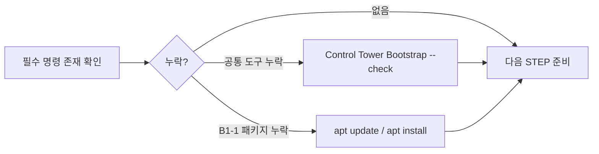

# B1-1 모듈 01 — STEP 02 표준 실행 경로와 필수 도구 준비

> [← STEP 01](01-baseline.md) · [모듈 01 목차](README.md) · [전체 입문자 가이드](../../BEGINNER-GUIDE.md)

<a id="step-02"></a>
## STEP 02 — Golden Path와 필수 도구 준비

## ① 왜 하는가

중간 단계에서 명령 자체가 없어 실패하는 일을 막고 하나의 재현 가능한 기준 환경을 사용하기 위해서입니다.

## ② 무엇을 하는가

필요한 명령이 있는지 확인하고 없는 Mission 패키지만 설치합니다. `unzip`, `file`, `git` 같은 공통 기본도구는 Control Tower Ubuntu Bootstrap에서 관리하고, B1-1에서만 필요한 시스템 패키지는 Mission 계층으로 분리합니다.

## ③ 이번 단계에서 알아야 할 용어

- **Golden Path** — 이번 Round의 기준 실행 경로입니다.
- **패키지 (Package)** — Linux에서 설치·관리하는 프로그램 묶음입니다.
- **패키지 인덱스 (Package Index)** — 설치 가능한 패키지 이름·버전·다운로드 위치에 대한 로컬 목록입니다.
- **공통 기본 계층 (Common Base)** — 여러 미션이 함께 사용하는 기본 명령과 도구입니다.
- **미션 전용 패키지 (Mission Package)** — B1-1 요구사항을 수행하기 위해 추가로 필요한 시스템 패키지입니다.

## ④ 필요한 핵심 개념



핵심은 **먼저 확인하고, 누락된 계층만 복구하는 것**입니다. 공통 도구와 B1-1 전용 패키지를 한 목록에 계속 섞어 넣지 않습니다.

## ⑤ 실행할 명령어 또는 코드

필수 명령 존재 여부 확인:

```bash
for c in bash ssh sshd ss ps pgrep df stat getfacl setfacl crontab unzip file runuser git awk grep find; do
    command -v "$c" || echo "[MISSING] $c"
done
```

Mission 전용 패키지가 누락되었을 때만:

```bash
sudo apt update
sudo apt install -y openssh-server ufw acl cron procps iproute2 util-linux
```

`unzip`, `file`, `git` 같은 공통 기본도구가 누락되었다면 Mission 패키지 목록에 섞기보다 Control Tower에서 다음 공통 Bootstrap을 다시 확인합니다.

```bash
cd "$HOME/codyssey/codyssey-basic"
bash environments/ubuntu/bootstrap.sh --check
```

## ⑥ 명령어와 코드에 입문자가 이해할 수 있는 주석

### 1) 필수 명령 존재 여부 확인

- `for c in ...; do ... done`
  - `bash`, `ssh`, `sshd`처럼 확인할 명령 이름을 변수 `c`에 하나씩 넣고 같은 검사를 반복합니다.
  - 이 반복문은 프로그램을 설치하거나 삭제하지 않고 **명령 존재 여부만 조회**합니다.
- `command -v "$c"`
  - 현재 셸의 `PATH`에서 해당 명령을 실행할 수 있는 위치를 찾습니다.
  - `/usr/bin/bash`처럼 경로가 나오면 그 명령을 현재 환경에서 사용할 수 있다는 뜻입니다.
- `|| echo "[MISSING] $c"`
  - `command -v`가 실패했을 때만 `[MISSING] 명령이름`을 출력합니다.
  - `[MISSING]`이 있다고 바로 임의 패키지를 설치하지 말고, **공통 기본도구인지 B1-1 Mission 도구인지 먼저 분류**합니다.

이 첫 번째 확인 블록은 **🟢 SAFE TO RERUN**입니다. 조회만 수행합니다.

### 2) `sudo apt update`

- `sudo`
  - 시스템 패키지 정보는 관리자 권한이 필요한 영역이므로 `apt` 작업을 root 권한으로 실행합니다.
  - 이 권한은 패키지 관리에만 사용하며 `agent-admin` 같은 Mission 계정에 광범위한 sudo 권한을 추가하는 뜻이 아닙니다.
- `apt`
  - Ubuntu의 패키지 관리자입니다.
- `update`
  - 저장소에서 최신 **패키지 인덱스**를 받아 로컬 목록을 갱신합니다.
  - 애플리케이션 패키지를 직접 업그레이드하는 `upgrade`와 다릅니다.
  - 네트워크와 패키지 목록에는 영향을 주므로 단순 조회 명령은 아니지만, 정상적인 패키지 설치 전에 수행하는 표준 준비 단계입니다.

### 3) `sudo apt install -y openssh-server ufw acl cron procps iproute2 util-linux`

- `install`
  - 뒤에 적은 패키지를 설치하거나, 이미 설치되어 있다면 현재 설치 상태를 확인하고 필요한 의존성을 맞춥니다.
- `-y`
  - 설치 도중 나오는 일반적인 확인 질문에 자동으로 `yes`라고 답합니다.
  - 따라서 패키지 목록을 **눈으로 확인한 뒤에만** 실행해야 합니다. 임의의 패키지 이름을 추가한 상태에서 그대로 실행하지 않습니다.
- `openssh-server`
  - SSH 서버 데몬 `sshd`를 제공합니다. STEP 03에서 포트 `20022`와 Root 원격 로그인 차단을 설정할 때 필요합니다.
- `ufw`
  - Ubuntu의 방화벽 관리 도구입니다. STEP 04에서 `20022/tcp`, `15034/tcp` 정책을 구성할 때 사용합니다.
- `acl`
  - `getfacl`, `setfacl` 명령을 제공합니다. STEP 05에서 역할별 접근 권한을 세밀하게 검증·설정할 때 필요합니다.
- `cron`
  - 예약 실행 서비스와 `crontab`을 제공합니다. STEP 10에서 `agent-admin`이 `monitor.sh`를 매분 실행하도록 구성할 때 필요합니다.
- `procps`
  - `ps`, `pgrep` 등 프로세스 확인 도구를 제공합니다. Agent 프로세스 Health Check와 자원 확인에 사용합니다.
- `iproute2`
  - `ss` 등 네트워크 상태 확인 도구를 제공합니다. TCP `20022`, `15034` LISTEN 여부를 검사할 때 필요합니다.
- `util-linux`
  - 다양한 Linux 기본 시스템 도구를 제공합니다. R01에서 사용자 전환·시스템 점검에 필요한 기반 명령의 가용성을 맞추는 Mission 패키지 계층입니다.

이 설치 블록은 시스템 패키지를 변경하므로 **🟡 CHECK BEFORE RERUN**입니다. 다시 실행하기 전에 STEP 02의 `command -v` 결과와 현재 패키지 상태를 확인합니다. 이미 필요한 패키지가 모두 있다면 설치를 반복할 이유가 없습니다.

### 4) Common Base와 Mission Package를 분리하는 이유

이번 R01에서 B1-1 Mission 패키지 계층은 다음 일곱 패키지로 관리합니다.

```text
openssh-server
ufw
acl
cron
procps
iproute2
util-linux
```

반면 `git`, `unzip`, `file`, `ssh` 클라이언트처럼 여러 미션이 공통으로 사용하는 도구는 Control Tower의 **Common Base**에서 관리합니다. 이렇게 나누면 다음 미션마다 같은 기본 패키지를 반복 설치하거나 Mission 전용 목록이 계속 커지는 것을 막을 수 있습니다.

### 5) Control Tower Bootstrap 확인

- `cd "$HOME/codyssey/codyssey-basic"`
  - Control Tower 저장소 루트로 이동합니다.
  - 큰따옴표를 사용해 `$HOME`에서 확장된 경로를 하나의 인자로 안전하게 전달합니다.
- `bash environments/ubuntu/bootstrap.sh --check`
  - `bash`로 Control Tower의 Ubuntu Bootstrap 스크립트를 실행합니다.
  - `--check`는 공통 개발환경이 준비되어 있는지 **확인하는 모드**이며, B1-1 Mission 패키지를 대신 설치하는 명령이 아닙니다.
  - 공통 기본도구가 누락된 경우에는 이 결과를 기준으로 Common Base부터 복구한 뒤 B1-1 저장소로 돌아옵니다.

> **STOP 기준:** `apt update`가 네트워크/DNS/저장소 오류로 실패하거나, 설치 과정에서 예상하지 않은 패키지 제거·대규모 변경이 제안되거나, Common Base 검사 자체가 FAIL이면 STEP 03으로 진행하지 않습니다. 오류 원인을 먼저 해결합니다.

## ⑦ 예상되는 정상 결과

- 첫 번째 반복문에서 필수 명령마다 실행 경로가 출력되고 `[MISSING]`이 남지 않습니다.
- `apt update`를 실행한 경우 패키지 인덱스 갱신이 오류 없이 끝납니다.
- Mission 패키지를 설치한 경우 대상 패키지 설치가 정상 종료됩니다.
- Common Base가 이미 준비되어 있다면 `bootstrap.sh --check`에서 공통 개발환경 확인 결과가 정상으로 나옵니다.

## ⑧ 그 결과가 의미하는 것

SSH, ACL, 프로세스/포트 확인, 압축 해제, cron 실습을 수행할 최소 실행 도구가 준비되었고, **Common Base와 B1-1 Mission 패키지의 책임 경계도 유지된 상태**입니다.

## ⑨ 자주 발생하는 오류와 해결 방법

- `apt` lock → 다른 패키지 작업이 끝났는지 먼저 확인합니다. 잠금 파일을 임의 삭제하지 않습니다.
- DNS/네트워크 오류 → 패키지 설치를 반복하기보다 네트워크·DNS부터 해결합니다.
- `Unable to locate package` → `apt update` 성공 여부와 저장소 상태를 확인합니다.
- 공통 기본도구가 누락됨 → Mission 패키지를 계속 추가하지 말고 Control Tower Bootstrap을 먼저 복구합니다.
- `[MISSING] sshd`만 보임 → SSH 클라이언트 `ssh`와 서버 `sshd`는 별개이므로 `openssh-server` 설치 여부를 확인합니다.

## ⑩ 완료 확인

- [ ] 필수 명령 존재
- [ ] `[MISSING]` 항목의 Common Base / Mission Package 분류 완료
- [ ] 필요한 경우에만 Mission 전용 패키지 설치 완료
- [ ] 공통 기본도구와 Mission 전용 패키지 역할을 구분함
- [ ] Common Base가 누락되었다면 Bootstrap `--check` 기준으로 복구 방향 확인
- [ ] 실제 버전을 `environment/versions.md`에 Runtime 실행 시 기록할 준비 완료

---

## 다음 이동

[← STEP 01](01-baseline.md) · [모듈 01 목차](README.md) · [다음: 모듈 02 →](../02-ssh-firewall/README.md) · [전체 입문자 가이드](../../BEGINNER-GUIDE.md)
