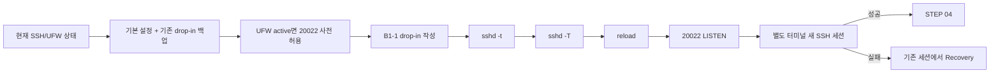

# B1-1 모듈 02 — STEP 03 보안 원격 접속(Secure Shell, SSH) 설정

> [← 모듈 02 목차](README.md) · [다음: STEP 04 →](02-firewall.md) · [전체 입문자 가이드](../../BEGINNER-GUIDE.md)

<a id="step-03"></a>
## STEP 03 — SSH를 20022로 안전하게 전환

## ① 왜 하는가

공식 요구사항은 SSH 포트 `20022`와 Root 원격 로그인 차단입니다. SSH는 원격 접속 경로 자체를 바꾸는 작업이므로 순서를 잘못 잡으면 현재 접속을 잃을 수 있습니다. 따라서 이 STEP은 **현재 상태 확인 → 체크포인트(Checkpoint) → 변경 → 검증(Verification) → 새 세션 → 필요 시 복구(Recovery)** 순서를 고정합니다.

## ② 무엇을 하는가

1. 현재 `sshd`, 포트, UFW 상태를 읽습니다.
2. `/etc/ssh/sshd_config`와 B1-1용 drop-in이 이미 있다면 그 파일까지 백업합니다.
3. UFW가 이미 활성 상태이면 `20022/tcp`를 먼저 허용합니다.
4. B1-1 drop-in에 `Port 20022`, `PermitRootLogin no`를 작성합니다.
5. `sshd -t`와 `sshd -T`가 모두 정상일 때만 reload합니다.
6. Ubuntu 내부에서 `20022` LISTEN을 확인합니다.
7. 기존 세션을 닫지 않은 상태에서 **다른 터미널**로 실제 새 SSH 세션을 확인합니다.
8. 실패하면 기존 세션에서 이전 drop-in/UFW 상태로 최소 복구합니다.

> 기존 SSH 세션과 기존 `22/tcp` 허용 규칙은 `20022` 새 세션이 성공하기 전까지 제거하지 않습니다. 기존 22 정리는 STEP 04에서만 진행합니다.

## ③ 이번 단계에서 알아야 할 용어

- **SSH(Secure Shell)** — 암호화된 원격 접속 프로토콜입니다.
- **SSH 서버(sshd)** — 원격 SSH 연결을 받아 인증하고 세션을 만드는 서버 프로세스입니다.
- **추가 설정 파일(drop-in)** — 기본 설정 파일을 직접 크게 수정하지 않고 `/etc/ssh/sshd_config.d/`에 기능별 설정을 추가하는 방식입니다.
- **최종 적용 설정(Effective Configuration)** — 여러 설정 파일을 모두 읽은 뒤 `sshd`가 실제로 적용하는 최종 값입니다.
- **체크포인트(Checkpoint)** — 변경 전 상태와 백업 위치를 기록해 되돌릴 수 있게 만드는 지점입니다.
- **복구(Recovery)** — 실패 시 변경 전 동작 상태로 되돌리는 절차입니다.
- **다시 불러오기(reload)** — 서비스를 완전히 종료하지 않고 검증된 설정을 다시 읽게 하는 작업입니다.

## ④ 필요한 핵심 개념



### OrbStack 접속과 B1-1 Mission SSH를 반드시 구분

```text
OrbStack 관리/편의 접속
ssh orb 또는 VS Code Remote-SSH orb

≠

B1-1 평가 대상
OrbStack Ubuntu 내부 OpenSSH Server(sshd)
TCP 20022
ssh -p 20022 <Ubuntu사용자>@<Ubuntu주소>
```

`ssh orb`로 Ubuntu에 들어갈 수 있다는 사실만으로 B1-1의 `sshd:20022`가 동작한다고 판정하지 않습니다. B1-1은 Ubuntu 내부 OpenSSH Server, 실제 `20022` LISTEN, 그리고 실제 새 SSH 세션을 별도로 확인합니다.

## ⑤ 실행할 명령어 또는 코드

### A. 변경 전 상태 확인 — 읽기 전용

```bash
sudo systemctl is-active ssh
sudo grep -RniE '^[[:space:]]*(Port|PermitRootLogin)' \
  /etc/ssh/sshd_config /etc/ssh/sshd_config.d 2>/dev/null || true
sudo sshd -T | grep -E '^(port|permitrootlogin) '
sudo ss -lntp | grep -E ':(22|20022)\b' || true
sudo ufw status verbose || true
```

`ssh` 서비스가 active가 아니거나 `sshd -T` 자체가 실패하면 **아직 설정 파일을 쓰지 않습니다.** STEP 02의 `openssh-server` 설치 상태와 `systemctl status ssh`를 먼저 확인합니다.

### B. 체크포인트와 백업 만들기

```bash
STAMP="$(date +%Y%m%d%H%M%S)"
DROPIN="/etc/ssh/sshd_config.d/99-codyssey-b1-1.conf"
MAIN_BAK="/etc/ssh/sshd_config.b1-1-r01.${STAMP}.bak"
DROPIN_BAK="${DROPIN}.b1-1-r01.${STAMP}.bak"
CHECKPOINT="/tmp/b1-1-ssh-checkpoint.${STAMP}.txt"
UFW_BEFORE="/tmp/b1-1-ufw-before-ssh.${STAMP}.txt"

sudo cp -a /etc/ssh/sshd_config "$MAIN_BAK"

if sudo test -e "$DROPIN"; then
    sudo cp -a "$DROPIN" "$DROPIN_BAK"
    DROPIN_EXISTED=yes
else
    DROPIN_EXISTED=no
fi

sudo ufw status numbered | tee "$UFW_BEFORE" >/dev/null || true

printf 'STAMP=%s\nMAIN_BAK=%s\nDROPIN=%s\nDROPIN_BAK=%s\nDROPIN_EXISTED=%s\nUFW_BEFORE=%s\n' \
  "$STAMP" "$MAIN_BAK" "$DROPIN" "$DROPIN_BAK" "$DROPIN_EXISTED" "$UFW_BEFORE" \
  > "$CHECKPOINT"

printf '[CHECKPOINT] %s\n' "$CHECKPOINT"
```

> `/tmp` 체크포인트에는 **경로와 상태만** 기록합니다. 비밀번호, SSH 개인키, Token, Secret 값은 기록하지 않습니다.

### C. UFW가 이미 active라면 20022를 먼저 허용

```bash
UFW_ADDED_20022=no

if sudo ufw status | grep -q '^Status: active$'; then
    if sudo ufw status | grep -Eq '^[[:space:]]*20022/tcp[[:space:]]+ALLOW IN'; then
        echo '[INFO] 20022/tcp is already allowed'
    else
        sudo ufw allow 20022/tcp
        UFW_ADDED_20022=yes
        echo '[CHECKPOINT] this STEP added 20022/tcp'
    fi
else
    echo '[INFO] UFW is inactive; final enable/policy is handled in STEP 04'
fi

printf 'UFW_ADDED_20022=%s\n' "$UFW_ADDED_20022" >> "$CHECKPOINT"
sudo ufw status verbose || true
```

UFW가 이미 active인데 `20022/tcp` 허용이 실패하면 SSH 포트를 바꾸지 않습니다.

### D. B1-1 SSH drop-in 작성

```bash
printf '%s\n' 'Port 20022' 'PermitRootLogin no' \
  | sudo tee "$DROPIN" >/dev/null

sudo chown root:root "$DROPIN"
sudo chmod 0644 "$DROPIN"
```

### E. reload 전에 반드시 두 번 검증

```bash
sudo sshd -t
sudo sshd -T | grep -E '^(port|permitrootlogin) '
```

정상 기준:

```text
port 20022
permitrootlogin no
```

`sshd -t`가 오류를 내거나 `sshd -T`에서 위 두 값이 나오지 않으면 **reload하지 않습니다.** 다른 drop-in이나 기본 파일의 우선순위를 조사하고 아래 Recovery 절차로 원래 상태를 복구합니다.

### F. 검증이 정상일 때만 reload하고 LISTEN 확인

```bash
sudo systemctl reload ssh
sudo systemctl is-active ssh
sudo ss -lntp | grep ':20022'
sudo sshd -T | grep -E '^(port 20022|permitrootlogin no)$'
```

여기까지 성공해도 기존 SSH 세션은 아직 닫지 않습니다.

### G. 실제 새 SSH 세션 확인

먼저 **OrbStack Ubuntu 터미널**에서 접속 대상 정보를 확인합니다.

```bash
whoami
hostname
hostname -I
```

- `whoami` 결과가 `<Ubuntu사용자>` 후보입니다.
- `hostname -I`는 Ubuntu가 가진 IP 주소 후보를 보여 줄 수 있습니다. 여러 주소가 나오면 macOS Host에서 실제로 도달 가능한 주소를 확인해야 합니다.
- 현재 사용자가 SSH 인증에 사용할 정상적인 비밀번호나 공개키 인증 경로가 없다면, Root 로그인을 허용하거나 보안 설정을 약화시켜 억지로 통과시키지 않습니다. 비-root 사용자용 정상 인증 경로를 먼저 준비합니다.

그 다음 **별도의 macOS Terminal**에서 B1-1 Mission SSH를 실행합니다.

```bash
ssh -p 20022 <Ubuntu사용자>@<Ubuntu주소>
```

> 이 명령이 실제 B1-1 `sshd:20022` 새 세션 확인입니다. `ssh orb`로 다시 접속한 것은 이 검증을 대신하지 않습니다.

새 세션 안에서 최소 확인:

```bash
whoami
printf 'SSH_CONNECTION=%s\n' "$SSH_CONNECTION"
```

`whoami`가 의도한 비-root 사용자이고 새 세션이 유지되면 실제 접속 경로가 열린 것입니다. `SSH_CONNECTION`에는 IP/포트 정보가 포함될 수 있으므로 공개 Evidence에 넣을 때는 네트워크 정보 공개 범위를 먼저 확인합니다.

### H. 실패 시 Recovery — 기존 세션을 닫지 말고 수행

먼저 체크포인트 파일을 확인합니다. 체크포인트에는 Secret이 없습니다.

```bash
cat "$CHECKPOINT"
```

#### 기존 B1-1 drop-in이 원래 존재했던 경우

```bash
sudo cp -a "$DROPIN_BAK" "$DROPIN"
sudo sshd -t
sudo systemctl reload ssh
```

#### 기존 B1-1 drop-in이 원래 없었던 경우

```bash
sudo rm -f "$DROPIN"
sudo sshd -t
sudo systemctl reload ssh
```

복구 후 현재 SSH 포트를 다시 확인합니다.

```bash
sudo systemctl is-active ssh
sudo sshd -T | grep -E '^(port|permitrootlogin) '
sudo ss -lntp | grep -E ':(22|20022)\b' || true
```

그리고 체크포인트의 `UFW_BEFORE`와 현재 UFW를 비교합니다.

```bash
cat "$UFW_BEFORE"
sudo ufw status numbered
```

`UFW_ADDED_20022=yes`였고 **이 STEP에서 새로 추가한 20022 규칙을 더 이상 유지할 이유가 없으며 이전 SSH 동작이 복구된 것을 확인한 뒤에만** 다음을 실행합니다.

```bash
sudo ufw delete allow 20022/tcp
sudo ufw status verbose
```

> 기존 `22/tcp` 규칙은 Recovery 중에도 임의 삭제하지 않습니다. `/etc/ssh/sshd_config` 본문은 이 STEP에서 수정하지 않지만, `MAIN_BAK`은 예기치 않은 수동 변경이 있었을 때 원본 비교/복구를 위한 안전 백업입니다.

## ⑥ 명령어와 코드에 입문자가 이해할 수 있는 주석

### 상태 확인 명령

- `systemctl is-active ssh`
  - Ubuntu의 `ssh` 서비스가 현재 실행 중인지 상태만 확인합니다.
- `grep -RniE ...`
  - `-R`은 디렉터리 아래를 재귀 탐색하고, `-n`은 줄 번호, `-i`는 대소문자 무시, `-E`는 확장 정규식을 사용합니다.
  - 여러 SSH 설정 파일에 `Port` 또는 `PermitRootLogin`이 중복되어 있는지 조사합니다.
- `sshd -T`
  - 설정 파일 여러 개를 모두 해석한 뒤 실제 적용될 값을 출력합니다.
  - 파일 한 곳만 보는 것보다 최종 적용 상태를 판단하기에 적합합니다.
- `ss -lntp`
  - `-l` LISTEN, `-n` 숫자 포트, `-t` TCP, `-p` 프로세스 정보를 표시합니다.

### 체크포인트와 백업 명령

- `STAMP="$(date +%Y%m%d%H%M%S)"`
  - `$(...)`는 괄호 안 명령의 출력을 변수에 넣는 명령 치환(Command Substitution)입니다.
  - `date +...`로 초 단위 시각을 붙여 백업 파일 이름 충돌을 줄입니다.
- `cp -a`
  - 파일 내용뿐 아니라 가능한 속성을 함께 보존해 백업합니다.
- `test -e "$DROPIN"`
  - 대상 파일이 이미 존재하는지 확인합니다. 기존 파일이 있으면 덮어쓰기 전에 반드시 별도 백업합니다.
- `tee "$UFW_BEFORE"`
  - UFW 상태 출력을 화면 파이프에서 파일로도 기록합니다. `/tmp`의 이 파일은 복구 비교용이며 비밀정보를 포함시키지 않습니다.
- `printf ... > "$CHECKPOINT"`
  - `>`는 파일을 새로 만들거나 기존 내용을 덮어씁니다. 여기서는 이번 실행용 새 타임스탬프 파일이므로 의도된 동작입니다.
- `>> "$CHECKPOINT"`
  - `>>`는 기존 내용을 지우지 않고 뒤에 추가합니다.

### UFW 사전 허용 명령

- `grep -q '^Status: active$'`
  - UFW가 이미 활성 상태인지 출력 없이 종료 코드로 판단합니다.
- `grep -Eq ...20022...ALLOW IN`
  - 기존 규칙에 `20022/tcp` 허용이 이미 있는지 확인해 불필요한 중복 추가를 줄입니다.
- `ufw allow 20022/tcp`
  - 현재 UFW가 active인 경우 SSH 포트를 바꾸기 **전에** 새 포트의 인바운드 TCP를 허용합니다.

### SSH 설정 작성과 검증

- `printf '%s\n' ... | sudo tee "$DROPIN" >/dev/null`
  - 두 설정 줄을 정확히 만들어 root 권한으로 drop-in 파일에 기록합니다.
  - `>/dev/null`은 `tee`가 같은 설정을 터미널에 다시 출력하는 것만 막습니다.
- `chown root:root`
  - SSH 시스템 설정 파일 소유자를 root로 고정합니다.
- `chmod 0644`
  - root는 읽기/쓰기, 그 외 사용자는 읽기만 가능하게 설정합니다.
- `sshd -t`
  - 서비스를 건드리지 않고 SSH 설정 문법과 기본 유효성을 검사합니다. 성공 시 일반적으로 출력이 없습니다.
- `sshd -T`
  - 실제 최종 적용 설정을 확인합니다. `port 20022`, `permitrootlogin no` 확인 전에는 reload하지 않습니다.
- `systemctl reload ssh`
  - 검증된 설정을 실행 중인 SSH 서비스가 다시 읽도록 합니다. `restart`보다 기존 세션 영향을 줄이는 방향으로 사용하지만, 기존 세션을 닫아도 된다는 뜻은 아닙니다.

### 실제 접속 명령

- `hostname -I`
  - Ubuntu에 할당된 IP 주소 후보를 출력합니다. 가상화 환경에서는 여러 주소가 나올 수 있으므로 실제 Host에서 도달 가능한 주소인지 확인해야 합니다.
- `ssh -p 20022 사용자@주소`
  - `-p 20022`는 기본 SSH 포트 22가 아니라 공식 Mission 포트 20022를 명시합니다.
  - 이 명령은 **별도의 macOS Terminal**에서 실행해 기존 Ubuntu 세션을 안전망으로 남겨 둡니다.
- `$SSH_CONNECTION`
  - 실제 SSH 세션에서 연결 양 끝의 주소와 포트 정보를 확인하는 환경변수입니다. 민감한 네트워크 정보를 공개 Evidence에 그대로 노출하지 않도록 주의합니다.

### Recovery 명령

- `cp -a "$DROPIN_BAK" "$DROPIN"`
  - 기존 drop-in이 있었던 경우 이전 파일을 되돌립니다.
- `rm -f "$DROPIN"`
  - 기존 drop-in이 없었는데 이번 STEP에서 새로 만든 경우에만 새 파일을 제거합니다.
- 복구 후에도 반드시 `sshd -t → reload → is-active → ss` 순서로 실제 서비스 상태를 다시 확인합니다.
- UFW 20022 삭제는 **이 STEP이 새로 추가한 규칙이라는 사실과 기존 SSH 경로 복구를 모두 확인한 뒤** 수행합니다.

### 재실행 안전성

이 STEP 전체는 **🔴 DO NOT RERUN BLINDLY**입니다.

```text
조회 명령                               → 🟢 SAFE TO RERUN
백업 생성                               → 🟡 CHECK BEFORE RERUN
UFW 20022 사전 허용                     → 🟡 CHECK BEFORE RERUN
SSH drop-in 쓰기 / reload               → 🔴 상태·백업·검증 후에만
Recovery의 rm/ufw delete                → 🔴 이전 상태를 확인한 뒤에만
```

> **STOP 기준:** 백업 경로를 확인할 수 없음, `sshd -t` 실패, 최종 적용 설정이 20022/Root 차단과 다름, reload 후 ssh service 비정상, 20022 LISTEN 없음, 실제 새 SSH 세션 실패 중 하나라도 발생하면 STEP 04로 진행하지 않습니다.

## ⑦ 예상되는 정상 결과

- 변경 전 SSH/UFW 상태와 백업 경로가 기록됩니다.
- 기존 B1-1 drop-in이 있었다면 덮어쓰기 전에 별도 백업됩니다.
- UFW가 active였다면 20022가 사전 허용된 뒤 SSH 설정이 변경됩니다.
- `sshd -t`가 오류 없이 끝납니다.
- `sshd -T`에서 `port 20022`, `permitrootlogin no`가 확인됩니다.
- reload 후 `ssh` service가 active입니다.
- Ubuntu 내부 `ss`에서 TCP `20022` LISTEN이 확인됩니다.
- 별도 macOS Terminal의 `ssh -p 20022 ...`로 실제 비-root 새 세션이 성공합니다.

## ⑧ 그 결과가 의미하는 것

B1-1의 SSH 요구사항이 단순히 설정 파일에 적힌 상태가 아니라 **최종 적용 설정 → 실제 서비스 LISTEN → 실제 새 세션**까지 연결되어 검증 가능한 상태가 된 것입니다. 또한 실패하더라도 이전 drop-in/UFW 상태를 기준으로 복구할 경로가 확보되어 있습니다.

## ⑨ 자주 발생하는 오류와 해결 방법

- `sshd -t` 오류 → reload 금지. 오류 위치를 확인하고 기존 drop-in 복구 또는 이번에 만든 drop-in 제거 후 다시 `sshd -t`.
- `sshd -T`에 `port 22`가 남음 → 다른 설정 파일의 `Port` 선언과 읽기 순서를 조사하고 reload 금지.
- `permitrootlogin no`가 아님 → 다른 설정 파일/Match 블록 영향을 확인하고 reload 금지.
- reload 후 `20022`가 LISTEN하지 않음 → 기존 세션을 유지한 채 `systemctl status ssh`, `sshd -T`, `ss`를 다시 확인.
- macOS에서 `Connection refused` → Ubuntu에서 20022 LISTEN 여부와 접속 주소를 먼저 확인. `ssh orb` 성공을 Mission SSH 성공으로 대체하지 않음.
- macOS에서 timeout → Host/Guest 네트워크 경로와 UFW를 확인. 주소를 임의 추측하지 않음.
- `Permission denied` → 비-root 사용자 인증 수단을 확인. Root 로그인 허용 또는 무분별한 `PasswordAuthentication yes`로 우회하지 않음.
- 기존 drop-in을 덮어쓴 뒤 문제 발생 → `DROPIN_BAK` 복구 후 `sshd -t`, reload, 기존 포트 확인.
- UFW에 20022를 새로 추가했지만 SSH 변경을 철회함 → 이전 SSH가 정상 복구된 뒤, 체크포인트와 `UFW_BEFORE` 비교 후 이번에 추가한 규칙만 제거.

## ⑩ 완료 확인

- [ ] 변경 전 `ssh` service / effective config / LISTEN / UFW 상태 확인
- [ ] `/etc/ssh/sshd_config` 백업
- [ ] 기존 B1-1 drop-in 존재 여부 확인 및 존재 시 별도 백업
- [ ] UFW 상태 체크포인트 기록
- [ ] UFW active일 때 20022 사전 허용
- [ ] B1-1 drop-in owner/group/mode 확인
- [ ] `sshd -t` 성공
- [ ] `sshd -T`에서 `port 20022`
- [ ] `sshd -T`에서 `permitrootlogin no`
- [ ] reload 후 `ssh` active
- [ ] Ubuntu 내부 20022 LISTEN
- [ ] OrbStack 관리 접속과 Mission `sshd:20022` 차이를 이해함
- [ ] 별도 macOS Terminal에서 실제 비-root 새 SSH 세션 성공
- [ ] 실패 시 Recovery 절차와 UFW 원복 조건을 이해함

---

## 다음 이동

[← 모듈 02 목차](README.md) · [다음: STEP 04 →](02-firewall.md) · [전체 입문자 가이드](../../BEGINNER-GUIDE.md)
