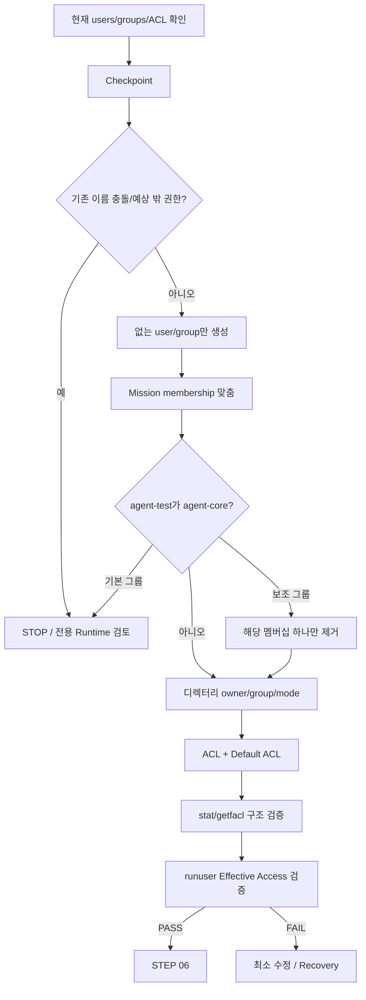

# B1-1 모듈 03 — 사용자·그룹·접근 제어 목록

> 범위: **STEP 05**  
> [← 모듈 02](02-SSH-AND-FIREWALL.md) · [입문자 가이드 허브](../BEGINNER-GUIDE.md) · [다음: 모듈 04 →](04-AGENT-RUNTIME.md)

## 📑 이 모듈 목차

- [STEP 05 — 사용자·그룹·디렉터리·ACL 구성](#step-05)

---

<a id="step-05"></a>
## STEP 05 — 사용자·그룹·디렉터리·ACL 구성

## ① 왜 하는가

공식 요구사항은 `agent-admin`, `agent-dev`, `agent-test`의 역할을 분리하고, `agent-common`과 `agent-core`를 이용해 공유 영역과 보안 영역을 최소 권한으로 나누는 것입니다. 특히 `agent-test`가 `agent-core`에 들어가 있거나 보안 디렉터리에 남아 있는 ACL 때문에 접근할 수 있으면 `api_keys`와 로그의 **core-only** 정책이 깨집니다.

기존 사용자·그룹·ACL이 이미 있을 수 있으므로 이 STEP은 무조건 덮어쓰지 않고 **현재 상태 확인 → 체크포인트(Checkpoint) → 필요한 항목만 생성/수정 → 구조 검증 → 실제 사용자 관점의 유효 접근 검증(Effective Access Verification) → 필요 시 최소 복구(Recovery)** 순서로 진행합니다.

## ② 무엇을 하는가

1. 기존 `agent-*` 사용자와 `agent-common`/`agent-core` 그룹을 먼저 조사합니다.
2. 기존 계정·그룹·디렉터리·ACL 상태를 `/tmp` 체크포인트로 기록합니다.
3. 같은 이름이 다른 업무/서비스에서 이미 사용 중이거나 예상하지 않은 권한이 있으면 수정하지 않고 STOP합니다.
4. 없는 사용자·그룹만 생성합니다.
5. `agent-admin`, `agent-dev`는 `agent-common`+`agent-core`, `agent-test`는 `agent-common`만 갖도록 Mission 관련 멤버십을 맞춥니다.
6. 특히 `agent-test`가 `agent-core`의 **보조 그룹(Supplementary Group)** 이면 해당 멤버십 하나만 최소 범위로 제거합니다. `agent-core`가 `agent-test`의 기본 그룹(Primary Group)이면 자동 수정하지 않고 STOP합니다.
7. `/opt/agent-app`, `upload_files`, `api_keys`, `bin`, `/var/log/agent-app`의 owner/group/mode를 구성합니다.
8. `upload_files`는 `agent-common`, `api_keys`와 로그는 `agent-core` 중심 ACL을 적용합니다.
9. `id`, `stat`, `getfacl`로 설정 모양을 보고, `runuser ... test`로 실제 admin/dev/test의 읽기·쓰기 가능 여부까지 검증합니다.
10. 예상과 다르면 사용자·그룹 전체 삭제나 `chmod -R`, `chown -R`, `setfacl -b` 같은 광범위 초기화 대신 원인 하나만 최소 수정합니다.

> 이 STEP은 B1-1 전용 Ubuntu Runtime을 전제로 합니다. 이미 같은 `agent-*` 계정이나 그룹이 다른 서비스에서 사용 중이라면 그 계정을 미션 요구에 맞춰 강제로 변경하지 말고 B1-1 전용 OrbStack/WSL2 Ubuntu 환경을 사용합니다.

## ③ 이번 단계에서 알아야 할 용어

- **사용자(User)** — Linux에서 프로세스와 파일 접근 권한의 주체가 되는 계정입니다.
- **그룹(Group)** — 여러 사용자에게 공통 권한을 부여하는 단위입니다.
- **기본 그룹(Primary Group)** — 사용자가 로그인하거나 파일을 만들 때 기본적으로 연결되는 주 그룹입니다.
- **보조 그룹(Supplementary Group)** — 기본 그룹 외에 추가로 소속되어 접근 권한을 얻는 그룹입니다.
- **ACL(Access Control List)** — owner/group/others 기본 권한 외에 특정 사용자·그룹에 세밀한 권한을 추가하는 규칙입니다.
- **기본 ACL(Default ACL)** — 디렉터리 안에 새로 만들어지는 파일·디렉터리가 상속받을 ACL 기준입니다.
- **ACL 마스크(ACL Mask)** — named user/group와 group class에 실제로 허용되는 최대 권한 범위를 제한하는 값입니다.
- **setgid 디렉터리(setgid directory)** — 내부에 새로 생성되는 파일·디렉터리가 부모 디렉터리의 그룹을 상속하도록 돕는 디렉터리 설정입니다.
- **유효 접근(Effective Access)** — 설정 파일의 모양이 아니라 실제 사용자 입장에서 최종적으로 읽기·쓰기·실행이 가능한 상태입니다.
- **최소 권한(Least Privilege)** — 업무 수행에 필요한 사용자에게 필요한 권한만 부여하는 원칙입니다.
- **체크포인트(Checkpoint)** — 변경 전 계정·그룹·파일 권한 상태를 기록해 비교와 복구 근거로 사용하는 지점입니다.

## ④ 필요한 핵심 개념



공식 역할 관계는 다음입니다.

```text
agent-common
├─ agent-admin
├─ agent-dev
└─ agent-test

agent-core
├─ agent-admin
└─ agent-dev

agent-test ∉ agent-core
```

디렉터리 정책은 다음처럼 이해합니다.

```text
$AGENT_HOME/upload_files
→ group = agent-common
→ admin/dev/test가 읽기·쓰기 가능

$AGENT_HOME/api_keys
/var/log/agent-app
→ group = agent-core
→ admin/dev만 읽기·쓰기가 가능
→ agent-test는 읽기·쓰기 불가
```

## ⑤ 실행할 명령어 또는 코드

### 📍 실행 위치(Context)

```text
Host       : OrbStack Ubuntu 24.04 또는 WSL2 Ubuntu 24.04
Terminal   : Ubuntu Bash
Repository : B1-1 Repository root
권한       : 일반 사용자 + 필요한 줄에서만 sudo
venv       : 해당 없음
```

### A. 변경 전 사용자·그룹·디렉터리 상태 확인 — 읽기 전용

```bash
export AGENT_HOME=/opt/agent-app

for u in agent-admin agent-dev agent-test; do
    getent passwd "$u" || echo "[INFO] user missing: $u"
    id "$u" 2>/dev/null || true
done

for g in agent-common agent-core; do
    getent group "$g" || echo "[INFO] group missing: $g"
done

command -v getfacl
command -v setfacl
command -v runuser
command -v gpasswd
```

기존 계정이 보이면 사용자 이름만 보고 바로 재사용하지 않습니다. `getent passwd`의 home/shell, `id`의 UID/GID/그룹, `getent group`의 기존 멤버를 보고 **B1-1 전용 계정인지 확인**합니다.

특히 `agent-test`를 확인합니다.

```bash
id -gn agent-test 2>/dev/null || true
id -nG agent-test 2>/dev/null || true
```

- 기본 그룹이 `agent-core`이면 자동 변경하지 않고 STOP합니다.
- 보조 그룹 목록에 `agent-core`가 있으면 아래 체크포인트를 만든 뒤 **B1-1 전용 계정임이 확인된 경우에만** 해당 보조 멤버십 하나를 제거합니다.
- `agent-core`에 admin/dev 외의 낯선 멤버가 보이면 그 사용자를 자동 제거하지 않고 용도를 먼저 확인합니다.

### B. 변경 전 상태 체크포인트 저장

```bash
STAMP="$(date +%Y%m%d%H%M%S)"
IDENTITY_BEFORE="/tmp/b1-1-identity-before.${STAMP}.txt"
PERMISSION_BEFORE="/tmp/b1-1-permission-before.${STAMP}.txt"
IDENTITY_CHECKPOINT="/tmp/b1-1-identity-checkpoint.${STAMP}.txt"

{
    for u in agent-admin agent-dev agent-test; do
        echo "===== USER: $u ====="
        getent passwd "$u" || echo "[MISSING] $u"
        id "$u" 2>/dev/null || true
    done
    for g in agent-common agent-core; do
        echo "===== GROUP: $g ====="
        getent group "$g" || echo "[MISSING] $g"
    done
} | tee "$IDENTITY_BEFORE" >/dev/null

{
    for d in "$AGENT_HOME" "$AGENT_HOME/upload_files" "$AGENT_HOME/api_keys" "$AGENT_HOME/bin" /var/log/agent-app; do
        echo "===== PATH: $d ====="
        if sudo test -e "$d"; then
            sudo stat -c '%U %G %a %n' "$d"
            sudo getfacl -p "$d" 2>/dev/null || true
        else
            echo "[MISSING] $d"
        fi
    done
} | tee "$PERMISSION_BEFORE" >/dev/null

printf 'STAMP=%s\nIDENTITY_BEFORE=%s\nPERMISSION_BEFORE=%s\n' \
  "$STAMP" "$IDENTITY_BEFORE" "$PERMISSION_BEFORE" \
  > "$IDENTITY_CHECKPOINT"

printf '[CHECKPOINT] %s\n' "$IDENTITY_CHECKPOINT"
```

> 체크포인트에는 계정 이름, UID/GID, 그룹, 경로, owner/group/mode, ACL만 기록합니다. Password, Token, Secret 값은 기록하지 않습니다.

### C. 없는 그룹과 사용자만 생성

```bash
getent group agent-common >/dev/null || sudo groupadd agent-common
getent group agent-core   >/dev/null || sudo groupadd agent-core

id agent-admin >/dev/null 2>&1 || sudo useradd -m -s /bin/bash agent-admin
id agent-dev   >/dev/null 2>&1 || sudo useradd -m -s /bin/bash agent-dev
id agent-test  >/dev/null 2>&1 || sudo useradd -m -s /bin/bash agent-test
```

이 명령은 기존 계정이나 그룹을 삭제하거나 새 UID/GID로 다시 만들지 않습니다. 이미 존재하는 경우에는 앞부분의 확인 결과를 그대로 존중하고 생성 명령을 건너뜁니다.

### D. 필요한 Mission 그룹 멤버십 추가

```bash
sudo usermod -aG agent-common,agent-core agent-admin
sudo usermod -aG agent-common,agent-core agent-dev
sudo usermod -aG agent-common agent-test

id -nG agent-admin
id -nG agent-dev
id -nG agent-test
```

`-aG`는 기존 보조 그룹을 유지하면서 필요한 Mission 그룹을 **추가**합니다. 하지만 추가만 하기 때문에 `agent-test`가 예전부터 `agent-core`에 들어가 있던 잘못된 상태는 자동으로 고쳐지지 않습니다. 따라서 다음 확인이 반드시 필요합니다.

```bash
if id -nG agent-test | grep -qw agent-core; then
    echo '[STOP] agent-test is still a member of agent-core'
else
    echo '[PASS] agent-test is not a member of agent-core'
fi
```

#### `agent-test`가 `agent-core`의 보조 그룹인 경우에만 최소 수정

먼저 기본 그룹이 `agent-core`가 아닌지 다시 확인합니다.

```bash
id -gn agent-test
```

결과가 `agent-core`가 **아니고**, 체크포인트에서 이 계정이 B1-1 전용임을 확인했다면 보조 그룹 멤버십 하나만 제거합니다.

```bash
sudo gpasswd -d agent-test agent-core
id -nG agent-test
```

> `gpasswd -d`는 사용자나 그룹 자체를 삭제하지 않고 지정한 **보조 그룹 멤버십 하나**를 제거합니다. `agent-core`가 `agent-test`의 기본 그룹이라면 이 명령으로 억지로 해결하지 말고 STOP하여 계정 출처와 기본 그룹 설계를 먼저 확인합니다.

### E. Mission 디렉터리 owner/group/mode 구성

```bash
export AGENT_HOME=/opt/agent-app

sudo install -d -o agent-admin -g agent-common -m 0710 "$AGENT_HOME"
sudo install -d -o agent-admin -g agent-common -m 2770 "$AGENT_HOME/upload_files"
sudo install -d -o agent-admin -g agent-core   -m 2770 "$AGENT_HOME/api_keys"
sudo install -d -o agent-dev   -g agent-core   -m 0750 "$AGENT_HOME/bin"
sudo install -d -o agent-admin -g agent-core   -m 2770 /var/log/agent-app
```

`$AGENT_HOME/bin`은 이후 `monitor.sh`와 Agent 실행 파일을 두기 위한 R01 보조 경로입니다. 공식 핵심 권한 정책은 `upload_files`, `api_keys`, `/var/log/agent-app`의 역할 분리에 있습니다.

### F. ACL과 Default ACL 적용

```bash
sudo setfacl -m g:agent-common:rwx,m:rwx "$AGENT_HOME/upload_files"
sudo setfacl -d -m g:agent-common:rwx,m:rwx "$AGENT_HOME/upload_files"

sudo setfacl -m g:agent-core:rwx,m:rwx "$AGENT_HOME/api_keys" /var/log/agent-app
sudo setfacl -d -m g:agent-core:rwx,m:rwx "$AGENT_HOME/api_keys" /var/log/agent-app
```

보안 디렉터리에 기존 named ACL이 남아 있으면 `agent-test`가 `agent-core`가 아니어도 접근할 수 있습니다. 따라서 바로 다음 구조 확인에서 예상하지 않은 `user:agent-test:...` 또는 Mission과 무관한 named user/group ACL이 보이면 **STEP 06으로 진행하지 않습니다.**

예를 들어 `getfacl`에 `agent-test`의 개별 ACL이 실제로 남아 있고, 체크포인트로 기존 상태를 확인한 뒤 B1-1 전용 Runtime에서 그 항목만 제거해야 한다고 판단한 경우에만 다음처럼 최소 수정합니다.

```bash
sudo setfacl -x u:agent-test "$AGENT_HOME/api_keys" /var/log/agent-app
```

Default ACL에도 같은 named user가 실제로 존재하는 경우에만 해당 default 항목을 개별적으로 제거합니다.

```bash
sudo setfacl -x d:u:agent-test "$AGENT_HOME/api_keys" /var/log/agent-app
```

> `setfacl -b`로 모든 확장 ACL을 한꺼번에 지우는 방법은 이번 R01의 기본 해결책으로 사용하지 않습니다. 기존 ACL이 있다면 어떤 항목이 문제인지 확인하고 필요한 엔트리만 수정합니다.

### G. 사용자·그룹·owner/group/mode/ACL 구조 확인

```bash
id agent-admin
id agent-dev
id agent-test

getent group agent-common
getent group agent-core

sudo stat -c '%U %G %a %n' \
  /opt/agent-app \
  /opt/agent-app/upload_files \
  /opt/agent-app/api_keys \
  /opt/agent-app/bin \
  /var/log/agent-app

sudo getfacl -p \
  /opt/agent-app/upload_files \
  /opt/agent-app/api_keys \
  /var/log/agent-app
```

여기서는 파일 모양과 ACL을 확인합니다. 하지만 **구조가 보기 좋다고 실제 접근이 맞는 것은 아니므로** 다음 H 단계의 사용자별 접근 검사를 반드시 수행합니다.

### H. 실제 사용자별 유효 접근(Effective Access) 검증

`upload_files`는 세 사용자 모두 읽기·쓰기가 가능해야 합니다.

```bash
for u in agent-admin agent-dev agent-test; do
    sudo runuser -u "$u" -- test -r "$AGENT_HOME/upload_files" \
      && sudo runuser -u "$u" -- test -w "$AGENT_HOME/upload_files" \
      && echo "[PASS] $u can read/write upload_files" \
      || echo "[FAIL] $u cannot read/write upload_files"
done
```

`api_keys`는 admin/dev만 읽기·쓰기가 가능해야 합니다.

```bash
for u in agent-admin agent-dev; do
    sudo runuser -u "$u" -- test -r "$AGENT_HOME/api_keys" \
      && sudo runuser -u "$u" -- test -w "$AGENT_HOME/api_keys" \
      && echo "[PASS] $u can read/write api_keys" \
      || echo "[FAIL] $u cannot read/write api_keys"
done
```

`agent-test`는 `api_keys`를 읽거나 쓸 수 없어야 합니다.

```bash
if ! sudo runuser -u agent-test -- test -r "$AGENT_HOME/api_keys" \
   && ! sudo runuser -u agent-test -- test -w "$AGENT_HOME/api_keys"; then
    echo '[PASS] agent-test is blocked from api_keys'
else
    echo '[FAIL] agent-test can access api_keys'
fi
```

로그 디렉터리도 admin/dev만 읽기·쓰기가 가능해야 합니다.

```bash
for u in agent-admin agent-dev; do
    sudo runuser -u "$u" -- test -r /var/log/agent-app \
      && sudo runuser -u "$u" -- test -w /var/log/agent-app \
      && echo "[PASS] $u can read/write agent logs" \
      || echo "[FAIL] $u cannot read/write agent logs"
done
```

`agent-test`는 로그 디렉터리를 읽거나 쓸 수 없어야 합니다.

```bash
if ! sudo runuser -u agent-test -- test -r /var/log/agent-app \
   && ! sudo runuser -u agent-test -- test -w /var/log/agent-app; then
    echo '[PASS] agent-test is blocked from agent logs'
else
    echo '[FAIL] agent-test can access agent logs'
fi
```

하나라도 `[FAIL]`이면 `chmod 777`, `setfacl -b`, 사용자 전체 삭제 같은 우회 방법을 사용하지 않습니다. `id`, `stat`, `getfacl`을 다시 보고 **그 실패를 만든 멤버십·mode·ACL 하나만** 수정합니다.

### I. 실패 시 Recovery / 최소 되돌리기

먼저 체크포인트를 다시 확인합니다.

```bash
cat "$IDENTITY_CHECKPOINT"
cat "$IDENTITY_BEFORE"
cat "$PERMISSION_BEFORE"
```

#### 잘못 추가한 보조 그룹 멤버십만 되돌릴 때

이번 STEP에서 특정 사용자에게 특정 그룹을 잘못 추가했다는 사실이 명확할 때만 그 멤버십 하나를 제거합니다.

```bash
sudo gpasswd -d <사용자> <그룹>
```

`<사용자>`, `<그룹>`은 Placeholder입니다. 체크포인트를 보고 실제 잘못 추가한 한 쌍으로 바꿉니다. 다른 보조 그룹은 건드리지 않습니다.

#### `agent-test`의 기존 core 멤버십을 제거했지만 정말 이전 상태로 되돌려야 할 때

체크포인트가 시작 전에 `agent-test`가 `agent-core`의 보조 그룹이었다는 사실을 보여 주고, B1-1 최종 상태를 포기하고 원래 환경으로 rollback해야 하는 상황에서만 다음을 검토합니다.

```bash
sudo usermod -aG agent-core agent-test
```

이 복구는 **B1-1 최종 요구사항을 만족하는 상태가 아닙니다.** 원래 외부 환경을 복구하는 경우에만 사용하며, B1-1을 계속하려면 전용 Runtime에서 다시 올바른 멤버십을 구성합니다.

#### 기존 디렉터리/ACL을 되돌릴 때

`$PERMISSION_BEFORE`의 owner/group/mode/ACL을 먼저 읽고 차이를 확인합니다. 전체 경로에 다음과 같은 광범위 명령을 바로 사용하지 않습니다.

```text
chmod -R ...
chown -R ...
setfacl -b ...
rm -rf /opt/agent-app
userdel -r ...
groupdel ...
```

기존에 있던 named ACL 하나를 이번 STEP에서 잘못 제거했다면 체크포인트를 보고 그 엔트리 하나만 `setfacl -m ...`로 복구합니다. 새로 만든 Mission 계정·그룹·디렉터리는 이후 다른 STEP에서 데이터가 생길 수 있으므로, 단순 오류 해결을 위해 자동 삭제하지 않습니다.

Recovery 또는 수정 후에는 반드시 G와 H의 **구조 확인 + 유효 접근 검증**을 다시 수행합니다.

## ⑥ 명령어와 코드에 입문자가 이해할 수 있는 주석

### 상태 확인과 체크포인트

- `export AGENT_HOME=/opt/agent-app`
  - 현재 Bash 세션에서 `AGENT_HOME` 변수를 `/opt/agent-app`으로 지정합니다. 시스템 전체 계정 설정을 바꾸는 명령이 아니라 현재 셸과 자식 프로세스에 전달되는 환경값입니다.
- `getent passwd "$u"`
  - 시스템 계정 데이터베이스에서 사용자 이름, UID/GID, home, shell 정보를 조회합니다. Password의 실제 비밀값을 출력하는 명령이 아닙니다.
- `id "$u"`
  - 사용자의 UID, 기본 GID, 현재 소속 그룹을 확인합니다.
- `id -gn agent-test`
  - `-g`는 기본 그룹 ID를, `-n`은 숫자 대신 그룹 이름을 출력합니다. 따라서 `agent-test`의 **기본 그룹 이름**을 확인합니다.
- `id -nG agent-test`
  - `-G`는 기본 그룹과 보조 그룹을 모두 출력하고 `-n`은 이름으로 표시합니다.
- `getent group "$g"`
  - 그룹의 존재 여부와 등록된 멤버를 확인합니다.
- `stat -c '%U %G %a %n'`
  - `%U` owner 이름, `%G` group 이름, `%a` 숫자 mode, `%n` 경로를 한 줄로 출력합니다.
- `getfacl -p`
  - 파일·디렉터리의 ACL을 확인합니다. `-p`는 절대경로의 앞 `/`를 유지해 체크포인트에서 실제 대상 경로를 분명하게 합니다.
- `{ ... } | tee ...`
  - 중괄호 안 여러 조회 명령의 출력을 하나로 묶어 `/tmp` 체크포인트 파일에 기록합니다.

### 사용자·그룹 생성

- `getent group ... || sudo groupadd ...`
  - 그룹이 이미 있으면 그대로 사용하고, 없을 때만 `groupadd`로 생성합니다.
- `id ... || sudo useradd ...`
  - 사용자가 이미 있으면 다시 만들지 않고, 없을 때만 생성합니다.
- `useradd -m -s /bin/bash`
  - `-m`은 home 디렉터리를 만들고, `-s /bin/bash`는 로그인 shell을 Bash로 지정합니다.
- `sudo`
  - 사용자·그룹 생성과 시스템 디렉터리 권한 변경은 관리자 권한이 필요하므로 해당 줄에서만 사용합니다.

### 그룹 멤버십

- `usermod -aG ...`
  - `-G`는 보조 그룹 목록을 다루고, `-a`는 기존 보조 그룹을 지우지 않고 뒤에 추가(append)합니다.
  - `-a` 없이 `-G`만 사용하면 기존 보조 그룹을 덮어쓸 수 있으므로 이 가이드에서는 사용하지 않습니다.
- `grep -qw agent-core`
  - `-q`는 출력 없이 성공/실패로 판단하고, `-w`는 완전한 단어 `agent-core`만 찾습니다.
- `gpasswd -d agent-test agent-core`
  - `agent-test`를 `agent-core` **보조 그룹 멤버십에서만** 제거합니다. 사용자나 그룹 자체를 삭제하지 않습니다.

### 디렉터리 생성과 mode

- `install -d`
  - 파일 복사 대신 디렉터리를 생성하거나 기존 디렉터리의 속성을 지정하는 데 사용합니다.
- `-o agent-admin`
  - owner를 `agent-admin`으로 지정합니다.
- `-g agent-common` / `-g agent-core`
  - 디렉터리의 group owner를 역할에 맞는 그룹으로 지정합니다.
- `-m 0710`
  - `$AGENT_HOME`에서 owner는 `rwx`, group은 `x`, others는 권한 없음으로 둡니다. 상위 경로는 필요한 사용자들이 하위 허용 경로로 이동할 수 있게 최소 traversal만 제공합니다.
- `-m 2770`
  - `2`는 setgid bit, `770`은 owner/group `rwx`, others 권한 없음입니다. 공유 디렉터리에서 새 항목이 해당 그룹을 이어받도록 돕습니다.
- `-m 0750`
  - owner는 `rwx`, group은 `r-x`, others는 권한 없음입니다. 이후 `bin` 실행 파일 접근 기준으로 사용합니다.

### ACL

- `setfacl -m ...`
  - `-m`은 지정한 ACL 엔트리를 추가하거나 수정합니다.
- `g:agent-common:rwx`
  - named group `agent-common`에 읽기·쓰기·실행 권한을 부여합니다.
- `g:agent-core:rwx`
  - named group `agent-core`에 읽기·쓰기·실행 권한을 부여합니다.
- `m:rwx`
  - ACL mask를 `rwx`로 설정해 위 named group 권한이 mask 때문에 의도치 않게 줄어들지 않도록 합니다.
- `setfacl -d -m ...`
  - `-d`는 Default ACL을 뜻하며 디렉터리 아래 새 파일·디렉터리가 역할 기반 ACL을 상속받도록 합니다.
- `setfacl -x u:agent-test ...`
  - 실제로 존재하는 named user ACL 엔트리 하나만 삭제합니다. ACL 전체를 지우는 명령이 아닙니다.
- `setfacl -x d:u:agent-test ...`
  - Default ACL에 실제 존재하는 `agent-test` named user 엔트리만 제거할 때 사용합니다.

### 구조 검증과 실제 접근 검증

- `runuser -u 사용자 -- 명령`
  - root 권한으로 설정을 읽는 대신, 지정한 실제 사용자 신분으로 뒤의 `test` 명령을 실행해 유효 접근을 확인합니다.
- `test -r 경로`
  - 해당 사용자 관점에서 경로가 읽기 가능한지 종료 코드로 확인합니다.
- `test -w 경로`
  - 해당 사용자 관점에서 경로가 쓰기 가능한지 확인합니다.
- `&&`
  - 왼쪽 검사가 성공했을 때만 다음 검사를 수행합니다.
- `||`
  - 앞의 검사 묶음이 실패했을 때 `[FAIL]` 메시지를 출력합니다.
- `! test ...`
  - 접근 검사가 **실패해야 정상**인 보안 디렉터리에서 결과를 반전해 "접근 불가"를 성공 조건으로 사용합니다.

### 재실행 안전성

이 STEP 전체는 **🔴 DO NOT RERUN BLINDLY**입니다.

```text
getent / id / stat / getfacl 조회                 → 🟢 SAFE TO RERUN
체크포인트 파일 생성                             → 🟢 SAFE TO RERUN
없는 user/group 생성                             → 🟡 CHECK BEFORE RERUN
usermod -aG                                      → 🟡 기존 membership 확인 후
install -d owner/group/mode 변경                 → 🔴 기존 경로 Checkpoint 확인 후
setfacl -m / -d -m                               → 🔴 기존 ACL Checkpoint 확인 후
gpasswd -d / setfacl -x                          → 🔴 대상 멤버십·엔트리 확인 후
runuser ... test                                 → 🟢 SAFE TO RERUN
Recovery membership/ACL 변경                     → 🔴 Checkpoint와 원래 상태 확인 후
```

> **STOP 기준:** 기존 `agent-*` 이름이 다른 서비스에서 사용 중임, `agent-test`의 기본 그룹이 `agent-core`, `agent-core`에 용도를 알 수 없는 추가 사용자가 있음, 보안 디렉터리에 예상하지 않은 named ACL이 있음, `agent-test`가 `api_keys` 또는 로그를 읽거나 쓸 수 있음, admin/dev가 필요한 보안 디렉터리를 읽거나 쓸 수 없음, 세 사용자 중 누구라도 `upload_files`를 읽거나 쓸 수 없음 중 하나라도 발생하면 STEP 06으로 진행하지 않습니다.

## ⑦ 예상되는 정상 결과

- `agent-admin`, `agent-dev`, `agent-test`가 존재합니다.
- `agent-common`, `agent-core`가 존재합니다.
- `agent-admin`은 `agent-common`과 `agent-core`에 속합니다.
- `agent-dev`는 `agent-common`과 `agent-core`에 속합니다.
- `agent-test`는 `agent-common`에 속하고 `agent-core`에는 속하지 않습니다.
- `upload_files`는 `agent-common` 기반으로 admin/dev/test가 실제 읽기·쓰기가 가능합니다.
- `api_keys`와 `/var/log/agent-app`는 `agent-core` 기반으로 admin/dev만 실제 읽기·쓰기가 가능합니다.
- `agent-test`는 `api_keys`와 로그를 실제로 읽거나 쓸 수 없습니다.
- setgid와 Default ACL을 통해 새 항목도 역할 기반 그룹/ACL 정책을 이어갈 기반이 준비됩니다.

## ⑧ 그 결과가 의미하는 것

공식 계정/그룹 요구사항을 단순히 이름만 생성한 것이 아니라 **역할 기반 그룹 멤버십 → 디렉터리 owner/group/mode → ACL → 실제 사용자별 유효 접근**까지 연결해 최소 권한 정책을 검증할 수 있는 상태가 된 것입니다. 특히 `agent-test ∉ agent-core`와 secure directory 접근 차단을 별도로 확인하므로 과거 상태가 남아 있어도 단순 `usermod -aG`만으로 잘못 통과하는 문제를 줄입니다.

## ⑨ 자주 발생하는 오류와 해결 방법

- `agent-test`가 계속 `agent-core`에 보임 → 먼저 `id -gn agent-test`로 기본 그룹인지 확인. 보조 그룹이면 B1-1 전용 계정임을 확인한 뒤 `gpasswd -d agent-test agent-core`; 기본 그룹이면 자동 수정하지 않고 STOP.
- `agent-core`에 모르는 사용자가 있음 → 무작정 `gpasswd -d`하지 말고 기존 서비스 계정인지 확인. 다른 서비스가 사용 중이면 전용 Runtime으로 이동.
- `setfacl`/`getfacl` 없음 → STEP 02의 `acl` 패키지 설치 상태 확인. 이 STEP에서 임의 패키지 목록을 추가하지 않음.
- group 변경 후 현재 로그인 셸에서 새 membership이 안 보임 → 해당 사용자의 새 로그인 세션에서 다시 확인하거나 `id 사용자`로 시스템 계정 DB 결과를 확인.
- `agent-test`가 `api_keys`를 읽음 → `id agent-test`, `stat`, `getfacl` 순서로 core membership, others mode, named ACL/mask를 확인. `chmod 777` 같은 우회 금지.
- `agent-test`가 로그를 읽음 → `/var/log/agent-app` owner/group/mode와 named ACL을 확인하고 문제 엔트리만 최소 수정.
- admin/dev가 secure directory를 못 씀 → core membership, 상위 경로 execute 권한, mode, ACL mask 순서로 확인.
- 세 사용자 중 한 명이 upload에 못 씀 → common membership, `$AGENT_HOME` traversal, upload group/mode, ACL mask를 확인.
- 기존 디렉터리에 낯선 ACL이 많음 → `setfacl -b`로 전부 삭제하지 말고 체크포인트와 비교해 B1-1 전용 환경인지부터 판단.
- 복구 필요 → `userdel -r`, `groupdel`, `chmod -R`, `chown -R`, `rm -rf`부터 실행하지 말고 체크포인트 기준으로 잘못 바꾼 멤버십/ACL 한 항목씩 되돌림.

## ⑩ 완료 확인

- [ ] 변경 전 사용자/그룹 상태 체크포인트 저장
- [ ] 변경 전 디렉터리 owner/group/mode/ACL 체크포인트 저장
- [ ] 기존 `agent-*` 이름 충돌 여부 확인
- [ ] 사용자 3개 존재
- [ ] 그룹 2개 존재
- [ ] `agent-admin` = common + core
- [ ] `agent-dev` = common + core
- [ ] `agent-test` = common, **not core**
- [ ] `agent-test` 기본 그룹이 core가 아님
- [ ] `agent-core`에 용도 불명 추가 사용자가 없음
- [ ] `/opt/agent-app` owner/group/mode 확인
- [ ] `upload_files` group=agent-common 및 R/W effective access 확인
- [ ] `api_keys` group=agent-core 및 admin/dev R/W 확인
- [ ] `/var/log/agent-app` group=agent-core 및 admin/dev R/W 확인
- [ ] `agent-test`의 api_keys read/write 차단 확인
- [ ] `agent-test`의 log read/write 차단 확인
- [ ] ACL / Default ACL / mask 확인
- [ ] 예상 밖 named ACL 없음
- [ ] 실패 시 전체 초기화가 아닌 최소 Recovery 절차를 이해함

---

---

## 다음 이동

[← 모듈 02](02-SSH-AND-FIREWALL.md) · [입문자 가이드 허브](../BEGINNER-GUIDE.md) · [다음: 모듈 04 →](04-AGENT-RUNTIME.md)
