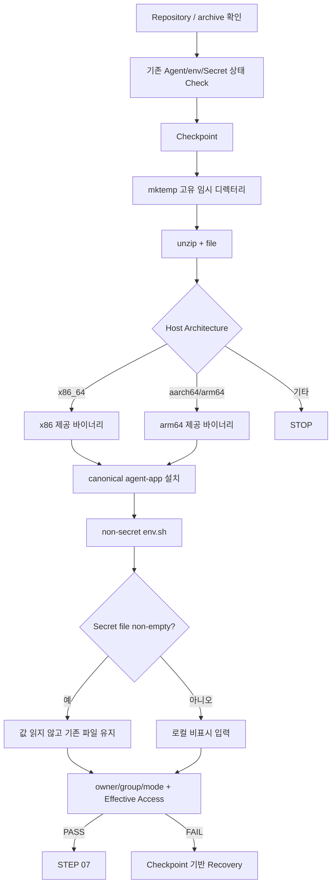
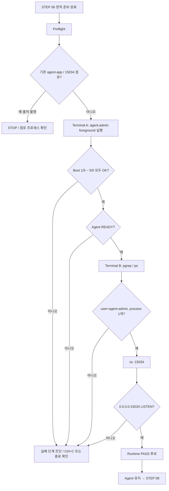

# B1-1 모듈 04 — Agent 준비와 실제 실행

> 범위: **STEP 06~07**  
> [← 모듈 03](03-USERS-GROUPS-ACL.md) · [입문자 가이드 허브](../BEGINNER-GUIDE.md) · [다음: 모듈 05 →](05-MONITOR-AND-CRON.md)

## 📑 이 모듈 목차

- [STEP 06 — 제공 Agent archive·환경변수·Secret 준비](#step-06)
- [STEP 07 — Agent Boot 5/5와 TCP 15034 LISTEN 검증](#step-07)

---

<a id="step-06"></a>
## STEP 06 — 제공 Agent archive·환경변수·Secret 준비

## ① 왜 하는가

공식 B1-1은 제공 Agent를 **일반 계정으로 실제 실행**하고, 지정된 환경변수·키 파일·로그 경로를 만족한 뒤 Boot Sequence 5단계를 통과해야 합니다. 이때 CPU 아키텍처와 맞지 않는 실행 파일을 설치하면 `Exec format error`처럼 실행 자체가 불가능하고, 환경변수나 Secret 파일의 경로·권한이 틀리면 다음 STEP의 Boot 검증이 실패합니다.

따라서 이 STEP은 단순히 ZIP을 풀고 파일을 복사하는 단계가 아니라 **현재 상태 확인 → 체크포인트(Checkpoint) → 아키텍처 확인 → 제공 파일 검사 → 실행 파일 설치 → 비밀값이 없는 환경파일 구성 → Secret을 로컬에서만 준비 → 값 노출 없는 권한·접근 검증 → 필요 시 최소 복구(Recovery)** 순서로 진행합니다.

> Secret의 실제 값은 이 가이드, 채팅, GitHub, Evidence에 적지 않습니다. 이 STEP에서는 **경로·존재 여부·비어 있지 않은지·소유권·권한·실제 접근 가능 여부만** 확인합니다. Secret 값이 공식 요구와 일치하는지는 값을 출력해서 비교하지 않고 STEP 07의 제공 Agent Boot 동작으로 확인합니다.

## ② 무엇을 하는가

1. B1-1 Repository root와 `agent-app.zip` 존재 여부, 현재 CPU 아키텍처를 확인합니다.
2. 기존 `/opt/agent-app/bin/agent-app`, `env.sh`, `t_secret.key`가 있으면 출처와 상태를 먼저 확인하고 체크포인트를 남깁니다.
3. 고정 `/tmp` 폴더를 지우는 대신 `mktemp -d`로 이번 실행만의 고유 임시 디렉터리를 만듭니다.
4. `unzip -l`, `file`로 제공 archive 내부 실행 파일과 CPU 형식을 확인합니다.
5. `x86_64` 또는 `aarch64/arm64`에 맞는 제공 바이너리만 선택해 R01 기준 이름 `/opt/agent-app/bin/agent-app`으로 설치합니다.
6. 공식 환경변수를 담은 비밀값 없는 `env.sh`를 만들고 `agent-admin:agent-core`, `0640`으로 관리합니다.
7. R01의 `AGENT_PROCESS_NAME=agent-app`은 이후 `monitor.sh`의 정확한 프로세스 식별을 돕기 위한 내부 운영값이며, 공식 Mission의 필수 환경변수를 대체하지 않습니다.
8. 기존 Secret 파일이 비어 있지 않으면 **내용을 읽거나 덮어쓰지 않고 유지**합니다. 파일이 없거나 비어 있을 때만 공식 Mission 원본을 보며 로컬 터미널에서 비표시 입력으로 준비합니다.
9. Secret 파일은 `agent-admin:agent-core`, `0660`으로 맞추고 admin/dev는 읽기·쓰기 가능, test는 읽기·쓰기 불가인지 확인합니다.
10. 실패하면 기존 바이너리·env.sh 백업과 Secret의 기존 존재 여부를 기준으로 최소 복구합니다.

## ③ 이번 단계에서 알아야 할 용어

- **아카이브(Archive)** — 여러 파일을 하나의 묶음으로 보관한 파일입니다. 이번 미션의 제공 파일은 ZIP 형식입니다.
- **ELF(Executable and Linkable Format)** — Linux에서 사용하는 대표적인 실행 파일 형식입니다.
- **CPU 아키텍처(CPU Architecture)** — `x86_64`, `aarch64`처럼 CPU 명령어 계열을 구분하는 값입니다.
- **실행 파일(Binary / Executable)** — CPU가 실행할 수 있도록 빌드된 프로그램 파일입니다.
- **기준 파일명(Canonical Name)** — 이후 명령과 검증이 같은 대상을 가리키도록 R01에서 고정해 사용하는 이름입니다. 여기서는 `agent-app`입니다.
- **환경변수(Environment Variable)** — 프로그램 외부에서 실행 경로·포트 같은 설정을 전달하는 이름/값 쌍입니다.
- **비밀정보(Secret)** — 공개 저장소·채팅·로그·Evidence에 노출하면 안 되는 민감 값입니다.
- **xtrace** — Bash의 `set -x`로 켜지는 명령 추적 기능입니다. Secret을 다루는 구간에서는 꺼져 있어야 합니다.
- **파일 모드(File Mode)** — owner/group/others가 파일을 읽고 쓰고 실행할 수 있는 권한 비트입니다.
- **체크포인트(Checkpoint)** — 변경 전 상태와 복구용 경로를 기록하는 지점입니다.
- **유효 접근(Effective Access)** — mode/ACL 모양이 아니라 실제 사용자 신분으로 최종 접근 가능한 상태입니다.

## ④ 필요한 핵심 개념



핵심 분리는 다음과 같습니다.

```text
환경 설정(env.sh)
→ 경로·포트 등 비밀값이 아닌 실행 설정
→ Git에 실제 Runtime 파일을 올리지 않고 로컬 시스템에서 관리

Secret 파일(t_secret.key)
→ 실제 민감 값
→ 값 출력·채팅 전송·Evidence 저장 금지
→ 존재/크기/소유권/권한/접근 동작만 검증
```

또한 다음 둘은 다른 검증입니다.

```text
file agent-app
→ 현재 CPU와 호환되는 형식인지 정적 확인

STEP 07 Agent Boot
→ 실제로 실행되고 Boot 조건을 통과하는지 동적 확인
```

## ⑤ 실행할 명령어 또는 코드

### 📍 실행 위치(Context)

```text
Host       : OrbStack Ubuntu 24.04 또는 WSL2 Ubuntu 24.04
Terminal   : Ubuntu Bash
Repository : $HOME/codyssey/codyssey-basic-b1-1-system-monitor
권한       : 일반 사용자 + 필요한 줄에서만 sudo
venv       : 해당 없음
```

### A. Repository·archive·필수 경로 확인 — 읽기 전용

```bash
pwd
git branch --show-current
git status --short
test -f agent-app.zip && echo '[PASS] agent-app.zip exists' || echo '[STOP] agent-app.zip missing'
uname -m
command -v unzip
command -v file
sudo test -d /opt/agent-app/bin && echo '[PASS] bin directory exists' || echo '[STOP] bin directory missing'
sudo test -d /opt/agent-app/api_keys && echo '[PASS] api_keys directory exists' || echo '[STOP] api_keys directory missing'
```

`agent-app.zip`이 없거나 STEP 05에서 준비한 `bin`, `api_keys` 디렉터리가 없으면 archive 설치를 진행하지 않습니다.

### B. 기존 Agent/env/Secret 상태 체크포인트

```bash
export AGENT_HOME=/opt/agent-app
AGENT_BIN="$AGENT_HOME/bin/agent-app"
ENV_FILE="$AGENT_HOME/env.sh"
KEY_FILE="$AGENT_HOME/api_keys/t_secret.key"
STAMP="$(date +%Y%m%d%H%M%S)"
AGENT_META_BEFORE="/tmp/b1-1-agent-before.${STAMP}.txt"
AGENT_CHECKPOINT="/tmp/b1-1-agent-checkpoint.${STAMP}.txt"
BIN_BAK="${AGENT_BIN}.b1-1-r01.${STAMP}.bak"
ENV_BAK="${ENV_FILE}.b1-1-r01.${STAMP}.bak"

BIN_EXISTED=no
ENV_EXISTED=no
KEY_EXISTED=no

{
    for f in "$AGENT_BIN" "$ENV_FILE" "$KEY_FILE"; do
        echo "===== PATH: $f ====="
        if sudo test -e "$f"; then
            sudo stat -c '%U %G %a %s %n' "$f"
        else
            echo '[MISSING]'
        fi
    done
} | tee "$AGENT_META_BEFORE" >/dev/null

if sudo test -e "$AGENT_BIN"; then
    BIN_EXISTED=yes
    sudo cp -a "$AGENT_BIN" "$BIN_BAK"
fi

if sudo test -e "$ENV_FILE"; then
    ENV_EXISTED=yes
    sudo cp -a "$ENV_FILE" "$ENV_BAK"
fi

if sudo test -e "$KEY_FILE"; then
    KEY_EXISTED=yes
fi

printf 'STAMP=%s\nBIN_EXISTED=%s\nENV_EXISTED=%s\nKEY_EXISTED=%s\nAGENT_META_BEFORE=%s\nBIN_BAK=%s\nENV_BAK=%s\n' \
  "$STAMP" "$BIN_EXISTED" "$ENV_EXISTED" "$KEY_EXISTED" \
  "$AGENT_META_BEFORE" "$BIN_BAK" "$ENV_BAK" \
  > "$AGENT_CHECKPOINT"

printf '[CHECKPOINT] %s\n' "$AGENT_CHECKPOINT"
```

> 이 체크포인트는 Secret **내용을 읽지 않습니다.** 기존 Secret은 별도 복사본을 만들지 않고 존재 여부와 `stat` 메타데이터만 기록합니다. 기존 `agent-app`이나 `env.sh`가 다른 서비스에서 온 파일처럼 출처가 불분명하면 덮어쓰기 전에 STOP합니다.

### C. 고유 임시 디렉터리에서 archive 검사

```bash
AGENT_INSPECT_DIR="$(mktemp -d /tmp/b1-1-agent-inspect.XXXXXX)"
printf '[INFO] inspect dir: %s\n' "$AGENT_INSPECT_DIR"

unzip -l agent-app.zip
unzip -q agent-app.zip -d "$AGENT_INSPECT_DIR"
find "$AGENT_INSPECT_DIR" -maxdepth 3 -type f -exec file -- {} \;
```

고정 `/tmp/b1-1-agent-inspect`를 먼저 `rm -rf`하는 방식 대신 `mktemp -d`를 사용하므로 다른 실행의 임시 파일을 실수로 지우는 위험을 줄입니다.

### D. Host CPU에 맞는 제공 바이너리 선택

```bash
ARCH="$(uname -m)"
AGENT_SOURCE=''

case "$ARCH" in
    x86_64)
        AGENT_SOURCE="$AGENT_INSPECT_DIR/agent-app-linux-x86"
        ;;
    aarch64|arm64)
        AGENT_SOURCE="$AGENT_INSPECT_DIR/agent-app-linux-arm64"
        ;;
    *)
        echo "[STOP] unsupported architecture: $ARCH"
        ;;
esac

if [ -n "$AGENT_SOURCE" ] && [ -f "$AGENT_SOURCE" ]; then
    printf '[INFO] selected: %s\n' "$AGENT_SOURCE"
    file "$AGENT_SOURCE"
else
    echo '[STOP] expected Agent binary was not found'
    find "$AGENT_INSPECT_DIR" -maxdepth 3 -type f -print
fi
```

정상 해석:

```text
uname -m = x86_64
→ 선택 파일의 file 결과에 x86-64 계열이 보여야 함

uname -m = aarch64 또는 arm64
→ 선택 파일의 file 결과에 ARM aarch64 계열이 보여야 함
```

`ARCH`가 지원 대상이 아니거나 예상 파일이 없다면 다른 파일을 임의로 rename하여 강행하지 않습니다.

### E. canonical `agent-app` 설치

아래 설치는 D 단계의 `AGENT_SOURCE`가 실제 존재하고 `file` 결과가 Host CPU와 맞는 것을 눈으로 확인한 뒤에만 실행합니다.

```bash
if [ -n "$AGENT_SOURCE" ] && [ -f "$AGENT_SOURCE" ]; then
    sudo install -o agent-admin -g agent-core -m 0750 \
      "$AGENT_SOURCE" \
      "$AGENT_BIN"
else
    echo '[STOP] Agent install skipped because source is invalid'
fi

sudo stat -c '%U %G %a %s %n' "$AGENT_BIN" 2>/dev/null || true
sudo file "$AGENT_BIN" 2>/dev/null || true
```

`agent-app`이라는 canonical 이름은 R01에서 이후 `pgrep -x agent-app`과 설치 경로를 일관되게 만들기 위한 운영 기준입니다. 제공 archive 자체를 수정하거나 원본 ZIP의 파일명을 바꾸는 것이 아닙니다.

### F. 비밀값이 없는 `env.sh` 작성

```bash
sudo tee "$ENV_FILE" >/dev/null <<'EOF'
# B1-1 R01 non-secret runtime environment
export AGENT_HOME="/opt/agent-app"
export AGENT_PORT="15034"
export AGENT_UPLOAD_DIR="/opt/agent-app/upload_files"
export AGENT_KEY_PATH="/opt/agent-app/api_keys/t_secret.key"
export AGENT_LOG_DIR="/var/log/agent-app"
# R01 helper used by monitor.sh; not a replacement for official required envs.
export AGENT_PROCESS_NAME="agent-app"
EOF

sudo chown agent-admin:agent-core "$ENV_FILE"
sudo chmod 0640 "$ENV_FILE"
sudo bash -n "$ENV_FILE"
sudo stat -c '%U %G %a %n' "$ENV_FILE"
```

환경변수 자체를 실제 `agent-admin` 신분으로 source할 수 있는지도 비밀값을 출력하지 않고 검사합니다.

```bash
sudo runuser -u agent-admin -- bash -c '
  source /opt/agent-app/env.sh
  test "$AGENT_HOME" = "/opt/agent-app" &&
  test "$AGENT_PORT" = "15034" &&
  test "$AGENT_UPLOAD_DIR" = "/opt/agent-app/upload_files" &&
  test "$AGENT_KEY_PATH" = "/opt/agent-app/api_keys/t_secret.key" &&
  test "$AGENT_LOG_DIR" = "/var/log/agent-app" &&
  test "$AGENT_PROCESS_NAME" = "agent-app"
' && echo '[PASS] env.sh is readable and expected variables are set' \
  || echo '[FAIL] env.sh variable check'
```

### G. Secret 파일 준비 — 값은 채팅/화면 출력 금지

먼저 기존 파일이 비어 있지 않은지 **내용을 읽지 않고** 확인합니다.

```bash
if sudo test -s "$KEY_FILE"; then
    echo '[INFO] existing Secret file is non-empty; value was not read or overwritten'
else
    echo '[INFO] Secret file is missing or empty; prepare it locally from the official Mission source'
fi
```

기존 파일이 비어 있지 않으면 이 STEP에서는 그대로 유지합니다. 없거나 비어 있을 때만 **공식 Mission 원본을 사용자가 직접 보면서 로컬 Ubuntu 터미널에서** 다음 비표시 입력 절차를 수행합니다. Secret 값을 이 채팅에 보내지 않습니다.

```bash
sudo -v
set +x
read -rsp 'Enter B1-1 mission test key locally: ' B1_SECRET; echo

if [ -n "$B1_SECRET" ]; then
    printf '%s\n' "$B1_SECRET" \
      | sudo tee "$KEY_FILE" >/dev/null
else
    echo '[STOP] empty Secret was not written'
fi

unset B1_SECRET
```

- `sudo -v`는 Secret 입력 전에 sudo 인증을 미리 갱신해 입력 직후 예상하지 않은 sudo Password 질문이 섞이는 일을 줄입니다.
- `set +x`는 Bash xtrace를 끕니다. 이 구간에서 다시 `set -x`하지 않습니다.
- `read -s`는 입력 문자를 터미널에 표시하지 않습니다.
- Secret은 명령행 인자로 넣지 않으므로 shell history에 실제 값이 명령 문자열로 저장되지 않습니다.
- 입력이 끝나면 `unset B1_SECRET`으로 현재 셸 변수에서 제거합니다.

Secret 파일의 owner/group/mode를 맞춥니다.

```bash
sudo chown agent-admin:agent-core "$KEY_FILE"
sudo chmod 0660 "$KEY_FILE"
```

### H. Secret 값 없이 존재·권한·유효 접근 검증

```bash
sudo test -s "$KEY_FILE" \
  && echo '[PASS] Secret file exists and is non-empty' \
  || echo '[FAIL] Secret file missing or empty'

sudo stat -c '%U %G %a %n' "$KEY_FILE"
```

`agent-admin`과 `agent-dev`는 core 구성원으로서 읽기·쓰기가 가능해야 합니다.

```bash
for u in agent-admin agent-dev; do
    sudo runuser -u "$u" -- test -r "$KEY_FILE" \
      && sudo runuser -u "$u" -- test -w "$KEY_FILE" \
      && echo "[PASS] $u can read/write Secret file" \
      || echo "[FAIL] $u Secret file access"
done
```

`agent-test`는 읽거나 쓸 수 없어야 합니다.

```bash
if ! sudo runuser -u agent-test -- test -r "$KEY_FILE" \
   && ! sudo runuser -u agent-test -- test -w "$KEY_FILE"; then
    echo '[PASS] agent-test is blocked from Secret file'
else
    echo '[FAIL] agent-test can access Secret file'
fi
```

> 여기서도 `cat`, `head`, `tail`, `grep`으로 Secret 내용을 읽지 않습니다. 정확한 Secret 내용 검증은 값을 노출하는 별도 비교 명령이 아니라 STEP 07 제공 Agent의 Boot Sequence 결과로 확인합니다.

### I. 임시 archive 검사 디렉터리 정리 — 선택

같은 Bash 세션에서 `AGENT_INSPECT_DIR` 값이 유지되고 있을 때만 다음 안전 검사를 거쳐 정리합니다.

```bash
case "${AGENT_INSPECT_DIR:-}" in
    /tmp/b1-1-agent-inspect.*)
        rm -rf -- "$AGENT_INSPECT_DIR"
        echo '[INFO] temporary inspect directory removed'
        ;;
    *)
        echo '[STOP] temporary path does not match the expected pattern; nothing removed'
        ;;
esac
```

고정 경로를 무조건 삭제하지 않고, `mktemp`가 만든 예상 패턴과 일치할 때만 해당 임시 디렉터리를 제거합니다.

### J. 실패 시 Recovery — 기존 파일을 추측하지 않고 체크포인트 기준

먼저 체크포인트를 확인합니다. Secret 내용은 들어 있지 않습니다.

```bash
cat "$AGENT_CHECKPOINT"
cat "$AGENT_META_BEFORE"
```

#### 기존 Agent binary가 있었던 경우

`BIN_EXISTED=yes`이고 백업 파일이 실제 존재할 때만 이전 실행 파일을 복원합니다.

```bash
sudo test -f "$BIN_BAK" && sudo cp -a "$BIN_BAK" "$AGENT_BIN"
sudo stat -c '%U %G %a %s %n' "$AGENT_BIN"
```

#### 기존 env.sh가 있었던 경우

`ENV_EXISTED=yes`이고 백업 파일이 실제 존재할 때만 복원합니다.

```bash
sudo test -f "$ENV_BAK" && sudo cp -a "$ENV_BAK" "$ENV_FILE"
sudo stat -c '%U %G %a %n' "$ENV_FILE"
```

#### 이번 STEP에서 처음 만든 파일을 철회해야 하는 경우

체크포인트가 `BIN_EXISTED=no` 또는 `ENV_EXISTED=no`였고 **이번 실패한 STEP에서 새로 만든 파일임이 명확한 경우에만** 정확한 대상 파일 하나를 제거하는 것을 검토합니다.

```bash
sudo rm -f "$AGENT_BIN"
sudo rm -f "$ENV_FILE"
```

두 명령은 체크포인트를 확인한 Recovery 상황에서만 사용합니다. `/opt/agent-app` 전체를 `rm -rf`하지 않습니다.

#### Secret Recovery 원칙

- `KEY_EXISTED=yes`이고 시작할 때 이미 비어 있지 않았던 Secret은 이 STEP에서 내용 자체를 읽거나 덮어쓰지 않았으므로 그대로 유지합니다.
- Secret의 기존 내용을 별도 백업 파일로 복제하지 않습니다.
- `KEY_EXISTED=no`였고 이번 STEP에서 새 Secret을 만들었지만 전체 작업을 철회해야 한다면 체크포인트와 정확한 경로를 확인한 뒤 **해당 Secret 파일 하나만** 제거할 수 있습니다.

```bash
sudo rm -f "$KEY_FILE"
```

이 명령 역시 `KEY_EXISTED=no`가 확인된 Recovery 상황에서만 사용합니다. Secret을 삭제하기 전에 값을 출력하거나 다른 파일로 복사하지 않습니다.

Recovery 후에는 A·E·F·H의 **경로/형식/권한/유효 접근 검사**를 다시 수행합니다.

## ⑥ 명령어와 코드에 입문자가 이해할 수 있는 주석

### 사전 확인과 체크포인트

- `test -f agent-app.zip`
  - 현재 Repository root에 제공 archive 파일이 실제 존재하는지 확인합니다.
- `uname -m`
  - Host CPU 아키텍처를 확인해 어떤 제공 바이너리를 선택할지 결정합니다.
- `stat -c '%U %G %a %s %n'`
  - owner, group, 숫자 mode, byte 크기, 파일명을 출력합니다. Secret 파일에서도 **내용이 아니라 메타데이터만** 확인합니다.
- `cp -a`
  - 기존 Agent binary와 non-secret `env.sh`를 덮어쓰기 전에 속성을 보존해 로컬 백업합니다.
  - Secret 파일은 별도 복사하지 않습니다.

### archive 검사

- `mktemp -d /tmp/b1-1-agent-inspect.XXXXXX`
  - 충돌 가능성이 낮은 고유 임시 디렉터리를 만듭니다. `XXXXXX`는 실제 실행 시 임의 문자로 바뀝니다.
- `unzip -l agent-app.zip`
  - 압축을 풀지 않고 archive 내부 파일 목록을 확인합니다.
- `unzip -q ... -d ...`
  - `-q`는 불필요한 진행 출력을 줄이고, `-d`는 압축을 풀 대상 디렉터리를 지정합니다.
- `find ... -maxdepth 3 -type f`
  - 임시 디렉터리 아래 최대 3단계에서 일반 파일만 찾습니다.
- `-exec file -- {} \;`
  - 찾은 파일 하나씩 `file` 명령에 전달해 형식과 CPU 계열을 확인합니다.
  - `--`는 이후 경로가 옵션처럼 해석되는 일을 막는 구분자입니다.

### CPU 선택

- `ARCH="$(uname -m)"`
  - 명령 치환으로 `uname -m` 결과를 `ARCH` 변수에 저장합니다.
- `case "$ARCH" in ... esac`
  - 아키텍처별로 선택할 제공 바이너리 경로를 분기합니다.
- `x86_64`
  - x86-64 계열 제공 바이너리를 사용합니다.
- `aarch64|arm64`
  - ARM 64-bit 계열 제공 바이너리를 사용합니다.
- 알 수 없는 아키텍처
  - 임의 바이너리 실행 대신 STOP합니다.

### Agent 설치

- `install -o agent-admin -g agent-core -m 0750`
  - 파일 복사와 동시에 owner=`agent-admin`, group=`agent-core`, mode=`750`으로 설치합니다.
- `0750`
  - owner는 `rwx`, group은 `r-x`, others는 권한이 없습니다.
- `/opt/agent-app/bin/agent-app`
  - R01의 canonical 실행 경로입니다. 이 소유권/파일명 정책은 R01 운영 기준이며 공식 제공 archive 원본을 바꾸지 않습니다.

### env.sh

- `tee "$ENV_FILE" <<'EOF'`
  - 여러 줄의 비밀값 없는 환경 설정을 root 권한으로 파일에 기록합니다.
  - `'EOF'`처럼 delimiter를 quote하면 here-document 내부 `$...`를 현재 셸이 먼저 확장하지 않습니다.
- `chmod 0640`
  - owner는 읽기/쓰기, group은 읽기, others는 권한 없음입니다.
- `bash -n "$ENV_FILE"`
  - 환경파일을 source하기 전에 Bash 문법 오류가 없는지 확인합니다.
- `runuser -u agent-admin -- bash -c ...`
  - 실제 Agent 실행 계정 관점에서 env.sh를 읽고 기대한 비밀값 없는 변수들이 설정되는지 검사합니다.

### Secret 입력·검증

- `sudo test -s "$KEY_FILE"`
  - 파일이 존재하고 크기가 0보다 큰지 확인합니다. 내용은 읽지 않습니다.
- `sudo -v`
  - sudo 인증 상태를 미리 갱신합니다. Secret 입력 후 sudo Password prompt와 혼동되는 일을 줄입니다.
- `set +x`
  - Bash 명령 추적(xtrace)을 비활성화합니다. Secret 처리 구간에서는 `set -x`를 사용하지 않습니다.
- `read -rsp ... B1_SECRET`
  - `-r`은 backslash를 특별 처리하지 않고, `-s`는 입력을 화면에 표시하지 않으며, `-p`는 로컬 prompt를 보여 줍니다.
  - 입력값은 현재 셸 변수에만 잠시 존재하며 채팅으로 전송하지 않습니다.
- `printf '%s\n' "$B1_SECRET" | sudo tee "$KEY_FILE" >/dev/null`
  - Secret을 한 줄 파일로 기록하되 `tee`가 값을 화면에 다시 출력하지 않게 합니다.
  - 실제 값은 명령 문자열 자체가 아니라 표준입력으로 전달됩니다.
- `unset B1_SECRET`
  - 입력 후 현재 셸의 임시 변수에서 값을 제거합니다.
- `chmod 0660`
  - owner와 group은 읽기/쓰기, others는 권한 없음입니다.
- `runuser ... test -r/-w`
  - Secret 내용을 읽지 않고 각 역할 계정의 실제 읽기/쓰기 가능 여부만 확인합니다.

### 임시 디렉터리 정리

- `case "${AGENT_INSPECT_DIR:-}" in /tmp/b1-1-agent-inspect.*)`
  - 변수 값이 이번 STEP에서 만든 예상 `/tmp` 패턴과 일치하는지 먼저 확인합니다.
- `rm -rf -- "$AGENT_INSPECT_DIR"`
  - 확인된 임시 디렉터리만 제거합니다. `$AGENT_HOME`, Repository, `/tmp` 전체에는 사용하지 않습니다.

### 재실행 안전성

이 STEP 전체는 **🔴 DO NOT RERUN BLINDLY**입니다.

```text
pwd / git / uname / command -v / test / stat 조회       → 🟢 SAFE TO RERUN
체크포인트·고유 임시 디렉터리 생성                      → 🟢 SAFE TO RERUN
archive unzip/file 검사                                  → 🟢 새 mktemp 경로에서 SAFE
기존 binary/env 로컬 백업                                → 🟡 출처 확인 후
Agent binary install                                     → 🔴 Architecture + Checkpoint 확인 후
env.sh overwrite                                         → 🔴 기존 파일 출처 + Checkpoint 확인 후
기존 non-empty Secret 유지                               → 🟢 값은 읽지 않음
Secret 신규 입력/쓰기                                    → 🔴 공식 원본·xtrace off·로컬 입력 확인 후
chown/chmod Secret                                       → 🟡 현재 파일과 STEP 05 정책 확인 후
runuser test / stat / file / bash -n 검증                → 🟢 SAFE TO RERUN
임시 디렉터리 rm -rf                                     → 🔴 mktemp 패턴 확인 후
Recovery cp/rm                                           → 🔴 Checkpoint의 EXISTED 상태 확인 후
```

> **STOP 기준:** `agent-app.zip` 없음, Host CPU 아키텍처 미지원, 예상 제공 바이너리 없음, `file` 결과와 Host CPU 불일치, 기존 Agent/env 파일 출처 불명, `env.sh` 문법/변수 검사 실패, Secret 파일이 비어 있음, Secret owner/group/mode가 요구와 다름, admin/dev가 Secret에 필요한 접근을 못 함, `agent-test`가 Secret을 읽거나 쓸 수 있음 중 하나라도 발생하면 STEP 07로 진행하지 않습니다.

## ⑦ 예상되는 정상 결과

- Repository root에 제공 `agent-app.zip`이 존재합니다.
- `uname -m`과 선택한 Agent 바이너리의 `file` 아키텍처가 일치합니다.
- `/opt/agent-app/bin/agent-app`이 존재하고 R01 기준 owner=`agent-admin`, group=`agent-core`, mode=`750`입니다.
- `env.sh`가 존재하고 owner=`agent-admin`, group=`agent-core`, mode=`640`이며 Bash 문법 검사를 통과합니다.
- 공식 환경변수 경로와 포트가 `agent-admin` 관점에서 정상적으로 source됩니다.
- R01 helper `AGENT_PROCESS_NAME=agent-app`도 설정되어 있습니다.
- Secret 파일은 비어 있지 않으며 owner=`agent-admin`, group=`agent-core`, mode=`660`입니다.
- Secret 값은 출력·채팅·Evidence에 노출되지 않습니다.
- `agent-admin`, `agent-dev`는 Secret 파일에 읽기·쓰기가 가능하고 `agent-test`는 읽기·쓰기가 불가능합니다.

## ⑧ 그 결과가 의미하는 것

제공 Agent를 실행하기 위한 **정적 준비(static preparation)**가 완료된 것입니다. 즉 CPU에 맞는 실행 파일, 실행 경로, 비밀값이 아닌 환경변수, Secret 파일의 위치와 최소 권한까지 준비되었습니다.

그러나 이 단계만으로는 Agent가 정상이라는 뜻이 아닙니다. Secret의 실제 내용 적합성, 일반 계정 실행, Boot Sequence 5/5, `Agent READY`, TCP `15034` LISTEN은 **STEP 07의 실제 실행 결과**로만 판정합니다.

## ⑨ 자주 발생하는 오류와 해결 방법

- `agent-app.zip` 없음 → Repository root와 Git 상태를 확인. 임의의 외부 Agent 파일로 대체하지 않음.
- `mktemp` 실패 → `/tmp` 사용 가능 여부와 디스크/권한을 확인하고 고정 경로 `rm -rf` 방식으로 우회하지 않음.
- 예상 `agent-app-linux-*` 파일이 없음 → `unzip -l`과 `find ... file` 결과를 다시 확인. 이름을 추측해 다른 파일을 설치하지 않음.
- `Exec format error` → `uname -m`과 설치된 `file /opt/agent-app/bin/agent-app` 결과를 다시 비교. 다른 아키텍처 바이너리 실행 금지.
- 기존 `agent-app` 출처를 모름 → 덮어쓰기 중단. 체크포인트 메타데이터와 환경 출처를 먼저 확인.
- `env.sh` 검사 FAIL → Secret과 무관한 환경 파일이므로 Bash 문법과 정확한 경로/포트 값을 수정한 뒤 재검증.
- 기존 Secret 파일이 이미 non-empty → 내용을 `cat`하여 확인하지 않음. owner/group/mode와 Effective Access만 확인하고 STEP 07 Boot로 정확성 판단.
- Secret 파일이 empty → 값을 채팅에 보내지 말고 공식 Mission 원본을 보고 로컬 non-echo 입력으로 다시 준비.
- Secret 입력 중 문자가 화면에 보임 → 즉시 입력 중단, `set +x`와 `read -s` 사용 여부를 확인하고 새 로컬 입력으로 재시도. 화면에 노출된 값을 Evidence로 사용하지 않음.
- `agent-test`가 Secret을 읽음 → STEP 05의 `agent-test` core membership, `api_keys` mode/ACL, Secret 파일 mode를 순서대로 확인. Secret 내용은 읽지 않음.
- admin/dev가 Secret을 못 씀 → core membership, 상위 `api_keys` traversal/mode/ACL, Secret group/mode를 확인.
- 복구 필요 → `/opt/agent-app` 전체 삭제 금지. `AGENT_CHECKPOINT`의 `BIN_EXISTED`, `ENV_EXISTED`, `KEY_EXISTED`와 백업 경로를 확인해 파일 하나씩 복구.

## ⑩ 완료 확인

- [ ] STEP 05 사용자/그룹/ACL Gate 통과
- [ ] Repository root와 `agent-app.zip` 존재 확인
- [ ] Host CPU 아키텍처 확인
- [ ] 기존 Agent/env/Secret 메타데이터 Checkpoint 저장
- [ ] 기존 binary/env가 있었다면 로컬 백업 경로 확인
- [ ] 기존 Secret은 내용 복사 없이 존재 여부만 기록
- [ ] `mktemp -d` 고유 임시 디렉터리에서 archive 검사
- [ ] `unzip -l` archive 목록 확인
- [ ] `file`로 제공 바이너리 CPU 형식 확인
- [ ] Host CPU와 선택 바이너리 일치
- [ ] canonical `/opt/agent-app/bin/agent-app` 설치
- [ ] Agent binary owner/group/mode 확인
- [ ] non-secret `env.sh` 작성
- [ ] `env.sh` owner/group/mode 및 Bash 문법 확인
- [ ] 공식 환경변수 경로/포트가 `agent-admin`으로 source 가능
- [ ] `AGENT_PROCESS_NAME`이 R01 helper임을 구분
- [ ] 기존 non-empty Secret은 값 읽기/덮어쓰기 없이 유지
- [ ] Secret 신규 입력 시 `set +x` + non-echo 로컬 입력
- [ ] Secret 파일 non-empty 확인 — 값 출력 없음
- [ ] Secret owner=`agent-admin`, group=`agent-core`, mode=`660`
- [ ] admin/dev Secret read/write 가능
- [ ] agent-test Secret read/write 차단
- [ ] Secret 값이 GitHub/채팅/Evidence에 노출되지 않음
- [ ] 임시 디렉터리 정리 시 mktemp 패턴 검증
- [ ] 실패 시 Checkpoint 기반 최소 Recovery 절차를 이해함
- [ ] **아직 Boot 5/5 / Agent READY / 15034 LISTEN을 PASS로 기록하지 않음**

---

<a id="step-07"></a>
## STEP 07 — Agent Boot 5/5와 TCP 15034 LISTEN 검증

## ① 왜 하는가

공식 B1-1은 제공 Agent를 **일반 계정으로 실행**하고, Boot Sequence 5단계가 모두 `[OK]`로 끝난 뒤 `Agent READY`가 출력되며, 앱이 **`0.0.0.0:15034`에서 LISTEN**해야 한다고 요구합니다. STEP 06에서 실행 파일·환경변수·Secret 경로와 권한을 정적으로 준비했더라도, 실제 Agent가 실행되지 않으면 이 요구사항은 충족된 것이 아닙니다.

따라서 이 STEP은 **실행 전 점검(Preflight) → 기존 프로세스/포트 충돌 확인 → `agent-admin` foreground 실행 → 실제 Boot 5/5 확인 → `Agent READY` 확인 → 프로세스 사용자 확인 → `0.0.0.0:15034` LISTEN 확인 → 실제 결과만 Evidence 후보로 기록 → 실패 시 최소 진단/종료** 순서로 진행합니다.

> 이 STEP에서 Secret의 실제 값을 출력하거나 비교하지 않습니다. Secret의 정확성은 제공 Agent가 실제 Boot 검사를 통과하는지로 판단합니다. Boot 출력에 예상하지 않은 민감정보가 보이면 그 화면을 채팅·GitHub·Evidence에 저장하지 않습니다.

## ② 무엇을 하는가

1. STEP 06의 Agent binary, `env.sh`, Secret 파일, 로그 디렉터리 접근이 실제 실행 전에 준비되어 있는지 다시 확인합니다.
2. 이미 실행 중인 `agent-app` 또는 이미 `15034`를 사용 중인 프로세스가 있는지 확인합니다.
3. 기존 프로세스나 포트 점유자가 있으면 무조건 `kill`/`pkill`하지 않고 먼저 출처를 확인합니다.
4. Terminal A에서 `agent-admin`으로 Agent를 **foreground** 실행합니다. Root로 Agent를 직접 실행하지 않습니다.
5. Terminal A의 실제 출력에서 Boot Sequence 5단계가 모두 `[OK]`이고 마지막에 `Agent READY`가 나오는지 확인합니다.
6. Terminal B에서 `pgrep`, `ps`로 `agent-app` 프로세스가 존재하고 실행 사용자가 `agent-admin`인지 확인합니다.
7. `ss`로 TCP `15034`가 LISTEN 중인지 확인하고, 공식 목표인 `0.0.0.0:15034` 바인딩을 별도로 확인합니다.
8. Boot 5/5, READY, 프로세스 사용자, 포트 LISTEN 중 하나라도 빠지면 STEP 08로 진행하지 않습니다.
9. 성공한 Agent는 STEP 08 `monitor.sh`가 검사할 실제 대상이므로 Terminal A를 유지한 채 다음 STEP으로 넘어갑니다.
10. 중단하거나 실패한 경우에는 Terminal A의 `Ctrl+C`를 우선 사용하고, 예상하지 않은 잔여 프로세스를 발견해도 PID와 사용자를 확인하기 전에 광범위 종료 명령을 사용하지 않습니다.

## ③ 이번 단계에서 알아야 할 용어

- **프로세스(Process)** — 실행 중인 프로그램 인스턴스입니다. 같은 실행 파일이라도 여러 프로세스가 존재할 수 있습니다.
- **부트 순서(Boot Sequence)** — 애플리케이션이 시작 전에 필요한 조건을 단계별로 검사하는 흐름입니다.
- **포그라운드 실행(Foreground Execution)** — 프로그램을 현재 터미널에 연결한 채 실행하여 출력과 `Ctrl+C` 중단을 직접 관리하는 방식입니다.
- **PID(Process ID, 프로세스 식별자)** — 실행 중인 프로세스를 구분하는 숫자입니다.
- **프로세스 소유 사용자(Process User)** — 해당 프로세스를 실제로 실행 중인 Linux 사용자입니다.
- **소켓(Socket)** — 프로세스가 네트워크 통신을 위해 사용하는 운영체제 객체입니다.
- **리슨(LISTEN)** — 서버 프로세스가 특정 TCP 포트에서 연결을 받을 준비가 된 상태입니다.
- **바인드 주소(Bind Address)** — 서버가 어느 네트워크 주소에 연결을 받을지 지정하는 주소입니다.
- **전체 IPv4 인터페이스(All IPv4 Interfaces)** — `0.0.0.0`처럼 현재 시스템의 모든 IPv4 인터페이스에 대해 연결을 받는 상태입니다.
- **포트 충돌(Port Conflict)** — 이미 다른 프로세스가 같은 TCP 포트를 사용하여 새 프로그램이 해당 포트에 바인딩할 수 없는 상태입니다.
- **종료 신호(Termination Signal)** — 실행 중인 프로세스에 정상 종료를 요청하는 신호입니다. 이 미션의 제공 앱은 공식 안내에 따라 `Ctrl+C`로 종료합니다.

## ④ 필요한 핵심 개념



핵심은 다음 네 가지를 서로 다른 증거로 확인하는 것입니다.

```text
Boot 5/5 [OK]
→ 앱 내부 시작 조건 검사 통과

Agent READY
→ 앱이 준비 완료 상태까지 도달

ps / pgrep
→ 실제 프로세스가 존재하고 실행 사용자가 agent-admin

ss 0.0.0.0:15034
→ 실제 TCP 서버 소켓이 공식 주소/포트에서 LISTEN
```

하나의 출력만으로 나머지를 추측하지 않습니다. 예를 들어 `Agent READY` 문자열만 보였다고 포트 LISTEN을 가정하지 않고, `15034`가 열려 있다고 Boot 5/5가 통과했다고 가정하지 않습니다.

## ⑤ 실행할 명령어 또는 코드

### 📍 실행 위치(Context)

```text
Host       : OrbStack Ubuntu 24.04 또는 WSL2 Ubuntu 24.04
Terminal A : Ubuntu Bash — Agent foreground 실행 전용
Terminal B : Ubuntu Bash — 프로세스/포트 읽기 전용 검증
Repository : B1-1 Repository root 또는 Ubuntu 내 안전한 작업 위치
권한       : 일반 사용자 + 사용자 전환/소켓 상세 확인 시 필요한 sudo
venv       : 해당 없음
```

### A. 실행 전 점검(Preflight) — 값 노출 없는 읽기 중심 검사

```bash
sudo test -x /opt/agent-app/bin/agent-app \
  && echo '[PASS] Agent binary is executable' \
  || echo '[STOP] Agent binary missing or not executable'

sudo stat -c '%U %G %a %n' /opt/agent-app/bin/agent-app
sudo stat -c '%U %G %a %n' /opt/agent-app/env.sh
sudo stat -c '%U %G %a %s %n' /opt/agent-app/api_keys/t_secret.key
sudo stat -c '%U %G %a %n' /var/log/agent-app

sudo test -s /opt/agent-app/api_keys/t_secret.key \
  && echo '[PASS] Secret file is non-empty; value not read' \
  || echo '[STOP] Secret file missing or empty'

sudo runuser -u agent-admin -- test -r /opt/agent-app/env.sh \
  && echo '[PASS] agent-admin can read env.sh' \
  || echo '[STOP] agent-admin cannot read env.sh'

sudo runuser -u agent-admin -- test -x /opt/agent-app/bin/agent-app \
  && echo '[PASS] agent-admin can execute Agent' \
  || echo '[STOP] agent-admin cannot execute Agent'

sudo runuser -u agent-admin -- test -w /var/log/agent-app \
  && echo '[PASS] agent-admin can write Agent log directory' \
  || echo '[STOP] agent-admin cannot write Agent log directory'
```

Secret 파일에 대해서는 크기와 메타데이터만 확인합니다. `cat`, `head`, `tail`, 내용 비교용 `grep`을 실행하지 않습니다.

실제 실행 신분도 미리 확인합니다.

```bash
sudo runuser -u agent-admin -- id
```

출력의 사용자/UID가 `agent-admin`에 해당하고 UID가 `0`이 아니어야 합니다.

### B. 기존 Agent 프로세스와 15034 포트 충돌 확인

```bash
pgrep -a -x agent-app || true
sudo ss -lntp | grep ':15034' || true
```

정상적인 **첫 실행 전 상태**에서는 두 명령 모두 아무 대상도 찾지 않을 수 있습니다.

다음 중 하나라도 출력되면 바로 새 Agent를 또 실행하지 않습니다.

```text
기존 agent-app 프로세스가 있음
TCP 15034를 이미 LISTEN 중인 프로세스가 있음
```

기존 프로세스가 이전 R01 실행에서 의도적으로 유지한 동일 Agent인지, 다른 서비스인지 먼저 `ps`와 `ss`의 PID/사용자를 확인합니다. 출처를 모르는 프로세스에 `pkill`, `kill -9`, `fuser -k`를 사용하지 않습니다.

### C. Terminal A — `agent-admin`으로 Agent foreground 실행

**Terminal A**에서 다음 명령을 실행합니다.

```bash
sudo -u agent-admin -H bash -lc '
  set -e
  set +x
  source /opt/agent-app/env.sh
  test "$(id -u)" -ne 0
  printf "[INFO] launching as %s (uid=%s)\n" "$(id -un)" "$(id -u)"
  cd "$AGENT_HOME"
  exec "$AGENT_HOME/bin/agent-app"
'
```

이 명령은 Agent를 background로 보내지 않습니다. Terminal A를 Agent 출력 전용으로 남겨 Boot Sequence와 이후 상태를 직접 관찰합니다.

> `set +x`는 명령 추적을 꺼 둡니다. `env.sh`에는 Secret 값 자체를 넣지 않지만, Agent 실행 주변에서 민감 경로/환경을 불필요하게 상세 추적하지 않도록 `set -x`를 사용하지 않습니다.

### D. Terminal A — 실제 Boot 출력 판정

공식 성공 기준은 다음 세 조건입니다.

```text
1. Boot Sequence 5단계가 모두 [OK]
2. 마지막에 Agent READY 출력
3. Agent가 바로 종료되지 않고 계속 실행 상태 유지
```

실제 출력은 제공 Agent가 생성한 현재 실행 결과를 기준으로 읽습니다. 문서의 예시 문자열과 실제 출력이 조금 다르더라도 **5단계 모두 `[OK]`인지와 `Agent READY`가 실제로 나왔는지**를 확인합니다.

다음 중 하나라도 있으면 PASS로 기록하지 않습니다.

```text
[FAIL] 존재
5단계 중 하나 이상 [OK] 누락
Agent READY 없음
READY 전에 프로세스 종료
Traceback / Exec format error / Permission denied 등 실행 오류
```

Boot 화면을 Evidence 후보로 보관하려면 먼저 Secret 값이나 기타 민감정보가 화면에 노출되지 않았는지 확인합니다. 민감정보가 보이는 화면은 저장·공유하지 않습니다.

### E. Terminal B — 실제 프로세스 수와 실행 사용자 검증

Agent가 Terminal A에서 계속 실행 중인 상태에서 **Terminal B**를 엽니다.

```bash
pgrep -x agent-app | wc -l
pgrep -a -x agent-app
ps -C agent-app -o user=,uid=,pid=,comm=,args=
```

R01의 정상적인 단일 foreground 실행 기준:

```text
pgrep -x agent-app | wc -l
→ 1

ps ... user
→ agent-admin

ps ... uid
→ 0이 아님

comm
→ agent-app
```

프로세스가 0개면 Agent가 이미 종료된 것입니다. 2개 이상이면 중복 실행 여부를 먼저 조사하고 하나를 임의로 골라 PASS 처리하지 않습니다.

### F. Terminal B — TCP 15034 LISTEN과 바인드 주소 검증

먼저 상세 소켓 정보를 확인합니다.

```bash
sudo ss -lntp | grep ':15034'
```

그 다음 공식 목표인 `0.0.0.0:15034`를 별도로 검사합니다.

```bash
sudo ss -lnt | awk '$4 == "0.0.0.0:15034" {ok=1} END {exit !ok}' \
  && echo '[PASS] official bind target 0.0.0.0:15034 confirmed' \
  || echo '[FAIL] official bind target 0.0.0.0:15034 not confirmed'
```

공식 Mission의 목표는 **`0.0.0.0:15034` LISTEN**입니다. `127.0.0.1:15034`처럼 loopback에만 바인딩된 상태는 동일한 요구로 판정하지 않습니다.

환경에 따라 `ss`가 `*` 또는 IPv6 주소 형식으로 보여 주는 경우에는 그 표현만 보고 자동 PASS 처리하지 않습니다. 실제 현재 소켓이 공식 `0.0.0.0:15034` 요구와 동등한지 별도로 확인해야 하며, 이번 R01의 기본 자동 판정은 위의 명시적 IPv4 바인딩을 기준으로 합니다.

상세 `ss -lntp` 출력의 PID/프로세스 이름도 E 단계의 `agent-app` PID와 연결되는지 확인합니다. 포트가 열려 있어도 다른 프로세스가 점유한 것이라면 Agent 성공 증거가 아닙니다.

### G. 성공 시 Agent를 유지하고 STEP 08로 이동

다음 네 조건이 모두 실제로 확인되면 Terminal A를 닫지 않습니다.

```text
Boot 5/5 [OK]
Agent READY
agent-app user = agent-admin
0.0.0.0:15034 LISTEN
```

STEP 08의 `monitor.sh`가 이 실제 Agent 프로세스와 포트를 검사해야 하므로 **Agent를 실행한 Terminal A를 그대로 유지한 채** 다음 STEP으로 이동합니다.

공식 미션은 앱 종료 방법으로 `Ctrl+C`를 안내합니다. 따라서 STEP 08 이후 더 이상 Agent가 필요하지 않거나 현재 실행을 철회할 때 Terminal A에서 `Ctrl+C`로 정상 종료합니다.

### H. 종료·실패 후 상태 확인

Agent를 `Ctrl+C`로 종료했거나 Boot 실패로 프로세스가 끝났다면 Terminal B에서 다음을 확인합니다.

```bash
pgrep -a -x agent-app || true
sudo ss -lntp | grep ':15034' || true
```

의도적으로 종료한 뒤 두 명령에 아무 것도 남지 않으면 정상적인 정리 상태입니다.

예상하지 않은 `agent-app`이 계속 남아 있으면 바로 `pkill -9`하지 않습니다. 먼저 다음으로 사용자와 PID를 확인합니다.

```bash
ps -C agent-app -o user=,uid=,pid=,comm=,args=
```

이번 Terminal A에서 시작한 `agent-admin` 프로세스라는 사실을 PID와 사용자로 확인한 뒤에만 개별 종료를 검토합니다. 강제 `SIGKILL(-9)`은 기본 Recovery 방법으로 사용하지 않습니다.

### I. Boot 실패 단계별 최소 진단

공식 예시에서 Boot 검사는 사용자, 환경변수, 필수 파일, 포트 가용성, 로그 권한과 같은 시작 조건을 단계적으로 확인합니다. 실제 Agent 출력이 최종 기준이며, 실패한 단계만 다음처럼 좁혀 봅니다.

#### 사용자 관련 실패

```bash
sudo runuser -u agent-admin -- id
```

- 실제 실행 사용자가 `agent-admin`인지 확인합니다.
- Root로 Agent를 직접 실행하여 우회하지 않습니다.

#### 환경변수 관련 실패

STEP 06의 non-secret 변수 검사를 다시 수행합니다. Secret 값은 출력하지 않습니다.

```bash
sudo runuser -u agent-admin -- bash -c '
  source /opt/agent-app/env.sh
  test "$AGENT_HOME" = "/opt/agent-app" &&
  test "$AGENT_PORT" = "15034" &&
  test "$AGENT_UPLOAD_DIR" = "/opt/agent-app/upload_files" &&
  test "$AGENT_KEY_PATH" = "/opt/agent-app/api_keys/t_secret.key" &&
  test "$AGENT_LOG_DIR" = "/var/log/agent-app"
' && echo '[PASS] required non-secret environment values' \
  || echo '[FAIL] required non-secret environment values'
```

#### Secret/필수 파일 관련 실패

```bash
sudo test -s /opt/agent-app/api_keys/t_secret.key \
  && echo '[PASS] Secret file exists and is non-empty; value not read' \
  || echo '[FAIL] Secret file missing or empty'

sudo stat -c '%U %G %a %n' /opt/agent-app/api_keys/t_secret.key
```

파일이 존재하고 권한도 정상인데 제공 Agent의 key 검사가 실패하면 Secret 값을 화면에 출력해서 비교하지 않습니다. 공식 Mission 원본을 사용자가 직접 보며 STEP 06의 비표시 로컬 입력 절차로 다시 준비한 뒤 Boot를 재시도합니다.

#### 포트 관련 실패

```bash
sudo ss -lntp | grep ':15034' || true
```

다른 PID가 이미 15034를 사용한다면 그 프로세스의 출처를 확인합니다. 업무 프로세스나 출처 불명 프로세스를 미션 때문에 강제 종료하지 않습니다.

#### 로그 권한 관련 실패

```bash
sudo runuser -u agent-admin -- test -w /var/log/agent-app \
  && echo '[PASS] agent-admin can write log directory' \
  || echo '[FAIL] agent-admin cannot write log directory'

sudo stat -c '%U %G %a %n' /var/log/agent-app
sudo getfacl -p /var/log/agent-app
```

STEP 05에서 검증한 그룹/ACL 정책과 비교하여 문제인 membership, mode, ACL 항목 하나만 수정합니다.

#### 실행 파일 자체 실패

`Exec format error` 또는 실행 즉시 실패가 보이면 STEP 06의 CPU/ELF 확인으로 돌아갑니다.

```bash
uname -m
sudo file /opt/agent-app/bin/agent-app
sudo stat -c '%U %G %a %n' /opt/agent-app/bin/agent-app
```

다른 아키텍처의 제공 바이너리를 억지로 실행하거나 Root 권한으로 재시도해 우회하지 않습니다.

### J. 실제 실행 Evidence 후보

이 STEP을 실제로 수행한 뒤에만 다음을 현재 R01 Evidence 후보로 사용할 수 있습니다.

```text
Terminal A
→ Boot Sequence 5/5 [OK]
→ Agent READY

Terminal B
→ pgrep/ps의 실제 agent-app PID
→ user=agent-admin, uid != 0
→ ss의 실제 0.0.0.0:15034 LISTEN
```

예상 출력, README 예시, 과거 Round 화면은 현재 R01 Runtime Evidence를 대신하지 않습니다. Secret 값이 화면에 나타난 자료는 Evidence로 사용하지 않습니다.

## ⑥ 명령어와 코드에 입문자가 이해할 수 있는 주석

### 실행 전 점검

- `test -x /opt/agent-app/bin/agent-app`
  - 현재 Agent 파일이 존재하고 실행 가능한 mode인지 종료 코드로 확인합니다.
- `stat -c '%U %G %a %n'`
  - owner, group, 숫자 mode, 파일 경로를 확인합니다. Secret 파일에 `%s`를 추가한 경우 내용이 아니라 byte 크기만 봅니다.
- `test -s t_secret.key`
  - Secret 파일이 존재하고 비어 있지 않은지만 확인합니다. 값은 읽지 않습니다.
- `runuser -u agent-admin -- test -r ...`
  - 실제 `agent-admin` 신분으로 `env.sh`를 읽을 수 있는지 검사합니다.
- `runuser -u agent-admin -- test -x ...`
  - 실제 `agent-admin`이 Agent binary를 실행할 권한이 있는지 검사합니다.
- `runuser -u agent-admin -- test -w /var/log/agent-app`
  - Boot 마지막 조건과 연결되는 로그 디렉터리 쓰기 권한을 실제 실행 사용자 관점에서 확인합니다.

### 충돌 확인

- `pgrep -a -x agent-app`
  - `-x`는 프로세스 이름 전체가 정확히 `agent-app`인 항목만 찾고, `-a`는 PID와 명령행을 함께 보여 줍니다.
  - 기존 프로세스가 있으면 새 인스턴스를 중복 실행하기 전에 출처를 확인합니다.
- `ss -lntp`
  - `-l` LISTEN, `-n` 숫자 주소/포트, `-t` TCP, `-p` 프로세스 정보를 보여 줍니다.
  - `sudo`는 다른 사용자 프로세스의 PID/프로세스 정보를 더 정확히 확인하기 위해 사용합니다.

### Agent 실행

- `sudo -u agent-admin`
  - 명령을 Root 프로세스로 실행하는 것이 아니라 target user를 `agent-admin`으로 바꿔 실행합니다.
- `-H`
  - target user의 HOME을 사용하도록 합니다.
- `bash -lc '...'`
  - `bash`를 실행하여 따옴표 안 여러 명령을 하나의 로그인 셸 명령 흐름으로 수행합니다.
- `set -e`
  - `source`, non-root 확인, `cd` 같은 준비 명령이 실패하면 잘못된 상태로 Agent 실행을 계속하지 않고 셸을 종료합니다.
- `set +x`
  - xtrace를 끕니다. Agent 시작 주변의 환경을 불필요하게 상세 출력하지 않습니다.
- `source /opt/agent-app/env.sh`
  - 현재 `agent-admin` 셸에 공식 실행 경로/포트 등 non-secret 환경변수를 적용합니다.
- `test "$(id -u)" -ne 0`
  - 실제 target UID가 Root UID `0`이 아닌지 실행 직전에 확인합니다.
- `id -un` / `id -u`
  - 실행 사용자 이름과 UID를 안전하게 표시합니다. Secret과 무관한 실행 신분 Evidence입니다.
- `cd "$AGENT_HOME"`
  - 제공 Agent의 기준 작업 디렉터리로 이동합니다.
- `exec "$AGENT_HOME/bin/agent-app"`
  - 현재 Bash 프로세스를 Agent 프로세스로 교체합니다. Terminal A가 Agent에 직접 연결되어 출력과 `Ctrl+C`를 관리하기 쉬워집니다.

### 프로세스 검증

- `pgrep -x agent-app | wc -l`
  - 정확한 이름의 Agent 프로세스 PID 수를 세어 중복 실행 여부를 확인합니다.
- `pgrep -a -x agent-app`
  - 실제 PID와 실행 명령을 확인합니다.
- `ps -C agent-app -o user=,uid=,pid=,comm=,args=`
  - `-C agent-app`은 command name으로 대상을 고릅니다.
  - `-o`는 출력 열을 지정하며 `=`를 붙이면 불필요한 헤더를 제거합니다.
  - 사용자, UID, PID, command name, 실행 인자를 함께 보아 `agent-admin`이 실행한 실제 프로세스인지 확인합니다.

### 포트 검증

- `sudo ss -lntp | grep ':15034'`
  - 실제 TCP 15034 LISTEN 행과 가능하면 연결 프로세스를 확인합니다.
- `awk '$4 == "0.0.0.0:15034" ...'`
  - `ss -lnt` 출력의 local address 열이 공식 목표 주소와 정확히 일치하는지 검사합니다.
- `&& echo '[PASS]' || echo '[FAIL]'`
  - 앞의 `awk` 검사가 성공했을 때만 PASS, 실패하면 FAIL을 표시합니다.
  - FAIL 문자열이 나왔다고 설정을 임의 변경하지 말고 실제 `ss` 원문을 먼저 해석합니다.

### 종료와 재실행 안전성

- `Ctrl+C`
  - 공식 안내에 따른 Agent 정상 종료 경로입니다. Terminal A에서 현재 foreground Agent에 interrupt를 전달합니다.
- `pgrep ... || true`, `ss ... || true`
  - 종료 후 프로세스/포트가 남았는지 확인하되, 대상이 없다는 정상 상황 때문에 검사 흐름이 중단되지 않게 합니다.
- `pkill`, `kill -9`, `fuser -k`
  - 이번 R01의 기본 종료/복구 명령으로 사용하지 않습니다. 출처가 다른 프로세스를 함께 종료할 위험이 있습니다.

### 재실행 안전성

```text
stat / test / runuser test / pgrep / ps / ss 조회          → 🟢 SAFE TO RERUN
Terminal A Agent foreground 시작                           → 🔴 기존 agent-app/15034 확인 후에만
Boot 출력 확인                                             → 🟢 읽기 전용 관찰
Terminal B pgrep/ps/ss 검증                                → 🟢 SAFE TO RERUN
Ctrl+C                                                     → 🟡 현재 Terminal A의 대상 Agent 확인 후
개별 프로세스 종료                                         → 🔴 PID/user/출처 확인 후 필요한 경우에만
Boot 실패 후 STEP 05/06 설정 수정                          → 🔴 원인 한 항목 확인 후 최소 변경
```

> **STOP 기준:** STEP 06 Gate 미통과, 기존 `agent-app`/15034 점유 출처 불명, `agent-admin`이 binary/env/log에 필요한 접근을 못 함, Boot 단계 `[FAIL]`, Boot 5단계 `[OK]` 미완료, `Agent READY` 미출력, 프로세스 0개 또는 중복 실행, 실행 사용자가 `agent-admin`이 아님, UID가 0, 공식 `0.0.0.0:15034` LISTEN 미확인 중 하나라도 발생하면 STEP 08로 진행하지 않습니다.

## ⑦ 예상되는 정상 결과

Terminal A:

```text
[1/5] ... [OK]
[2/5] ... [OK]
[3/5] ... [OK]
[4/5] ... [OK]
[5/5] ... [OK]
...
Agent READY
```

위 텍스트는 **형태를 설명하는 예시**이며 실제 제공 Agent의 현재 출력이 우선입니다. Reference 예시를 Runtime 결과로 복사하지 않습니다.

Terminal B에서는 다음이 확인되어야 합니다.

```text
agent-app process count = 1
user = agent-admin
uid != 0
TCP 0.0.0.0:15034 LISTEN
ss의 PID/프로세스가 실행 중 Agent와 연결됨
```

## ⑧ 그 결과가 의미하는 것

STEP 06의 정적 준비가 실제 동작으로 이어졌다는 의미입니다. 즉:

```text
계정/권한
+ 환경변수
+ Secret 파일의 실제 적합성
+ 포트 가용성
+ 로그 쓰기 권한
        ↓
Boot Sequence 5/5 [OK]
        ↓
Agent READY
        ↓
agent-admin 실제 프로세스
        ↓
0.0.0.0:15034 LISTEN
```

까지 실제 실행으로 연결되었습니다.

다만 STEP 07 성공만으로 B1-1 전체가 CLEAR가 되는 것은 아닙니다. 이후 `monitor.sh`, 로그 누적/회전, cron, 실패/Warning 경로, 통합 검증(Verification), Evidence가 남아 있습니다.

## ⑨ 자주 발생하는 오류와 해결 방법

- Boot User 단계 실패 → Terminal A를 Root로 직접 실행했는지 확인하고 `sudo runuser -u agent-admin -- id`로 실제 계정 확인. Root 실행으로 우회 금지.
- Environment 단계 실패 → STEP 06의 `env.sh` 문법·owner/group/mode와 required non-secret 변수 경로/포트를 다시 검증.
- Key/Required File 단계 실패 → `test -s`, `stat`, `agent-admin` 접근 권한만 확인. Secret 값을 `cat`/`grep`으로 출력하지 않음. 파일이 정상인데 key 검사가 실패하면 공식 Mission 원본을 보고 로컬 비표시 입력으로 다시 준비.
- Port Availability 단계 실패 → `sudo ss -lntp | grep ':15034'`로 기존 점유 PID 확인. 출처 모르는 프로세스 강제 종료 금지.
- Log Permission 단계 실패 → `runuser -u agent-admin -- test -w`, `stat`, `getfacl` 순서로 `/var/log/agent-app` effective access를 확인하고 STEP 05의 문제 항목 하나만 수정.
- `Exec format error` → STEP 06으로 돌아가 `uname -m`과 `file /opt/agent-app/bin/agent-app` 비교.
- `Permission denied` → binary execute mode, `$AGENT_HOME` traversal, `agent-core` membership을 확인. `chmod 777`로 우회 금지.
- Boot 5/5는 보이지만 `Agent READY` 없음 → PASS 아님. Terminal A의 마지막 오류/종료 상태를 확인하고 실패 원인을 수정.
- `Agent READY`는 보이지만 `pgrep` 0개 → 앱이 READY 직후 종료된 것일 수 있음. 실제 프로세스가 유지되지 않으므로 PASS 아님.
- 프로세스는 있지만 15034 LISTEN 없음 → Process와 socket은 별개 상태. `ss`와 Terminal A의 Runtime 오류를 함께 확인.
- `127.0.0.1:15034`만 LISTEN → 공식 `0.0.0.0:15034` 요구를 충족한 것으로 자동 판정하지 않음.
- `*:15034` 또는 `[::]:15034`만 표시 → 네트워크 표현을 추측으로 PASS 처리하지 말고 실제 IPv4 `0.0.0.0:15034` 바인딩 여부를 확인.
- `pgrep`가 2개 이상 → 중복 실행. 임의 PID 하나를 PASS로 선택하지 말고 각 PID/user/args와 Terminal A를 연결해 원인 파악.
- Agent를 종료해야 함 → Terminal A에서 `Ctrl+C` 우선. `pkill -9 agent-app`을 기본 명령으로 사용하지 않음.
- 실제 Boot 화면에 민감정보가 보임 → 해당 화면을 채팅/Evidence에 붙이지 말고 안전한 비민감 검증 출력으로 다시 수집.

## ⑩ 완료 확인

- [ ] STEP 06의 정적 준비 Gate 통과
- [ ] Agent binary 실행 가능 확인
- [ ] `env.sh` owner/group/mode 및 agent-admin 읽기 가능 확인
- [ ] Secret 파일 non-empty/메타데이터 확인 — 값 출력 없음
- [ ] `/var/log/agent-app`에 agent-admin 실제 쓰기 가능
- [ ] 실행 전 기존 `agent-app` 프로세스/15034 점유 확인
- [ ] 출처 불명 기존 프로세스를 강제 종료하지 않음
- [ ] Terminal A에서 `agent-admin` foreground 실행
- [ ] 실행 UID가 0이 아님
- [ ] Boot Sequence 1/5~5/5 모두 실제 `[OK]`
- [ ] `Agent READY` 실제 출력
- [ ] Agent가 READY 이후에도 계속 실행 중
- [ ] `pgrep -x agent-app` 프로세스 수 1개
- [ ] `ps`에서 user=`agent-admin`, UID != 0
- [ ] `ss`에서 TCP 15034 LISTEN 확인
- [ ] 공식 `0.0.0.0:15034` 바인드 확인
- [ ] `ss` PID/프로세스와 Agent 실행이 연결됨
- [ ] Secret 값이 Terminal 캡처/채팅/GitHub/Evidence에 노출되지 않음
- [ ] 실패 시 failed Boot 단계만 최소 진단
- [ ] 정상 종료가 필요하면 Terminal A에서 `Ctrl+C` 사용
- [ ] **성공 시 Agent를 유지한 채 STEP 08로 진행**
- [ ] **실제 실행 전에는 Boot/READY/LISTEN을 PASS로 기록하지 않음**

---

---

## 다음 이동

[← 모듈 03](03-USERS-GROUPS-ACL.md) · [입문자 가이드 허브](../BEGINNER-GUIDE.md) · [다음: 모듈 05 →](05-MONITOR-AND-CRON.md)
