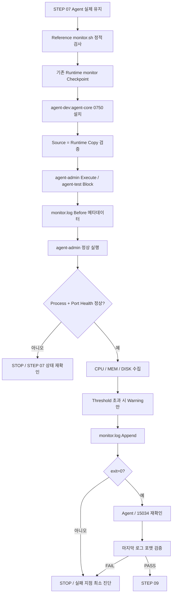
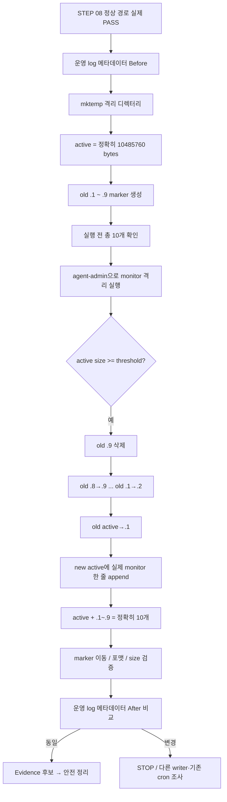

# B1-1 모듈 05 — 모니터링·로그 회전

> 범위: **STEP 08~09**  
> [← 모듈 04](04-AGENT-RUNTIME.md) · [입문자 가이드 허브](../BEGINNER-GUIDE.md) · [다음: 모듈 06 →](06-CRON-FAILURE-WARNING.md)

## 📑 이 모듈 목차

- [STEP 08 — monitor.sh 설치와 정상 실행](#step-08)
- [STEP 09 — monitor.log 10MB / 총 10개 로그 회전 격리 검증](#step-09)

---

<a id="step-08"></a>
## STEP 08 — monitor.sh 설치와 정상 실행

## ① 왜 하는가

공식 B1-1의 핵심 구현물은 Bash `monitor.sh`입니다. 이 스크립트는 실행 중인 Agent 프로세스와 TCP `15034` 상태를 확인하고, 정상일 때 CPU·메모리·Root 파티션 디스크 사용률을 수집하며, 임계값을 넘으면 경고를 출력하고 `/var/log/agent-app/monitor.log`에 고정 형식으로 누적 기록해야 합니다.

또한 공식 권한 정책은 Runtime 파일을 `$AGENT_HOME/bin/monitor.sh`에 두고 **owner=`agent-dev`, group=`agent-core`, mode=`750`**, 실제 실행자는 `agent-admin`으로 분리합니다. 따라서 Repository에 Reference `monitor.sh`가 존재하는 것만으로는 충분하지 않고, **실제 Runtime 경로에 정확히 설치되어 `agent-admin`으로 정상 실행되고 로그가 실제 누적되어야** 합니다.

이 STEP은 **STEP 07 실제 Agent 유지 확인 → Repository source 정적 검사 → 기존 설치본 체크포인트 → Runtime 설치 → owner/group/mode·실행 권한 검증 → `agent-admin` 정상 실행 → 종료 코드 확인 → Agent Process/Port 재확인 → 실제 monitor.log 마지막 라인 형식 확인 → 필요 시 최소 복구** 순서로 진행합니다.

> STEP 08은 **정상 경로(Normal Path)**만 검증합니다. Process/Port를 의도적으로 실패시키는 `exit 1` 검증과 강제 Warning 검증은 STEP 11에서 수행하고, `10MB / 10개` 회전 경계는 STEP 09의 격리 테스트에서 검증합니다. 실제 Agent를 일부러 끄거나 운영 로그를 크게 만들어 이 STEP을 통과하려고 하지 않습니다.

## ② 무엇을 하는가

1. STEP 07에서 실제 Boot 5/5, `Agent READY`, `agent-admin` 프로세스, `0.0.0.0:15034` LISTEN을 확인한 Agent가 계속 살아 있는지 다시 확인합니다.
2. Repository의 `training/round-01-clear/monitor.sh`가 존재하고 Bash 문법, shebang, CRLF 문제가 없는지 정적으로 검사합니다.
3. 기존 `/opt/agent-app/bin/monitor.sh`가 있으면 owner/group/mode와 파일 메타데이터를 기록하고 덮어쓰기 전에 백업합니다.
4. Repository Reference를 `/opt/agent-app/bin/monitor.sh`에 owner=`agent-dev`, group=`agent-core`, mode=`0750`으로 설치합니다.
5. 설치본이 Repository source와 동일한지 비교하고, `agent-admin`은 실행 가능하며 `agent-test`는 읽을 수 없는지 유효 접근을 확인합니다.
6. 실행 전 현재 `monitor.log`의 존재 여부와 크기만 기록합니다. 실제 로그 내용을 미리 수정하거나 삭제하지 않습니다.
7. `agent-admin`으로 `env.sh`를 읽은 뒤 설치된 `monitor.sh`를 한 번 정상 실행하고 실제 종료 코드를 확인합니다.
8. 콘솔에서 Process/TCP `[OK]`, CPU/MEM/DISK 값, 필요 시 Warning, 로그 append 결과를 확인합니다.
9. 실행 후 Agent 프로세스와 `15034` LISTEN이 계속 유지되는지 재확인합니다.
10. `/var/log/agent-app/monitor.log`의 마지막 라인이 공식 고정 포맷인지 검증합니다.
11. 실패하면 Agent를 끄거나 Root로 monitor를 우회 실행하지 않고, 실패 항목을 STEP 05/07 또는 Repository source/설치본 중 하나로 좁혀 최소 수정합니다.

## ③ 이번 단계에서 알아야 할 용어

- **관제(Monitoring)** — 서비스와 시스템 상태를 지속적으로 확인하고 이상 징후를 기록하는 운영 활동입니다.
- **상태 점검(Health Check)** — 서비스가 실제로 동작하는지 핵심 조건을 검사하는 과정입니다. B1-1에서는 Process와 TCP Port가 hard failure 조건입니다.
- **정상 경로(Normal Path)** — 의도적인 장애를 만들지 않은 정상 서비스 상태에서 기대하는 실행 흐름입니다.
- **종료 코드(Exit Code)** — 프로세스가 호출자에게 성공/실패를 숫자로 전달하는 값입니다. 정상은 `0`, 공식 Health failure는 `1`입니다.
- **임계값(Threshold)** — 값을 넘었을 때 Warning을 발생시키는 경계입니다.
- **파싱(Parsing)** — 명령 출력에서 필요한 값만 추출하고 원하는 형식으로 정리하는 작업입니다.
- **Root 파티션(Root Filesystem)** — `/`에 마운트된 기본 파일시스템입니다. 공식 DISK_USED 수집 대상입니다.
- **누적 기록(Append)** — 기존 파일을 덮어쓰지 않고 끝에 새 내용을 추가하는 방식입니다. Shell의 `>>`가 사용됩니다.
- **기준 구현(Reference Implementation)** — Repository에서 학습·재현 기준으로 관리하는 소스입니다. Reference 존재 자체는 Runtime 성공을 의미하지 않습니다.
- **설치본(Runtime Copy)** — 실제 Linux 실행 경로에 배치되어 사용되는 파일입니다.
- **체크포인트(Checkpoint)** — 덮어쓰기 전에 기존 설치본 상태와 백업 경로를 기록하는 지점입니다.
- **CRLF(Carriage Return + Line Feed)** — Windows 계열 줄바꿈입니다. Linux에서 직접 실행하는 Bash shebang에 `\r`이 남으면 실행 오류 원인이 될 수 있습니다.

## ④ 필요한 핵심 개념



### 정상 실행과 이후 시험을 분리

```text
STEP 08
→ 실제 Agent가 정상인 상태
→ monitor.sh 정상 실행
→ exit=0
→ 실제 로그 한 줄 누적 확인

STEP 09
→ 10MB / 10개 로그 회전 경계 검증

STEP 11
→ Process failure → exit 1
→ Port failure → exit 1
→ Warning-only 경로 → exit 0
```

이렇게 분리하면 정상 동작, 로그 회전, 장애 처리라는 서로 다른 요구사항을 한 번에 섞지 않고 원인을 좁힐 수 있습니다.

### 구현상 Process와 Port는 별도 Health Check

```text
Process 존재
≠
TCP Port LISTEN
```

프로세스가 살아 있어도 앱이 포트 바인딩에 실패할 수 있고, 반대로 같은 포트를 다른 프로세스가 사용할 수도 있습니다. 현재 R01은 STEP 07에서 Agent PID/사용자/포트를 먼저 연결해 확인한 뒤 STEP 08에서 `monitor.sh`가 그 상태를 감시하도록 합니다.

## ⑤ 실행할 명령어 또는 코드

### 📍 실행 위치(Context)

```text
Host       : OrbStack Ubuntu 24.04 또는 WSL2 Ubuntu 24.04
Terminal A : STEP 07의 Agent foreground Terminal — 그대로 유지
Terminal B : Ubuntu Bash — monitor 설치·실행·검증
Repository : $HOME/codyssey/codyssey-basic-b1-1-system-monitor
권한       : 일반 사용자 + 설치/역할 전환에 필요한 줄에서만 sudo
venv       : 해당 없음
```

### A. STEP 07 실제 Runtime Gate 재확인 — 읽기 전용

**Terminal A의 Agent를 종료하지 않은 상태에서 Terminal B**에서 수행합니다.

```bash
cd "$HOME/codyssey/codyssey-basic-b1-1-system-monitor"
pwd
git branch --show-current
git status --short

AGENT_COUNT="$(pgrep -x agent-app | wc -l)"
printf '[INFO] agent-app count=%s\n' "$AGENT_COUNT"
ps -C agent-app -o user=,uid=,pid=,comm=,args=
sudo ss -lntp | grep ':15034'
sudo ss -lnt | awk '$4 == "0.0.0.0:15034" {ok=1} END {exit !ok}' \
  && echo '[PASS] STEP 07 bind target still active' \
  || echo '[STOP] STEP 07 bind target is no longer active'
```

정상 기준:

```text
agent-app count = 1
user = agent-admin
uid != 0
0.0.0.0:15034 LISTEN
```

하나라도 다르면 `monitor.sh`를 설치·실행해 오류를 덮지 않고 STEP 07 상태부터 복구합니다.

### B. Repository Reference `monitor.sh` 정적 검사

```bash
MONITOR_SRC="training/round-01-clear/monitor.sh"
MONITOR_DST="/opt/agent-app/bin/monitor.sh"
MONITOR_LOG="/var/log/agent-app/monitor.log"

command -v cmp

test -f "$MONITOR_SRC" \
  && echo '[PASS] Reference monitor.sh exists' \
  || echo '[STOP] Reference monitor.sh missing'

head -n 1 "$MONITOR_SRC"
grep -qx '#!/usr/bin/env bash' "$MONITOR_SRC" \
  && echo '[PASS] Bash shebang confirmed' \
  || echo '[STOP] unexpected shebang'

bash -n "$MONITOR_SRC" \
  && echo '[PASS] Reference Bash syntax' \
  || echo '[STOP] Reference Bash syntax failed'

if LC_ALL=C grep -q $'\r' "$MONITOR_SRC"; then
    echo '[STOP] CR character detected; normalize line endings before install'
else
    echo '[PASS] no CR character detected'
fi
```

`bash -n`은 source를 실행하지 않고 문법만 검사합니다. CR 문자가 발견되면 Linux Runtime에 설치하기 전에 원본의 줄바꿈부터 바로잡고 다시 검증합니다. 이 STEP에서 설치본만 임의 수정해 Repository source와 다른 상태를 만들지 않습니다.

### C. 기존 Runtime `monitor.sh` 체크포인트와 백업

```bash
STAMP="$(date +%Y%m%d%H%M%S)"
MONITOR_META_BEFORE="/tmp/b1-1-monitor-before.${STAMP}.txt"
MONITOR_CHECKPOINT="/tmp/b1-1-monitor-checkpoint.${STAMP}.txt"
MONITOR_BAK="${MONITOR_DST}.b1-1-r01.${STAMP}.bak"
MONITOR_EXISTED=no

{
    echo "===== MONITOR_DST: $MONITOR_DST ====="
    if sudo test -e "$MONITOR_DST"; then
        sudo stat -c '%U %G %a %s %n' "$MONITOR_DST"
        sudo file "$MONITOR_DST" 2>/dev/null || true
    else
        echo '[MISSING]'
    fi

    echo "===== MONITOR_LOG: $MONITOR_LOG ====="
    if sudo test -e "$MONITOR_LOG"; then
        sudo stat -c '%U %G %a %s %n' "$MONITOR_LOG"
    else
        echo '[MISSING]'
    fi
} | tee "$MONITOR_META_BEFORE" >/dev/null

if sudo test -e "$MONITOR_DST"; then
    MONITOR_EXISTED=yes
    if sudo cp -a "$MONITOR_DST" "$MONITOR_BAK"; then
        echo '[PASS] existing Runtime monitor.sh backed up'
    else
        echo '[STOP] Runtime monitor.sh backup failed'
    fi
fi

printf 'STAMP=%s\nMONITOR_EXISTED=%s\nMONITOR_META_BEFORE=%s\nMONITOR_BAK=%s\nMONITOR_SRC=%s\nMONITOR_DST=%s\nMONITOR_LOG=%s\n' \
  "$STAMP" "$MONITOR_EXISTED" "$MONITOR_META_BEFORE" "$MONITOR_BAK" \
  "$MONITOR_SRC" "$MONITOR_DST" "$MONITOR_LOG" \
  > "$MONITOR_CHECKPOINT"

printf '[CHECKPOINT] %s\n' "$MONITOR_CHECKPOINT"
```

기존 설치본이 다른 실습·서비스에서 온 것으로 보이거나 백업에 실패했다면 덮어쓰기 전에 STOP합니다. `monitor.log`는 용량이 커질 수 있는 실제 운영 기록이므로 이 STEP에서 복제하지 않고 메타데이터만 남깁니다.

### D. Runtime 경로에 공식 권한 정책으로 설치

B와 C가 모두 정상일 때만 설치합니다.

```bash
sudo install -o agent-dev -g agent-core -m 0750 \
  "$MONITOR_SRC" \
  "$MONITOR_DST"

sudo stat -c '%U %G %a %s %n' "$MONITOR_DST"
sudo bash -n "$MONITOR_DST"

if sudo cmp -s "$MONITOR_SRC" "$MONITOR_DST"; then
    echo '[PASS] Runtime monitor.sh matches Repository Reference'
else
    echo '[STOP] Runtime monitor.sh differs from Repository Reference'
fi
```

정상 기준:

```text
owner = agent-dev
group = agent-core
mode  = 750
Bash syntax = PASS
Runtime file content = Repository Reference와 동일
```

`/opt/agent-app/bin/monitor.sh`를 직접 편집하여 Repository source와 다른 수정본을 만들지 않습니다. 코드 수정이 필요하면 Repository의 Reference를 수정·검증한 뒤 다시 설치하는 흐름을 사용합니다.

### E. 역할별 유효 접근 검증

`agent-dev`는 owner로서 파일을 유지·수정할 수 있고, `agent-admin`은 `agent-core` 구성원으로서 실행할 수 있어야 합니다.

```bash
sudo runuser -u agent-dev -- test -w "$MONITOR_DST" \
  && echo '[PASS] agent-dev can write Runtime monitor.sh' \
  || echo '[STOP] agent-dev cannot write Runtime monitor.sh'

sudo runuser -u agent-admin -- test -x "$MONITOR_DST" \
  && echo '[PASS] agent-admin can execute Runtime monitor.sh' \
  || echo '[STOP] agent-admin cannot execute Runtime monitor.sh'
```

`agent-test`는 `agent-core`가 아니므로 Runtime monitor source를 읽을 수 없어야 합니다.

```bash
if ! sudo runuser -u agent-test -- test -r "$MONITOR_DST"; then
    echo '[PASS] agent-test cannot read Runtime monitor.sh'
else
    echo '[STOP] agent-test can read Runtime monitor.sh'
fi
```

하나라도 예상과 다르면 `chmod 777`이나 `sudo` Root 실행으로 우회하지 않고 STEP 05의 group/mode/ACL을 다시 확인합니다.

### F. 정상 실행 전 실제 로그 기준선 기록

```bash
sudo runuser -u agent-admin -- test -w /var/log/agent-app \
  && echo '[PASS] agent-admin can write log directory' \
  || echo '[STOP] agent-admin cannot write log directory'

if sudo test -e "$MONITOR_LOG"; then
    MONITOR_LOG_SIZE_BEFORE="$(sudo stat -c '%s' "$MONITOR_LOG")"
else
    MONITOR_LOG_SIZE_BEFORE=0
fi

printf '[INFO] monitor.log size before=%s bytes\n' "$MONITOR_LOG_SIZE_BEFORE"

if [ "$MONITOR_LOG_SIZE_BEFORE" -ge 10485760 ]; then
    echo '[INFO] existing active log is at/over 10MB; normal run may rotate it before appending'
fi
```

여기서는 `monitor.log`를 비우거나 삭제하지 않습니다. 기존 active 로그가 이미 10MB 이상이라면 현재 Reference 로직은 정상 실행 중 회전을 수행할 수 있으므로 단순 Before/After 줄 수 증가만으로 성공을 판단하지 않습니다. 회전 자체의 경계 검증은 STEP 09에서 별도 격리 테스트로 수행합니다.

### G. `agent-admin`으로 정상 실행하고 종료 코드 보존

```bash
sudo -u agent-admin -H bash -c '
  set -e
  set +x
  source /opt/agent-app/env.sh
  exec /opt/agent-app/bin/monitor.sh
'
MONITOR_RC=$?
printf '[INFO] monitor_exit=%s\n' "$MONITOR_RC"
```

이 실행은 Root로 `monitor.sh`를 직접 실행하지 않습니다. `env.sh`에는 Secret 값 자체가 들어 있지 않으며, `set +x`로 불필요한 명령 추적을 끈 상태에서 공식 경로·포트와 R01 process name을 적용합니다.

정상 경로의 필수 판정은:

```text
monitor_exit=0
```

입니다. `[WARNING]`이 자연스럽게 출력되더라도 Process와 Port Health가 정상이고 최종 종료 코드가 `0`이면 Warning-only 정책과 양립할 수 있습니다.

### H. 정상 실행 직후 Agent 상태와 로그 누적 검증

먼저 Agent가 monitor 실행 때문에 중단되지 않았는지 확인합니다.

```bash
pgrep -x agent-app | wc -l
ps -C agent-app -o user=,uid=,pid=,comm=
sudo ss -lntp | grep ':15034'
```

그리고 실제 active 로그의 마지막 라인을 확인합니다. `monitor.log`에는 Secret 값이 기록되지 않아야 합니다.

```bash
sudo stat -c '%U %G %a %s %n' "$MONITOR_LOG"
sudo tail -n 1 "$MONITOR_LOG"
```

공식 로그 포맷을 정규식으로 확인합니다.

```bash
sudo tail -n 1 "$MONITOR_LOG" \
  | grep -Eq '^\[[0-9]{4}-[0-9]{2}-[0-9]{2} [0-9]{2}:[0-9]{2}:[0-9]{2}\] PID:[0-9]+ CPU:[0-9]+([.][0-9]+)?% MEM:[0-9]+([.][0-9]+)?% DISK_USED:[0-9]+([.][0-9]+)?%$' \
  && echo '[PASS] monitor.log last line matches official format' \
  || echo '[STOP] monitor.log last line format mismatch'
```

정상 로그 형태:

```text
[YYYY-MM-DD HH:MM:SS] PID:... CPU:..% MEM:..% DISK_USED:..%
```

위 형태는 문서 설명용이고, PASS는 **실제 Runtime에서 방금 생성된 마지막 라인**으로만 판단합니다.

### I. 정상 콘솔 출력 해석

현재 Reference의 정상 실행에서는 대체로 다음 범주의 출력이 나타납니다.

```text
[HEALTH CHECK]
[OK] Process found ...
[OK] TCP 15034 is LISTEN
[OK] Firewall is active
또는 Firewall 확인 실패 시 [WARNING]

[RESOURCE MONITORING]
CPU Usage : ...%
MEM Usage : ...%
DISK Used : ...%
필요 시 CPU/MEM/DISK [WARNING]

[OK] Log appended: /var/log/agent-app/monitor.log
====== MONITOR COMPLETE ======
```

문구 전체를 Reference 예시와 문자 단위로 맞추는 것이 목표가 아닙니다. 공식 요구사항에 연결되는 실제 의미를 봅니다.

```text
Process Health 정상
TCP 15034 Health 정상
CPU/MEM/DISK 실제 값 수집
Threshold 초과는 Warning-only
실제 monitor.log append
최종 exit=0
```

방화벽 Warning은 공식 정책상 hard failure가 아닙니다. 다만 STEP 04에서 UFW가 실제 active임을 이미 검증했는데도 monitor가 확인하지 못한다면 `ufw` 상태와 Reference의 `firewall_is_active()` 판정을 별도로 조사합니다. Warning을 없애기 위해 `agent-admin`에 광범위한 NOPASSWD sudo를 추가하지 않습니다.

### J. 실패 시 최소 진단과 설치본 Recovery

#### 먼저 Runtime source/설치 상태를 확인

```bash
cat "$MONITOR_CHECKPOINT"
cat "$MONITOR_META_BEFORE"
sudo stat -c '%U %G %a %s %n' "$MONITOR_DST" 2>/dev/null || true
sudo bash -n "$MONITOR_DST" 2>/dev/null || true
sudo cmp -s "$MONITOR_SRC" "$MONITOR_DST" \
  && echo '[PASS] source/runtime still identical' \
  || echo '[FAIL] source/runtime differ'
```

#### Process 실패가 나오면

Agent를 Root로 다시 띄우거나 monitor 코드를 바로 수정하지 않습니다. STEP 07의 실제 대상부터 확인합니다.

```bash
pgrep -a -x agent-app || true
ps -C agent-app -o user=,uid=,pid=,comm=,args= || true
sudo ss -lntp | grep ':15034' || true
```

Agent가 사라졌다면 STEP 07을 다시 정상화한 뒤 monitor를 재실행합니다.

#### Port 실패가 나오면

Process가 있다고 포트를 정상으로 가정하지 않습니다.

```bash
sudo ss -lntp | grep ':15034' || true
```

다른 프로세스가 포트를 잡고 있는지, Agent가 LISTEN을 잃었는지 STEP 07 기준으로 좁혀 봅니다.

#### CPU/MEM/DISK 수집 실패가 나오면

```bash
PID="$(pgrep -x agent-app | head -n 1 || true)"
printf '[INFO] PID=%s\n' "$PID"
ps -p "$PID" -o %cpu=,%mem= 2>/dev/null || true
df -P / || true
```

이 진단은 값을 읽는 작업이며 시스템 자원을 인위적으로 올리지 않습니다. PID가 비어 있다면 자원 파싱보다 Agent Process 문제부터 해결합니다.

#### 로그 쓰기 실패가 나오면

```bash
sudo runuser -u agent-admin -- test -w /var/log/agent-app \
  && echo '[PASS] agent-admin can write log dir' \
  || echo '[FAIL] agent-admin cannot write log dir'

sudo stat -c '%U %G %a %n' /var/log/agent-app
sudo getfacl -p /var/log/agent-app
```

STEP 05의 `agent-core` membership, mode, ACL에서 실제 실패 원인 하나만 수정합니다. `chmod 777`로 우회하지 않습니다.

#### 설치 자체를 철회해야 할 때

먼저 체크포인트의 `MONITOR_EXISTED`를 확인합니다.

기존 설치본이 있었고 백업이 실제 존재하면:

```bash
sudo test -f "$MONITOR_BAK" && sudo cp -a "$MONITOR_BAK" "$MONITOR_DST"
sudo stat -c '%U %G %a %s %n' "$MONITOR_DST"
```

기존 설치본이 없었고 이번 STEP에서 처음 만든 파일임이 명확하면, 전체 `$AGENT_HOME/bin`이 아니라 해당 파일 하나만 제거하는 것을 검토합니다.

```bash
sudo rm -f "$MONITOR_DST"
```

`monitor.log`에 정상적으로 추가된 Runtime 기록은 설치본 Recovery를 이유로 자동 삭제하지 않습니다. 실제 운영 로그를 지워 실패를 숨기지 않습니다.

> STEP 08 실패를 복구하기 위해 STEP 07의 정상 Agent를 `pkill`/`kill -9`로 종료하거나, `monitor.sh`를 Root로 실행하거나, `/opt/agent-app` 전체를 삭제하지 않습니다.

### K. 현재 Reference `monitor.sh` 구현을 평가 관점에서 읽기

공식 Evaluation은 단순 실행뿐 아니라 `pgrep`/`ps`, `ss`, CPU/MEM/DISK 파싱과 권한 정책을 설명할 수 있는지도 확인합니다. 현재 Reference의 핵심 구조는 다음과 같습니다.

#### Process Health

```text
pgrep -x "$AGENT_PROCESS_NAME"
→ 정확한 프로세스 이름으로 PID 탐색
→ PID가 없으면 fail()
→ fail()은 exit 1
```

`-x`를 사용하는 이유는 `/opt/agent-app/...`처럼 경로 문자열에 우연히 `agent-app`이 들어 있는 다른 프로세스를 잘못 찾는 false positive를 줄이기 위해서입니다. 현재 구현은 첫 PID를 사용하므로 **STEP 07에서 process count=1을 먼저 검증하는 것이 중요**합니다.

#### TCP Port Health

```text
ss -lnt
→ LISTEN TCP socket 조회
→ awk로 local address가 :15034로 끝나는 행 탐색
→ 없으면 exit 1
```

Process와 Port를 둘 다 확인하는 이유는 프로세스 존재만으로 서비스 소켓 준비 상태를 보장할 수 없기 때문입니다.

#### Firewall 상태

```text
UFW/firewalld active 확인
→ 확인되면 [OK]
→ 확인되지 않으면 [WARNING]
→ 스크립트 종료하지 않음
```

방화벽 전체 허용 규칙은 STEP 04와 `verify.sh`에서 별도로 검증합니다. `monitor.sh`는 운영 중 active 상태를 경고 수준으로 관찰합니다.

#### CPU / MEM

```text
ps -p "$PID" -o %cpu=
ps -p "$PID" -o %mem=
→ awk로 숫자 값 추출
```

현재 R01 Reference는 **모니터링 대상 Agent 프로세스의 CPU/MEM 사용률**을 수집합니다.

#### DISK_USED

```text
df -P /
→ Root filesystem 한 줄 선택
→ Used%의 % 기호 제거
→ 숫자로 사용
```

`-P`는 POSIX 형식의 비교적 안정적인 한 줄 출력을 사용해 파싱하기 쉽게 합니다.

#### Threshold

```text
CPU > 20
MEM > 10
DISK_USED > 80
→ [WARNING]
→ 계속 실행
```

`is_over()`는 `awk`를 사용하여 정수뿐 아니라 소수값도 `>` 비교합니다. 경고는 장애와 달리 스크립트를 중단하지 않습니다.

#### 로그 누적

```text
TIMESTAMP=$(date '+%Y-%m-%d %H:%M:%S')
printf ... >> "$MONITOR_LOG"
```

`>>`는 기존 로그를 유지하고 새 라인을 뒤에 붙입니다. `>`를 사용하면 매 실행마다 기존 로그를 덮어쓸 수 있으므로 공식 누적 기록 목적과 맞지 않습니다.

현재 Reference는 로그 append 전에 `rotate_log_if_needed`를 호출합니다. 이 회전 정책의 **10MB / 총 10개 파일** 경계 동작은 다음 STEP 09에서 실제 운영 로그를 훼손하지 않는 격리 경로로 검증합니다.

## ⑥ 명령어와 코드에 입문자가 이해할 수 있는 주석

### STEP 07 Gate와 Repository 확인

- `cd "$HOME/codyssey/codyssey-basic-b1-1-system-monitor"`
  - 실제 B1-1 Repository root로 이동합니다. Reference 파일을 다른 clone이나 Host 경로에서 잘못 설치하는 일을 줄입니다.
- `AGENT_COUNT="$(pgrep -x agent-app | wc -l)"`
  - `pgrep -x`가 찾은 정확한 이름의 PID 수를 `wc -l`로 세어 변수에 저장합니다.
  - 정상 R01은 STEP 07에서 단일 foreground Agent 1개를 기준으로 합니다.
- `ps -C ...`
  - Agent의 user/UID/PID/command를 다시 확인하여 Root나 다른 프로세스를 감시 대상으로 착각하지 않게 합니다.
- `ss ... awk '$4 == "0.0.0.0:15034"'`
  - 공식 STEP 07 바인드가 monitor 설치 직전에도 유지되는지 확인합니다.

### Reference 정적 검사

- `MONITOR_SRC=...`, `MONITOR_DST=...`, `MONITOR_LOG=...`
  - 이후 반복해서 사용하는 source, Runtime 설치 경로, 로그 경로를 변수로 고정합니다.
- `command -v cmp`
  - source와 설치본 byte 내용 비교에 사용할 `cmp` 명령의 존재를 확인합니다.
- `test -f "$MONITOR_SRC"`
  - Repository Reference 파일 존재 여부를 확인합니다.
- `head -n 1`
  - 첫 줄 shebang을 확인합니다. 파일 전체를 실행하는 명령이 아닙니다.
- `grep -qx '#!/usr/bin/env bash'`
  - `-q`는 일치 내용을 출력하지 않고 종료 코드만 사용하고, `-x`는 줄 전체가 정확히 해당 shebang인지 확인합니다.
- `bash -n "$MONITOR_SRC"`
  - 실제 동작 없이 Bash 문법만 검사합니다.
- `LC_ALL=C grep -q $'\r'`
  - byte 중심의 C locale에서 Carriage Return 문자가 남아 있는지 검사합니다.
  - `$'\r'`는 Bash ANSI-C quoting으로 CR 문자를 표현합니다.

### 체크포인트와 설치

- `STAMP="$(date +%Y%m%d%H%M%S)"`
  - 타임스탬프로 기존 설치본 백업 이름 충돌을 줄입니다.
- `stat -c '%U %G %a %s %n'`
  - owner/group/mode/byte size/path를 기록합니다.
- `cp -a`
  - 기존 설치본이 있으면 덮어쓰기 전에 속성을 가능한 한 보존하여 백업합니다.
- `install -o agent-dev -g agent-core -m 0750`
  - 복사와 동시에 공식 owner/group/mode를 적용합니다.
- `cmp -s source destination`
  - `-s`는 차이 내용을 출력하지 않고 동일/다름만 종료 코드로 알려 줍니다. 설치 과정에서 다른 내용이 들어가지 않았는지 확인합니다.

### 역할별 권한

- `runuser -u agent-dev -- test -w`
  - 실제 owner 역할인 `agent-dev`가 Runtime monitor 파일을 쓸 수 있는지 확인합니다.
- `runuser -u agent-admin -- test -x`
  - 실제 cron/수동 실행자인 `agent-admin`이 파일을 실행할 수 있는지 확인합니다.
- `! runuser -u agent-test -- test -r`
  - test 계정의 읽기 차단이 성공 조건이므로 `!`로 결과를 반전합니다.

### 로그 Before 확인

- `stat -c '%s' "$MONITOR_LOG"`
  - 기존 active 로그의 byte 크기만 읽습니다.
- `10485760`
  - 10 MiB에 해당하는 byte 수입니다. 현재 Reference의 기본 회전 기준입니다.
- 기존 로그가 기준 이상이면 다음 정상 실행에서 회전될 수 있으므로 단순 줄 수 증가만으로 성공을 판단하지 않습니다.

### `agent-admin` 정상 실행

- `sudo -u agent-admin -H`
  - Root가 아니라 실제 실행 계정 `agent-admin`으로 명령을 수행하고 target user HOME을 사용합니다.
- `bash -c '...'`
  - login profile을 추가로 읽지 않고 필요한 `env.sh`를 명시적으로 source하여 실행 환경의 변동을 줄입니다.
- `set -e`
  - `env.sh` source 같은 준비가 실패하면 monitor를 잘못된 환경으로 계속 실행하지 않게 합니다.
- `set +x`
  - Shell 명령 추적을 끕니다.
- `source /opt/agent-app/env.sh`
  - `AGENT_PORT`, `AGENT_LOG_DIR`, R01 `AGENT_PROCESS_NAME` 등 non-secret Runtime 설정을 현재 셸에 적용합니다.
- `exec /opt/agent-app/bin/monitor.sh`
  - 중간 Bash를 실제 monitor 프로세스로 교체하여 monitor 종료 코드가 `sudo` 호출 결과로 그대로 전달되게 합니다.
- `MONITOR_RC=$?`
  - 바로 앞 `sudo`/monitor 실행의 종료 코드를 저장합니다.
- 정상 경로는 `MONITOR_RC=0`이어야 합니다. 의도적 Health failure의 `1`은 STEP 11에서 별도로 검증합니다.

### 로그 포맷 검증

- `tail -n 1 "$MONITOR_LOG"`
  - 실제 active log의 가장 마지막 한 줄을 봅니다.
- `grep -E`
  - 확장 정규식으로 timestamp, PID, CPU, MEM, DISK_USED 필드 순서와 `%` 기호를 확인합니다.
- `[0-9]+([.][0-9]+)?`
  - 정수 또는 소수 숫자 형식을 허용합니다.
- 이 검사는 로그의 형식을 확인할 뿐 Secret 값을 읽거나 검색하지 않습니다.

### 진단 명령

- `PID="$(pgrep -x agent-app | head -n 1 || true)"`
  - 현재 Agent PID를 진단용 변수로 얻습니다. STEP 07에서 중복이 없어야 한다는 전제가 있습니다.
- `ps -p "$PID" -o %cpu=,%mem=`
  - monitor가 읽는 것과 같은 프로세스 자원 값을 직접 확인합니다.
- `df -P /`
  - Root filesystem 사용률 원본을 직접 확인합니다.
- `getfacl -p /var/log/agent-app`
  - 로그 쓰기 실패 시 실제 ACL을 확인합니다.

### 재실행 안전성

이 STEP 전체는 **🔴 DO NOT RERUN BLINDLY**입니다. Reference 조회와 검증은 안전하지만 설치는 파일을 덮어쓰고, monitor 정상 실행은 실제 로그를 append하며 기존 로그가 10MB 이상이면 회전을 수행할 수 있습니다.

```text
Git / pgrep / ps / ss / source 정적 조회                 → 🟢 SAFE TO RERUN
bash -n / shebang / CRLF / cmp 검사                      → 🟢 SAFE TO RERUN
체크포인트·기존 설치본 백업                              → 🟡 기존 파일 출처 확인 후
Runtime monitor install                                  → 🔴 Checkpoint + source 검사 후
stat / runuser test                                      → 🟢 SAFE TO RERUN
monitor 정상 실행                                        → 🟡 매 실행마다 실제 로그 append/회전 가능
로그 tail / regex 검증                                   → 🟢 SAFE TO RERUN
설치본 Recovery cp/rm                                    → 🔴 MONITOR_EXISTED 상태 확인 후
Agent 강제 종료 / Root monitor 실행                     → 🚫 이 STEP의 복구 방법 아님
```

> **STOP 기준:** STEP 07 실제 Runtime Gate 미통과, Repository Reference 없음, Bash 문법 실패, Bash shebang 불일치, CRLF/CR 문자 발견, 기존 Runtime monitor 출처 불명, 기존 파일 백업 실패, 설치 owner/group/mode 불일치, source/runtime 내용 불일치, `agent-admin` 실행 권한 없음, `agent-test`가 Runtime monitor를 읽을 수 있음, `monitor_exit != 0`, monitor 실행 후 Agent/15034가 사라짐, 실제 로그 마지막 라인 포맷 불일치 중 하나라도 발생하면 STEP 09로 진행하지 않습니다.

## ⑦ 예상되는 정상 결과

설치 검증:

```text
Reference monitor.sh Bash syntax = PASS
CR character = 없음
Runtime path = /opt/agent-app/bin/monitor.sh
owner = agent-dev
group = agent-core
mode = 750
Repository Reference와 Runtime Copy 동일
agent-dev write = 가능
agent-admin execute = 가능
agent-test read = 불가
```

정상 실행에서는 실제 환경에 따라 숫자와 Warning 유무는 달라질 수 있지만 다음 의미가 확인되어야 합니다.

```text
Process Health = [OK]
TCP 15034 Health = [OK]
CPU Usage = 실제 숫자
MEM Usage = 실제 숫자
DISK Used = 실제 숫자
Threshold 초과 시 [WARNING] 가능
Log appended = [OK]
monitor_exit = 0
```

실행 후:

```text
agent-app process count = 1 유지
user = agent-admin 유지
TCP 15034 LISTEN 유지
monitor.log 마지막 라인 = 공식 고정 포맷
```

## ⑧ 그 결과가 의미하는 것

Repository의 Reference 구현이 단순 예시 파일에 머무르지 않고 **실제 Runtime 설치본 → 공식 owner/group/mode → 역할별 실행 권한 → 정상 Agent Health Check → CPU/MEM/DISK 수집 → Warning-only 분리 → 실제 로그 누적 → exit 0**까지 연결되었다는 의미입니다.

이 단계가 실제로 성공한 뒤에야 `monitor.sh`의 정상 경로가 Runtime에서 동작한다고 말할 수 있습니다. 그러나 아직 `10MB / 10개` 회전 경계, cron 자동 실행, Process/Port 실패 `exit 1`, 강제 Warning 경로, 통합 검증(Verification), Evidence가 남아 있으므로 B1-1 전체 PASS/CLEAR는 아닙니다.

## ⑨ 자주 발생하는 오류와 해결 방법

- `bash -n` 실패 → 설치하지 말고 Repository Reference의 해당 문법 오류를 먼저 수정·재검증.
- shebang이 다름 → 공식 Bash-only 제약과 현재 Reference 의도를 확인. Runtime 설치본만 임의 수정하지 않음.
- CRLF/CR 발견 → Git/Editor의 line ending을 LF로 바로잡고 Reference에서 재검증한 뒤 설치. Linux 설치본만 `sed -i`로 임시 변환하여 source와 다르게 만들지 않음.
- 기존 `/opt/agent-app/bin/monitor.sh` 출처를 모름 → 덮어쓰기 STOP. 체크포인트와 이전 실습 여부 확인.
- `cmp` 결과가 다름 → 설치 대상/source 경로를 다시 확인. Runtime 파일을 직접 고치는 대신 Reference를 기준으로 다시 설치.
- owner/group/mode가 다름 → `install -o agent-dev -g agent-core -m 0750`이 실제 성공했는지와 상위 `bin` 경로 정책 확인.
- `agent-admin` 실행 불가 → `id agent-admin`, `agent-core` membership, `$AGENT_HOME`/`bin` traversal, mode를 STEP 05 기준으로 확인. `chmod 777` 금지.
- `agent-test`가 monitor를 읽음 → `agent-test`의 core membership, `bin`/파일 ACL·mode를 확인하고 문제 항목 하나만 수정.
- `Agent process not found` → monitor 코드를 먼저 바꾸지 말고 STEP 07 Agent가 여전히 실행 중인지 `pgrep/ps`로 확인.
- `TCP 15034 is not LISTEN` → Process가 있어도 Port는 별도이므로 `ss`와 STEP 07 Terminal A 상태 확인.
- CPU/MEM 값 수집 실패 → Agent PID가 실행 중인지 확인한 뒤 직접 `ps` 출력과 Reference parsing 비교.
- DISK_USED 수집 실패 → `df -P /` 원문 확인. Root filesystem 자체 문제를 우회하기 위해 다른 경로로 임의 변경하지 않음.
- Firewall `[WARNING]` → 공식상 Warning-only. STEP 04 UFW 실제 상태를 확인하고, active인데도 탐지 실패하면 `firewall_is_active()`의 non-root 판정 경로를 조사. NOPASSWD sudo를 광범위하게 추가하지 않음.
- CPU/MEM/DISK `[WARNING]` → 정상 환경에서 임계값을 실제로 초과했다면 경고 자체는 정상이며 스크립트는 계속 진행해야 함. 의도적인 Warning 검증은 STEP 11에서 수행.
- `Log directory is not writable` → `runuser`, `stat`, `getfacl`로 STEP 05 최소 권한 정책 확인. Root 실행으로 우회 금지.
- `monitor_exit`가 1 → 정상 경로 PASS 아님. 콘솔의 첫 `[FAIL]` 원인을 해결한 뒤 다시 실행.
- log 마지막 줄 형식 FAIL → Reference source/runtime 동일성, 실제 마지막 라인, append 로직을 확인. 예상 예시 문자열을 Evidence로 대체하지 않음.
- 기존 log가 10MB 이상이라 정상 실행 중 `.1`로 이동함 → Reference의 자동 회전 가능 동작. active log의 새 마지막 라인을 확인하고 STEP 09에서 격리된 10MB/10개 경계를 별도 검증.
- 복구 필요 → `MONITOR_CHECKPOINT`의 `MONITOR_EXISTED`와 백업 경로를 확인해 정확한 설치 파일 하나만 복구. 실제 monitor.log 전체 삭제 금지.

## ⑩ 완료 확인

- [ ] STEP 07 실제 Boot 5/5 / Agent READY / agent-admin process / 0.0.0.0:15034 Gate가 현재도 유지됨
- [ ] B1-1 Repository root / Branch / working tree 확인
- [ ] Reference `training/round-01-clear/monitor.sh` 존재
- [ ] Bash shebang 확인
- [ ] `bash -n` Reference 문법 PASS
- [ ] CRLF/CR 문자 없음
- [ ] 기존 Runtime monitor 존재 여부와 메타데이터 Checkpoint 저장
- [ ] 기존 Runtime monitor가 있었다면 덮어쓰기 전 백업 성공
- [ ] Runtime 경로 `/opt/agent-app/bin/monitor.sh`
- [ ] owner=`agent-dev`
- [ ] group=`agent-core`
- [ ] mode=`750`
- [ ] 설치본 Bash 문법 PASS
- [ ] Repository Reference = Runtime Copy 내용 동일
- [ ] `agent-dev` Runtime monitor write 가능
- [ ] `agent-admin` Runtime monitor execute 가능
- [ ] `agent-test` Runtime monitor read 차단
- [ ] `/var/log/agent-app`에 agent-admin write 가능
- [ ] 실행 전 monitor.log size 메타데이터 확인
- [ ] Root가 아닌 `agent-admin`으로 정상 실행
- [ ] Process Health `[OK]`
- [ ] TCP 15034 Health `[OK]`
- [ ] CPU/MEM/DISK 실제 값 수집
- [ ] 자연 발생 Warning은 hard failure와 구분
- [ ] `[OK] Log appended` 실제 확인
- [ ] `monitor_exit=0`
- [ ] monitor 실행 후 Agent process 1개 유지
- [ ] monitor 실행 후 TCP 15034 LISTEN 유지
- [ ] 실제 `monitor.log` 마지막 라인 확인
- [ ] 마지막 라인이 공식 `[YYYY-MM-DD HH:MM:SS] PID:... CPU:..% MEM:..% DISK_USED:..%` 포맷에 맞음
- [ ] 실패 시 Agent 종료/Root 실행/광범위 권한 완화 없이 최소 진단
- [ ] 설치본 Recovery가 필요하면 `MONITOR_EXISTED` 기준으로 정확한 파일만 복구
- [ ] **아직 10MB/10개 회전 Runtime 검증은 STEP 09 전이므로 PASS로 기록하지 않음**
- [ ] **아직 Process/Port failure exit 1과 강제 Warning 경로는 STEP 11 전이므로 PASS로 기록하지 않음**

---

<a id="step-09"></a>
## STEP 09 — monitor.log 10MB / 총 10개 로그 회전 격리 검증

## ① 왜 하는가

공식 B1-1은 `monitor.log`가 계속 커져 디스크를 고갈시키지 않도록 **10MB / 10개 파일**의 로그 용량 관리 정책을 구현하고 실제 동작을 설명할 수 있어야 합니다. 현재 R01 Reference `monitor.sh`는 별도 `logrotate` 설정이 아니라 Bash 내부의 `rotate_log_if_needed()` 함수로 이 정책을 구현합니다.

운영 경로 `/var/log/agent-app`의 실제 로그를 10MB까지 인위적으로 키우거나 기존 회전 파일을 삭제해서 시험하면 실제 증빙과 운영 기록을 손상시킬 수 있습니다. 따라서 이 STEP은 **STEP 08 정상 실행 Gate 재확인 → 운영 로그 메타데이터 기준선 → `mktemp` 고유 격리 디렉터리 → 정확한 회전 경계와 기존 `.1~.9` 마커 구성 → 실제 설치된 `monitor.sh`를 `agent-admin`으로 격리 실행 → `.1~.9` 이동 관계와 총 개수 검증 → 새 active 로그 포맷 검증 → 운영 로그 불변 확인 → 증빙 수집 후 범위 제한 정리** 순서로 수행합니다.

> 공식 문서의 표현은 **10MB / 10개**입니다. 현재 R01 Reference 구현은 그 정책을 코드에서 `MAX_LOG_BYTES=10485760`, `MAX_TOTAL_LOG_FILES=10`으로 구체화합니다. `10485760` byte는 10 MiB에 해당하며, 이것은 **R01 구현 세부값**이지 공식 요구 문구를 다른 단위로 바꾸는 것이 아닙니다.

## ② 무엇을 하는가

1. STEP 08의 정상 경로가 실제로 성공했고, Agent 1개와 TCP `15034`가 계속 정상인지 다시 확인합니다.
2. Repository Reference와 `/opt/agent-app/bin/monitor.sh` 설치본이 같은지 확인합니다.
3. 실제 `/var/log/agent-app/monitor.log`의 크기와 수정 시각만 저장하여 격리 시험 전후 비교 기준으로 사용합니다.
4. 고정 `/tmp/b1-1-log-test`를 지우지 않고 `mktemp -d`로 이번 실행 전용 디렉터리를 만듭니다.
5. active `monitor.log`을 R01 회전 경계인 정확히 `10485760` byte로 만들고, `.1`~`.9`에는 서로 다른 식별 마커를 넣습니다.
6. 실행 전 active + `.1`~`.9`가 정확히 10개인지 확인합니다.
7. 실제 설치된 `monitor.sh`를 `agent-admin`으로 실행하되 `AGENT_LOG_DIR`, `MAX_LOG_BYTES`, `MAX_TOTAL_LOG_FILES`만 **이번 자식 프로세스에서** 격리 경로/시험값으로 override합니다.
8. 실행 후 old active가 `.1`로 이동했는지, old `.1→.2` … old `.8→.9`가 되었는지, 기존 old `.9`가 제거되었는지 확인합니다.
9. 새 active `monitor.log`가 다시 생성되어 실제 공식 포맷의 한 줄을 포함하는지 확인합니다.
10. active + `.1`~`.9`가 정확히 총 10개이고 `.10`은 존재하지 않는지 확인합니다.
11. 시험 전후 운영 `monitor.log` 메타데이터가 같아 격리 시험이 운영 로그를 건드리지 않았는지 확인합니다.
12. 필요한 Evidence를 먼저 남긴 뒤, 정확한 `mktemp` 경로와 예상 파일만 대상으로 정리합니다.

## ③ 이번 단계에서 알아야 할 용어

- **로그 회전(Log Rotation)** — 현재 active 로그가 기준 크기에 도달하면 이전 로그로 넘기고 새 active 로그를 시작하는 방식입니다.
- **보존 정책(Retention Policy)** — 얼마나 큰 로그를 몇 개까지 유지할지 정하는 규칙입니다.
- **활성 로그(Active Log)** — 현재 새 기록이 추가되는 `monitor.log`입니다.
- **회전 로그(Rotated Log)** — 이전 기록을 보관하는 `monitor.log.1`, `.2` 같은 파일입니다.
- **회전 경계(Rotation Boundary)** — 회전 여부를 결정하는 크기 기준입니다. 현재 R01 구현은 `10485760` byte입니다.
- **격리 시험(Isolated Test)** — 실제 운영 데이터 대신 별도 임시 경로에서 같은 코드를 실행해 동작을 재현하는 시험입니다.
- **마커(Marker)** — 파일이 회전 후 어느 번호로 이동했는지 추적하기 위해 넣는 식별 문자열입니다.
- **희소 파일(Sparse File)** — `truncate`처럼 논리적 파일 크기를 크게 만들되 실제 디스크 블록을 전부 데이터로 채우지 않을 수 있는 파일입니다.
- **메타데이터(Metadata)** — 파일 내용 자체가 아니라 크기, 수정 시각, owner/mode 같은 속성 정보입니다.
- **환경변수 재정의(Environment Override)** — 원본 설정 파일을 수정하지 않고 특정 실행에만 다른 환경값을 전달하는 방식입니다.

## ④ 필요한 핵심 개념



현재 Reference의 회전 순서를 파일 관점에서 보면 다음과 같습니다.

```text
실행 전
monitor.log      = ACTIVE-BEFORE, 10485760 bytes
monitor.log.1    = ROTATED-BEFORE-1
...
monitor.log.8    = ROTATED-BEFORE-8
monitor.log.9    = ROTATED-BEFORE-9

회전
old .9           → 삭제
old .8           → .9
...
old .1           → .2
old active       → .1

그 다음 append
새 monitor.log   → 방금 실행한 실제 monitor 기록 1줄
```

### “10개”의 의미

현재 R01 Reference는 `MAX_TOTAL_LOG_FILES=10`을 **active `monitor.log`까지 포함한 총 파일 수**로 해석합니다.

```text
monitor.log      1개
monitor.log.1~.9 9개
--------------------
총               10개
```

따라서 `.10`을 만드는 구조가 아닙니다.

### 경계값과 append 순서의 의미

현재 코드는 새 로그를 쓰기 **전에** active 파일 크기를 검사합니다.

```text
현재 active size >= 10485760
→ 먼저 rotation
→ 그 다음 새 active에 현재 한 줄 append
```

따라서 이 STEP은 **정확히 10485760 byte인 active 파일**을 만들어 회전 조건을 명확하게 시험합니다. “모든 순간에 active 파일이 절대로 10MB를 한 byte도 넘지 않는다”는 별도 보장을 이 시험 결과로 과장하지 않습니다.

## ⑤ 실행할 명령어 또는 코드

### 📍 실행 위치(Context)

```text
Host       : OrbStack Ubuntu 24.04 또는 WSL2 Ubuntu 24.04
Terminal A : STEP 07부터 유지 중인 Agent foreground Terminal
Terminal B : Ubuntu Bash — 격리 로그 회전 시험
Repository : $HOME/codyssey/codyssey-basic-b1-1-system-monitor
권한       : 일반 사용자 + 필요한 조회/소유권 변경 줄에서만 sudo
venv       : 해당 없음
```

### A. STEP 08 정상 경로와 설치본 재확인 — 읽기 전용

```bash
cd "$HOME/codyssey/codyssey-basic-b1-1-system-monitor"

AGENT_COUNT="$(pgrep -x agent-app | wc -l)"
printf '[INFO] agent-app count=%s\n' "$AGENT_COUNT"
ps -C agent-app -o user=,uid=,pid=,comm=
sudo ss -lntp | grep ':15034'

sudo cmp -s training/round-01-clear/monitor.sh /opt/agent-app/bin/monitor.sh \
  && echo '[PASS] Runtime monitor matches Repository Reference' \
  || echo '[STOP] Runtime monitor differs from Repository Reference'
```

정상 기준:

```text
agent-app count = 1
user = agent-admin
uid != 0
TCP 15034 LISTEN
Repository Reference = Runtime monitor
```

STEP 08의 실제 `monitor_exit=0`과 운영 로그 포맷 확인까지 성공하지 않았다면 이 STEP으로 강행하지 않습니다.

### B. 운영 monitor.log 메타데이터 기준선 저장

```bash
PROD_LOG="/var/log/agent-app/monitor.log"

if sudo test -e "$PROD_LOG"; then
    PROD_LOG_BEFORE="$(sudo stat -c '%s:%Y' "$PROD_LOG")"
else
    PROD_LOG_BEFORE='MISSING'
fi

printf '[INFO] production monitor.log before=%s\n' "$PROD_LOG_BEFORE"
```

`%s`는 byte 크기, `%Y`는 마지막 수정 시각(epoch seconds)입니다. 여기서는 운영 로그 내용을 읽거나 복사하지 않습니다.

### C. 이번 실행 전용 격리 디렉터리 만들기

```bash
LOG_TEST_DIR="$(sudo -u agent-admin mktemp -d /tmp/b1-1-log-rotation.XXXXXX)"
printf '[INFO] test dir=%s\n' "$LOG_TEST_DIR"

case "$LOG_TEST_DIR" in
    /tmp/b1-1-log-rotation.*)
        echo '[PASS] isolated test path pattern confirmed'
        ;;
    *)
        echo '[STOP] unexpected test path; do not create/delete test files'
        ;;
esac

sudo chown agent-admin:agent-core "$LOG_TEST_DIR"
sudo chmod 0770 "$LOG_TEST_DIR"
sudo stat -c '%U %G %a %n' "$LOG_TEST_DIR"

TEST_LOG="$LOG_TEST_DIR/monitor.log"
```

`LOG_TEST_DIR`가 비어 있거나 `/tmp/b1-1-log-rotation.*` 패턴과 맞지 않으면 여기서 STOP합니다. 이후 생성·삭제 명령을 실행하지 않습니다.

### D. 정확한 회전 경계와 `.1~.9` 마커 준비

먼저 active 파일에 마커를 넣고 R01 회전 경계인 정확히 `10485760` byte로 만듭니다.

```bash
printf '%s\n' 'ACTIVE-BEFORE' \
  | sudo -u agent-admin tee "$TEST_LOG" >/dev/null
sudo -u agent-admin truncate -s 10485760 "$TEST_LOG"
```

기존 회전 파일 `.1`~`.9`에는 서로 다른 마커를 넣습니다.

```bash
for i in 1 2 3 4 5 6 7 8 9; do
    printf 'ROTATED-BEFORE-%s\n' "$i" \
      | sudo -u agent-admin tee "${TEST_LOG}.${i}" >/dev/null
done
```

실행 전 총 개수와 크기를 확인합니다.

```bash
BEFORE_COUNT="$(sudo find "$LOG_TEST_DIR" -maxdepth 1 -type f -name 'monitor.log*' | wc -l)"
printf '[INFO] test log count before=%s\n' "$BEFORE_COUNT"

sudo find "$LOG_TEST_DIR" -maxdepth 1 -type f -name 'monitor.log*' \
  -printf '%f %s bytes\n' | sort -V
```

정상 기준은 **총 10개**, 그리고 `monitor.log`이 **10485760 bytes**입니다. 둘 중 하나라도 다르면 monitor를 실행하지 않고 시험 데이터 생성 단계부터 확인합니다.

### E. 실제 설치된 monitor.sh를 격리 경로로 한 번 실행

```bash
sudo -u agent-admin -H env LOG_TEST_DIR="$LOG_TEST_DIR" bash -c '
  set -e
  set +x
  source /opt/agent-app/env.sh
  export AGENT_LOG_DIR="$LOG_TEST_DIR"
  export MAX_LOG_BYTES=10485760
  export MAX_TOTAL_LOG_FILES=10
  exec /opt/agent-app/bin/monitor.sh
'
ROTATION_RC=$?
printf '[INFO] rotation_test_exit=%s\n' "$ROTATION_RC"
```

여기서 `env.sh` 자체는 수정하지 않습니다. `source`한 뒤 이번 자식 Shell에서만 `AGENT_LOG_DIR`을 임시 디렉터리로 바꾸고, 현재 R01 Reference의 회전 시험값을 명시합니다.

> `MAX_LOG_BYTES`, `MAX_TOTAL_LOG_FILES`는 현재 R01 `monitor.sh`가 안전한 경계 시험을 위해 허용하는 **내부 시험/구현 변수**입니다. 공식 Mission의 필수 환경변수 목록에 새 항목을 추가하는 것이 아닙니다.

정상 경로는 `rotation_test_exit=0`이어야 합니다.

### F. 실행 후 총 파일 수와 파일명 검증

```bash
AFTER_COUNT="$(sudo find "$LOG_TEST_DIR" -maxdepth 1 -type f -name 'monitor.log*' | wc -l)"
printf '[INFO] test log count after=%s\n' "$AFTER_COUNT"

for suffix in '' .1 .2 .3 .4 .5 .6 .7 .8 .9; do
    sudo test -f "${TEST_LOG}${suffix}" \
      && echo "[PASS] exists: monitor.log${suffix}" \
      || echo "[FAIL] missing: monitor.log${suffix}"
done

sudo test ! -e "${TEST_LOG}.10" \
  && echo '[PASS] no monitor.log.10' \
  || echo '[FAIL] unexpected monitor.log.10'
```

정상 기준:

```text
AFTER_COUNT = 10
monitor.log 존재
monitor.log.1 ~ monitor.log.9 모두 존재
monitor.log.10 없음
```

### G. 정확한 회전 이동 관계와 오래된 `.9` 제거 검증

old active가 `.1`로 갔는지 먼저 확인합니다.

```bash
ROTATED_SIZE="$(sudo stat -c '%s' "${TEST_LOG}.1")"
printf '[INFO] monitor.log.1 size=%s bytes\n' "$ROTATED_SIZE"

sudo head -n 1 "${TEST_LOG}.1" | grep -qx 'ACTIVE-BEFORE' \
  && echo '[PASS] old active log moved to .1' \
  || echo '[FAIL] old active log was not preserved as .1'
```

그 다음 old `.1→.2`부터 old `.8→.9`까지 마커를 확인합니다.

```bash
for n in 2 3 4 5 6 7 8 9; do
    old=$((n - 1))
    sudo head -n 1 "${TEST_LOG}.${n}" \
      | grep -qx "ROTATED-BEFORE-${old}" \
      && echo "[PASS] old .${old} moved to .${n}" \
      || echo "[FAIL] rotation mapping .${old} -> .${n}"
done
```

마지막 `.9`는 다음을 보여야 합니다.

```bash
sudo head -n 1 "${TEST_LOG}.9"
```

정상이라면 `ROTATED-BEFORE-8`입니다. 실행 전 `.9`였던 `ROTATED-BEFORE-9`가 그대로 남아 있지 않고 제거되었다는 뜻입니다.

또한 `.1`의 크기는 old active와 같은 `10485760` byte여야 합니다.

### H. 새 active monitor.log의 실제 기록 검증

```bash
ACTIVE_SIZE="$(sudo stat -c '%s' "$TEST_LOG")"
printf '[INFO] new active size=%s bytes\n' "$ACTIVE_SIZE"

sudo tail -n 1 "$TEST_LOG" \
  | grep -Eq '^\[[0-9]{4}-[0-9]{2}-[0-9]{2} [0-9]{2}:[0-9]{2}:[0-9]{2}\] PID:[0-9]+ CPU:[0-9]+([.][0-9]+)?% MEM:[0-9]+([.][0-9]+)?% DISK_USED:[0-9]+([.][0-9]+)?%$' \
  && echo '[PASS] new active monitor.log has official format' \
  || echo '[FAIL] new active monitor.log format'

if [ "$ACTIVE_SIZE" -lt 10485760 ]; then
    echo '[PASS] new active log restarted below the R01 rotation threshold'
else
    echo '[FAIL] new active log did not restart below the threshold'
fi
```

이 마지막 라인은 **실제 현재 Agent PID와 자원 값으로 이번 격리 실행이 생성한 결과**여야 합니다. 문서 예시를 복사해 넣지 않습니다.

### I. 운영 monitor.log가 격리 시험 때문에 바뀌지 않았는지 확인

```bash
if sudo test -e "$PROD_LOG"; then
    PROD_LOG_AFTER="$(sudo stat -c '%s:%Y' "$PROD_LOG")"
else
    PROD_LOG_AFTER='MISSING'
fi

printf '[INFO] production monitor.log after=%s\n' "$PROD_LOG_AFTER"

if [ "$PROD_LOG_BEFORE" = "$PROD_LOG_AFTER" ]; then
    echo '[PASS] isolated rotation test did not touch production monitor.log metadata'
else
    echo '[STOP] production monitor.log changed; investigate another writer before STEP 10'
fi
```

이 시험의 `AGENT_LOG_DIR`은 임시 경로이므로 정상적으로 격리되었다면 운영 `monitor.log`는 이 실행 때문에 바뀌지 않아야 합니다.

만약 운영 로그가 달라졌다면 “시험이 운영 로그를 썼다”고 바로 단정하지 않습니다. STEP 10 전인데도 기존 cron이나 다른 monitor 프로세스가 이미 실행 중인지 먼저 조사합니다.

```bash
sudo crontab -u agent-admin -l 2>/dev/null || true
ps -ef | grep '[m]onitor.sh' || true
```

의도하지 않은 writer의 출처를 확인하기 전에는 STEP 10으로 진행하지 않습니다.

### J. Evidence 후보 확인 후 격리 디렉터리 정리

정리 전에 한 번 더 파일 목록과 크기를 남깁니다.

```bash
sudo find "$LOG_TEST_DIR" -maxdepth 1 -type f -name 'monitor.log*' \
  -printf '%f %s bytes\n' | sort -V
```

이 출력과 F~I의 실제 PASS 결과는 Secret이 없는 현재 R01 로그 회전 Evidence 후보가 될 수 있습니다.

필요한 Evidence를 확보한 뒤에만 다음처럼 **예상 패턴의 파일만** 삭제하고 빈 디렉터리를 제거합니다.

```bash
case "$LOG_TEST_DIR" in
    /tmp/b1-1-log-rotation.*)
        sudo find "$LOG_TEST_DIR" -mindepth 1 -maxdepth 1 \
          -type f -name 'monitor.log*' -delete
        sudo rmdir "$LOG_TEST_DIR"
        ;;
    *)
        echo '[STOP] unexpected path; nothing deleted'
        ;;
esac
```

`rmdir`은 디렉터리가 비어 있을 때만 성공합니다. 예상하지 않은 다른 파일이 있으면 디렉터리를 통째로 지우지 않고 남겨 원인을 확인합니다. 이 STEP에서는 고정 `/tmp` 경로에 `rm -rf`를 사용하지 않습니다.

## ⑥ 명령어와 코드에 입문자가 이해할 수 있는 주석

### 사전 Gate와 운영 로그 보호

- `pgrep -x agent-app | wc -l`
  - STEP 07부터 유지 중인 Agent가 정확히 한 개인지 확인합니다.
- `cmp -s Repository Runtime`
  - 실제 시험 대상 `monitor.sh`가 현재 Repository Reference와 동일한지 확인합니다.
- `PROD_LOG=/var/log/agent-app/monitor.log`
  - 운영 로그 경로를 별도 변수로 고정하여 시험용 `TEST_LOG`와 혼동하지 않습니다.
- `stat -c '%s:%Y'`
  - 파일 내용 대신 byte 크기와 수정 시각을 하나의 문자열로 기록합니다.
  - 시험 전후 값이 같으면 이 격리 실행이 운영 active 로그를 직접 건드리지 않았다는 중요한 근거가 됩니다.

### 고유 격리 디렉터리

- `mktemp -d /tmp/b1-1-log-rotation.XXXXXX`
  - 매 실행마다 충돌 가능성이 낮은 고유 디렉터리를 만듭니다.
  - 기존 고정 폴더를 `rm -rf`한 뒤 재사용하는 방식보다 안전합니다.
- `sudo -u agent-admin`
  - 시험 파일의 생성 주체를 실제 monitor 실행 계정과 맞춥니다.
- `case "$LOG_TEST_DIR" in /tmp/b1-1-log-rotation.*)`
  - 생성·삭제 전에 경로가 예상한 시험 패턴인지 검증합니다.
- `chown agent-admin:agent-core`, `chmod 0770`
  - 격리 디렉터리를 실제 실행 역할에 맞춰 읽기·쓰기 가능하게 하고 others 접근을 막습니다.

### 경계 파일과 마커

- `printf ... | tee "$TEST_LOG"`
  - `ACTIVE-BEFORE`라는 추적용 마커를 active 파일 첫 줄에 씁니다.
- `truncate -s 10485760`
  - 파일의 **논리적 크기**를 정확히 10,485,760 byte로 맞춥니다.
  - 많은 실제 데이터를 10 MiB만큼 반복 출력하는 대신 빠르게 경계 조건을 만들 수 있고, 파일시스템에 따라 희소 파일이 될 수 있습니다.
- `for i in 1 ... 9; do ... done`
  - `.1`부터 `.9`까지 같은 생성 명령을 반복하되 각 파일에 서로 다른 번호 마커를 넣습니다.
- `ROTATED-BEFORE-n`
  - 회전 후 파일이 어느 번호로 이동했는지 실제 내용으로 추적하는 비밀값 없는 테스트 마커입니다.

### 파일 개수와 목록

- `find "$LOG_TEST_DIR" -maxdepth 1`
  - 시험 디렉터리 바로 아래 한 단계만 조사합니다.
- `-type f`
  - 일반 파일만 대상으로 합니다.
- `-name 'monitor.log*'`
  - 시험용 monitor 로그 이름과 맞는 파일만 선택합니다.
- `wc -l`
  - `find`가 찾은 파일 경로 수를 세어 총 파일 수로 사용합니다.
- `-printf '%f %s bytes\n'`
  - 디렉터리 경로를 제외한 파일명과 byte 크기를 출력합니다.
- `sort -V`
  - `.1`, `.2`, `.9` 같은 버전형 숫자 접미사를 사람이 보기 쉬운 순서로 정렬합니다.

### 격리 monitor 실행

- `env LOG_TEST_DIR="$LOG_TEST_DIR" bash -c '...'`
  - 바깥 Shell에서 만든 임시 경로를 `agent-admin`의 자식 Shell에 전달합니다.
- `source /opt/agent-app/env.sh`
  - 공식 경로·포트·process name 같은 정상 Runtime 설정을 먼저 읽습니다.
- `export AGENT_LOG_DIR="$LOG_TEST_DIR"`
  - **이번 한 실행의 로그 출력 경로만** 격리 디렉터리로 바꿉니다. `env.sh` 파일 자체는 수정하지 않습니다.
- `export MAX_LOG_BYTES=10485760`
  - 현재 R01 구현의 회전 경계값을 이번 시험에 명시합니다.
- `export MAX_TOTAL_LOG_FILES=10`
  - active를 포함해 총 10개를 유지하는 현재 R01 구현값을 명시합니다.
- `exec /opt/agent-app/bin/monitor.sh`
  - 실제 설치된 Reference 동일본을 실행하여 mock 코드가 아니라 실제 구현을 검증합니다.
- `ROTATION_RC=$?`
  - 바로 전 monitor 실행 종료 코드를 저장합니다. 정상 Health와 회전 성공 경로는 `0`이어야 합니다.

### 회전 순서 검증

- `test -f "${TEST_LOG}${suffix}"`
  - active와 `.1`~`.9`가 모두 실제 존재하는지 확인합니다.
- `test ! -e "${TEST_LOG}.10"`
  - `.10`이 존재하지 않는 것을 성공 조건으로 검사합니다.
- `stat -c '%s' "${TEST_LOG}.1"`
  - old active가 `.1`로 이동하면서 원래의 정확한 경계 크기를 보존했는지 확인합니다.
- `head -n 1 ... | grep -qx ...`
  - 파일 첫 줄의 마커가 정확히 예상 문자열인지 출력 없이 비교합니다.
  - `-q`는 비교 결과만 사용하고, `-x`는 한 줄 전체가 정확히 일치해야 성공합니다.
- `old=$((n - 1))`
  - Bash 산술 확장으로 현재 `.n`에 들어 있어야 할 이전 번호를 계산합니다.

### 새 active와 공식 포맷

- `tail -n 1 "$TEST_LOG"`
  - 회전 후 새 active에 실제로 추가된 최신 monitor 한 줄을 읽습니다.
- `grep -Eq ...`
  - timestamp, PID, CPU, MEM, DISK_USED 순서와 숫자/`%` 형식을 검증합니다.
- `[ "$ACTIVE_SIZE" -lt 10485760 ]`
  - 회전 직후 새 active가 다시 작은 파일에서 시작했는지 확인합니다.

### 운영 로그 불변 확인

- `PROD_LOG_BEFORE` / `PROD_LOG_AFTER`
  - 운영 로그의 크기·수정 시각을 시험 앞뒤로 비교합니다.
- 값이 다르면
  - 격리 시험 실패로 단정하지 말고 기존 cron, 별도 monitor 실행 등 **다른 writer**를 조사합니다.
- `crontab -u agent-admin -l`
  - STEP 10 전에 과거 cron 등록이 남아 있는지 읽기 전용으로 확인합니다.
- `ps -ef | grep '[m]onitor.sh'`
  - 현재 실행 중인 monitor 프로세스 후보를 찾습니다. `[m]` 패턴은 grep 명령 자체가 결과에 잡히는 것을 줄입니다.

### 안전한 정리

- `find ... -delete`
  - 검증된 `LOG_TEST_DIR` 바로 아래의 `monitor.log*` 일반 파일만 삭제합니다.
  - 운영 `/var/log/agent-app`에는 적용하지 않습니다.
- `rmdir "$LOG_TEST_DIR"`
  - 디렉터리가 비어 있을 때만 제거합니다. 예상하지 않은 내용이 있으면 실패하고 그대로 남기므로 `rm -rf`보다 안전한 종료 경계가 됩니다.

### 재실행 안전성

STEP 09는 운영 로그를 직접 변경하지 않도록 설계했지만, 임시 파일을 실제로 생성·회전·삭제하므로 전체를 무조건 반복 실행하지 않습니다.

```text
Agent / ss / cmp / stat / crontab / ps 조회                 → 🟢 SAFE TO RERUN
mktemp 고유 디렉터리 생성                                  → 🟢 새 경로를 만들므로 낮은 위험
시험 디렉터리 chown/chmod                                   → 🟡 경로 패턴 확인 후
marker 생성 / truncate / .1~.9 생성                       → 🟡 검증된 mktemp 경로에서만
격리 AGENT_LOG_DIR로 monitor 실행                           → 🟡 실제 Health Check + 임시 로그 write
find/stat/head/tail/grep 검증                               → 🟢 SAFE TO RERUN
운영 monitor.log truncate/rm/인위적 10MB 생성               → 🚫 사용하지 않음
고정 /tmp 경로 rm -rf                                      → 🚫 사용하지 않음
find -delete / rmdir 정리                                   → 🔴 Evidence 확보 + 정확한 경로/패턴 확인 후
```

> **STOP 기준:** STEP 08 정상 경로 미통과, Agent가 1개가 아님, 실행 사용자가 `agent-admin`이 아님, TCP 15034 미확인, Runtime monitor와 Repository Reference 불일치, `mktemp` 경로 비정상, 시험 디렉터리 owner/mode 오류, 실행 전 파일 수가 10개가 아님, active 크기가 정확한 경계값이 아님, `rotation_test_exit != 0`, 실행 후 파일 수가 10개가 아님, active 또는 `.1~.9` 누락, `.10` 생성, `.1`의 크기/마커 불일치, `.1→.2`~`.8→.9` 매핑 실패, 새 active 공식 포맷 실패, 새 active가 경계보다 작게 재시작하지 않음, 운영 monitor.log 메타데이터가 예상치 않게 변경됨 중 하나라도 발생하면 STEP 10으로 진행하지 않습니다.

## ⑦ 예상되는 정상 결과

실행 전:

```text
시험 경로 = /tmp/b1-1-log-rotation.<고유문자>
총 파일 수 = 10
monitor.log = 10485760 bytes
monitor.log.1 ~ .9 = 각기 다른 marker
```

실행 후:

```text
rotation_test_exit = 0
총 파일 수 = 정확히 10
monitor.log 존재
monitor.log.1 ~ monitor.log.9 존재
monitor.log.10 없음
```

회전 매핑:

```text
old active  → .1   (size = 10485760, marker = ACTIVE-BEFORE)
old .1      → .2
old .2      → .3
...
old .8      → .9
old .9      → 제거
```

새 active:

```text
monitor.log
→ R01 threshold보다 작은 크기로 새로 시작
→ 실제 현재 Agent PID/CPU/MEM/DISK가 공식 로그 형식으로 1줄 append
```

운영 보호:

```text
PROD_LOG_BEFORE = PROD_LOG_AFTER
→ 이 격리 시험 자체가 /var/log/agent-app/monitor.log를 변경하지 않음
```

## ⑧ 그 결과가 의미하는 것

공식의 **10MB / 10개 로그 관리 요구사항**이 현재 R01의 Bash 구현에서 실제 회전 동작으로 연결된다는 것을, 실제 운영 로그를 인위적으로 키우거나 삭제하지 않고 검증한 것입니다.

특히 단순히 “파일 수가 10개 이하”만 보는 것이 아니라 다음을 함께 증명합니다.

```text
회전 경계에서 실제 trigger
old active → .1 보존
중간 세대 순서 이동
가장 오래된 .9 제거
active 포함 총 10개 제한
새 active 정상 생성과 실제 로그 append
운영 log 격리 유지
```

`verify.sh`의 production 파일 수 `<= 10` 검사는 최종 상태 확인에 유용하지만, **정확한 경계에서 실제 회전 순서가 동작했는지까지 단독으로 증명하지는 않습니다.** STEP 09의 격리 시험이 그 동작 증거를 보완합니다.

## ⑨ 자주 발생하는 오류와 해결 방법

- `mktemp` 결과가 비어 있음 → `/tmp` 권한/용량 확인. 고정 폴더를 만들고 `rm -rf`로 우회하지 않음.
- `test log count before != 10` → `find` 결과를 먼저 보고 누락/추가 파일 확인. monitor 실행 전 시험 fixture부터 수정.
- active size가 10485760이 아님 → `stat -c '%s'`로 확인 후 `truncate` 성공 여부를 점검. 운영 로그에는 적용 금지.
- `rotation_test_exit=1` → 회전 로직보다 먼저 Process/Port Health가 실패했을 수 있으므로 콘솔 첫 `[FAIL]`, STEP 07 Agent/15034부터 확인.
- `.1`이 `ACTIVE-BEFORE`가 아님 → active가 threshold에 도달하지 않았거나 다른 경로를 쓴 것인지 `AGENT_LOG_DIR`, `stat`, 실행 로그를 확인.
- `.2~.9` marker가 한 칸씩 이동하지 않음 → `monitor.sh`의 `rotate_log_if_needed()` 현재 설치본과 Repository Reference 동일성 확인.
- old `ROTATED-BEFORE-9`가 남음 → 최고 세대 삭제 로직이 동작하지 않은 것. 파일 수와 `.9` marker를 함께 확인.
- `.10`이 생김 → 현재 R01의 “active 포함 총 10개” 구현과 다름. `MAX_TOTAL_LOG_FILES`, 설치본 코드, 기존 파일을 확인.
- 새 active가 없음 → 회전 후 append 전에 monitor가 실패했을 수 있음. 콘솔 종료 코드와 로그 디렉터리 쓰기 권한 확인.
- 새 active 포맷 FAIL → STEP 08의 실제 로그 포맷과 설치본 코드를 다시 확인. 시험 marker를 실제 로그처럼 꾸며 PASS 처리하지 않음.
- 운영 `monitor.log` 메타데이터가 바뀜 → 먼저 `agent-admin` crontab과 현재 monitor 프로세스를 조사. 과거 cron이 남아 있으면 STEP 10에서 중복을 만들기 전에 정리 계획 수립.
- cleanup에서 `rmdir` 실패 → 예상하지 않은 파일이 있다는 뜻일 수 있음. `ls -la "$LOG_TEST_DIR"`로 확인하고 디렉터리 전체 `rm -rf` 금지.
- 디스크 사용량이 걱정됨 → `truncate`의 논리 크기와 실제 block 사용량이 다를 수 있음. 필요하면 시험 디렉터리의 `du -h`와 `ls -lh`를 구분해 확인하되 운영 로그는 건드리지 않음.

## ⑩ 완료 확인

- [ ] STEP 08 실제 정상 실행 `monitor_exit=0`과 공식 로그 포맷 Gate를 이미 통과
- [ ] Agent process count=1 / user=`agent-admin` / TCP 15034 정상 유지
- [ ] Runtime monitor = Repository Reference
- [ ] 운영 `monitor.log` Before 메타데이터 저장
- [ ] `mktemp -d /tmp/b1-1-log-rotation.XXXXXX` 고유 시험 경로 사용
- [ ] 시험 경로 패턴 확인
- [ ] 시험 디렉터리 owner=`agent-admin`, group=`agent-core`, mode=`770`
- [ ] active marker `ACTIVE-BEFORE` 생성
- [ ] active 크기 정확히 `10485760` byte
- [ ] `.1~.9` 각기 다른 marker 생성
- [ ] 실행 전 active 포함 총 10개
- [ ] `AGENT_LOG_DIR` override는 이번 자식 실행에만 적용
- [ ] `MAX_LOG_BYTES` / `MAX_TOTAL_LOG_FILES`가 R01 내부 시험값임을 구분
- [ ] `rotation_test_exit=0`
- [ ] 실행 후 active + `.1~.9` 정확히 총 10개
- [ ] `.10` 없음
- [ ] old active → `.1`
- [ ] `.1` 크기 `10485760` byte
- [ ] old `.1→.2` ... old `.8→.9` marker 매핑 PASS
- [ ] 기존 old `.9` 제거 확인
- [ ] 새 active `monitor.log` 존재
- [ ] 새 active 크기 R01 threshold 미만
- [ ] 새 active 마지막 라인이 공식 로그 포맷
- [ ] 운영 `monitor.log` Before/After 메타데이터 동일
- [ ] 운영 로그가 바뀌었다면 기존 cron/다른 writer 조사 후 STOP
- [ ] Evidence 후보를 먼저 확보한 뒤 시험 파일만 정리
- [ ] 고정 `/tmp` 경로 `rm -rf` 사용 안 함
- [ ] 실제 `/var/log/agent-app/monitor.log`를 truncate/delete하지 않음
- [ ] **실제 격리 시험을 실행하기 전에는 10MB/10개 Runtime PASS로 기록하지 않음**

---

---

## 다음 이동

[← 모듈 04](04-AGENT-RUNTIME.md) · [입문자 가이드 허브](../BEGINNER-GUIDE.md) · [다음: 모듈 06 →](06-CRON-FAILURE-WARNING.md)
