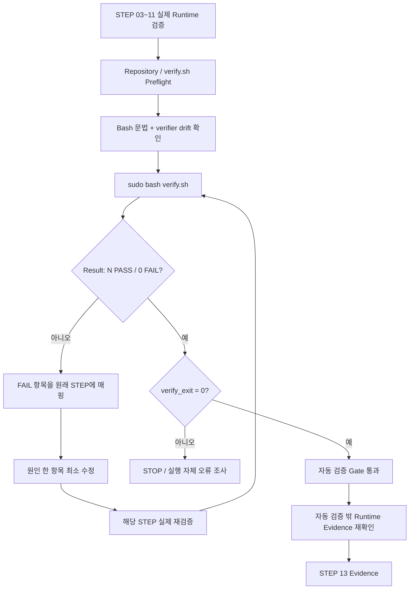
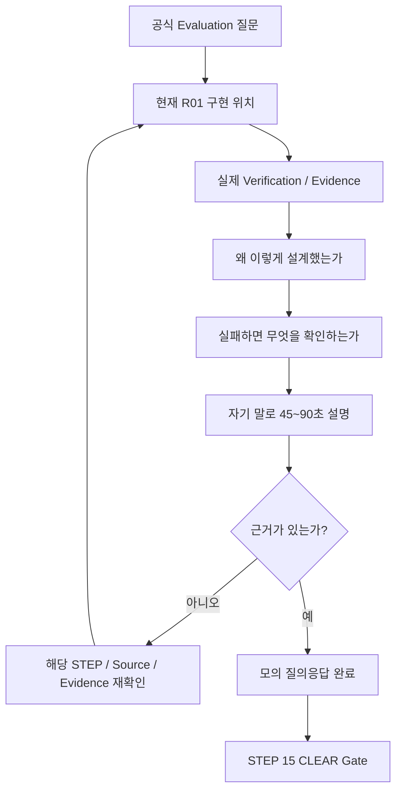

# B1-1 모듈 07 — 검증·증빙·평가 설명

> 범위: **STEP 12~14**  
> [← 모듈 06](06-CRON-FAILURE-WARNING.md) · [입문자 가이드 허브](../BEGINNER-GUIDE.md) · [다음: 모듈 08 →](08-FINAL-CLEAR.md)

## 📑 이 모듈 목차

- [STEP 12 — 통합 `verify.sh` 검증(Verification)](#step-12)
- [STEP 13 — 실제 증빙 자료(Evidence) 수집·검토·연결](#step-13)
- [STEP 14 — 평가 질의응답(Evaluation Q&A) 학습·모의 설명](#step-14)

---

<a id="step-12"></a>
## STEP 12 — 통합 `verify.sh` 검증(Verification)

## ① 왜 하는가

STEP 03~11에서는 SSH, UFW, 사용자·그룹·ACL, Agent, `monitor.sh`, 로그 회전, cron, 실패·Warning 분기를 각각 실제 Runtime 관점에서 나누어 검증합니다. 마지막에는 이 설정들이 서로 모순 없이 **동시에 현재 시스템에 남아 있는지** 한 번에 다시 확인해야 누락과 회귀를 줄일 수 있습니다.

R01의 `environment/verify.sh`는 이 목적의 **통합 자동 검증 스크립트(Integrated Verification Script)** 입니다. SSH 최종 적용 설정, UFW 정책, 역할별 유효 접근, non-secret 환경변수, Secret 파일의 메타데이터, `monitor.sh` 설치 정책, Agent/포트, 현재 로그 형식·개수, cron 등록, Git Secret-pattern 추적 여부를 `[PASS]`/`[FAIL]`로 모아서 확인합니다.

다만 `verify.sh`가 `0 FAIL`이라고 해서 B1-1 전체가 자동으로 CLEAR가 되는 것은 아닙니다. 공식 평가에는 실제 새 SSH 세션, Agent Boot Sequence 5단계 `[OK]`와 `Agent READY`, 실제 cron 자동 로그 증가, 10MB/10개 회전 동작, 실패/Warning 분기, 설명형 평가와 Evidence처럼 **이 스크립트 하나만으로 재현할 수 없는 항목**도 포함됩니다. 공식 Evaluation도 설정·Runtime·증빙·설명까지 함께 요구합니다.

> STEP 12의 성공 의미는 **“현재 `verify.sh`가 자동으로 확인하도록 설계된 항목에서 0 FAIL”**입니다. STEP 03~11의 실제 Runtime Evidence를 대체하지 않으며, STEP 13 Evidence와 STEP 14 Evaluation Q&A가 끝나기 전에는 B1-1을 CLEAR로 기록하지 않습니다.

## ② 무엇을 하는가

1. STEP 11까지 필요한 실제 Runtime 검증을 완료했는지 먼저 확인합니다.
2. B1-1 Repository root, 현재 Branch, working tree를 확인합니다.
3. 현재 실행할 `verify.sh`가 Repository의 추적 파일이며, 로컬/스테이징 변경으로 검증 기준 자체가 임의 수정되지 않았는지 확인합니다.
4. `verify.sh`의 Bash shebang과 문법을 실행 전에 정적으로 확인합니다.
5. `sudo bash .../verify.sh`를 실행하되 모든 `[PASS]`/`[FAIL]` 출력을 그대로 확인하고 실제 종료 코드를 보존합니다.
6. 최종 `Result: N PASS / 0 FAIL`과 `verify_exit=0`을 모두 확인합니다. `N`은 스크립트가 발전하면 달라질 수 있으므로 고정 숫자로 외우지 않습니다.
7. `[FAIL]`이 하나라도 있거나 종료 코드가 0이 아니면 STEP 13으로 넘어가지 않고, 실패 항목을 소유한 원래 STEP으로 돌아가 원인 하나만 수정합니다.
8. `verify.sh`의 자동 검증 범위와 **자동 검증 밖의 Runtime/Evidence 항목**을 구분합니다.
9. 실패를 없애기 위해 실제 시스템 대신 `verify.sh`의 판정문이나 출력만 수정하지 않습니다.
10. Secret은 이 STEP에서도 값 자체를 읽거나 출력하지 않습니다.

## ③ 이번 단계에서 알아야 할 용어

- **통합 검증(Integrated Verification)** — 여러 개별 설정을 하나의 검증 흐름에서 다시 확인해 현재 전체 상태의 일관성을 점검하는 과정입니다.
- **자동 검증 범위(Automated Verification Scope)** — 스크립트가 명령과 종료 코드로 직접 판정할 수 있도록 구현된 범위입니다.
- **유효 접근(Effective Access)** — 파일의 mode/ACL 모양이 아니라 실제 사용자 신분으로 최종 읽기·쓰기·실행이 가능한 상태입니다.
- **종료 코드(Exit Code)** — 프로그램이 호출자에게 성공 또는 실패 상태를 숫자로 전달하는 값입니다. 현재 `verify.sh`는 FAIL이 0개일 때만 `0`으로 끝납니다.
- **검증 기준선(Verification Baseline)** — 무엇을 PASS/FAIL로 판단할지 정한 현재 Repository의 기준 스크립트·공식 요구사항입니다.
- **검증 범위 밖 항목(Out-of-scope for Automated Verification)** — 자동 스크립트만으로는 현재 실제 수행 여부를 충분히 증명할 수 없어 별도 Runtime 관찰이나 Evidence가 필요한 항목입니다.
- **회귀(Regression)** — 이전 단계에서 정상으로 만들었던 상태가 이후 변경 때문에 다시 깨지는 현상입니다.
- **거짓 통과(False Pass)** — 실제 요구사항은 충족하지 않았는데 검사 기준이나 증거 해석이 잘못되어 PASS로 기록하는 상태입니다.

## ④ 필요한 핵심 개념



### `verify.sh`가 확인하는 것과 확인하지 못하는 것

현재 R01 `verify.sh`의 실제 소스를 기준으로 범위를 구분합니다.

| 구분 | 현재 `verify.sh`가 자동 확인 | 별도 STEP/Evidence가 필요한 부분 |
|---|---|---|
| SSH | `sshd -T`의 `port 20022`, `PermitRootLogin no`, TCP 20022 LISTEN | STEP 03의 **별도 macOS Terminal 실제 새 SSH 세션** |
| UFW | active, default deny incoming, 20022/15034 ALLOW, 추가 ALLOW IN 없음 | STEP 04 적용 후 실제 SSH 연결 유지 |
| 사용자/그룹 | 사용자·그룹 존재와 mission membership | 기존 계정 충돌 여부를 판단한 STEP 05 체크포인트 |
| 권한 | `runuser` 기반 공유/보안 디렉터리 유효 접근 | ACL 구조·Default ACL의 상세 Evidence |
| 환경/Secret | non-secret `env.sh` 값, Secret 존재·non-empty·owner/group/mode | Secret **실제 값은 읽지 않음**; STEP 07 Boot 동작으로 적합성 확인 |
| `monitor.sh` | owner/group/mode, Bash 문법, admin 실행 가능, test 읽기 차단 | STEP 08 정상 실행 `monitor_exit=0`과 실제 콘솔 Health/Resource 출력 |
| Agent | 프로세스 존재, non-root 여부, TCP 15034 LISTEN | STEP 07의 Boot 5/5, `Agent READY`, R01 user=`agent-admin`, 공식 `0.0.0.0:15034` 바인드 |
| 로그 | production `monitor.log` non-empty, 최신 라인 포맷 | STEP 08 실제 append 시점 연결 |
| 로그 보존 | 현재 `monitor.log*` 파일 수 `<=10` | STEP 09의 정확한 10MB 경계, `.1~.9` 이동, old `.9` 제거 동작 |
| cron | `agent-admin` crontab에 매분 `monitor.sh` 항목 존재 | STEP 10의 cron service active + **1~2분 실제 자동 로그 증가** |
| 실패/Warning | 통합 스크립트가 직접 재실행하지 않음 | STEP 11 Process/Port `exit 1`, CPU/MEM/DISK Warning-only `exit 0` |
| Secret 추적 | Git 추적 파일명에서 `.env`, `*.key`, `*.pem`, `secrets/` 패턴 검사 | 값 자체 검색·출력 금지; 실제 Evidence에 민감정보가 없는지도 별도 확인 |
| 평가 설명 | 자동 확인하지 않음 | STEP 14 Evaluation Q&A |
| Evidence 완결성 | 자동 확인하지 않음 | STEP 13 Evidence + STEP 15 CLEAR Gate |

따라서:

```text
verify.sh 0 FAIL
≠
B1-1 CLEAR

verify.sh 0 FAIL
+
STEP 03~11 실제 Runtime PASS
+
필수 Evidence
+
Evaluation 설명 가능
=
STEP 15 CLEAR 판단 후보
```

## ⑤ 실행할 명령어 또는 코드

### 📍 실행 위치(Context)

```text
Host       : OrbStack Ubuntu 24.04 또는 WSL2 Ubuntu 24.04
Terminal A : STEP 07부터 유지 중인 Agent foreground Terminal
Terminal B : Ubuntu Bash — 통합 검증 실행
Repository : $HOME/codyssey/codyssey-basic-b1-1-system-monitor
권한       : 일반 사용자 + verify.sh 실행에서 sudo
venv       : 해당 없음
전제       : STEP 11 실제 Runtime 분기 검증까지 PASS
```

### A. Repository와 `verify.sh` 실행 전 점검(Preflight)

```bash
cd "$HOME/codyssey/codyssey-basic-b1-1-system-monitor"
pwd
git branch --show-current
git status --short

VERIFY_SCRIPT="training/round-01-clear/environment/verify.sh"

test -f "$VERIFY_SCRIPT" \
  && echo '[PASS] verify.sh exists' \
  || echo '[STOP] verify.sh missing'

head -n 1 "$VERIFY_SCRIPT"

grep -qx '#!/usr/bin/env bash' "$VERIFY_SCRIPT" \
  && echo '[PASS] verify.sh Bash shebang confirmed' \
  || echo '[STOP] unexpected verify.sh shebang'

bash -n "$VERIFY_SCRIPT" \
  && echo '[PASS] verify.sh Bash syntax' \
  || echo '[STOP] verify.sh Bash syntax failed'
```

여기까지는 실제 시스템 설정을 변경하지 않는 정적 확인입니다.

### B. 검증 기준 스크립트의 로컬 변경 여부 확인

현재 `main` 기준 `verify.sh`에 working-tree 또는 staged 변경이 있는지 확인합니다.

```bash
if git diff --quiet -- "$VERIFY_SCRIPT" \
   && git diff --cached --quiet -- "$VERIFY_SCRIPT"; then
    echo '[PASS] verify.sh has no local or staged drift'
else
    echo '[STOP] verify.sh differs from the current checked-out Git baseline'
fi
```

`git status --short`에 다른 파일 변경이 있더라도 그 변경의 출처를 모르면 먼저 확인합니다. 특히 `verify.sh` 자체가 임의 수정된 상태라면 **그 수정본으로 시스템을 PASS 판정하지 않습니다.**

> `git reset --hard`, `git checkout --`, `git clean`으로 변경을 무조건 지우지 않습니다. 변경 이유를 확인하고 현재 R01 기준과 일치하는 검증 스크립트를 사용합니다.

### C. 통합 `verify.sh` 실제 실행

A/B가 정상이고 STEP 11까지 실제 Runtime PASS가 확인된 상태에서 실행합니다.

```bash
if sudo bash "$VERIFY_SCRIPT"; then
    VERIFY_RC=0
else
    VERIFY_RC=$?
fi

printf '[INFO] verify_exit=%s\n' "$VERIFY_RC"
```

실행 중 출력되는 `[PASS]`와 `[FAIL]`을 숨기거나 `grep`으로 PASS만 추려 보지 않습니다.

현재 `verify.sh`는 개별 검사 실패를 `FAIL` 카운터에 누적하고 마지막에:

```text
Result: <PASS개수> PASS / <FAIL개수> FAIL
```

을 출력합니다. 그리고 FAIL이 `0`일 때만 종료 코드 `0`을 반환하도록 구현되어 있습니다.

### D. 최종 판정

필수 성공 조건은 둘 다입니다.

```text
Result: N PASS / 0 FAIL
verify_exit=0
```

`N`은 현재 스크립트의 검사 항목 수에 따라 달라질 수 있으므로 특정 숫자를 문서에 하드코딩하지 않습니다.

아래 중 하나라도 발생하면 STOP입니다.

```text
[FAIL] 한 개 이상
Result의 FAIL > 0
verify_exit != 0
sudo/명령 자체 오류
검증 중 Secret 실제 값이 예상치 않게 화면에 노출됨
```

### E. FAIL을 원래 STEP으로 되돌려 진단

`verify.sh` 자체를 먼저 수정하지 않고 실패 문자열을 다음 소유 STEP에 매핑합니다.

| `verify.sh` 실패 범주 | 먼저 돌아갈 STEP |
|---|---|
| command missing | STEP 02 |
| SSH effective port / PermitRootLogin / TCP 20022 | STEP 03 |
| UFW active/default/rule/extra ALLOW | STEP 04 |
| user/group/membership/directory/effective access | STEP 05 |
| `env.sh` / Secret 존재·owner·group·mode | STEP 06 |
| Agent process / non-root / TCP 15034 | STEP 07 |
| `monitor.sh` owner/group/mode/syntax/access, `monitor.log` 포맷 | STEP 08 |
| monitor log file count | STEP 09 |
| `agent-admin` cron entry | STEP 10 |
| Process/Port failure 또는 Warning-only 동작 | STEP 11에서 별도 실제 검증 |
| tracked Secret-pattern file | 해당 Git 추적 경로의 **파일명/용도만** 먼저 확인 후 Secret 정책에 따라 최소 수정 |

예를 들어 UFW FAIL이 났다고 `verify.sh`에서 UFW 검사를 삭제하거나, Agent user 관련 FAIL이 났다고 PASS 문자열을 바꾸면 안 됩니다. **실제 Runtime 상태가 공식 Mission/R01 의도와 다른 것인지 먼저 확인**합니다.

반대로 `verify.sh`의 판정 조건 자체가 공식 Mission/Evaluation과 충돌한다고 의심되면 시스템을 억지로 바꾸지 않습니다. 공식 Source of Truth와 현재 검증 코드를 다시 비교한 뒤 verifier 자체의 문제인지 판정합니다.

### F. 자동 검증 Gate 통과 후 남은 항목 확인

`0 FAIL` 이후에도 STEP 13으로 넘어가기 전에 다음 실제 수행이 이미 끝났는지 확인합니다.

```text
STEP 03  실제 새 Mission SSH 세션
STEP 07  Boot Sequence 5/5 + Agent READY + 공식 bind
STEP 08  monitor 정상 실행 + exit 0 + 실제 append
STEP 09  10MB / 10개 실제 격리 회전
STEP 10  cron 1~2분 자동 monitor.log 증가
STEP 11  Process/Port failure exit 1 + Warning-only exit 0
```

하나라도 실제로 실행하지 않았다면:

```text
verify.sh = 0 FAIL
Documentation = 준비됨
하지만 해당 Runtime Evidence = 미완료
→ STEP 13으로 강행하지 않고 빠진 Runtime STEP 수행
```

입니다.

## ⑥ 명령어와 코드에 입문자가 이해할 수 있는 주석

### Repository / verifier Preflight

- `cd "$HOME/codyssey/codyssey-basic-b1-1-system-monitor"`
  - B1-1 Repository root로 이동하여 다른 clone이나 Host 공유 경로의 verifier를 실행하는 실수를 줄입니다.
- `pwd`
  - 실제 현재 작업 디렉터리를 확인합니다.
- `git branch --show-current`
  - 현재 체크아웃한 Branch를 확인합니다.
- `git status --short`
  - 로컬 수정·추가·삭제가 있는지 확인합니다. 예상 밖 변경을 자동 삭제하지 않습니다.
- `VERIFY_SCRIPT=".../verify.sh"`
  - 이후 모든 검사와 실행이 같은 verifier 파일을 가리키도록 경로를 변수로 고정합니다.
- `test -f "$VERIFY_SCRIPT"`
  - 검증 스크립트가 실제 일반 파일로 존재하는지 확인합니다.
- `head -n 1`
  - 첫 줄의 shebang을 눈으로 확인합니다.
- `grep -qx '#!/usr/bin/env bash'`
  - `-q`는 일치 내용을 출력하지 않고 종료 코드만 사용하고, `-x`는 줄 전체가 Bash shebang과 정확히 같은지 확인합니다.
- `bash -n "$VERIFY_SCRIPT"`
  - `verify.sh`의 검사 로직을 실제 수행하지 않고 Bash 문법만 검사합니다.

### verifier drift 확인

- `git diff --quiet -- "$VERIFY_SCRIPT"`
  - 현재 working tree의 `verify.sh`가 Git 기준본과 다른지 종료 코드로 확인합니다.
- `git diff --cached --quiet -- "$VERIFY_SCRIPT"`
  - staging area에 올라간 `verify.sh` 변경도 별도로 확인합니다.
- `&&`
  - 두 검사 모두 성공할 때만 “local/staged drift 없음”으로 판정합니다.
- 이 검사는 파일을 원복하지 않습니다. 단지 현재 검증 기준이 Git 기준본과 같은지 읽습니다.

### 실제 통합 검증 실행

- `sudo bash "$VERIFY_SCRIPT"`
  - `verify.sh`를 Bash로 실행합니다.
  - `sudo`가 필요한 이유는 `/etc/ssh`의 최종 적용 설정, UFW 상태, 다른 Mission 사용자 신분의 `runuser` 접근 시험, 시스템 경로의 파일 메타데이터처럼 일반 사용자만으로는 충분히 확인하기 어려운 항목이 있기 때문입니다.
  - `sudo`는 이 verifier에서 **설정을 변경하기 위한 권한이 아니라 시스템 수준 상태를 읽고 사용자별 접근을 시험하기 위한 권한**입니다.
- `if ...; then ... else ... fi`
  - verifier 성공/실패를 숨기지 않고 실제 종료 코드를 변수에 보존합니다.
- `VERIFY_RC=$?`
  - 실패한 `sudo bash verify.sh`의 종료 코드를 바로 저장합니다.
- `printf '[INFO] verify_exit=%s\n' ...`
  - 자동 검증 최종 종료 코드를 명시적으로 보여 줍니다.
- `|| true`를 verifier 전체 뒤에 붙이지 않습니다.
  - 그렇게 하면 실제 실패 종료 코드를 성공처럼 바꿔 버릴 수 있기 때문입니다.

### 현재 `verify.sh` 내부의 주요 읽기 검사

현재 구현은 다음 계열의 명령을 사용합니다.

```text
sshd -T
ufw status verbose
id / getent
runuser ... test
grep
stat
pgrep / ps
ss
tail
find
crontab -l
git ls-files
```

이들은 현재 상태·파일명·메타데이터·유효 접근을 확인합니다. `verify.sh`는 SSH/UFW/사용자/그룹/cron을 생성·수정·삭제하지 않고 `monitor.sh`도 실행하지 않습니다.

Secret 파일은:

```text
존재하는가?
비어 있지 않은가?
owner/group/mode가 맞는가?
```

만 확인하고 실제 Secret 내용은 읽어 출력하지 않습니다.

### `Result`와 종료 코드

현재 verifier는 각 성공에서 `PASS`를, 각 실패에서 `FAIL`을 증가시킵니다.

마지막의 의미는 다음과 같습니다.

```text
FAIL = 0
→ Result: N PASS / 0 FAIL
→ verifier exit 0

FAIL > 0
→ Result: ... / N FAIL
→ verifier non-zero exit
```

따라서 화면의 마지막 Summary와 Shell의 실제 종료 코드를 함께 확인하면, 단순히 중간 `[PASS]` 몇 줄만 보고 통과로 오판하는 것을 줄일 수 있습니다.

### 재실행 안전성

STEP 12의 `verify.sh` 자체는 시스템 설정을 변경하지 않는 검증 전용 스크립트이므로 **🟢 SAFE TO RERUN**입니다.

```text
pwd / git / test / head / grep / bash -n             → 🟢 SAFE TO RERUN
git diff --quiet                                      → 🟢 SAFE TO RERUN
sudo bash verify.sh                                   → 🟢 검증 전용, 시스템 설정 변경 없음
Result / exit code 확인                               → 🟢 SAFE TO RERUN
FAIL 원인 확인용 해당 STEP 조회 명령                 → 🟢/🟡/🔴 해당 STEP 기준 따름
FAIL을 고치기 위한 시스템 변경                       → 이 STEP에서 즉흥 수행하지 않음
```

STEP 10 cron이 이미 active라면 `verify.sh`와 무관하게 production `monitor.log`가 매분 자연스럽게 증가할 수 있습니다. 이것은 verifier가 로그를 쓴 것이 아닙니다.

> **STOP 기준:** STEP 11 실제 Runtime PASS 미확인, Repository/Branch가 예상과 다름, `verify.sh` missing, local/staged verifier drift의 출처 불명, Bash 문법 실패, 예상하지 않은 shebang, `sudo bash verify.sh` 실행 오류, `[FAIL]` 1개 이상, `Result` FAIL > 0, `verify_exit != 0`, 검증 중 민감정보 노출, verifier 판정과 공식 Source of Truth의 모순 의심 중 하나라도 있으면 STEP 13으로 진행하지 않습니다.

## ⑦ 예상되는 정상 결과

실제 숫자는 검사 항목 수에 따라 달라질 수 있습니다.

```text
[PASS] ...
[PASS] ...
...
Result: N PASS / 0 FAIL
[INFO] verify_exit=0
```

그리고 화면 전체에서 숨겨진 FAIL이 없어야 합니다.

`verify.sh`는 `set -u`를 사용하지만 개별 검사 실패를 즉시 중단시키는 방식이 아니라 FAIL을 누적하여 마지막 Summary까지 보여 주도록 작성되어 있으므로, **실패 항목이 있다면 먼저 그 항목을 모두 읽고 원래 STEP에 연결**합니다.

## ⑧ 그 결과가 의미하는 것

`Result: N PASS / 0 FAIL`과 `verify_exit=0`이 함께 확인되면 **현재 시점의 자동 검증 가능 범위**에서 B1-1 환경이 일관된 상태라는 강한 확인 신호가 됩니다.

하지만 의미를 넘겨 해석하면 안 됩니다.

```text
통합 자동 검증 PASS
= STEP 12 Verification Gate 후보

통합 자동 검증 PASS
≠ Boot Evidence
≠ 실제 새 SSH 접속 Evidence
≠ cron 자동 증가 Evidence
≠ 10MB/10개 실제 회전 Evidence
≠ 실패/Warning 분기 Evidence
≠ 설명형 평가 PASS
≠ B1-1 CLEAR
```

따라서 STEP 12 뒤의 올바른 흐름은:

```text
STEP 12  verify 0 FAIL
    ↓
STEP 13  실제 Evidence 정리
    ↓
STEP 14  Evaluation Q&A
    ↓
STEP 15  공식 Mission + Evaluation + Runtime + Evidence 종합 CLEAR Gate
```

입니다.

## ⑨ 자주 발생하는 오류와 해결 방법

- `verify.sh missing` → 다른 파일을 임의로 대신 실행하지 말고 현재 Branch/Repository와 Git 상태를 확인합니다.
- `bash -n` FAIL → Runtime 설정을 바꾸지 말고 verifier 자체의 문법 오류를 먼저 해결한 뒤 다시 정적 검증합니다.
- local/staged verifier drift → `reset --hard`부터 하지 말고 왜 바뀌었는지 확인합니다. 현재 R01 기준 변경인지 미완성 로컬 수정인지 구분합니다.
- `command missing` → STEP 02의 Common Base/Mission Package 분류로 돌아갑니다.
- SSH FAIL → STEP 03 effective config와 20022 LISTEN부터 다시 확인합니다. 새 SSH 연결 성공은 별도 Evidence로 유지합니다.
- UFW FAIL → STEP 04 규칙과 기본 정책을 확인합니다. UFW를 `reset`하여 통과시키지 않습니다.
- user/group/effective access FAIL → STEP 05 `id → stat → getfacl → runuser test` 순서로 최소 원인을 찾습니다.
- env/Secret FAIL → STEP 06 경로·owner/group/mode를 확인합니다. Secret 값을 `cat`하여 비교하지 않습니다.
- Agent/TCP FAIL → STEP 07 Terminal A와 Process/Port를 정상화합니다. Root 실행이나 출처 불명 PID 강제 종료로 우회하지 않습니다.
- monitor/log FAIL → STEP 08 Reference/Runtime 동일성, 권한, 실제 로그 포맷을 확인합니다.
- log count FAIL → STEP 09 회전 정책과 현재 production 로그 세대를 확인합니다. 실제 로그를 무작정 삭제해 개수만 줄이지 않습니다.
- cron entry FAIL → STEP 10 exact/related count와 기존 crontab 체크포인트를 확인합니다. 같은 줄을 반복 추가하지 않습니다.
- tracked Secret-pattern file FAIL → `git ls-files`에 나타난 **경로와 파일명**부터 확인하고 실제 민감정보 파일이면 추적 제거·Secret 교체 여부를 안전하게 판단합니다. 내용을 화면에 출력하지 않습니다.
- 중간에 PASS가 많고 FAIL 하나만 있음 → 전체 PASS가 아닙니다. 마지막 `0 FAIL` 전까지 STEP 13으로 가지 않습니다.
- `verify_exit=0`인데 과거 STEP 실제 Runtime을 하지 않음 → 자동 검증 범위만 통과한 것입니다. 빠진 STEP의 실제 Runtime을 수행한 뒤 Evidence를 만듭니다.
- verifier가 공식 요구보다 더 강하거나 다른 조건을 요구한다고 의심됨 → 시스템을 그 조건에 억지로 맞추기 전에 공식 Mission/Evaluation과 verifier 코드를 다시 비교합니다.
- Secret 또는 민감정보가 터미널에 예상치 않게 보임 → 해당 화면을 Evidence로 사용하지 않고 노출 경로를 먼저 제거합니다.

## ⑩ 완료 확인

- [ ] STEP 11 실제 Runtime 분기 검증까지 완료
- [ ] B1-1 Repository root 확인
- [ ] 현재 Branch / working tree 확인
- [ ] `verify.sh` 존재
- [ ] Bash shebang 확인
- [ ] `bash -n verify.sh` PASS
- [ ] `verify.sh` local/staged drift 없음 또는 변경 출처를 명확히 이해함
- [ ] `sudo bash verify.sh` 실제 실행
- [ ] 모든 `[PASS]`/`[FAIL]` 출력을 숨기지 않고 확인
- [ ] `Result: N PASS / 0 FAIL`
- [ ] `verify_exit=0`
- [ ] FAIL을 verifier 출력 수정으로 숨기지 않음
- [ ] Secret 실제 값을 읽거나 출력하지 않음
- [ ] STEP 03 새 SSH 세션 Evidence가 별도로 존재
- [ ] STEP 07 Boot 5/5 / Agent READY / 공식 bind Evidence가 별도로 존재
- [ ] STEP 09 10MB/10개 실제 회전 Evidence가 별도로 존재
- [ ] STEP 10 cron 1~2분 자동 증가 Evidence가 별도로 존재
- [ ] STEP 11 실패/Warning 분기 Evidence가 별도로 존재
- [ ] 자동 검증 PASS와 B1-1 CLEAR를 구분함
- [ ] **실제 `verify.sh` 실행 전에는 Verification PASS로 기록하지 않음**
- [ ] **STEP 13 Evidence 정리 전에는 Mission CLEAR로 기록하지 않음**

---

<a id="step-13"></a>
## STEP 13 — 실제 증빙 자료(Evidence) 수집·검토·연결

## ① 왜 하는가

공식 B1-1은 단순히 설정을 만들어 놓는 것으로 끝나지 않고, **실제로 수행한 설정과 실행 결과를 명령어 출력 또는 화면 캡처로 증빙**할 수 있어야 합니다. 공식 Mission도 SSH, 방화벽, 계정/그룹/ACL, Agent Boot 5단계와 `Agent READY`, `monitor.sh`, `monitor.log`, cron 자동 실행을 필수 증거 자료로 요구합니다.

STEP 03~12에서 수행한 검증 결과가 있더라도, 서로 다른 Terminal·시간·임시 시험 결과가 흩어져 있으면 평가자가 어떤 요구사항을 어떤 결과가 증명하는지 다시 추적하기 어렵습니다. 따라서 이 STEP에서는 **요구사항(Requirement) → 구현(Implementation) → 검증(Verification) → 증빙 자료(Evidence)** 연결을 기준으로 현재 R01의 실제 결과만 정리합니다.

> 문서에 적힌 예상 결과, 과거 Round 결과, Reference 예시, 다른 사람의 캡처는 현재 R01 Evidence가 아닙니다. 실제로 실행하지 않은 항목은 Evidence 완료로 표시하지 않습니다.

## ② 무엇을 하는가

1. STEP 12에서 실제 `verify.sh`가 `0 FAIL`이었는지 확인합니다.
2. 현재 Repository/Branch/Commit과 Evidence 수집 시각을 기록해 증빙의 출처(Provenance)를 남깁니다.
3. 기존 `evidence/README.md`와 `docs/requirements-mapping.md`의 R01~R22 연결표를 기준으로 필요한 증거 묶음을 확인합니다.
4. 바로 Repository에 파일을 만들기보다 `/tmp`의 고유 임시 디렉터리에 먼저 안전한 출력만 수집합니다.
5. Secret 값을 읽지 않는 명령만 사용합니다. 특히 `t_secret.key`는 `test -s`, `stat` 등 메타데이터만 기록합니다.
6. SSH, UFW, 사용자/그룹/ACL, Agent, monitor, 로그 회전, cron, 통합 검증 결과를 요구사항별 파일로 분리합니다.
7. 실제 새 SSH 세션, Agent Boot 5/5, cron Before/After처럼 자동 수집만으로 맥락이 부족한 항목은 해당 STEP에서 확보한 실제 Terminal 결과 또는 안전한 캡처를 사용합니다.
8. 수집 파일을 Repository에 복사하기 전에 Secret·Password·Token·Private Key·불필요한 개인정보/네트워크 정보가 없는지 사람이 직접 검토합니다.
9. 민감정보가 섞인 자료는 그대로 편집해 사실을 왜곡하지 말고, 더 안전한 명령으로 다시 수집하는 것을 우선합니다.
10. 검토가 끝난 파일만 `training/round-01-clear/evidence/` 아래 현재 R01 Evidence로 옮깁니다.
11. `docs/requirements-mapping.md`의 각 Requirement와 실제 Evidence 파일을 대응시킵니다.
12. Evidence가 모두 준비되어도 STEP 14 설명형 평가와 STEP 15 CLEAR Gate 전에는 Mission CLEAR로 기록하지 않습니다.

## ③ 이번 단계에서 알아야 할 용어

- **증빙 자료(Evidence)** — 요구사항을 실제로 수행했다는 사실을 제3자가 다시 확인할 수 있는 출력·로그·캡처입니다.
- **추적성(Traceability)** — 요구사항에서 구현, 검증, 증빙까지 연결이 끊기지 않는 성질입니다.
- **출처 정보(Provenance)** — 어떤 Repository/Commit/Runtime/시점에서 결과가 생성되었는지 보여 주는 정보입니다.
- **원시 증거(Raw Evidence)** — 실제 명령·프로그램이 생성한 원본 결과입니다.
- **민감정보 삭제(Redaction)** — 공개할 필요가 없는 민감한 일부 정보를 표시적으로 가리는 처리입니다. PASS/FAIL 자체를 바꾸는 용도로 사용하지 않습니다.
- **검증 가능한 증거(Verifiable Evidence)** — 다른 사람이 명령, 경로, 시각, 설정을 보고 요구사항 충족 여부를 판단할 수 있는 증거입니다.
- **증거 묶음(Evidence Bundle)** — 하나의 R01 실행에 대해 관련 증거 파일을 체계적으로 모은 집합입니다.
- **거짓 증거(False Evidence)** — 예상 출력, 수동으로 만든 성공 문자열, 다른 실행 결과를 현재 수행 결과처럼 사용하는 자료입니다.

## ④ 필요한 핵심 개념

```mermaid
flowchart TD
    A[공식 Mission / Evaluation] --> B[Requirement ID R01~R22]
    B --> C[실제 STEP 03~12 Runtime 결과]
    C --> D[/tmp 안전한 Evidence staging]
    D --> E[Secret / 민감정보 검토]
    E -->|안전| F[Repository Evidence bundle]
    E -->|위험| G[더 안전한 명령으로 재수집]
    G --> D
    F --> H[Requirement Mapping 연결]
    H --> I[Evidence completeness review]
    I --> J[STEP 14 Evaluation Q&A]
```

### Evidence의 세 가지 등급을 구분

```text
Reference / 예상 결과
→ 학습용 예시
→ Evidence 아님

실제 Runtime 출력이지만 요구사항과 연결되지 않음
→ 자료는 있으나 추적성 부족
→ Evidence 후보

현재 R01 실제 Runtime 출력
+ Requirement ID 연결
+ Secret 없음
+ 출처 정보 확인 가능
→ 제출 가능한 Evidence
```

### Redaction과 조작을 구분

공개할 필요가 없는 IP 주소 같은 정보가 포함되면 최소 범위로 가릴 수 있습니다. 그러나 다음 값은 요구사항 판정에 필요한 경우 임의 변경하지 않습니다.

```text
포트 번호
PASS / FAIL
exit code
사용자 역할(agent-admin/dev/test)
파일 owner/group/mode
Boot 5/5 상태
Agent READY 여부
cron 시간 흐름
로그 회전 파일 수와 크기
```

필수 증명값까지 가려야 할 정도로 원본 출력이 위험하면 기존 파일을 편집하는 것보다 **필요한 필드만 출력하는 안전한 명령으로 다시 수집**합니다.

## ⑤ 실행할 명령어 또는 코드

### 📍 실행 위치(Context)

```text
Host       : OrbStack Ubuntu 24.04 또는 WSL2 Ubuntu 24.04
Terminal A : 필요 시 STEP 07부터 유지 중인 Agent foreground Terminal
Terminal B : Ubuntu Bash — Evidence 수집·검토
Repository : $HOME/codyssey/codyssey-basic-b1-1-system-monitor
권한       : 일반 사용자 + 시스템 읽기에서 필요한 줄만 sudo
venv       : 해당 없음
전제       : STEP 12 실제 Verification Gate 통과
```

### A. Evidence 수집 전 Repository 출처 정보 확인

```bash
cd "$HOME/codyssey/codyssey-basic-b1-1-system-monitor"
pwd
git branch --show-current
git status --short
git rev-parse HEAD
date --iso-8601=seconds
```

`git status --short`에 예상하지 않은 변경이 있으면 Evidence를 수집하기 전에 그 출처를 확인합니다. 현재 실행과 무관한 미완성 변경이 섞인 상태를 제출 기준선으로 사용하지 않습니다.

### B. 이번 실행 전용 안전한 staging 디렉터리 만들기

```bash
EVIDENCE_STAGE="$(mktemp -d /tmp/b1-1-evidence.XXXXXX)"
printf '[INFO] evidence staging=%s\n' "$EVIDENCE_STAGE"

case "$EVIDENCE_STAGE" in
    /tmp/b1-1-evidence.*)
        echo '[PASS] staging path confirmed'
        ;;
    *)
        echo '[STOP] unexpected staging path'
        ;;
esac
```

Repository에 바로 저장하지 않고 `/tmp`에서 먼저 검토하므로 실수로 민감한 출력을 Git에 추가하는 위험을 줄입니다.

### C. Evidence context 파일 만들기

```bash
{
    printf 'captured_at=%s\n' "$(date --iso-8601=seconds)"
    printf 'repository=%s\n' "$(pwd)"
    printf 'branch=%s\n' "$(git branch --show-current)"
    printf 'commit=%s\n' "$(git rev-parse HEAD)"
    printf 'architecture=%s\n' "$(uname -m)"
    . /etc/os-release
    printf 'os=%s %s\n' "$NAME" "$VERSION_ID"
} > "$EVIDENCE_STAGE/00-context.txt"
```

이 파일은 현재 Evidence가 어떤 Runtime/Commit에서 생성되었는지 확인하는 출처 정보입니다. Secret은 포함하지 않습니다.

### D. SSH 설정 Evidence

Ubuntu Terminal에서:

```bash
{
    sudo sshd -T | grep -E '^(port|permitrootlogin) '
    sudo ss -lntp | grep ':20022'
} > "$EVIDENCE_STAGE/01-ssh-config.txt"
```

STEP 03에서 실제 `ssh -p 20022 ...`로 들어온 **새 SSH 세션 안에서** 다음처럼 서버 포트와 비-root 사용자만 안전하게 남길 수 있습니다.

```bash
{
    printf 'session_user=%s\n' "$(whoami)"
    printf '%s\n' "$SSH_CONNECTION" | awk '{print "server_port=" $4}'
} > "$EVIDENCE_STAGE/01-ssh-session.txt"
```

`SSH_CONNECTION` 전체를 저장하면 IP 주소가 함께 들어갈 수 있으므로 위 명령은 공식 판정에 필요한 서버 포트 필드만 남깁니다.

### E. UFW Evidence

```bash
{
    sudo ufw status verbose
    echo '--- numbered rules ---'
    sudo ufw status numbered
} > "$EVIDENCE_STAGE/02-firewall.txt"
```

이 출력에서 UFW active, 기본 incoming deny, `20022/tcp`, `15034/tcp`, 불필요한 추가 `ALLOW IN`이 없는지를 확인합니다.

### F. 사용자·그룹·ACL Evidence

```bash
{
    id agent-admin
    id agent-dev
    id agent-test
    getent group agent-common
    getent group agent-core
    echo '--- owner/group/mode ---'
    sudo stat -c '%U %G %a %n' \
      /opt/agent-app \
      /opt/agent-app/upload_files \
      /opt/agent-app/api_keys \
      /opt/agent-app/bin \
      /var/log/agent-app
    echo '--- ACL ---'
    sudo getfacl -p \
      /opt/agent-app/upload_files \
      /opt/agent-app/api_keys \
      /var/log/agent-app
} > "$EVIDENCE_STAGE/03-users-groups-permissions.txt"
```

역할별 실제 접근 결과도 별도 파일로 남깁니다.

```bash
{
    for u in agent-admin agent-dev agent-test; do
        sudo runuser -u "$u" -- test -r /opt/agent-app/upload_files \
          && sudo runuser -u "$u" -- test -w /opt/agent-app/upload_files \
          && echo "[PASS] $u upload_files read/write" \
          || echo "[FAIL] $u upload_files read/write"
    done

    for u in agent-admin agent-dev; do
        sudo runuser -u "$u" -- test -r /opt/agent-app/api_keys \
          && sudo runuser -u "$u" -- test -w /opt/agent-app/api_keys \
          && echo "[PASS] $u api_keys read/write" \
          || echo "[FAIL] $u api_keys read/write"
    done

    if ! sudo runuser -u agent-test -- test -r /opt/agent-app/api_keys \
       && ! sudo runuser -u agent-test -- test -w /opt/agent-app/api_keys; then
        echo '[PASS] agent-test blocked from api_keys'
    else
        echo '[FAIL] agent-test can access api_keys'
    fi
} > "$EVIDENCE_STAGE/04-effective-access.txt"
```

### G. 환경변수와 Secret 메타데이터 Evidence

비밀값이 없는 환경 설정은 필요한 필드만 출력합니다.

```bash
sudo runuser -u agent-admin -- bash -c '
  source /opt/agent-app/env.sh
  printf "AGENT_HOME=%s\n" "$AGENT_HOME"
  printf "AGENT_PORT=%s\n" "$AGENT_PORT"
  printf "AGENT_UPLOAD_DIR=%s\n" "$AGENT_UPLOAD_DIR"
  printf "AGENT_KEY_PATH=%s\n" "$AGENT_KEY_PATH"
  printf "AGENT_LOG_DIR=%s\n" "$AGENT_LOG_DIR"
' > "$EVIDENCE_STAGE/05-environment.txt"
```

Secret은 **값을 읽지 않고** 존재와 메타데이터만 남깁니다.

```bash
{
    sudo test -s /opt/agent-app/api_keys/t_secret.key \
      && echo '[PASS] Secret file exists and is non-empty; value not read' \
      || echo '[FAIL] Secret file missing or empty'
    sudo stat -c '%U %G %a %s %n' /opt/agent-app/api_keys/t_secret.key
} > "$EVIDENCE_STAGE/05-secret-metadata.txt"
```

다음과 같은 명령은 Evidence 수집에 사용하지 않습니다.

```text
cat /opt/agent-app/api_keys/t_secret.key
head /opt/agent-app/api_keys/t_secret.key
tail /opt/agent-app/api_keys/t_secret.key
grep <실제 Secret 값> ...
set -x
```

### H. Agent Boot / Process / TCP 15034 Evidence

Boot 5/5와 `Agent READY`는 **STEP 07에서 실제 제공 Agent를 실행했을 때의 출력**을 사용합니다. 제공 앱의 출력 형식이 바뀔 수 있으므로 Boot stdout 전체를 자동으로 파일에 redirect하기 전에 민감정보가 출력되지 않는지 먼저 확인합니다.

안전하게 별도로 재수집 가능한 Process/Port Evidence:

```bash
{
    pgrep -a -x agent-app
    ps -C agent-app -o user=,uid=,pid=,comm=,args=
    sudo ss -lntp | grep ':15034'
} > "$EVIDENCE_STAGE/06-agent-runtime.txt"
```

STEP 07의 실제 화면에서 다음이 모두 확인된 캡처 또는 Secret이 제거된 안전한 실제 출력이 필요합니다.

```text
Boot 1/5 ~ 5/5 모두 [OK]
Agent READY
실행 user = agent-admin
UID != 0
0.0.0.0:15034 LISTEN
```

문서의 예상 Boot 예시를 복사해 `06-agent-boot.txt`로 만들지 않습니다.

### I. monitor 정상 실행 / 로그 Evidence

STEP 08의 실제 정상 실행 결과를 사용합니다. 현재 상태를 안전하게 다시 확인할 때는 다음 메타데이터와 최신 로그를 수집할 수 있습니다.

```bash
{
    sudo stat -c '%U %G %a %s %n' /opt/agent-app/bin/monitor.sh
    sudo stat -c '%U %G %a %s %n' /var/log/agent-app/monitor.log
    sudo tail -n 3 /var/log/agent-app/monitor.log
} > "$EVIDENCE_STAGE/07-monitor-log.txt"
```

`monitor.sh` 정상 실행 콘솔의 Process/Port/CPU/MEM/DISK/Warning/`monitor_exit=0` 결과는 STEP 08에서 실제로 수행한 출력을 사용합니다.

### J. 로그 회전 Evidence

STEP 09의 격리 시험에서 확보한 실제 결과를 사용합니다. 최소한 다음 사실을 한 자료에서 추적할 수 있어야 합니다.

```text
실행 전 active + .1~.9 = 10개
active = R01 회전 경계값
old active → .1
old .1 → .2 ... old .8 → .9
old .9 제거
실행 후 active + .1~.9 = 10개
monitor.log.10 없음
새 active 공식 포맷
```

실제 production 로그를 10MB로 인위적으로 키워 Evidence를 다시 만들지 않습니다. STEP 09의 `/tmp` 격리 시험 결과가 현재 R01의 동작 Evidence입니다.

### K. cron Evidence — 전체 crontab 공개 금지

전체 사용자 crontab을 그대로 저장하지 않고 B1-1 관련 줄만 수집합니다.

```bash
{
    sudo systemctl is-active cron
    sudo crontab -u agent-admin -l 2>/dev/null \
      | grep -E '(/opt/agent-app/env\.sh|/opt/agent-app/bin/monitor\.sh)' || true
} > "$EVIDENCE_STAGE/10-cron-config.txt"
```

실제 자동 실행 Evidence는 STEP 10에서 확보한 다음 세 요소를 함께 사용합니다.

```text
관찰 시작 Before 시각/monitor.log 최신 상태
1~2분 동안 수동 monitor 실행 없음
After 시각/새 monitor.log 라인 + 공식 포맷
```

crontab에 미션 외 민감한 명령이 있을 수 있으므로 전체 `crontab -l` 출력 파일을 공개 저장하지 않습니다.

### L. 실패 경로와 Warning-only Evidence

STEP 11의 격리 시험 실제 출력에서 다음을 분리해 보관합니다.

```text
Process failure
→ [FAIL] 확인
→ exit=1
→ 실제 Agent/15034 유지

Port failure
→ Process [OK]
→ 시험 포트 [FAIL]
→ exit=1
→ 실제 15034 유지

CPU/MEM/DISK Warning-only
→ 세 Warning 확인
→ 격리 monitor.log append
→ exit=0
```

실제 Agent를 다시 끄거나 UFW를 비활성화하여 Evidence를 재생성하지 않습니다.

### M. 통합 `verify.sh` Evidence

STEP 12의 실제 전체 출력과 종료 코드를 사용합니다. 현재 상태를 다시 검증할 필요가 있다면 다음처럼 실행하되 실제 모든 PASS/FAIL을 그대로 봅니다.

```bash
VERIFY_SCRIPT="training/round-01-clear/environment/verify.sh"

if sudo bash "$VERIFY_SCRIPT" \
  | tee "$EVIDENCE_STAGE/12-verify.txt"; then
    VERIFY_RC=0
else
    VERIFY_RC=${PIPESTATUS[0]}
fi

printf 'verify_exit=%s\n' "$VERIFY_RC" \
  | tee -a "$EVIDENCE_STAGE/12-verify.txt"
```

> `tee`를 사용하면 화면에서 실제 검증을 보면서 파일에도 저장합니다. `PIPESTATUS[0]`는 pipe 왼쪽의 `verify.sh` 실제 종료 코드를 보존합니다. 이 결과는 **`Result: N PASS / 0 FAIL`과 `verify_exit=0`이 둘 다 실제로 확인된 경우에만** STEP 12 PASS Evidence가 됩니다.

### N. staging 파일 목록과 민감정보 수동 검토

먼저 파일명과 크기만 봅니다.

```bash
find "$EVIDENCE_STAGE" -maxdepth 1 -type f \
  -printf '%f %s bytes\n' | sort
```

그 다음 **자신이 방금 안전한 명령으로 만든 파일만** 하나씩 읽어 검토합니다. 파일 출처가 불명확하거나 Boot 캡처처럼 민감정보 가능성이 있는 자료는 자동 일괄 `cat`하지 않습니다.

검토 기준:

```text
[ ] Secret 값 없음
[ ] Password 없음
[ ] API Key / Access Token / Private Key 없음
[ ] 불필요한 IP/개인정보 없음
[ ] PASS/FAIL/exit code를 임의 수정하지 않음
[ ] 실제 현재 R01 결과임
[ ] Requirement와 연결 가능함
```

민감정보가 발견되면 해당 파일을 Git에 옮기지 않습니다. 필요한 증명 필드만 출력하는 더 안전한 명령으로 다시 수집합니다.

### O. 검토 완료한 파일만 Repository Evidence로 이동

현재 실행용 디렉터리 이름을 만듭니다.

```bash
EVIDENCE_RUN="training/round-01-clear/evidence/r01-$(date +%Y%m%d-%H%M%S)"
mkdir -p "$EVIDENCE_RUN"
printf '[INFO] repository evidence dir=%s\n' "$EVIDENCE_RUN"
```

**검토가 끝난 파일만** 한 개씩 복사합니다. 예:

```bash
cp "$EVIDENCE_STAGE/00-context.txt" "$EVIDENCE_RUN/"
cp "$EVIDENCE_STAGE/01-ssh-config.txt" "$EVIDENCE_RUN/"
cp "$EVIDENCE_STAGE/02-firewall.txt" "$EVIDENCE_RUN/"
```

위 세 줄은 예시입니다. staging에 있다는 이유만으로 `cp "$EVIDENCE_STAGE"/* ...`처럼 전부 일괄 복사하지 않습니다.

복사 후 Git이 추가 대상으로 보는 파일명을 확인합니다.

```bash
git status --short "$EVIDENCE_RUN"
git diff --no-index /dev/null "$EVIDENCE_RUN/00-context.txt" || true
```

실제 Evidence를 Git에 commit하기 전에는 파일 내용을 다시 검토하고, 현재 Repository의 제출 정책에 따라 필요한 자료만 추적합니다.

### P. Requirement Mapping과 Evidence 연결 확인

현재 R01 매핑 문서를 읽습니다.

```bash
sed -n '1,260p' training/round-01-clear/docs/requirements-mapping.md
```

최소 연결 예:

```text
R01~R02 → SSH config + 실제 새 session
R03     → UFW
R04~R06 → users/groups/ACL/effective access
R07~R08 → non-secret env + Secret metadata
R09~R11 → Agent process + Boot 5/5 + READY + 15034
R12~R18 → monitor 권한/정상/실패/Warning/log
R19     → 10MB/10개 격리 회전
R20     → agent-admin cron + 실제 1~2분 자동 증가
R21     → verify.sh 0 FAIL + exit 0
R22     → Secret 미노출 검토
```

Evidence 파일이 존재해도 해당 Requirement를 실제로 증명하지 못하면 “완료”로 표시하지 않습니다.

### Q. staging 정리 — Evidence 복사·검토 완료 후

필요한 자료가 안전하게 Repository 또는 별도 제출 위치에 보존되었고 더 이상 staging이 필요하지 않을 때만 정리합니다.

```bash
case "${EVIDENCE_STAGE:-}" in
    /tmp/b1-1-evidence.*)
        find "$EVIDENCE_STAGE" -mindepth 1 -maxdepth 1 -type f -delete
        rmdir "$EVIDENCE_STAGE"
        ;;
    *)
        echo '[STOP] unexpected staging path; nothing deleted'
        ;;
esac
```

`rmdir`이 실패하면 예상하지 않은 파일이나 하위 디렉터리가 있다는 뜻일 수 있으므로 `rm -rf`로 강제 삭제하지 않습니다.

## ⑥ 명령어와 코드에 입문자가 이해할 수 있는 주석

### 출처 정보

- `git rev-parse HEAD`
  - Evidence가 어떤 Git Commit 기준에서 수집되었는지 전체 SHA를 출력합니다.
- `date --iso-8601=seconds`
  - 시간대(offset)가 포함된 수집 시각을 기록합니다.
- `/etc/os-release`
  - Ubuntu 배포판 이름/버전 출처를 시스템 표준 파일에서 읽습니다.

### staging

- `mktemp -d /tmp/b1-1-evidence.XXXXXX`
  - 매 실행마다 고유한 임시 디렉터리를 만들어 기존 Evidence와 섞이지 않게 합니다.
- `case ... /tmp/b1-1-evidence.*)`
  - 생성·삭제 전에 경로가 이번 STEP의 예상 패턴인지 확인합니다.
- Repository에 바로 쓰지 않는 이유
  - 수집 직후 아직 Secret/민감정보 검토가 끝나지 않은 파일을 Git working tree에 두지 않기 위해서입니다.

### 출력 저장

- `{ ... } > file`
  - 중괄호 안 여러 명령의 stdout을 하나의 Evidence 파일에 새로 기록합니다.
- `>`
  - 대상 파일을 새로 만들거나 덮어씁니다. staging은 이번 실행의 새 고유 디렉터리이므로 의도된 동작입니다.
- `tee file`
  - 명령 결과를 화면과 파일에 동시에 보냅니다. STEP 12처럼 전체 PASS/FAIL을 눈으로 보면서 저장할 때 사용합니다.
- `${PIPESTATUS[0]}`
  - pipe를 사용했을 때 가장 왼쪽 `verify.sh`의 실제 종료 코드를 확인합니다. 단순 `$?`만 보면 `tee`의 종료 코드가 될 수 있습니다.

### Secret-safe Evidence

- `test -s t_secret.key`
  - Secret 파일이 존재하고 비어 있지 않은지만 확인합니다.
- `stat`
  - owner/group/mode/크기 같은 메타데이터만 출력합니다.
- Secret 파일에 `cat`, `head`, `tail`, 값 검색용 `grep`을 사용하지 않는 이유
  - 증빙에 필요한 것은 존재·권한·실제 Agent Boot 결과이지 비밀값 자체가 아니기 때문입니다.

### SSH session 최소 정보

- `SSH_CONNECTION`
  - 실제 SSH session의 양쪽 IP/포트가 포함된 환경변수입니다.
- `awk '{print "server_port=" $4}'`
  - 전체 연결 문자열 대신 서버 측 포트만 추출하여 불필요한 IP 노출을 줄입니다.

### 역할별 접근 검증

- `runuser -u 사용자 -- test -r/-w`
  - Root가 파일 내용을 대신 읽는 것이 아니라 실제 역할 사용자 신분으로 읽기·쓰기 가능 여부만 확인합니다.
- `[PASS]`/`[FAIL]`
  - 실제 종료 코드에 따라 생성된 결과를 그대로 저장합니다. 실패를 성공 문자열로 수동 수정하지 않습니다.

### Repository Evidence 복사

- `mkdir -p "$EVIDENCE_RUN"`
  - 현재 R01 실행용 Evidence 디렉터리를 만듭니다.
- `cp source destination`
  - **검토 완료한 파일 하나씩** Repository Evidence 위치로 복사합니다.
- wildcard 전체 복사를 피하는 이유
  - 검토하지 않은 민감 파일이 함께 Git working tree로 들어가는 것을 막기 위해서입니다.
- `git status --short "$EVIDENCE_RUN"`
  - Git이 어떤 Evidence 파일을 새 파일/변경 파일로 보는지 확인합니다.

### 안전한 staging 정리

- `find ... -type f -delete`
  - 예상 staging 바로 아래의 일반 파일만 제거합니다.
- `rmdir`
  - 디렉터리가 비어 있을 때만 제거합니다. 알 수 없는 내용이 있으면 강제로 지우지 않습니다.

### 재실행 안전성

STEP 13은 시스템 설정 자체는 대부분 읽기만 하지만 Evidence 파일을 생성·복사·삭제할 수 있습니다.

```text
pwd / git / date / stat / id / getent / ss / ufw 조회         → 🟢 SAFE TO RERUN
mktemp staging 생성                                            → 🟢 새 고유 경로 생성
staging에 Evidence 출력 저장                                   → 🟢 고유 경로 안에서는 안전
verify.sh 재실행                                               → 🟢 검증 전용, 단 실제 Runtime 전제 확인
Repository Evidence 디렉터리 생성                              → 🟡 중복 실행 디렉터리 확인
검토한 파일 개별 cp                                            → 🟡 대상 파일 확인 후
Evidence 파일 대량 wildcard 복사                               → 🚫 사용하지 않음
Secret 내용 출력                                               → 🚫 사용하지 않음
PASS/FAIL/exit code 수동 수정                                  → 🚫 Evidence 조작
staging find -delete / rmdir                                   → 🔴 필요한 Evidence 보존 확인 후
```

> **STOP 기준:** STEP 12 실제 `0 FAIL` 미확인, 현재 Repository/Commit 출처 불명, 실제 새 SSH 세션 Evidence 없음, Boot 5/5/READY 실제 결과 없음, STEP 09 회전 시험 미실행, STEP 10 실제 자동 증가 미확인, STEP 11 실패/Warning 분기 미실행, staging에 Secret/Token/Password/Private Key 발견, Requirement와 연결할 수 없는 자료를 PASS Evidence로 사용하려 함 중 하나라도 있으면 STEP 14로 진행하지 않습니다.

## ⑦ 예상되는 정상 결과

Evidence는 최소 다음 범주를 실제 현재 R01 결과로 설명할 수 있어야 합니다.

```text
00 Context / Provenance
01 SSH effective config + 실제 20022 새 session
02 UFW active + 20022/15034 only
03~04 users/groups/permissions/ACL/effective access
05 non-secret environment + Secret metadata only
06 Agent Boot 5/5 + READY + process user + 15034
07 monitor 정상 실행 + monitor.log
08 Process/Port failure exit 1
09 CPU/MEM/DISK Warning-only + log + exit 0
10 10MB/10개 rotation 실제 격리 시험
11 agent-admin cron + 실제 1~2분 자동 log 증가
12 verify.sh Result N PASS / 0 FAIL + exit 0
```

파일 번호는 Repository `evidence/README.md`의 권장 묶음과 함께 사용하며, 실제 제출 형식에 맞게 파일명은 조정할 수 있습니다. 핵심은 **실제 Requirement를 빠짐없이 다시 확인할 수 있는가**입니다.

## ⑧ 그 결과가 의미하는 것

STEP 13이 실제로 완료되면 B1-1의 설정과 실행 결과가 단순한 개인 경험이 아니라 다음 구조로 외부 검토 가능한 상태가 됩니다.

```text
공식 Requirement
        ↓
현재 R01 구현
        ↓
실제 Runtime 검증
        ↓
Secret 없는 Evidence
        ↓
Requirement Mapping
```

그러나 Evidence Complete만으로 설명형 Evaluation까지 자동 통과하는 것은 아닙니다. 다음 STEP 14에서 `pgrep`/`ss` 선택 이유, CPU/MEM/DISK 파싱, 최소 권한, `>`와 `>>`, 장애 대응 등을 자신의 실제 Runtime과 연결해 설명할 수 있어야 합니다.

## ⑨ 자주 발생하는 오류와 해결 방법

- 예상 출력이 보기 좋아 실제 출력 대신 사용됨 → 폐기하고 현재 R01 Runtime에서 다시 수집합니다.
- 과거 Round 파일을 재사용함 → `00-context.txt`의 Commit/수집 시각과 현재 실행을 비교하고 현재 R01 결과로 다시 만듭니다.
- Secret 파일을 `cat`한 화면이 있음 → 해당 자료는 제출하지 말고 `test -s`/`stat`로 다시 수집합니다.
- Boot 화면에 민감정보가 보임 → 그 캡처를 사용하지 않고 민감정보가 없는 안전한 실행/캡처 방법을 선택합니다.
- 전체 `crontab -l`을 저장함 → 미션 관련 줄만 `grep`으로 다시 수집합니다.
- SSH Evidence에 IP 주소가 불필요하게 노출됨 → 실제 session에서 서버 포트만 추출하는 명령으로 다시 수집합니다.
- UFW 캡처가 일부 잘려 다른 ALLOW IN 존재 여부를 판단할 수 없음 → 전체 `ufw status verbose/numbered` 결과를 다시 수집합니다.
- ACL은 보이지만 실제 접근 가능 여부가 없음 → `runuser ... test -r/-w` 결과를 추가합니다.
- `Agent READY`만 있고 15034 Evidence가 없음 → `ps`와 `ss`를 별도 수집합니다.
- `15034`만 있고 Boot 5/5가 없음 → 포트만으로 Boot 성공을 추측하지 말고 STEP 07 실제 Boot 결과를 확보합니다.
- monitor.log 최신 라인만 있고 수동/cron 구분이 없음 → STEP 10 Before/After 시간 흐름을 함께 사용합니다.
- 회전 후 파일 수만 있고 이동 순서가 없음 → STEP 09 marker 결과로 old active/.1~.9 이동을 증명합니다.
- verify `0 FAIL`만 있음 → STEP 03~11 별도 Runtime Evidence를 생략하지 않습니다.
- Evidence 파일을 수정하여 FAIL을 지움 → 증거 조작입니다. 원인을 수정하고 실제 검증을 다시 실행합니다.
- Repository에 복사 후 민감정보 발견 → commit하지 말고 해당 파일을 안전하게 제거한 뒤 더 안전한 명령으로 재수집합니다. 이미 원격에 올라갔다면 단순 삭제 commit만으로 민감정보가 사라졌다고 가정하지 말고 Secret 교체와 Git history 대응을 별도로 검토합니다.

## ⑩ 완료 확인

- [ ] STEP 12 실제 `Result: N PASS / 0 FAIL` + `verify_exit=0` 확인
- [ ] 현재 Repository / Branch / Commit / 수집 시각 기록
- [ ] Evidence staging을 `/tmp/b1-1-evidence.*` 고유 경로로 생성
- [ ] 공식 Mission의 필수 증거 자료 항목과 R01~R22 Mapping 확인
- [ ] SSH effective config Evidence
- [ ] 실제 `20022` 새 SSH session Evidence
- [ ] UFW 전체 정책 Evidence
- [ ] 사용자 3개 / 그룹 2개 Evidence
- [ ] 디렉터리 owner/group/mode/ACL Evidence
- [ ] 역할별 effective access Evidence
- [ ] non-secret 환경변수 Evidence
- [ ] Secret은 존재/non-empty/owner/group/mode만 Evidence
- [ ] Secret 값 출력 없음
- [ ] Agent Boot 1/5~5/5 실제 `[OK]` Evidence
- [ ] `Agent READY` 실제 Evidence
- [ ] Agent user=`agent-admin`, UID != 0 Evidence
- [ ] TCP `0.0.0.0:15034` Evidence
- [ ] monitor 정상 실행 / `exit=0` Evidence
- [ ] CPU/MEM/DISK 실제 수집 Evidence
- [ ] 공식 monitor.log 포맷 Evidence
- [ ] Process failure `exit=1` Evidence
- [ ] Port failure `exit=1` Evidence
- [ ] CPU/MEM/DISK Warning-only `exit=0` Evidence
- [ ] 10MB/10개 실제 격리 회전 Evidence
- [ ] agent-admin cron exact/related 1개 Evidence
- [ ] 실제 1~2분 cron 자동 monitor.log 증가 Evidence
- [ ] `verify.sh` 전체 결과 `0 FAIL` Evidence
- [ ] Requirement Mapping과 Evidence 파일 연결
- [ ] Evidence 파일에 Password/API Key/Token/Private Key 없음
- [ ] 불필요한 개인정보/네트워크 정보 최소화
- [ ] PASS/FAIL/exit code를 수동 조작하지 않음
- [ ] Repository로 옮기기 전에 파일별 수동 검토 완료
- [ ] staging 정리는 필요한 자료 보존 후 예상 경로에서만 수행
- [ ] **실제 Evidence가 채워지기 전에는 Evidence Complete로 기록하지 않음**
- [ ] **STEP 14 Evaluation Q&A 전에는 B1-1 CLEAR로 기록하지 않음**

---

<a id="step-14"></a>
## STEP 14 — 평가 질의응답(Evaluation Q&A) 학습·모의 설명

## ① 왜 하는가

공식 B1-1 평가는 설정이 존재하고 프로그램이 동작하는지만 확인하지 않습니다. **왜 그렇게 구현했는지, 어떤 명령으로 확인했는지, 장애가 발생하면 어떤 순서로 진단할지 자기 말로 설명할 수 있는지**도 평가합니다.

STEP 03~13에서 실제 실행 환경(Runtime), 검증(Verification), 증빙 자료(Evidence)를 준비했다면 STEP 14에서는 그 결과를 평가 질문과 연결합니다. 목표는 기준 답안을 외우는 것이 아니라 다음 네 요소를 한 답변 안에서 연결하는 것입니다.

```text
공식 요구사항
→ 현재 R01의 실제 구현
→ 실제 검증/Evidence
→ 설계 이유 또는 장애 대응
```

`docs/evaluation-qa.md`는 설명을 준비하기 위한 **기준 답안(Reference Answer)** 입니다. 실제 자신의 환경에서 확인하지 않은 PID, 시간, 상태, 성공 결과를 만들어 내는 자료가 아닙니다.

> STEP 14의 성공 의미는 **공식 Evaluation의 설명형 항목을 현재 R01 구현과 실제 Evidence를 근거로 자기 말로 설명할 수 있는 상태**입니다. 아직 실제 Runtime/Evidence가 없다면 답안 연습은 할 수 있지만 평가 준비 완료로 표시하지 않습니다.

## ② 무엇을 하는가

1. 공식 `b1-1-evaluation.md`를 다시 읽어 평가 항목 1~4의 범위를 확인합니다.
2. `docs/evaluation-qa.md`의 기준 답안을 읽되 그대로 암기하지 않습니다.
3. 평가 항목 2~4의 공식 설명형 질문 11개를 현재 R01 구현과 연결합니다.
4. 방화벽, 유효 접근, `verify.sh`처럼 평가 답변을 보강하는 추가 질문 3개도 함께 연습합니다.
5. 각 질문에 **요구사항 → 구현 → 검증/Evidence → 이유/장애 대응** 순서로 답합니다.
6. 실제 PID·시간·로그 수치처럼 실행마다 달라지는 값은 자신의 현재 Evidence를 보고 설명합니다.
7. 답변 중 모르는 부분이 나오면 기준 답안을 더 꾸며 말하지 않고 해당 STEP 또는 실제 소스 코드로 돌아가 확인합니다.
8. Secret, Password, API Key, Token, Private Key 값은 평가 설명에서도 말하거나 화면에 보여 주지 않습니다.
9. 내부 모의평가 점수는 학습용으로만 사용하고 공식 평가 점수나 통과 기준으로 오해하지 않습니다.
10. 공식 설명형 질문 전부를 근거와 함께 설명할 수 있을 때 STEP 15 CLEAR Gate로 이동합니다.

## ③ 이번 단계에서 알아야 할 용어

- **설명형 평가(Explanation-based Evaluation)** — 결과뿐 아니라 구현 이유, 명령 선택, 운영 원리, 장애 대응을 말로 설명하는 평가입니다.
- **근거 기반 답변(Evidence-grounded Answer)** — 추측이나 암기가 아니라 실제 코드·설정·명령 출력·Evidence를 근거로 하는 답변입니다.
- **위협 모델(Threat Model)** — 무엇을 보호하고 어떤 공격 또는 오용을 줄이려는지 구조적으로 설명하는 관점입니다.
- **최소 권한(Least Privilege)** — 사용자와 프로세스에 업무 수행에 필요한 최소 권한만 부여하는 원칙입니다.
- **오탐(False Positive)** — 실제 대상이 아닌데도 조건에 걸려 정상 대상처럼 잘못 판정하는 현상입니다.
- **상태 점검 실패(Health Failure)** — 핵심 서비스가 정상 제공되지 않아 성공으로 계속 처리하면 안 되는 상태입니다.
- **경고 전용(Warning-only)** — 이상 징후는 알리지만 관제를 계속 수행하여 상태와 추세를 기록하는 처리 방식입니다.
- **파싱(Parsing)** — 명령 출력에서 필요한 값을 규칙에 따라 추출해 프로그램이 사용할 수 있는 형태로 만드는 과정입니다.
- **로그 회전(Log Rotation)** — 로그가 무한히 커지지 않도록 크기·개수·기간 기준으로 이전 로그를 순환 보존하는 방식입니다.
- **장애 대응(Incident Response)** — 장애를 확인하고 영향을 줄이며 원인을 찾아 복구·재발 방지로 이어가는 절차입니다.

## ④ 필요한 핵심 개념



### 평가 답변의 기본 4층 구조

모든 질문을 기계적으로 같은 문장으로 말할 필요는 없지만, 다음 네 층을 의식하면 답변이 단순 암기에서 실제 엔지니어링 설명으로 바뀝니다.

```text
1층 — 요구사항
무엇을 만족해야 하는가?

2층 — 구현
현재 R01에서는 어떤 파일·사용자·그룹·명령·정책으로 구현했는가?

3층 — 검증/Evidence
실제로 어떤 명령과 결과로 확인했는가?

4층 — 이유/대응
왜 그 방식을 선택했고, 실패하면 어떤 순서로 진단하는가?
```

### 공식 Evaluation과 `evaluation-qa.md` 연결

| 공식 평가 | 공식 질문 핵심 | 기준 답안 연결 | 반드시 자신의 결과와 연결할 부분 |
|---|---|---|---|
| 항목 1 | SSH/UFW/계정/Agent/monitor/log/cron/회전 실제 동작 | Q1~Q14 전반 | STEP 13 실제 Evidence |
| 항목 2-1 | `pgrep`/`ps`, `ss` 선택 이유 | Q5 | 실제 Process/PID, TCP 15034 확인 방식 |
| 항목 2-2 | CPU/MEM/DISK 추출·파싱, 로그 포맷 | Q6 | 현재 `monitor.sh`와 실제 로그 한 줄 |
| 항목 2-3 | `agent-dev` 소유, `agent-admin` 실행, cron 권한 | Q4 | 실제 owner/group/mode와 그룹 membership |
| 항목 2-4 | 10MB/10개 로그 관리 | Q9 | STEP 09 실제 회전 결과 |
| 항목 3-1 | SSH 포트/Root 차단의 위협 모델 | Q1 | STEP 03 실제 effective config와 새 연결 |
| 항목 3-2 | `agent-core` 제한과 최소 권한 | Q3, Q13 | 실제 ACL/effective access |
| 항목 3-3 | Health Failure와 Warning 분리 | Q7 | STEP 11 실제 exit code와 Warning 결과 |
| 항목 3-4 | `>`와 `>>` 차이 | Q8 | `monitor.log` append 구현 |
| 항목 4-1 | Nginx 등 다른 서비스로 확장 | Q11 | Process/Port/Log/Threshold의 변경 지점 |
| 항목 4-2 | Process는 있으나 Port가 없음 | Q10 | 실제 진단 순서와 `ss` 사용 |
| 항목 4-3 | 로그 폭증·Disk Full 위험 대응 | Q12 | 단기/중기 대응과 Evidence 보존 |
| 보강 | 20022/15034만 허용하는 이유 | Q2 | STEP 04 실제 UFW 정책 |
| 보강 | `ls -l` 외 실제 사용자 접근 검사 이유 | Q13 | `runuser ... test` 결과 |
| 보강 | `verify.sh`가 sudo지만 검증 전용인 이유 | Q14 | STEP 12의 읽기 전용 검증 범위 |

공식 질문의 문구와 판단 기준은 `b1-1-evaluation.md`가 우선합니다. `evaluation-qa.md`는 이를 설명하기 위한 R01 학습 보조 자료입니다.

## ⑤ 실행할 명령어 또는 코드

### 📍 실행 위치(Context)

```text
Host       : OrbStack Ubuntu 24.04 또는 WSL2 Ubuntu 24.04
Terminal   : Ubuntu Bash
Repository : $HOME/codyssey/codyssey-basic-b1-1-system-monitor
권한       : 일반 사용자
venv       : 해당 없음
전제       : STEP 13의 실제 Evidence가 준비되어 있으면 가장 좋음
```

STEP 14 자체는 시스템 설정을 변경하지 않습니다. 평가 문서·기준 답안·현재 구현·Evidence를 읽고 연결하는 단계입니다.

### A. Repository와 학습 자료 확인

```bash
cd "$HOME/codyssey/codyssey-basic-b1-1-system-monitor"
pwd
git branch --show-current
git status --short

EVAL_FILE="b1-1-evaluation.md"
QA_FILE="training/round-01-clear/docs/evaluation-qa.md"
MAP_FILE="training/round-01-clear/docs/requirements-mapping.md"
EVIDENCE_DIR="training/round-01-clear/evidence"

test -f "$EVAL_FILE" && echo '[PASS] official evaluation markdown exists' || echo '[STOP] evaluation markdown missing'
test -f "$QA_FILE" && echo '[PASS] evaluation Q&A reference exists' || echo '[STOP] evaluation Q&A reference missing'
test -f "$MAP_FILE" && echo '[PASS] requirement mapping exists' || echo '[STOP] requirement mapping missing'
test -d "$EVIDENCE_DIR" && echo '[PASS] evidence directory exists' || echo '[STOP] evidence directory missing'
```

`git status --short`에 예상하지 않은 변경이 있으면 없애지 말고 출처를 먼저 확인합니다. STEP 14는 학습 단계이므로 working tree를 정리한다는 이유로 `git reset --hard` 또는 `git clean`을 사용하지 않습니다.

### B. 공식 Evaluation 다시 읽기

```bash
sed -n '1,260p' "$EVAL_FILE"
```

먼저 공식 평가 질문을 그대로 읽습니다. 기준 답안을 먼저 보면 질문보다 답안 문구를 외우기 쉬우므로 **공식 Evaluation → 기준 답안** 순서를 권장합니다.

### C. R01 기준 답안 읽기

```bash
sed -n '1,320p' "$QA_FILE"
```

읽으면서 다음 세 종류를 구분합니다.

```text
고정 원리
→ 최소 권한, Process와 Port의 차이, >와 >> 차이 등

현재 R01 구현
→ /opt/agent-app, canonical agent-app, UFW, 자체 log rotation 등

실행마다 달라지는 값
→ PID, 시간, 실제 CPU/MEM, 실제 로그 크기/시각 등
```

실행마다 달라지는 값은 기준 답안에서 만들어 내지 않고 자신의 Evidence를 사용합니다.

### D. Requirement Mapping으로 답변 근거 위치 확인

```bash
sed -n '1,260p' "$MAP_FILE"
```

각 질문을 읽을 때 `R01~R22` 중 어떤 요구사항·검증·Evidence와 연결되는지 확인합니다.

### E. 공식 설명형 질문 11개 모의 답변

각 질문은 먼저 **자료를 보지 않고 45~90초 정도 자기 말로 설명**한 뒤, 막힌 부분만 공식 Evaluation·현재 소스·기준 답안·Evidence로 확인합니다.

#### 질문 1 — Process와 Port 확인 명령

```text
왜 Process 식별에 pgrep/ps를 사용했고,
Port 확인에 ss를 사용했는가?
```

반드시 포함할 핵심:

```text
pgrep -x → 정확한 process name 식별 / 오탐 감소
ps       → PID의 실행 사용자와 CPU/MEM 확인
ss       → 실제 TCP socket LISTEN 상태 확인
Process 존재와 Port LISTEN은 서로 다른 상태
```

#### 질문 2 — CPU/MEM/DISK와 로그 포맷

```text
CPU, MEM, Root Disk 사용률을 어디서 어떻게 읽고,
왜 로그 포맷을 고정했는가?
```

반드시 포함할 핵심:

```text
Agent PID → ps의 %CPU / %MEM
Root filesystem → df -P /
필요한 필드 → awk 등으로 parsing
고정 로그 포맷 → 시간순 비교, 자동 parsing, 장애 추적에 유리
```

#### 질문 3 — 소유자와 실행자 분리

```text
왜 monitor.sh owner는 agent-dev이고
cron 실행자는 agent-admin인가?
```

반드시 포함할 핵심:

```text
작성/관리 책임과 운영 실행 책임 분리
agent-dev:agent-core + 750
agent-admin은 agent-core 소속이므로 read/execute
agent-test는 접근 차단
```

#### 질문 4 — 10MB / 10개 로그 회전

```text
현재 monitor.sh는 10MB / 10개 정책을 어떻게 구현하고
어떻게 안전하게 검증했는가?
```

반드시 포함할 핵심:

```text
active monitor.log 포함 총 10개
rotation은 .1 ~ .9
가장 오래된 세대 제거 → 뒤로 이동 → active를 .1 → 새 active
운영 로그 대신 STEP 09 격리 디렉터리에서 실제 동작 검증
```

#### 질문 5 — SSH 보안의 위협 모델

```text
SSH를 20022로 옮기고 Root 원격 로그인을 막는 것이
왜 보안에 도움이 되는가?
```

반드시 포함할 핵심:

```text
포트 변경만으로 강한 보안 완성은 아님
자동화된 기본 22 스캔/공격 노출을 줄이는 보조 효과
Root 직접 원격 인증 차단이 더 중요한 통제
일반 사용자 → 필요한 작업만 sudo → 최소 권한/감사 추적
```

#### 질문 6 — `agent-core`와 최소 권한

```text
왜 api_keys와 log 디렉터리는 agent-core에만 허용했는가?
```

반드시 포함할 핵심:

```text
agent-common = admin/dev/test 공유 영역
agent-core   = admin/dev 운영 핵심 영역
agent-test는 upload에는 접근하지만 Secret/log 핵심 영역은 차단
mode/ACL뿐 아니라 runuser 기반 실제 접근으로 검증
```

#### 질문 7 — 실패와 Warning의 차이

```text
왜 Process/Port 실패는 exit 1이고
Firewall/자원 임계값은 Warning-only인가?
```

반드시 포함할 핵심:

```text
Process/Port 없음 → 핵심 서비스 Health Failure
→ 정상 관제로 기록하면 안 됨 → exit 1

Firewall 상태 또는 자원 임계값 → 운영 위험 신호
→ 경고를 남기되 관제를 계속하여 추세/후속 상태 기록
```

#### 질문 8 — `>`와 `>>`

```text
`>`와 `>>`의 차이는 무엇이며
monitor.log에는 왜 `>>`가 필요한가?
```

반드시 포함할 핵심:

```text
>  = 새 출력으로 덮어씀
>> = 기존 파일 뒤에 추가
monitoring history는 누적되어야 하므로 >> 사용
```

#### 질문 9 — Nginx로 확장

```text
Agent 대신 Nginx를 관제한다면 무엇을 바꾸는가?
```

반드시 포함할 핵심:

```text
Process 식별 기준
Service Port
필요한 Log 경로
서비스 특성에 맞는 Threshold

Process → Port → Resource → Warning → Log 구조는 재사용 가능
```

#### 질문 10 — Process는 있는데 Port가 없음

```text
Process는 살아 있는데 TCP Port가 LISTEN하지 않으면
어떤 순서로 확인하는가?
```

권장 진단 순서:

```text
1. pgrep -x / ps로 실제 대상 Process인지 확인
2. Agent 시작 출력에서 Boot/bind 오류 확인
3. ss -lntp로 target port 점유/미바인드 확인
4. AGENT_PORT 확인
5. bind address가 localhost 등에 제한됐는지 확인
6. 원인을 수정한 뒤 정상 종료/재기동
7. 마지막으로 Firewall 외부 접근 정책 확인
```

Firewall은 애플리케이션의 LISTEN socket 자체를 만들어 주지 않는다는 점을 설명할 수 있어야 합니다.

#### 질문 11 — 로그 폭증과 Disk Full 위험

```text
로그가 급격히 증가해 Disk가 가득 찰 위험이 있다면
단기와 중기 대응을 어떻게 나누는가?
```

반드시 포함할 핵심:

```text
단기
→ 증가 원인/오류 확인
→ 장애 분석에 필요한 Evidence 보존
→ 회전/압축/안전한 공간 확보
→ 서비스 영향 완화

중기
→ log level/보존기간/회전기준 재검토
→ Disk monitoring threshold/alert 개선
→ 반복 원인 수정
```

무조건 `rm -rf`로 로그를 지우는 것을 장애 대응으로 설명하지 않습니다.

### F. 보강 질문 3개

공식 설명형 질문을 더 안정적으로 답하기 위해 다음도 자기 말로 설명합니다.

```text
12. 왜 UFW는 20022/tcp와 15034/tcp만 ALLOW IN으로 남겼는가?
13. 왜 ls -l/getfacl만 보지 않고 runuser로 실제 사용자 접근을 다시 검사하는가?
14. 왜 verify.sh는 sudo로 실행하면서도 검증 전용이라고 할 수 있는가?
```

기준 답안은 각각 `evaluation-qa.md`의 Q2, Q13, Q14에 연결됩니다.

### G. 실제 Evidence를 답변에 연결

STEP 13 실제 Evidence가 존재하는 경우 각 답변 끝에 다음처럼 **근거 위치를 말로 연결**합니다.

```text
“이 부분은 STEP 03의 SSH effective config와 실제 20022 새 세션에서 확인했습니다.”
“권한은 stat/getfacl뿐 아니라 agent-test 신분의 test -r/-w 결과로 확인했습니다.”
“로그 회전은 운영 로그를 직접 키우지 않고 STEP 09 격리 시험에서 .1~.9 이동을 확인했습니다.”
```

정확한 Evidence 파일명이 아직 정해지지 않았거나 실제 파일이 없다면 파일명을 만들어 말하지 않습니다. **실제 존재하는 Evidence만 지칭합니다.**

### H. 내부 모의평가 — 공식 점수 아님

공식 평가표에 없는 R01 학습용 자체 점검입니다. 공식 통과 점수로 사용하지 않습니다.

11개 공식 설명형 질문마다 다음처럼 스스로 판정합니다.

```text
0점 → 설명하지 못함
1점 → 원리 또는 기준 답안은 말하지만 자신의 구현/Evidence와 연결하지 못함
2점 → 원리 + 현재 구현 + 실제 검증/Evidence + 필요한 장애 대응까지 설명 가능
```

목표는 총점 숫자보다 **11개 질문 모두 2점 상태**입니다.

```text
11개 × 2점 = 22점
```

이 `22점`은 R01 내부 학습 지표이며 Codyssey 공식 Evaluation 점수가 아닙니다.

### I. 모르는 질문이 발견되었을 때

막힌 질문은 다음 순서로 해결합니다.

```text
공식 b1-1-evaluation.md 질문 재확인
        ↓
해당 STEP의 실제 구현/명령 확인
        ↓
monitor.sh / verify.sh / 설정 파일 확인
        ↓
STEP 13 실제 Evidence 확인
        ↓
evaluation-qa.md 기준 설명과 비교
        ↓
자기 말로 다시 답변
```

기준 답안을 더 길게 외우는 것으로 해결하지 않습니다.

## ⑥ 명령어와 코드에 입문자가 이해할 수 있는 주석

### Repository 확인 명령

- `cd "$HOME/codyssey/codyssey-basic-b1-1-system-monitor"`
  - 현재 B1-1 Repository root로 이동합니다.
- `pwd`
  - 실제 작업 위치가 예상 Repository인지 확인합니다.
- `git branch --show-current`
  - 현재 학습 기준 Branch를 확인합니다.
- `git status --short`
  - 현재 working tree 변경을 확인합니다. 읽기 명령이며 파일을 삭제하지 않습니다.

### 학습 자료 경로 변수

- `EVAL_FILE=...`
  - 공식 Markdown Evaluation 경로를 한 번 지정하여 이후 같은 파일을 읽습니다.
- `QA_FILE=...`
  - R01 평가 설명 기준 답안 경로입니다.
- `MAP_FILE=...`
  - Requirement와 구현·검증·Evidence의 연결표입니다.
- `EVIDENCE_DIR=...`
  - 실제 R01 Evidence가 위치하는 기본 디렉터리입니다.

### `test -f` / `test -d`

- `test -f 파일`
  - 대상이 실제 일반 파일로 존재하는지 확인합니다.
- `test -d 디렉터리`
  - 대상 디렉터리가 존재하는지 확인합니다.
- `&&`
  - 앞의 확인이 성공하면 `[PASS]`를 출력합니다.
- `||`
  - 앞의 확인이 실패하면 `[STOP]`을 출력합니다.

이 명령은 파일 내용을 바꾸지 않습니다.

### `sed -n '1,260p'`

- `sed`
  - 텍스트를 처리하는 명령입니다.
- `-n`
  - 기본 자동 출력을 끕니다.
- `'1,260p'`
  - 1~260번째 줄만 출력합니다.
- 파일 수정 옵션을 사용하지 않으므로 현재 명령은 **읽기 전용**입니다.

`evaluation-qa.md`는 현재 길이에 맞춰 `1,320p`를 사용하지만 문서가 더 길어지면 필요한 범위를 늘려 읽을 수 있습니다.

### 재실행 안전성

```text
pwd / git branch / git status                         → 🟢 SAFE TO RERUN
파일·디렉터리 test                                    → 🟢 SAFE TO RERUN
sed로 Evaluation/Q&A/Mapping 읽기                     → 🟢 SAFE TO RERUN
Evidence 파일 읽기                                    → 🟡 Secret 없는 검토 자료인지 먼저 확인
기준 답안의 예상값을 실제 Evidence처럼 작성           → 🚫 금지
Secret/Password/API Key/Token 값을 답변·화면에 노출    → 🚫 금지
git reset --hard / git clean으로 학습 전 변경 제거     → 🚫 STEP 14에서 사용하지 않음
```

> **STOP 기준:** 공식 Evaluation과 기준 답안이 서로 다르게 보임, 실제 구현과 기준 답안이 다름, STEP 13 Evidence가 없는데 실제 수행한 것처럼 말하려 함, 설명 중 Secret 값이 필요하다고 판단함 중 하나라도 있으면 추측으로 답을 완성하지 않습니다. 공식 Source of Truth와 해당 STEP을 다시 확인합니다.

## ⑦ 예상되는 정상 결과

STEP 14가 실제로 완료되면 최소한 다음과 같은 설명 흐름이 자연스럽게 나와야 합니다.

```text
질문을 들음
→ 공식 요구사항을 한 문장으로 요약
→ 현재 R01 구현 위치/방법 설명
→ 실제 확인 명령 또는 Evidence 설명
→ 왜 그 방식을 선택했는지 설명
→ 장애 질문이면 진단/복구 순서 설명
```

좋은 답변은 길기보다 **요구사항과 자신의 실제 구현이 정확하게 연결된 답변**입니다.

예를 들어 Process/Port 질문에서 단순히:

```text
“pgrep와 ss를 사용합니다.”
```

로 끝내지 않고 다음 논리를 자기 말로 설명할 수 있어야 합니다.

```text
Process와 socket LISTEN은 다른 상태이므로 둘 다 확인한다.
pgrep -x로 정확한 process name을 찾고,
ps로 PID의 사용자/자원 상태를 확인하며,
ss로 TCP 15034 LISTEN을 별도로 검증한다.
실제 STEP 07/08/11 결과와 연결한다.
```

이 문장은 **설명 구조 예시**이며 실제 Runtime Evidence를 대신하지 않습니다.

## ⑧ 그 결과가 의미하는 것

STEP 14를 통과하면 다음 세 계층이 연결됩니다.

```text
구현할 수 있음
+
실제로 검증할 수 있음
+
왜 그렇게 했는지 설명할 수 있음
```

이 상태는 단순 명령 복사보다 실제 운영 엔지니어링 학습에 가깝습니다.

그러나 STEP 14는 시스템 설정을 새로 검증하는 단계가 아닙니다. 실제 Runtime PASS, STEP 12 `0 FAIL`, STEP 13 Evidence가 없는데 설명만 잘한다고 B1-1을 CLEAR로 판정하지 않습니다.

```text
Evaluation Q&A 준비 완료
≠
Mission CLEAR
```

다음 STEP 15에서 공식 Mission + Evaluation + 실제 Runtime + Verification + Evidence + Secret 정책을 마지막으로 함께 확인합니다.

## ⑨ 자주 발생하는 오류와 해결 방법

- 기준 답안을 문장 그대로 암기함 → 답안마다 자신의 `monitor.sh`, 그룹 구조, 실제 Evidence를 하나 이상 연결합니다.
- 공식 질문보다 Reference 답안을 우선함 → 항상 `b1-1-evaluation.md` 질문을 먼저 읽고 Reference는 보조 설명으로 사용합니다.
- `pgrep`과 `ps`의 역할을 같은 것으로 설명함 → `pgrep`는 PID 탐색, `ps`는 해당 PID의 사용자/CPU/MEM 등 상태 확인으로 구분합니다.
- Process가 있으면 Port도 자동으로 열린다고 설명함 → Process와 socket LISTEN은 별도 상태이며 `ss`로 독립 확인합니다.
- SSH 포트 변경이 강력한 보안의 전부라고 설명함 → 포트 변경은 보조 통제이고 Root 원격 로그인 차단·Firewall·최소 권한과 함께 설명합니다.
- `chmod 750`만 맞으면 최소 권한이 완성됐다고 설명함 → 그룹 membership, 상위 디렉터리 traverse, ACL mask, 실제 `runuser` 접근까지 연결합니다.
- Firewall inactive를 무조건 `exit 1`이라고 답함 → 공식 요구에서는 Warning-only입니다. Process/Port Health Failure와 구분합니다.
- CPU/MEM/DISK Warning 발생 시 monitor를 종료한다고 답함 → 공식 요구는 Warning을 출력하고 계속 실행하는 것입니다.
- `>`와 `>>`를 반대로 설명함 → `>` 덮어쓰기, `>>` append를 실제 `monitor.log` 누적과 연결합니다.
- 로그 회전을 “10개의 백업 + active”라고 설명함 → 현재 R01 구현은 active 포함 총 10개이며 `.1~.9`를 유지합니다.
- Nginx 확장에서 프로세스 이름만 바꾼다고 답함 → Port, Log, Threshold도 서비스 특성에 맞춰 검토합니다.
- Process는 있는데 Port가 없을 때 Firewall부터 설정함 → 먼저 Boot/bind/Port 점유/환경변수/bind address를 확인합니다.
- Disk Full 대응으로 로그 전체 삭제만 제시함 → 분석 Evidence 보존, 단기 공간 확보, 회전/압축, 중기 원인·보존정책 개선으로 나눕니다.
- `verify.sh 0 FAIL`만으로 CLEAR라고 답함 → 실제 Boot, 새 SSH session, cron 증가, 회전, 실패/Warning, Evidence는 별도 Gate입니다.
- 실제 Evidence가 없는데 “확인했습니다”라고 말함 → “문서상 준비됨 / 실제 실행은 아직 미완료”처럼 현재 상태를 정확히 말합니다.
- Secret 값을 알아야 답할 수 있다고 생각함 → Secret의 값은 평가 답변에 필요하지 않습니다. 존재·권한과 Agent Boot 동작만 설명합니다.

## ⑩ 완료 확인

### 공식 구현·동작 항목 연결

- [ ] Evaluation 항목 1의 SSH/UFW/계정·그룹/Agent/monitor/log/cron/rotation을 실제 Evidence와 연결해 설명 가능

### 공식 항목 2 — 구현 방식 및 명령어 설명

- [ ] `pgrep -x`/`ps`/`ss`의 역할과 선택 이유 설명 가능
- [ ] CPU/MEM/DISK 수집·파싱 방식 설명 가능
- [ ] 공식 로그 포맷을 고정한 이유 설명 가능
- [ ] `agent-dev` owner / `agent-admin` executor / `agent-core` 권한 구조 설명 가능
- [ ] cron 실행 권한이 성립하는 이유 설명 가능
- [ ] 10MB/10개 로그 회전 구현과 실제 검증 방식 설명 가능

### 공식 항목 3 — 보안·권한·운영 원리 설명

- [ ] SSH 20022와 Root 원격 로그인 차단을 위협 모델 관점에서 설명 가능
- [ ] `agent-core` 제한을 최소 권한 원칙으로 설명 가능
- [ ] mode/ACL와 실제 유효 접근 검증의 차이를 설명 가능
- [ ] Process/Port Health Failure와 Firewall/자원 Warning-only의 차이를 설명 가능
- [ ] `>`와 `>>`의 차이와 로그 누적에 `>>`가 필요한 이유 설명 가능

### 공식 항목 4 — 응용 및 장애 대응

- [ ] Nginx 등 다른 서비스로 확장할 때 Process/Port/Log/Threshold 변경점을 설명 가능
- [ ] Process가 있지만 Port가 없을 때의 진단 순서를 설명 가능
- [ ] 로그 폭증/Disk Full 위험의 단기 대응과 중기 대응을 설명 가능

### 보강 및 진실성 Gate

- [ ] 20022/15034만 인바운드 허용하는 이유 설명 가능
- [ ] `runuser` 기반 실제 권한 검증 이유 설명 가능
- [ ] `verify.sh`가 sudo로 실행되지만 검증 전용인 이유 설명 가능
- [ ] 기준 답안과 자신의 실제 Runtime 결과를 구분함
- [ ] 실제 PID/시간/수치를 만들어 말하지 않음
- [ ] Secret 값을 말하거나 화면에 출력하지 않음
- [ ] 11개 공식 설명형 질문을 모두 자신의 구현/Evidence와 연결해 설명 가능
- [ ] 내부 0/1/2점 점검을 공식 평가 점수로 오해하지 않음
- [ ] **실제 Evidence가 없으면 Evaluation 준비 완료로 기록하지 않음**
- [ ] **STEP 15 CLEAR Gate 전에는 B1-1을 CLEAR로 기록하지 않음**

---

---

## 다음 이동

[← 모듈 06](06-CRON-FAILURE-WARNING.md) · [입문자 가이드 허브](../BEGINNER-GUIDE.md) · [다음: 모듈 08 →](08-FINAL-CLEAR.md)
